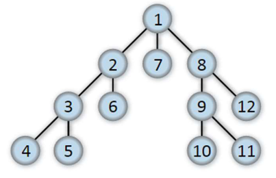
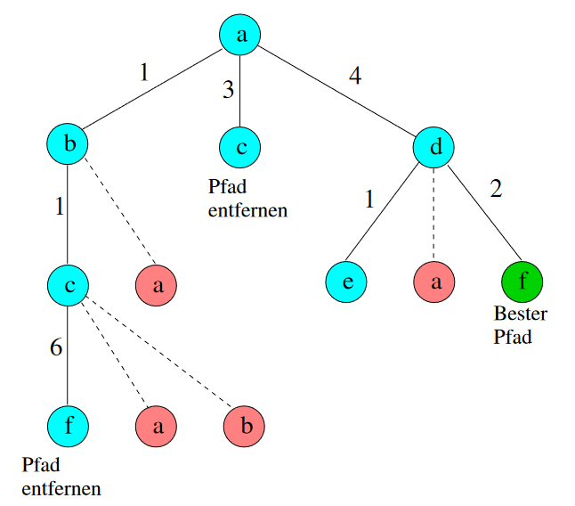
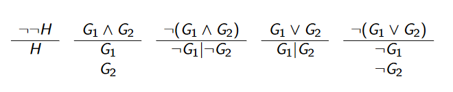
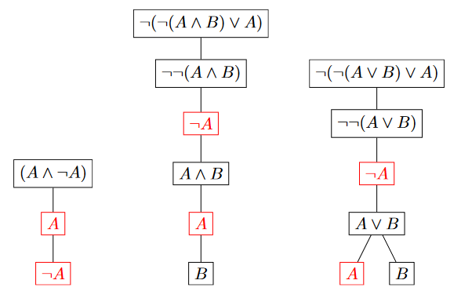
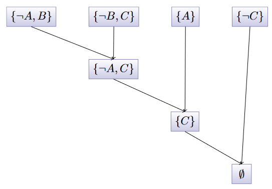
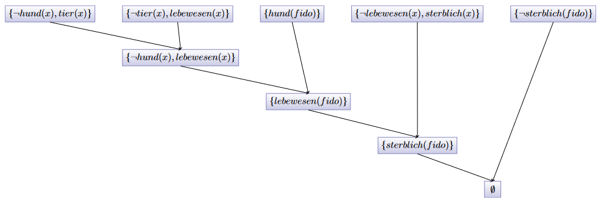
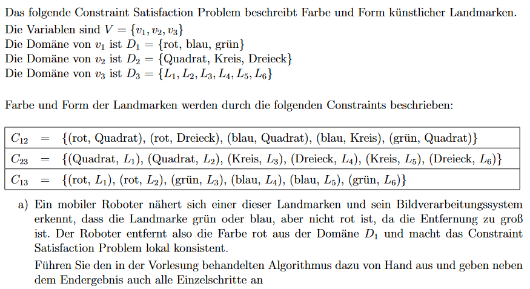

# Deduktive Systeme

## Inhalt
- [Deduktive Systeme](#deduktive-systeme)
  - [Inhalt](#inhalt)
- [Suche](#suche)
  - [Tiefensuche](#tiefensuche)
  - [Breitensuche](#breitensuche)
  - [Branch \& Bound](#branch--bound)
  - [Vergleich](#vergleich)
  - [Hill-Climbing](#hill-climbing)
  - [Back-Tracking](#back-tracking)
  - [Forward-Checking](#forward-checking)
- [Aussagenlogik](#aussagenlogik)
  - [Normalformen](#normalformen)
    - [Literal](#literal)
    - [Konjunktive Normalform (KNF)](#konjunktive-normalform-knf)
    - [Disjunktive Normalform (DNF)](#disjunktive-normalform-dnf)
  - [Hornformel](#hornformel)
  - [Tableau](#tableau)
  - [Resolution](#resolution)
  - [Resolutionsbeweis](#resolutionsbeweis)
- [Prädikatenlogik](#prädikatenlogik)
  - [Notation](#notation)
  - [Klauseln](#klauseln)
  - [Hinweise](#hinweise)
  - [Beispiele](#beispiele)
- [Constraints](#constraints)


# Suche
## Tiefensuche 
* große Tiefen erreichbar
* geringe Platzkomplexität
* kombinierbar

 <br>


## Breitensuche
* beste Lösung wird sicher gefunden
* hoher Platzbedarf

 <br>

## Branch & Bound

 <br>


## Vergleich
|                       | vollständig | optimal |
| --------------------- | ----------- | ------- |
| Breitensuche          | ja          | ja      |
| Tiefensuche           | ja          | nein    |
| iterative Tiefensuche | ja          | ja      |
| Branch & Bound        | ja          | ja      | <br>


## Hill-Climbing
...

## Back-Tracking
...

## Forward-Checking
...

# Aussagenlogik 
## Normalformen
### Literal
```bash
zB A, ¬A, B, ¬B, C, ¬C, ... 
```

### Konjunktive Normalform (KNF)
Eine Formel F ist in KNF, wenn sie eine Konjunktion von Disjunktionen von Literalen ist. 

```bash
(G → H) zu (¬G ∨ H)
(G ↔ H) zu ((G ∧ H) ∨ (¬G ∧ ¬H))
```

```bash
¬¬G zu G
¬(G ∧ H) zu (¬G ∨ ¬H)
¬(G ∨ H) zu (¬G ∧ ¬H)
```

```bash
(F ∨ (G ∧ H)) zu ((F ∨ G) ∧ (F ∨ H))
((F ∧ G) ∨ H) zu ((F ∨ H) ∧ (G ∨ H))
```


### Disjunktive Normalform (DNF)
Eine Formel F ist in DNF, wenn sie eine Disjunktion von Konjunktionen von Literalen ist. <br>

```bash
(G → H) zu (¬G ∨ H)
(G ↔ H) zu ((G ∧ H) ∨ (¬G ∧ ¬H))
```

```bash
¬¬G zu G
¬(G ∧ H) zu (¬G ∨ ¬H)
¬(G ∨ H) zu (¬G ∧ ¬H)
```

```bash
(F ∧ (G ∨ H)) zu ((F ∧ G) ∨ (F ∧ H))
((F ∨ G) ∧ H) zu ((F ∧ H) ∨ (G ∧ H))
```


## Hornformel
Eine Formel F is eine Hornformel, falls F in KNF vorliegt und jede Disjunktion in F höchstens ein positives Literal enthält.


## Tableau


* wenn in Pfad ¬¬H vorkommt, erweitere ihn um H
* wenn in Pfad G<sub>1</sub> ∧ G<sub>2</sub> vorkommt, erweitere ihn um G<sub>1</sub> und um G<sub>2</sub>
* wenn in Pfad ¬(G<sub>1</sub> ∧ G<sub>2</sub>) vorkommt, **verzweige** und erweitere
um linken Nachfolger ¬G<sub>1</sub> und rechten Nachfolger ¬G<sub>2</sub> usw



links: F unerfüllbar, 
mitte: F unerfüllbar,
rechts: F erfüllbar <br>

## Resolution
Synthetische Umformungsrregel, die aus zwei Klauseln eine neue Klausel erzeugt. 
* zeigt Unerfüllbarkeit von Formeln
* Formel müssen in KNF vorliegen

## Resolutionsbeweis
Wir wollen zeigen, dass wenn  
```bash
A → B und B → C 
```
gilt, auch 
```bash
A → C 
```
gilt. <br>

Dazu schreiben wir 
```bash
A → B als {¬A, B}
B → C als {¬B, C}
```
in Mengenschreibweise und nehmen die Negation des Ziels mit auf: 
```bash
¬(A → C)
```
was gleichbeduetend ist mit 
```bash
¬(¬A ∨ C)
```
und mit de Morgan erhalten wir 
```bash
A ∧ ¬C
```
und in Mengenschreibweise 
```bash
{A, ¬C}
```

Unser Herleitungsbaum sieht dann so aus:



Somit ist Formel F bewiesen indem wir ¬F zur Klauselmenge huinzufügen und einen Widerspruch herleiten. <br>


# Prädikatenlogik
Mit der Prädikatenlogik können wir Aussagen über Objekte machen. <br>

## Notation
```bash
# Alle Lebewesen sind sterblich.
∀x (Lebewesen(x) → Sterblich(x))

# Unterklassen
∀x (student(x) → person(x))

# Disjunktive Klassen
∀x (aktiv(x) → ¬inaktiv(x))

# Alle Teilklassen
∀x (ganzzahlig(x) → positiv(x) ∨ negativ(x))

# Typrestriktionen
∀x ∀y (verheiratet(x, y) → person(x) ∧ person(y))

# Definitionen
∀x (Regiozug(x) ↔ Zug(x) ∧ ¬ICE(x))
```

## Klauseln
Siehe [moodle](https://moodle.thi.de/pluginfile.php/524853/mod_resource/content/4/beamerdeduktaplogik.pdf) Seite 71. 

## Hinweise
Ausdrücke zum Lernen, die gut zu wissen sind: 
```bash
# "Alle Studenten..."
∀x (student(x) → ...)

# Es gibt mindestens einen Studenten...
∃x (student(x) ∧ ...)

# Es gibt mindestens zwei Studenten...
∃x ∃y (student(x) ∧ student(y) ∧ x ≠ y ∧ ...)

# Es gibt genau zwei Studenten...
∃x ∃y (student(x) ∧ student(y) ∧ x ≠ y ∧ ∀z (student(z) → (z = x ∨ z = y)))
```

## Beispiele 
Zum Beweis noch die negierte Formel (zu zeigen) zur Klauselmenge hinzu, bei leerer Menge als Ergebnis ist die Formel gezeigt. 
```bash
# zu zeigen
sterblich(fido)

# Klauselmenge
hund(x) → tier(x)
tier(x) → lebewesen(x)
hund(fido)
lebewesen(x) → sterblich(x)

# Umformen
¬hund(x) ∨ tier(x)
¬tier(x) ∨ lebewesen(x)
hund(fido)
¬lebewesen(x) ∨ sterblich(x)

# mit Negation
¬sterblich(fido)

# Klauselmenge
{{¬hund(x), tier(x)}, {¬tier(x), lebewesen(x)}, {hund(fido)}, {¬lebewesen(x), sterblich(x)}, {¬sterblich(fido)}}
```

Daraus ergibt sich folgender Resolutionsbeweis.




# Constraints
## Definition
...

**Constrainttypen**
...

## Aufgabe
Umsetzung des Constraintproblems an einer Beispielaifgabe. 



Mit Umformungen erhalten wir folgende Tabelle, beachte, geänderte Constraints müssen erneut betrachtet werden.

|          | $D_1$ | $D_2$   | $D_3$         | Filterset                |
|----------|-------|---------|---------------|--------------------------|
|          | $g,b$ | $Q,K,D$ | $1,2,3,4,5,6$ | $C_{12}, c_{23}, c_{13}$ |
| $c_{12}$ | $g,b$ | $Q,K$   | $1,2,3,4,5,6$ | $c_{23}, c_{13}$         |
| $c_{13}$ | $g,b$ | $Q,K$   | $3,4,5,6$     | $c_{23}$                 |
| $c_{23}$ | $g,b$ | $K$     | $3,5$         | $c_{13}, c_{12}$         |
| $c_{12}$ | $b$   | $K$     | $3,5$         | $c_{13}$                 |
| $c_{13}$ | $b$   | $K$     | $5$           | $c_{13}$                 |
| $c_{23}$ | $b$   | $K$     | $5$           | $\emptyset$              |


