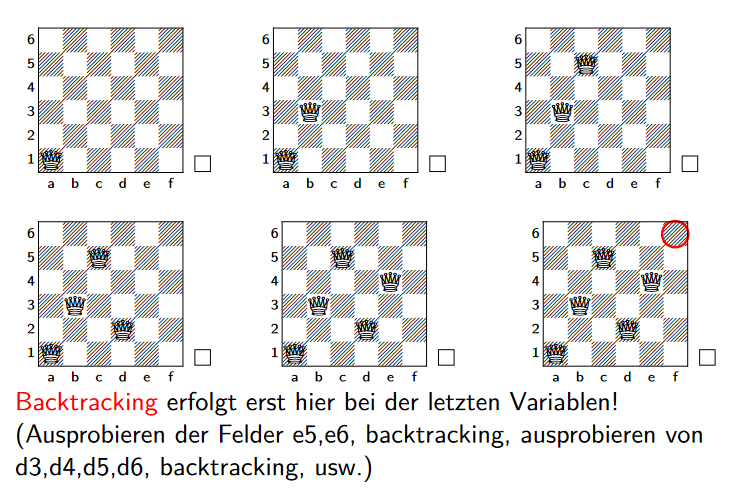
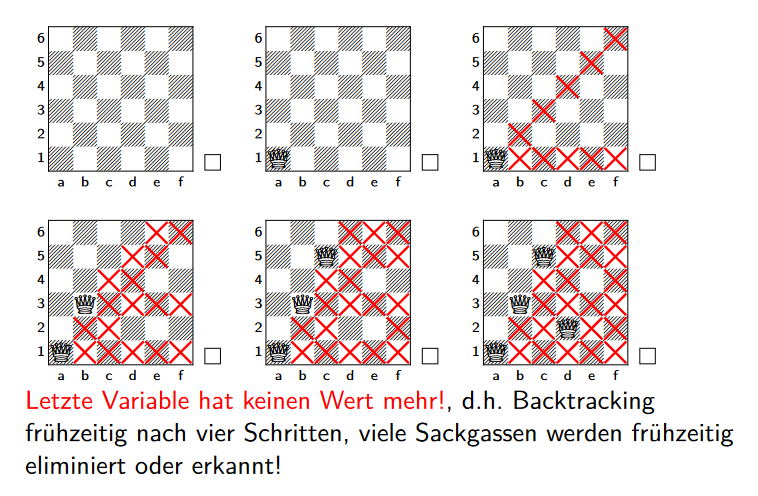

# Deduktive Systeme

## Inhalt
- [Deduktive Systeme](#deduktive-systeme)
  - [Inhalt](#inhalt)
- [Suche](#suche)
  - [Tiefensuche](#tiefensuche)
  - [Breitensuche](#breitensuche)
  - [Branch \& Bound](#branch--bound)
  - [Vergleich](#vergleich)
  - [Hill-Climbing](#hill-climbing)
  - [Back-Tracking](#back-tracking)
  - [Forward-Checking](#forward-checking)
- [Aussagenlogik](#aussagenlogik)
  - [Normalformen](#normalformen)
    - [Literal](#literal)
    - [Konjunktive Normalform (KNF)](#konjunktive-normalform-knf)
    - [Disjunktive Normalform (DNF)](#disjunktive-normalform-dnf)
  - [Hornformel](#hornformel)
  - [Tableau](#tableau)
  - [Resolution](#resolution)
  - [Resolutionsbeweis](#resolutionsbeweis)
- [Prädikatenlogik](#prädikatenlogik)
  - [Notation](#notation)
  - [Klauseln](#klauseln)
  - [Hinweise](#hinweise)
  - [Beispiele](#beispiele)
- [Constraints](#constraints)
  - [Konistenz](#konistenz)
  - [Constraintgraph](#constraintgraph)
  - [Aufgabe](#aufgabe)
- [Prolog](#prolog)
  - [Syntax](#syntax)
    - [Ändern](#ändern)
    - [Beziehungen](#beziehungen)
    - [Negation](#negation)
    - [Unifikation](#unifikation)
    - [Arithmetik](#arithmetik)
    - [Rekursion](#rekursion)
    - [Listen](#listen)
  - [Beispiele](#beispiele-1)


# Suche
## Tiefensuche 
* große Tiefen erreichbar
* geringe Platzkomplexität
* kombinierbar
* oft nur limitierte Tiefen erreichbar 
* darunter leidet die Vollständigkeit

 <br>


## Breitensuche
* beste Lösung wird sicher gefunden
* hoher Platzbedarf

 <br>

## Branch & Bound

 <br>


## Vergleich
|                       | vollständig | optimal |
| --------------------- | ----------- | ------- |
| Breitensuche          | ja          | ja      |
| Tiefensuche           | ja          | nein    |
| iterative Tiefensuche | ja          | ja      |
| Branch & Bound        | ja          | ja      | <br>


## Hill-Climbing
...

## Back-Tracking
Zurückgehen auf einen vorherigen Zustand, wenn ein Fehler auftritt.

<details><summary>Beispiel</summary>



</details> <br>

## Forward-Checking
Suchraum früh begrenzen, um die Suche zu beschleunigen.

<details><summary>Beispiel</summary>



</details> <br>

## A-Stern 
Der A-Stern Algorithmus ist ein informierter Suchalgorithmus, der eine Heuristik verwendet, um die Suche zu beschleunigen. 

$f(x) = g(x) + h(x)$ 

Hier ist $g(x)$ der Pfadkostenfunktion und $h(x)$ die Heuristik, also Schätzung der Kosten von $x$ zum Ziel.

**Beispiel** <br>
Bei der Navigation von München nach Hamburg, ist die Heuristik die Luftlinie zwischen den einzelnen Städten. In Ingolstadt ist man bereits $82km$ gefahren, die Luftlinie nach Hamburg beträgt $542km$.  

$f(x) = 82km + 542km = 612km$ 

Ulm ist auch ein möglicher Stop auf dem Weg, die Liftlinie beträgt $573km$ wenn man bereits $156km$ gefahren ist.

$f(x) = 156km + 573km = 729km$

Somit wird der Pfad vorerst außer Acht gelassen, da die Heuristik über Ingolstadt besser ist.

# Aussagenlogik 
## Normalformen
### Literal
```bash
zB A, ¬A, B, ¬B, C, ¬C, ... 
```

### Konjunktive Normalform (KNF)
Eine Formel F ist in KNF, wenn sie eine Konjunktion von Disjunktionen von Literalen ist. 

```bash
(G → H) zu (¬G ∨ H)
(G ↔ H) zu ((G ∧ H) ∨ (¬G ∧ ¬H))
```

```bash
¬¬G zu G
¬(G ∧ H) zu (¬G ∨ ¬H)
¬(G ∨ H) zu (¬G ∧ ¬H)
```

```bash
(F ∨ (G ∧ H)) zu ((F ∨ G) ∧ (F ∨ H))
((F ∧ G) ∨ H) zu ((F ∨ H) ∧ (G ∨ H))
```


### Disjunktive Normalform (DNF)
Eine Formel F ist in DNF, wenn sie eine Disjunktion von Konjunktionen von Literalen ist. <br>

```bash
(G → H) zu (¬G ∨ H)
(G ↔ H) zu ((G ∧ H) ∨ (¬G ∧ ¬H))
```

```bash
¬¬G zu G
¬(G ∧ H) zu (¬G ∨ ¬H)
¬(G ∨ H) zu (¬G ∧ ¬H)
```

```bash
(F ∧ (G ∨ H)) zu ((F ∧ G) ∨ (F ∧ H))
((F ∨ G) ∧ H) zu ((F ∧ H) ∨ (G ∧ H))
```


## Hornformel
Eine Formel F is eine Hornformel, falls F in KNF vorliegt und jede Disjunktion in F höchstens ein positives Literal enthält.


## Tableau


* wenn in Pfad ¬¬H vorkommt, erweitere ihn um H
* wenn in Pfad G<sub>1</sub> ∧ G<sub>2</sub> vorkommt, erweitere ihn um G<sub>1</sub> und um G<sub>2</sub>
* wenn in Pfad ¬(G<sub>1</sub> ∧ G<sub>2</sub>) vorkommt, **verzweige** und erweitere
um linken Nachfolger ¬G<sub>1</sub> und rechten Nachfolger ¬G<sub>2</sub> usw


links: F unerfüllbar, 
mitte: F unerfüllbar,
rechts: F erfüllbar <br>

## Resolution
Synthetische Umformungsrregel, die aus zwei Klauseln eine neue Klausel erzeugt. 
* zeigt Unerfüllbarkeit von Formeln
* Formel müssen in KNF vorliegen

## Resolutionsbeweis
Wir wollen zeigen, dass wenn  
```bash
A → B und B → C 
```
gilt, auch 
```bash
A → C 
```
gilt. <br>

Dazu schreiben wir 
```bash
A → B als {¬A, B}
B → C als {¬B, C}
```
in Mengenschreibweise und nehmen die Negation des Ziels mit auf: 
```bash
¬(A → C)
```
was gleichbeduetend ist mit 
```bash
¬(¬A ∨ C)
```
und mit de Morgan erhalten wir 
```bash
A ∧ ¬C
```
und in Mengenschreibweise 
```bash
{A, ¬C}
```

Unser Herleitungsbaum sieht dann so aus:


Somit ist Formel F bewiesen indem wir ¬F zur Klauselmenge huinzufügen und einen Widerspruch herleiten. <br>

**Hinweise** <br>
Für die Umformung ein paar Hinweise. 
```bash
# Verkettung
(A ∧ B) ∨ C = (A ∨ C) ∧ (B ∨ C)
```

## Sonsitges
**Korrektheit** <br>
Eine Logik wird als korrekt bezeichnet, wenn jede aus wahren Formeln mittels Inferenzregeln hergeleitete Formel auch wieder wahr ist.

**Vollständigkeit** <br>
Bedeutet in einer Logik, dass jede wahre Formel auch aus anderen wahren Formeln herleitbar ist, also in der Logik auch bewiesen werden kann.


# Prädikatenlogik
Mit der Prädikatenlogik können wir Aussagen über Objekte machen. <br>

## Notation
```bash
# Alle Lebewesen sind sterblich.
∀x (Lebewesen(x) → Sterblich(x))

# Unterklassen
∀x (student(x) → person(x))

# Disjunktive Klassen
∀x (aktiv(x) → ¬inaktiv(x))

# Alle Teilklassen
∀x (ganzzahlig(x) → positiv(x) ∨ negativ(x))

# Typrestriktionen
∀x ∀y (verheiratet(x, y) → person(x) ∧ person(y))

# Definitionen
∀x (Regiozug(x) ↔ Zug(x) ∧ ¬ICE(x))
```

## Klauseln
Siehe [moodle](https://moodle.thi.de/pluginfile.php/524853/mod_resource/content/4/beamerdeduktaplogik.pdf) Seite 71. 

## Hinweise
Ausdrücke zum Lernen, die gut zu wissen sind: 
```bash
# "Alle Studenten..."
∀x (student(x) → ...)

# Es gibt mindestens einen Studenten...
∃x (student(x) ∧ ...)

# Es gibt mindestens zwei Studenten...
∃x ∃y (student(x) ∧ student(y) ∧ x ≠ y ∧ ...)

# Es gibt genau zwei Studenten...
∃x ∃y (student(x) ∧ student(y) ∧ x ≠ y ∧ ∀z (student(z) → (z = x ∨ z = y)))
```

## Beispiele 
Zum Beweis noch die negierte Formel (zu zeigen) zur Klauselmenge hinzu, bei leerer Menge als Ergebnis ist die Formel gezeigt. 
```bash
# zu zeigen
sterblich(fido)

# Klauselmenge
hund(x) → tier(x)
tier(x) → lebewesen(x)
hund(fido)
lebewesen(x) → sterblich(x)

# Umformen
¬hund(x) ∨ tier(x)
¬tier(x) ∨ lebewesen(x)
hund(fido)
¬lebewesen(x) ∨ sterblich(x)

# mit Negation
¬sterblich(fido)

# Klauselmenge
{{¬hund(x), tier(x)}, {¬tier(x), lebewesen(x)}, {hund(fido)}, {¬lebewesen(x), sterblich(x)}, {¬sterblich(fido)}}
```

Daraus ergibt sich folgender Resolutionsbeweis.


# Constraints
Constraints (auch Randbedingungen) bieten einfache Art, Probleme zu modelieren. 

**Constraint Satisfaction Problem (CSP)** <br>
Ist ein 4-Tupel mit folgenden Komponenten. 
* $\mathcal{V}$ ist ein Tupel an _Variablen_
* $\mathcal{D}$ sind Grundmengen, die _Domänen_, die jeder Variable einen zugelassenen Wert zuordnen
* $\mathcal{C}$ ist eine Menge von _Constraints_
* $\mathcal{u}$ ist eine Überdeckungsfunktion

Es gibt verschiedene Arten von Constraints. 

**Tupelmengen** <br>
```prolog
(new-constraint :typ tupelset
                :name ampel
                :variables: (oben mitte unten)
                :definition ((dunkel dunkel gruen)
                             (rot gelb dunkel)
                             (rot dunkel dunkel)
                             (dunkel gelb dunkel)
                             (dunkel dunkel gruen)))
```

**Prädikate** <br>
```prolog
(new-constraint :typ predicate
                :name groesser
                :priority 20
                :variables (a b)
                :definition (> a b))
```

**konstruktive Constraints** <br>
```prolog
(new-constraint :typ constructive
                :name mult
                :variables (a b c)
                :class nosetprop
                :definition (((a b) c (*a b))
                             ((a c) b (/ c a) :if (not (= a 0)))
                             ((b c) a (/ c b) :if (not (= b 0)))))
```

## Konistenz
Ein Constraint-Problem ist konsistent, wenn es eine Lösung gibt, die alle gegebenen Constraints erfüllt.

**lokale Konistenz** <br>
Ein CSP ist lokal konsistent, wenn alle Constraints erfüllt sind.

**globale Konistenz** <br>
Weiter ist ein CSP global konsistent, wenn eine Lösung aus einelementigen Domänen besteht.

## Constraintgraph
...

## Aufgabe
Umsetzung des Constraintproblems an einer Beispielaifgabe. 


Mit Umformungen erhalten wir folgende Tabelle, beachte, geänderte Constraints müssen erneut betrachtet werden.

|          | $D_1$ | $D_2$   | $D_3$         | Filterset                |
|----------|-------|---------|---------------|--------------------------|
|          | $g,b$ | $Q,K,D$ | $1,2,3,4,5,6$ | $C_{12}, c_{23}, c_{13}$ |
| $c_{12}$ | $g,b$ | $Q,K$   | $1,2,3,4,5,6$ | $c_{23}, c_{13}$         |
| $c_{13}$ | $g,b$ | $Q,K$   | $3,4,5,6$     | $c_{23}$                 |
| $c_{23}$ | $g,b$ | $K$     | $3,5$         | $c_{13}, c_{12}$         |
| $c_{12}$ | $b$   | $K$     | $3,5$         | $c_{13}$                 |
| $c_{13}$ | $b$   | $K$     | $5$           | $c_{23}$                 |
| $c_{23}$ | $b$   | $K$     | $5$           | $\emptyset$              |


# Prolog
Steht für _Programming in Logic_ und ist eine deklarative Programmiersprache auf Basis von Hornklauseln.

## Syntax
Verwandschaftsbeziehungen als Beispiel. 
```prolog
% Datei
elternteil(ursula, markus).
elternteil(andreas, markus).
elternteil(monika, angelika).

% Konsole
?- [datei].
true.

?- elternteil(ursula, markus).
true.

?- elternteil(X, markus).
X = ursula ;
X = andreas ;
```

### Ändern
Daten können mit `assert` und `retract` hinzugefügt und entfernt werden. 
```prolog
?- assert(elternteil(elke, bernd)).
true.
?- retract(elternteil(elke, bernd)).
true.
```

Zusätuzliche Fakten können einfach hinzugefügt werden. 
```prolog
maennlich(markus).
...

weiblich(ursula).
...
```

### Beziehungen
Und neue Definitionen für Beziehungen genau so. 
```prolog
% Eltern
vater(X, Y) :- elternteil(X, Y), maennlich(X).
mutter(X, Y) :- elternteil(X, Y), weiblich(X).

% Kinder
sohn(X, Y) :- elternteil(Y, X), maennlich(X).
tochter(X, Y) :- elternteil(Y, X), weiblich(X).

% Geschwister
geschwister(X, Y) :- elternteil(Z, X), elternteil(Z, Y), X \= Y.

% Grosseltern
grossvater(X, Y) :- maennlich(X), elternteil(X, Z), elternteil(Z, Y).
grossmutter(X, Y) :- weiblich(X), elternteil(X, Z), elternteil(Z, Y).
```

Rekursiv kann so einfach eine Verwandtschaft überprüft werden. 
```prolog
vorfahre(X, Y) :- elternteil(X, Y).
vorfahre(X, Y) :- elternteil(X, Z), vorfahre(Z, Y).
```

### Negation
Eine Negation kann in Prolog mit ```not``` ausgedrückt werden. 
```prolog
% Datei
start(rb16, muenchen).
start(re1, muenchen).
start(ice800, muenchen).
start(ice724, essen).
regio(rb16).
regio(re1).
fern(ice800).
fern(ice724).

% Abfrage
?- start(X, muenchen), not(regio(X)).
X = ice800.
```

### Unifikation
Ist eine (minimale) Menge von Substitutionen, die zwei Terme identisch machen. 
```prolog
?- X=42.
X = 42.
?- g(X)=g(bahn).
X = bahn.

?- g(A+birne)=g(apfel+B).
A = apfel,
B = birne.
```

Gerechnet wird mit dem `is`-Operator. 
```prolog
?- 1+1 = 2.
false.
?- 1+1 is 2.
false.

?- 2 is 1+1.
true.
```

### Arithmetik
Verschiedene Vergleiche sind möglich. 
```prolog
?- X==Y       % X und Y gleiche Zahl
?- X=\=Y      % X und Y ungleiche Zahl
?- X<Y        % X kleiner Y
?- X>Y        % X grösser Y
?- X=<Y       % X kleiner oder gleich Y
?- X>=Y       % X grösser oder gleich Y
```

Einfache Rechenoperationen sind auch ähnlich zu anderen Sprachen.
```prolog
?- X+Y       % Addition
?- X-Y       % Subtraktion
?- X*Y       % Multiplikation
?- X/Y       % Division
?- X//Y      % Ganzzahlige Division
?- X mod Y   % Modulo (Restwert)
```

### Rekursion
Auch rekursive Funktionen sind möglich. 
```prolog
% Datei
fib(0, 1).
fib(1, 1).
fib(N, F) :- N1 is N-1,
             N2 is N-2,
             fib(N1, Fib1),
             fib(N2, Fib2),
             Fib is Fib1+Fib2.

% Abfrage
?- fib(0, E). 
E = 1.
?- fib(8, E).
E = 34.
```

Bei höheren Zahlen steigt die Rechenzeit stark an, deswegen können endständig rekursive Funktionen verwendet werden. Hierzu müssen Zwischenwerte gleich in den Rekursionsaufruf übergeben werden, lösung mit Akkumulatorvariablen. 
```prolog
% n, 01, 02, Ergebnis
fibh(0, E, _, E).
fibh(N, P1, P2, E) :- PN is P1+P2,
                      N1 is N-1,
                      fibh(N1, PN, P1, E).
fib(N, E) :- fibh(N, 1, 0, E).

% Abfrage
?- fib(0, E).
E = 1.
?- fib(40, E).
E = 165580141.
```

### Listen
Listen sind in Prolog eine Folge von Elementen. 
```prolog
% Liste
?- [1, 2, X] = [Y, Z, 3].
X = 3.
Y = 1.
Z = 2.

% Prüfen
member(rb16, [rb16, re1, ice800, ice724]).
true.
```

Elemente am __Anfang__ einer Liste können mit `|` aufgerufen werden. 
```prolog
?- [rb, re, ice] = [Erstes|Rest].
Erstes = rb,
Rest = [re, ice].

?- [rb, re, ic, ice] = [rb, re, Drittes|Rest].
Drittes = ic,
Rest = [ice].
```

Bei einer leeren Liste ist ```|``` nicht definiert. 
```prolog
?- X|Y = [].
false.
```

Die Länge einer Liste kann mit eigener Funktion berechnet werden. 
```prolog
% Datei
my_len([], 0).
my_len([K|Rest], E) :- my_len(Rest, E1),
                       E is E1+1.

% Abfrage
?- my_len([1, 2, 3], E).
E = 3.
```


## Beispiele
```prolog
% Check if two elements are equal
equals(X, X).

% Check if a number is even
is_even(X) :- X mod 2 =:= 0.

% Calculate the factorial of a number
factorial(0, 1).
factorial(N, Result) :-
    N > 0,
    N1 is N - 1,
    factorial(N1, SubResult),
    Result is N * SubResult.

% Check if a list is empty
is_empty([]).

% Concatenate two lists
concatenate([], List, List).
concatenate([X|Rest], List, [X|Result]) :-
    concatenate(Rest, List, Result). 
```

Beispiele zur Unifukation. 
```prolog
g(X+Y,f(a+b-C)) = g(23+h(a+b),f(Z+b-otto))
X = 23, 
Y = h(a+b),
C = otto,
Z = a
```

Beispiel zur Löschen aus einer Liste und Hinzufügen. 
```prolog
mydel(X, [X|Rest], Rest).
mydel(X, [Y|Rest], [Y|DRest]) :- mydel(X, Rest, DRest).

nyins(X, L, R) :- mydel(X, R, L).
```

