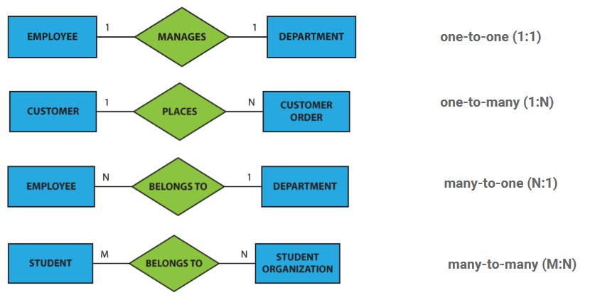
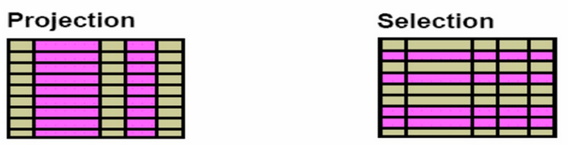

# Big Data 01

## Inhalt
- [Big Data 01](#big-data-01)
  - [Inhalt](#inhalt)
  - [Datenbanksysteme](#datenbanksysteme)
- [Konzeptionelle Modellierung](#konzeptionelle-modellierung)
  - [Entity-Relationship-Modell](#entity-relationship-modell)
- [Relationales Datenmodell](#relationales-datenmodell)
  - [Relationen als Tabelle](#relationen-als-tabelle)
  - [Relationensprache](#relationensprache)
    - [Syntax](#syntax)
    - [Superschlüssel](#superschlüssel)
    - [Schlüsselkandidat](#schlüsselkandidat)
    - [Primärschlüssel](#primärschlüssel)
    - [Surrogatschlüssel](#surrogatschlüssel)
    - [Fremdschlüssel](#fremdschlüssel)
  - [ERD zur Relationen](#erd-zur-relationen)
    - [Schriftnotation](#schriftnotation)
      - [Minimalnotation](#minimalnotation)
      - [detailierte Notation](#detailierte-notation)
    - [mehrwertige Attribute](#mehrwertige-attribute)
    - [Beispiel](#beispiel)
    - [Überführung](#überführung)
    - [Aufgaben](#aufgaben)
- [SQL](#sql)
  - [Data Definition Language (DDL)](#data-definition-language-ddl)
  - [Data Manipulation Language (DML)](#data-manipulation-language-dml)
  - [Data Query Language (DQL)](#data-query-language-dql)
    - [Beispiele](#beispiele)
- [PostgreSQL](#postgresql)
  - [Eigenschaften](#eigenschaften)
    - [Datentypen](#datentypen)
    - [Unterschiede](#unterschiede)
    - [Beispiele](#beispiele-1)
  - [SELECT \* FROM routing.stations WHERE name LIKE 'München%';](#select--from-routingstations-where-name-like-münchen)


<br>

## Datenbanksysteme
Eine Datenbank ist eine Sammlung von Daten,
[die untereinander in einer logischen Beziehung
stehen] und von einem eigenen Datenbank-
verwaltungssystem (Database Management
System, DBMS) verwaltet werden.


# Konzeptionelle Modellierung
## Entity-Relationship-Modell 
* Entities ```[]```
* Attribute ```()```
* Relationships ```<>``` 
* Linien ```-```

![Entity-Relationship-Modell]c01_erd.png)

Entities die auf die Existenz eines anderen Entities angewiesen sind, werden als ```weak entity``` bezeichnet und werden mit einem doppelten Rahmen dargestellt.



Min/Max kann am jeweiligen Ende der Linien angegeben werden. 
```
(0,1) = 0 oder 1
(1,*) = 1 oder mehr
(0,*) = 0 oder mehr 
```

# Relationales Datenmodell
Eine Relation ist eine Teilmenge des kartesischen Produkts von Wertebereichen.

## Relationen als Tabelle
Beispiel mit 6 Attributen und 3 Tupeln

| <ins>CustomerID</ins> | Name | Address | City | PostalCode | Country |
| --- | --- | --- | --- | --- | --- |
| 1 | Michael | Broad St 1 | London | 26925 | UK |
| 2 | John | Main St 2 | New York | 10176 | USA |
| 3 | Julia | 5th Ave 3 | New York | 10151 | USA |

## Relationensprache
Die Relationensprache ist eine formale Sprache, die zur Formulierung von Anfragen an eine Datenbank verwendet wird.

### Syntax
(später ergänzen)

### Superschlüssel
Ein Superschlüssel ist eine Menge von Attributen, die Tupel einer Relation ***eindeutig*** identifizieren.
```bash
ISBN
ISBN, Autor
Autor, Buchtitel
ISBN, Autor, Buchtitel
```

### Schlüsselkandidat
Die minimale Menge von Attributen, die Tupel einer Relation ***eindeutig*** identifizieren.
```bash
ISBN
Buchtitel, Autor
```

### Primärschlüssel
Aus den Kanidaten wird ein Primärschlüssel ausgewählt - wird meistens unterstrichen.
```bash
ISBN
```

### Surrogatschlüssel
Ein Surrogatschlüssel ist ein künstlich erzeugter Schlüssel, der zur Identifikation eines Tupels verwendet wird - oft mit ```_ID```.	
```bash
Literatur_ID
```
<!---
Beispiele
* Protonenzahl eines Atoms
* ISBN eines Buches
* Martriekelnummer eines Studenten
--->

### Fremdschlüssel
Ein Fremdschlüssel ist ein Attribut oder eine Attributkombination, die auf einen Primärschlüssel einer anderen Relation verweist.

| <ins>customer_id</ins> | name     | city     |
|-------------|----------|----------|
| 1           | John     | New York |
| 2           | Alice    | London   |
| 3           | Michael  | Paris    |
| 4           | Jennifer | Berlin   |

| <ins>order_id</ins> | order_date | customer_id |
|----------|------------|-------------|
| 101      | 2023-05-01 | 1           |
| 102      | 2023-05-02 | 3           |
| 103      | 2023-05-03 | 2           |
| 104      | 2023-05-04 | 1           |

Die zwiete Tabelle enthält die Spalte ```customer_id```, bei der es sich um einen Fremdschlüssel handelt, der auf die Spalte ```customer_id``` in der ersten Tabelle verweist.

## ERD zur Relationen
### Schriftnotation
#### Minimalnotation
Relationenname (<ins>Primärschlüssel</ins>, ↑ Fremdschlüssel)

#### detailierte Notation
Relationenname (<ins>Primärschlüssel</ins>: _datentyp_, ↑ Fremdschlüssel: _datentyp_) <br>

### mehrwertige Attribute
Können im relationalen Modell durch eine neue Relation dargestellt werden. 

### Beispiel
```
leihen(↑_KundenID_, ↑_ScooterID_, _von_, bis)
Foreign Key (KundenID) REFERENCES Kunden(ID)
Foreign Key (ScooterID) REFERENCES e-Scooter(ID)
```
### Überführung
| ERD | Überführung |
|-|-|
| Entitätstyp mit Attributen und Schlüsselattributen | Jeder Entitätstyp wird zu einer eigenen Relation mit entsprechenden Attributen übernommen. <br> Der Schlüsselattribut(e) wird als Primärschlüssel übernommen und üblicherweise an den Anfang des Relationenschemas gestellt. |
| schwache Entitätstypen | Attribute der schwachen Entität werden, um den Schlüssel der starken Entität erweiter.t <br> Primärschlüssel: Schlüssel der starken Entität und partieller Schlüssel der schwachen Entität. |
| ```1:1``` | Sind sehr selten und werden nach intensivem Review in der Regel in einer Relation dargestellt oder in zwei mit Fremdschlüsselbeziehung wenn DBMS das kann (Zirkelbezug). |
| ```n:m``` | Für ```n:m```-Beziehungen muss eine Beziehungsrelation angelegt werden. |
| ```1:n``` | Bei zwei Relationen: In einer ```1:N``` Beziehung kommt der Fremdschlüssel immer auf die Seite, wo das ```N``` steht. <br> Drei möglich werden aber gemieden. |

### Aufgaben
Zum Üben siehe [03_relationelles_datenmodell.pdf](https://moodle.thi.de/pluginfile.php/747005/mod_resource/content/1/03_Relationales_Datenmodell.pdf) S. 39 & 50.

<span style="color:red">Lernen für garantierte Punkte!</span>


# SQL
SQL ist Datenbanksprache zur Definition, Manipulation und Abfrage von Daten in relationalen Datenbanken.

## Data Definition Language (DDL)
Zum Anlegen, Ändern und Löshcen von Datenbanken, Schemas, Tabellen und ihren Strukturen.

Befehlssatz zum Anlegen einer Datenbank auf dem Datenbankserver.
```sql
CREATE DATABASE <escooterverwaltung>;
```

Befehlssatz zum Anlegen einer Tabelle (Relation) auf dem Datenbankserver.
```sql
--create a table
CREATE TABLE escooter (
    escooter_id integer NOT NULL PRIMARY KEY,
    serial_number integer,
    brand varchar(100),
    battery_status integer,
    isrentable smallint,
    employee_id integer
);
```

Manche Datenbanksysteme ermöglichen eine zusätzliche Strukturierungsebene einzufügen. Bei ```Postgres``` werden standardmäßig Tabellen in das Schema ```public``` abgelegt.
```sql	
CREATE SCHEMA escooter;
...
```

Constraints: Integritätsbedingungen, die bei der Tabellendefinition (oder Änderung) festgelegt werden. z.B. Statistische Wertebereiche, definierte Datentypen und Feldlängen, Fremdschlüssel.
```sql
CREATE escooter2 (
  scooter_id integer NOT NULL PRIMARY KEY,
  CHECK (scooter_id > 0),
  ...
)
```

Statische Bedingungen werden in SQL von einer ```CHECK```-Anweisung gefolgt von einer
Bedingung implementiert Änderungen an einer Tabelle werden zurückgewiesen, wenn die Bedingung zu false ausgewertet wird.
```sql
CHECK batterystatus BETWEEN 0 AND 100
CHECK brand IN ('Minimotors', 'Xiaomi', 'Inokim', 'Zero', 'Zoom')
```

Fremdschlüsselbeziehungen werden mit ```REFERENCES``` definiert. 
```sql
CREATE TABLE escooter (
  FOREIGN KEY (employeeID) REFERENCES
  employees(employeeid));
```

Beim Anlegen der ersten Tabelle ist eine andere Tabelle noch nicht bekannt, Fremdschlüsselbeziehungen können daher erst nachträglich definiert werden.
```sql
ALTER TABLE escooter
ADD FOREIGN KEY (employeeID) REFERENCES employees(employeeid);
```

Eindeutige Werte können mit ```UNIQUE``` definiert werden.
```sql
CREATE TABLE escooter (
  serial_number varchar(100) integer UNIQUE,
)
```


Bei der Definitioni eines Fremdschlüssels kann mit ```ON DELETE``` und ```ON UPDATE``` festgelegt werden, was mit den referenzierten Tupeln passieren soll, wenn das referenzierte Tupel gelöscht oder geändert wird.
```sql
CREATE TABLE escooter (
  FOREIGN KEY (employeeID) REFERENCES employees(employeeid)

  --nichts tun
  ON DELETE NO ACTION
  
  --Zeile mitlöschen
  ON DELETE CASCADE

  --Zeile mit NULL-Werten füllen
  ON DELETE SET NULL

  --Zeile mit Default-Werten füllen
  ON DELETE SET DEFAULT
);
```

Default-Werte können mit ```DEFAULT``` definiert werden.
```sql
CREATE TABLE escooter (
  serial_number varchar(100) integer DEFAULT '0000000000',
)
```

Eindeutige IDs können mit ```GENERATED ALWAYS AS IDENTITY``` definiert werden.
```sql
ScooterID integer GENERATED ALWAYS AS IDENTITY
```

Tabellen lassen sich mit ```ALTER TABLE``` ändern.
```sql
-- add an attribute
ALTER TABLE escooter
ADD COLUMN scooter_id integer;

-- change a datatype of an attribute
ALTER TABLE escooter
ALTER COLUMN scooter_id TYPE varchar(100);

--change column name
ALTER TABLE escooter
RENAME COLUMN scooter_id TO scooterid;
```

Tabellen lassen sich mit ```DROP TABLE``` löschen, Inhalte mit ```TRUNCATE TABLE```.
```sql
DROP TABLE <Name der Tabelle>
DROP TABLE <schemaname>.<Name der Tabelle>

TRUNCATE TABLE <Name der Tabelle>
TRUNCATE TABLE <schemaname>.<Name der Tabelle>
```

## Data Manipulation Language (DML)
Befehle zum Einfügen, Ändern und Löschen von Tupeln in Tabellen. 

Daten lassen sich mit ```INSERT INTO``` einfügen.
```sql
INSERT INTO escooter VALUES (1, '702', 'Segway', 1, true);
INSERT INTO employee (eid, vorname, nachname) VALUES (1, 'Max', 'Mayr');
```

Daten lassen sich mit ```UPDATE``` ändern.
```sql
UPDATE Customer
SET ispremium = 1
WHERE custid = 7;
```

Daten lassen sich mit ```DELETE``` löschen.
```sql
ELETE FROM customer
WHERE city = 'Stuttgart'
```

## Data Query Language (DQL)
Befehle zum Abfragen von Daten aus Tabellen.



Mit ```DISTINCT``` lassen sich Redundanzen entfernen. Im Beispiel werden nur Zuglinien angezeigt, die auf der Strecke fahren jedoch nicht mehrfach die gleiche Zuglinie.
```sql
SELECT DISTINCT zuglinie
```

Mit ```ORDER BY``` lassen sich Ergebnisse sortieren. 
```sql
SELECT FirstName, MiddleName, LastName
FROM Person
ORDER BY FirstName ASC,
         LastName DESC;
```

Zur Berechnung verschiedener Werte aus einer Menge von Tupeln.

Zum Zählen kann ```COUNT``` verwendet werden.
```sql
SELECT COUNT(*)
SELECT(DISTINCT COUNT(*))
```	

Für die Summe kann ```SUM``` verwendet werden.
```sql
SELECT SUM(<Attribut>)
```

Für den Durchschnitt kann ```AVG``` verwendet werden.
```sql
SELECT AVG(<Attribut>)
```

Und für Minimum und Maximum ```MIN``` und ```MAX```.
```sql
SELECT MIN(<Attribut>)
SELECT MAX(<Attribut>)
```

Sonstige Funktionen:
```sql
LOWER(<Attribut>)
UPPER(<Attribut>)
LENGTH(<Attribut>)
SUBSTRING(<Attribut>, <Start>, <Ende>)
TRIM(<Attribut>)
```

Nullwerte lassen sich mit ```IS NULL``` und ```IS NOT NULL``` abfragen.
```sql
SELECT *
FROM customer
WHERE birthdate IS NULL;
```

Mit ```UNION``` lassen sich Ergebnisse vereinigen.
```sql
SELECT vorname, nachname, geburtsdatum
FROM kunde
UNION
SELECT vorname, nachname, geburtsdatum
FROM mitarbeiter;
```

### Beispiele
Wie viele Kunden gibt es?
```sql
SELECT COUNT (custid)
FROM customer;
```

Wie viele unterschiedliche Städte gibt es?
```sql
SELECT COUNT (DISTINCT city)
FROM customer;
```

Für weitere Beispiele und Übungen siehe [04_SQL](https://moodle.thi.de/pluginfile.php/746838/mod_resource/content/1/04_SQL.pdf).

# PostgreSQL
PostgreSQL ist ein relationales Datenbanksystem, das auf dem SQL-Standard basiert. 

## Eigenschaften
Database Cluster, die aus mehreren Datenbanken bestehen. 

### Datentypen
```sql
--Zeichenkette von n Zeichen
CHARACTER(n)

--Zeichenkette von variabler Länge
VARCHAR(n)

--längere Zeichenketten
TEXT

--ganze Zahlen
INT
SMALLINT

--Timestamp
TIMESTAMP
```

### Unterschiede
Im Vergleich zu SQL unterscheidet sich PostgreSQL stark in der Syntax. 
* psql-Befehle beginnen mit ```\```
* mit ```;``` werden Befehle abgeschlossen

### Beispiele 
Um Daten einer ```.csv```-Datei zu importieren, muss Trennzeichen und Header angegeben werden.
```sql
COPY person(firstname, lastname, birthdate)
FROM 'C:\Data\person.csv'
DELIMITER ','
CSV HEADER encoding 'UTF8';
```

Beispiel für weitere Abfragen. 
```sql
--Datenbank erstellen
CREATE DATABASE bahn_routing;

--Schema erstellen
\c bahn_routing
CREATE SCHEMA routing;

--Tabelle erstellen
CREATE TABLE routing.stations (
  station_id integer PRIMARY KEY,
  name varchar(100) NOT NULL,
  latitude double precision NOT NULL,
  longitude double precision NOT NULL,
  long_distance boolean NOT NULL DEFAULT false,
);

--Daten anlegen
INSERT INTO routing.stations VALUES (1, 'München Hbf', 48.1408, 11.5583, true);
INSERT INTO routing.stations VALUES (2, 'Baar-Ebenhausen', 48.6762°, 11.4667, false);

--Daten abfragen
SELECT * FROM routing.stations WHERE long_distance = true;
SELECT * FROM routing.stations WHERE name LIKE 'München%';
--
