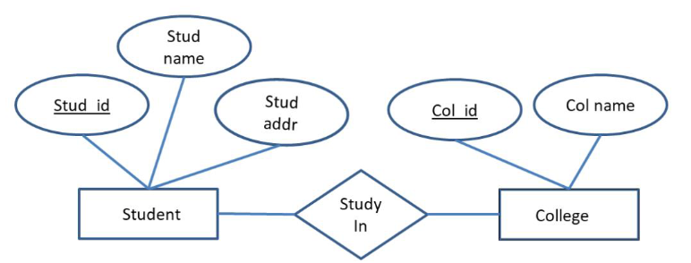

# Big Data 01

## Inhalt
- [Big Data 01](#big-data-01)
  - [Inhalt](#inhalt)
  - [Datenbanksysteme](#datenbanksysteme)
- [02 Koonzeptielle Modellierung](#02-koonzeptielle-modellierung)
  - [Entity-Relationship-Modell](#entity-relationship-modell)
- [Relationales Datenmodell](#relationales-datenmodell)
  - [Relationen als Tabelle](#relationen-als-tabelle)
  - [Relationensprache](#relationensprache)

<br>

## Datenbanksysteme
Eine Datenbank ist eine Sammlung von Daten,
[die untereinander in einer logischen Beziehung
stehen] und von einem eigenen Datenbank-
verwaltungssystem (Database Management
System, DBMS) verwaltet werden.


# Koonzeptielle Modellierung
## Entity-Relationship-Modell 
* Entities ```[]```
* Attribute ```()```
* Relationships ```<>``` 
* Linien ```-```



Entities die auf die Existenz eines anderen Entities angewiesen sind, werden als ```weak entity``` bezeichnet und werden mit einem doppelten Rahmen dargestellt.


Min/Max kann am jeweiligen Ende der Linien angegeben werden. 
```
(0,1) = 0 oder 1
(1,*) = 1 oder mehr
(0,*) = 0 oder mehr 
```

# Relationales Datenmodell
Eine Relation ist eine Teilmenge des kartesischen Produkts von Wertebereichen.

## Relationen als Tabelle
Beispiel mit 6 Attributen und 3 Tupeln

| CustomerID | Name | Address | City | PostalCode | Country |
| --- | --- | --- | --- | --- | --- |
| 1 | Michael | Broad St 1 | London | 26925 | UK |
| 2 | John | Main St 2 | New York | 10176 | USA |
| 3 | Julia | 5th Ave 3 | New York | 10151 | USA |

## Relationensprache
(add later)

03 page 22


<br>

[⬆ nach oben](#big-data-01)