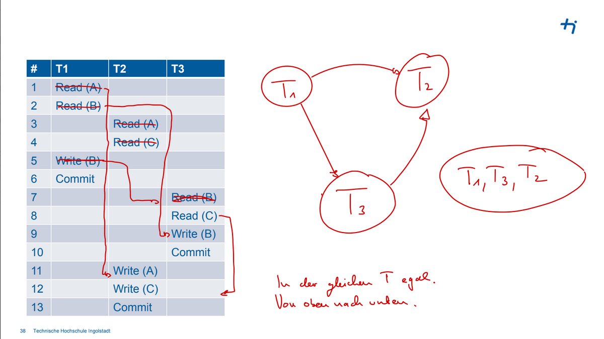

# Big Data 01

## Inhalt
- [Big Data 01](#big-data-01)
  - [Inhalt](#inhalt)
  - [Datenbanksysteme](#datenbanksysteme)
- [Konzeptionelle Modellierung](#konzeptionelle-modellierung)
  - [Entity-Relationship-Modell](#entity-relationship-modell)
- [Relationales Datenmodell](#relationales-datenmodell)
  - [Relationen als Tabelle](#relationen-als-tabelle)
  - [Relationensprache](#relationensprache)
    - [Syntax](#syntax)
    - [Superschlüssel](#superschlüssel)
    - [Schlüsselkandidat](#schlüsselkandidat)
    - [Primärschlüssel](#primärschlüssel)
    - [Surrogatschlüssel](#surrogatschlüssel)
    - [Fremdschlüssel](#fremdschlüssel)
  - [ERD zur Relationen](#erd-zur-relationen)
    - [Schriftnotation](#schriftnotation)
      - [Minimalnotation](#minimalnotation)
      - [detailierte Notation](#detailierte-notation)
    - [mehrwertige Attribute](#mehrwertige-attribute)
    - [Beispiel](#beispiel)
    - [Überführung](#überführung)
    - [Aufgaben](#aufgaben)
- [SQL](#sql)
  - [Data Definition Language (DDL)](#data-definition-language-ddl)
  - [Data Manipulation Language (DML)](#data-manipulation-language-dml)
  - [Data Query Language (DQL)](#data-query-language-dql)
    - [Beispiele](#beispiele)
- [PostgreSQL](#postgresql)
  - [Eigenschaften](#eigenschaften)
    - [Datentypen](#datentypen)
    - [Unterschiede](#unterschiede)
    - [Beispiele](#beispiele-1)
- [Normalisierung](#normalisierung)
  - [Anomalien](#anomalien)
  - [Abhängigkeiten](#abhängigkeiten)
  - [Normalformen](#normalformen)
  - [Aufgabe](#aufgabe)
- [Transaktionen](#transaktionen)
  - [ACID](#acid)
  - [Mehrbenutzerbetrieb](#mehrbenutzerbetrieb)
    - [Lösungen](#lösungen)
  - [Sperren](#sperren)
- [physischer Entwurf](#physischer-entwurf)
  - [B-Tree](#b-tree)
  - [Indexe](#indexe)
    - [Hash Index](#hash-index)
  - [Storage Engine](#storage-engine)
  - [RAID](#raid)
- [noSQL](#nosql)
  - [Architekturen](#architekturen)
  - [Key-Value Stores](#key-value-stores)
  - [Document Stores](#document-stores)
  - [Wide Column Stores](#wide-column-stores)
  - [Graph Stores](#graph-stores)
- [mongoDB](#mongodb)
  - [Syntax](#syntax-1)
  - [Aggregation](#aggregation)
  - [Beispiele](#beispiele-2)
- [Time Series Database](#time-series-database)
  - [Hyper Table](#hyper-table)
  - [Time Bucket](#time-bucket)
- [Neo4J](#neo4j)
- [Key-Value Stores](#key-value-stores-1)
  - [Redis](#redis)
  - [Persistenz](#persistenz)
- [Wide Column Stores](#wide-column-stores-1)
  - [Grundlagen](#grundlagen)
  - [Architektur](#architektur)
- [optimierte Speicherformate](#optimierte-speicherformate)


<br>

## Datenbanksysteme
Eine Datenbank ist eine Sammlung von Daten,
[die untereinander in einer logischen Beziehung
stehen] und von einem eigenen Datenbank-
verwaltungssystem (Database Management
System, DBMS) verwaltet werden.


# Konzeptionelle Modellierung
## Entity-Relationship-Modell 
* Entities ```[]```
* Attribute ```()```
* Relationships ```<>``` 
* Linien ```-```

![Entity-Relationship-Modell]c01_erd.png)

Entities die auf die Existenz eines anderen Entities angewiesen sind, werden als ```weak entity``` bezeichnet und werden mit einem doppelten Rahmen dargestellt.


Min/Max kann am jeweiligen Ende der Linien angegeben werden. 
```
(0,1) = 0 oder 1
(1,*) = 1 oder mehr
(0,*) = 0 oder mehr 
```

# Relationales Datenmodell
Eine Relation ist eine Teilmenge des kartesischen Produkts von Wertebereichen.

## Relationen als Tabelle
Beispiel mit 6 Attributen und 3 Tupeln

| <ins>CustomerID</ins> | Name | Address | City | PostalCode | Country |
| --- | --- | --- | --- | --- | --- |
| 1 | Michael | Broad St 1 | London | 26925 | UK |
| 2 | John | Main St 2 | New York | 10176 | USA |
| 3 | Julia | 5th Ave 3 | New York | 10151 | USA |

## Relationensprache
Die Relationensprache ist eine formale Sprache, die zur Formulierung von Anfragen an eine Datenbank verwendet wird.

### Syntax
(später ergänzen)

### Superschlüssel
Ein Superschlüssel ist eine Menge von Attributen, die Tupel einer Relation ***eindeutig*** identifizieren.
```bash
ISBN
ISBN, Autor
Autor, Buchtitel
ISBN, Autor, Buchtitel
```

### Schlüsselkandidat
Die minimale Menge von Attributen, die Tupel einer Relation ***eindeutig*** identifizieren.
```bash
ISBN
Buchtitel, Autor
```

### Primärschlüssel
Aus den Kanidaten wird ein Primärschlüssel ausgewählt - wird meistens unterstrichen.
```bash
ISBN
```

### Surrogatschlüssel
Ein Surrogatschlüssel ist ein künstlich erzeugter Schlüssel, der zur Identifikation eines Tupels verwendet wird - oft mit ```_ID```.	
```bash
Literatur_ID
```
<!---
Beispiele
* Protonenzahl eines Atoms
* ISBN eines Buches
* Martriekelnummer eines Studenten
--->

### Fremdschlüssel
Ein Fremdschlüssel ist ein Attribut oder eine Attributkombination, die auf einen Primärschlüssel einer anderen Relation verweist.

| <ins>customer_id</ins> | name     | city     |
|-------------|----------|----------|
| 1           | John     | New York |
| 2           | Alice    | London   |
| 3           | Michael  | Paris    |
| 4           | Jennifer | Berlin   |

| <ins>order_id</ins> | order_date | customer_id |
|----------|------------|-------------|
| 101      | 2023-05-01 | 1           |
| 102      | 2023-05-02 | 3           |
| 103      | 2023-05-03 | 2           |
| 104      | 2023-05-04 | 1           |

Die zwiete Tabelle enthält die Spalte ```customer_id```, bei der es sich um einen Fremdschlüssel handelt, der auf die Spalte ```customer_id``` in der ersten Tabelle verweist.

## ERD zur Relationen
### Schriftnotation
#### Minimalnotation
Relationenname (<ins>Primärschlüssel</ins>, ↑ Fremdschlüssel)

#### detailierte Notation
Relationenname (<ins>Primärschlüssel</ins>: _datentyp_, ↑ Fremdschlüssel: _datentyp_) <br>

### mehrwertige Attribute
Können im relationalen Modell durch eine neue Relation dargestellt werden. 

### Beispiel
```
leihen(↑_KundenID_, ↑_ScooterID_, _von_, bis)
Foreign Key (KundenID) REFERENCES Kunden(ID)
Foreign Key (ScooterID) REFERENCES e-Scooter(ID)
```
### Überführung
| ERD | Überführung |
|-|-|
| Entitätstyp mit Attributen und Schlüsselattributen | Jeder Entitätstyp wird zu einer eigenen Relation mit entsprechenden Attributen übernommen. <br> Der Schlüsselattribut(e) wird als Primärschlüssel übernommen und üblicherweise an den Anfang des Relationenschemas gestellt. |
| schwache Entitätstypen | Attribute der schwachen Entität werden, um den Schlüssel der starken Entität erweiter.t <br> Primärschlüssel: Schlüssel der starken Entität und partieller Schlüssel der schwachen Entität. |
| ```1:1``` | Sind sehr selten und werden nach intensivem Review in der Regel in einer Relation dargestellt oder in zwei mit Fremdschlüsselbeziehung wenn DBMS das kann (Zirkelbezug). |
| ```n:m``` | Für ```n:m```-Beziehungen muss eine Beziehungsrelation angelegt werden. |
| ```1:n``` | Bei zwei Relationen: In einer ```1:N``` Beziehung kommt der Fremdschlüssel immer auf die Seite, wo das ```N``` steht. <br> Drei möglich werden aber gemieden. |

### Aufgaben
Zum Üben siehe [03_relationelles_datenmodell.pdf](https://moodle.thi.de/pluginfile.php/747005/mod_resource/content/1/03_Relationales_Datenmodell.pdf) S. 39 & 50.

<span style="color:red">Lernen für garantierte Punkte!</span>


# SQL
SQL ist Datenbanksprache zur Definition, Manipulation und Abfrage von Daten in relationalen Datenbanken.

## Data Definition Language (DDL)
Zum Anlegen, Ändern und Löshcen von Datenbanken, Schemas, Tabellen und ihren Strukturen.

Befehlssatz zum Anlegen einer Datenbank auf dem Datenbankserver.
```sql
CREATE DATABASE <escooterverwaltung>;
```

Befehlssatz zum Anlegen einer Tabelle (Relation) auf dem Datenbankserver.
```sql
--create a table
CREATE TABLE escooter (
    escooter_id integer NOT NULL PRIMARY KEY,
    serial_number integer,
    brand varchar(100),
    battery_status integer,
    isrentable smallint,
    employee_id integer
);
```

Manche Datenbanksysteme ermöglichen eine zusätzliche Strukturierungsebene einzufügen. Bei ```Postgres``` werden standardmäßig Tabellen in das Schema ```public``` abgelegt.
```sql	
CREATE SCHEMA escooter;
...
```

Constraints: Integritätsbedingungen, die bei der Tabellendefinition (oder Änderung) festgelegt werden. z.B. Statistische Wertebereiche, definierte Datentypen und Feldlängen, Fremdschlüssel.
```sql
CREATE escooter2 (
  scooter_id integer NOT NULL PRIMARY KEY,
  CHECK (scooter_id > 0),
  ...
)
```

Statische Bedingungen werden in SQL von einer ```CHECK```-Anweisung gefolgt von einer
Bedingung implementiert Änderungen an einer Tabelle werden zurückgewiesen, wenn die Bedingung zu false ausgewertet wird.
```sql
CHECK batterystatus BETWEEN 0 AND 100
CHECK brand IN ('Minimotors', 'Xiaomi', 'Inokim', 'Zero', 'Zoom')
```

Fremdschlüsselbeziehungen werden mit ```REFERENCES``` definiert. 
```sql
CREATE TABLE escooter (
  FOREIGN KEY (employeeID) REFERENCES
  employees(employeeid));
```

Beim Anlegen der ersten Tabelle ist eine andere Tabelle noch nicht bekannt, Fremdschlüsselbeziehungen können daher erst nachträglich definiert werden.
```sql
ALTER TABLE escooter
ADD FOREIGN KEY (employeeID) REFERENCES employees(employeeid);
```

Eindeutige Werte können mit ```UNIQUE``` definiert werden.
```sql
CREATE TABLE escooter (
  serial_number varchar(100) integer UNIQUE,
)
```


Bei der Definitioni eines Fremdschlüssels kann mit ```ON DELETE``` und ```ON UPDATE``` festgelegt werden, was mit den referenzierten Tupeln passieren soll, wenn das referenzierte Tupel gelöscht oder geändert wird.
```sql
CREATE TABLE escooter (
  FOREIGN KEY (employeeID) REFERENCES employees(employeeid)

  --nichts tun
  ON DELETE NO ACTION
  
  --Zeile mitlöschen
  ON DELETE CASCADE

  --Zeile mit NULL-Werten füllen
  ON DELETE SET NULL

  --Zeile mit Default-Werten füllen
  ON DELETE SET DEFAULT
);
```

Default-Werte können mit ```DEFAULT``` definiert werden.
```sql
CREATE TABLE escooter (
  serial_number varchar(100) integer DEFAULT '0000000000',
)
```

Eindeutige IDs können mit ```GENERATED ALWAYS AS IDENTITY``` definiert werden.
```sql
ScooterID integer GENERATED ALWAYS AS IDENTITY
```

Tabellen lassen sich mit ```ALTER TABLE``` ändern.
```sql
-- add an attribute
ALTER TABLE escooter
ADD COLUMN scooter_id integer;

-- change a datatype of an attribute
ALTER TABLE escooter
ALTER COLUMN scooter_id TYPE varchar(100);

--change column name
ALTER TABLE escooter
RENAME COLUMN scooter_id TO scooterid;
```

Tabellen lassen sich mit ```DROP TABLE``` löschen, Inhalte mit ```TRUNCATE TABLE```.
```sql
DROP TABLE <Name der Tabelle>
DROP TABLE <schemaname>.<Name der Tabelle>

TRUNCATE TABLE <Name der Tabelle>
TRUNCATE TABLE <schemaname>.<Name der Tabelle>
```

## Data Manipulation Language (DML)
Befehle zum Einfügen, Ändern und Löschen von Tupeln in Tabellen. 

Daten lassen sich mit ```INSERT INTO``` einfügen.
```sql
INSERT INTO escooter VALUES (1, '702', 'Segway', 1, true);
INSERT INTO employee (eid, vorname, nachname) VALUES (1, 'Max', 'Mayr');
```

Daten lassen sich mit ```UPDATE``` ändern.
```sql
UPDATE Customer
SET ispremium = 1
WHERE custid = 7;
```

Daten lassen sich mit ```DELETE``` löschen.
```sql
ELETE FROM customer
WHERE city = 'Stuttgart'
```

## Data Query Language (DQL)
Befehle zum Abfragen von Daten aus Tabellen.


Mit ```DISTINCT``` lassen sich Redundanzen entfernen. Im Beispiel werden nur Zuglinien angezeigt, die auf der Strecke fahren jedoch nicht mehrfach die gleiche Zuglinie.
```sql
SELECT DISTINCT zuglinie
```

Mit ```ORDER BY``` lassen sich Ergebnisse sortieren. 
```sql
SELECT FirstName, MiddleName, LastName
FROM Person
ORDER BY FirstName ASC,
         LastName DESC;
```

Zur Berechnung verschiedener Werte aus einer Menge von Tupeln.

Zum Zählen kann ```COUNT``` verwendet werden.
```sql
SELECT COUNT(*)
SELECT(DISTINCT COUNT(*))
```	

Für die Summe kann ```SUM``` verwendet werden.
```sql
SELECT SUM(<Attribut>)
```

Für den Durchschnitt kann ```AVG``` verwendet werden.
```sql
SELECT AVG(<Attribut>)
```

Und für Minimum und Maximum ```MIN``` und ```MAX```.
```sql
SELECT MIN(<Attribut>)
SELECT MAX(<Attribut>)
```

Sonstige Funktionen:
```sql
LOWER(<Attribut>)
UPPER(<Attribut>)
LENGTH(<Attribut>)
SUBSTRING(<Attribut>, <Start>, <Ende>)
TRIM(<Attribut>)
```

Nullwerte lassen sich mit ```IS NULL``` und ```IS NOT NULL``` abfragen.
```sql
SELECT *
FROM customer
WHERE birthdate IS NULL;
```

Mit ```UNION``` lassen sich Ergebnisse vereinigen.
```sql
SELECT vorname, nachname, geburtsdatum
FROM kunde
UNION
SELECT vorname, nachname, geburtsdatum
FROM mitarbeiter;
```

### Beispiele
Wie viele Kunden gibt es?
```sql
SELECT COUNT (custid)
FROM customer;
```

Wie viele unterschiedliche Städte gibt es?
```sql
SELECT COUNT (DISTINCT city)
FROM customer;
```

Für weitere Beispiele und Übungen siehe [04_SQL](https://moodle.thi.de/pluginfile.php/746838/mod_resource/content/1/04_SQL.pdf).

# PostgreSQL
PostgreSQL ist ein relationales Datenbanksystem, das auf dem SQL-Standard basiert. 

## Eigenschaften
Database Cluster, die aus mehreren Datenbanken bestehen. 

### Datentypen
```sql
--Zeichenkette von n Zeichen
CHARACTER(n)

--Zeichenkette von variabler Länge
VARCHAR(n)

--längere Zeichenketten
TEXT

--ganze Zahlen
INT
SMALLINT

--Timestamp
TIMESTAMP
```

### Unterschiede
Im Vergleich zu SQL unterscheidet sich PostgreSQL stark in der Syntax. 
* psql-Befehle beginnen mit ```\```
* mit ```;``` werden Befehle abgeschlossen

### Beispiele 
Um Daten einer ```.csv```-Datei zu importieren, muss Trennzeichen und Header angegeben werden.
```sql
COPY person(firstname, lastname, birthdate)
FROM 'C:\Data\person.csv'
DELIMITER ','
CSV HEADER encoding 'UTF8';
```

Beispiel für weitere Abfragen. 
```sql
--Datenbank erstellen
CREATE DATABASE bahn_routing;

--Schema erstellen
\c bahn_routing
CREATE SCHEMA routing;

--Tabelle erstellen
CREATE TABLE routing.stations (
  station_id integer PRIMARY KEY,
  name varchar(100) NOT NULL,
  latitude double precision NOT NULL,
  longitude double precision NOT NULL,
  long_distance boolean NOT NULL DEFAULT false,
);

--Daten anlegen
INSERT INTO routing.stations VALUES (1, 'München Hbf', 48.1408, 11.5583, true);
INSERT INTO routing.stations VALUES (2, 'Baar-Ebenhausen', 48.6762°, 11.4667, false);

--Daten abfragen
SELECT * FROM routing.stations WHERE name LIKE 'München%';
SELECT * FROM routing.stations WHERE long_distance = true;
```

# Normalisierung
Aufteilung von Attributen in mehrere Relationen, um Redundanzen zu vermeiden - also die verlustfreie Zerlegung von Tabellen. 

<!-- Denormalisierung -->

## Anomalien
**Einfügeanomalie** <br>
Art von Dateninkonsistenz, bei der ein Datensatz nicht eingefügt werden kann, weil ein Attribut schon existiert.

**Änderungsanomalie** <br>
Wenn Änderungen an bestehenden Informationen nicht korrekt oder konsistent übernommen werden können.

**Löschanomalie** <br>
Art von Dateninkonsistenz, wenn das Löschen eines Datensatzes unbeabsichtigt zum Verlust von anderen Informationen führt.

## Abhängigkeiten

**funktionale Abhängigkeit** <br>
Elemente einer Relation sind voneinander abhängig, zum Beispiel wiefolgt. 
```bash
{persnr} → {name, vorname, geburtsdatum}
{projektnr} → {pname, prioritaet}
{projektnr} → {persnr, name, vorname, geburtsdatum}
```
<!-- siehe moodle S. 14 -->

**transitive Abhängigkeit** <br>
...

**partielle Abhängigkeit** <br>
...

## Normalformen

**1. Normalform** <br>
Jedes Attribut enthält nur atomare Werte (also keine mehrwertigen).

| Linie | Start | Ziel | Dauer |
| ----- | ----- | ---- | ----- |
| RE 1 | München | Nürnberg | 1.5 |
| RB 16 | <span style="color:red">Treuchtlingen, Nürnberg</span> | München | 3.2 |

Überführung in erste Normalform, indem mehrwertige Attribute in mehrere Tupel aufgeteilt werden. In diesem Fall zwei mal ```RB16``` mit den beiden Startwerten. <br>
Oft ist die Trennung jedoch nicht sinnvoll, z.B. bei mehreren Vornamen.

**2. Normalform** <br>
Jedes Nichtschlüsselattribut ist voll funktional **abhängig** vom Primärschlüssel, und es liegt die **1NF** vor. <br>
(Eine Relation liegt nicht in 2NF vor, wenn es ein Nichtschlüsselattribut gibt, das nur von einem Teil des Primärschlüssels abhängt.)

| Linie | Start | Ziel | Personal |
| ----- | ----- | ---- | ----- |
| RE 1 | München | Nürnberg | 1 |
| RE 1 | München | Nürnberg | 2 |
| RB 16 | Treuchtlingen | München | 1 |
| RB 16 | Treuchtlingen | München | 2 |
| RB 13 | Augsburg | Ingolstadt | 3 |

Überführung in zweite Normalform, indem die Relation in zwei Relationen aufgeteilt wird. <br>

| Linie | Start | Ziel |
| ----- | ----- | ---- |
| RE 1 | München | Nürnberg |
| RB 16 | Treuchtlingen | München |
| RB 13 | Augsburg | Ingolstadt |

| Linie | Personal |
| ----- | ----- |
| RE 1 | 1 |
| RE 1 | 2 |
| RB 16 | 1 |
| RB 16 | 2 |
| RB 13 | 3 |

**3. Normalform** <br>
Kein Nichtschlüsselattribut ist transitiv abhängig von einem Kandidatenschlüssel, und es liegt die **2NF** vor. <br>

Zerlegung - siehe [moodle](https://moodle.thi.de/pluginfile.php/750206/mod_resource/content/1/07_Normalisierung.pdf) S. 29. 

| ID | City | Code | Area |
| ----- | ----- | ---- | ----- |
| 1 | München | DE | 357000 |
| 2 | Nürnberg | DE | 357000 |
| 3 | Orlando | US | 9834000 |
| 4 | Bern | CH | 41285 |

Überführung in dritte Normalform, wobei von ```Code``` auf ```Area``` geschlossen werden kann. <br>

| Code | Area |
| ----- | ----- |
| DE | 357000 |
| US | 9834000 |
| CH | 41285 |

| ID | City | Code |
| ----- | ----- | ---- |
| 1 | München | DE |
| 2 | Nürnberg | DE |
| 3 | Orlando | US |
| 4 | Bern | CH |

<!-- siehe moodle S. 31 -->

## Aufgabe
Überführen der 2NF in die 3NF an einem Beispiel. 

| L_ID | Firma            | Straße          | Hausnummer | PLZ   | Ort       |
| ---- | ---------------- | --------------- | ---------- | ----- | --------- |
| 1    | Müller GmBH      | Neustrasse      | 1          | 12345 | Neustadt  |
| 2    | Maier KG         | Musterstrasse   | 3          | 34567 | Musterstadt |
| 3    | Schmidt AG       | Altgasse        | 5          | 98765 | Altstadt  |
| 4    | Mayr GbR         | Schillerstrasse | 8a         | 35781 | Weilburg  |
| 5    | Schneider e.K.   | Pfadstrasse     | 5          | 98765 | Altstadt  |

Aufteilung in die zwei neuen Tabellen. 

| L_ID | Firma            | Straße          | Hausnummer | PLZ (FK) |
| ---- | ---------------- | --------------- | ---------- | ----- |
| 1    | Müller GmBH      | Neustrasse      | 1          | 12345 |
| 2    | Maier KG         | Musterstrasse   | 3          | 34567 |
| 3    | Schmidt AG       | Altgasse        | 5          | 98765 |
| 4    | Mayr GbR         | Schillerstrasse | 8a         | 35781 |
| 5    | Schneider e.K.   | Pfadstrasse     | 5          | 98765 |

| PLZ (PK) | Ort |
| -------- | --- |
| 12345 | Neustadt |
| 34567 | Musterstadt |
| 98765 | Altstadt |
| 35781 | Weilburg |

<!--
Unterschied 2NF und 3NF?
-->

# Transaktionen
Eine logische Verarbeitungseinheit auf einer Datenbank, die eine oder mehrere Operationen (Einfügen, Löschen, Ändern, Suchen) enthält. <br>
Mit dem Befehl ```commit``` werden die Änderungen als gültig erklärt und mit ```rollback``` verworfen oder rückgängig gemacht. <br>
Der Beginn einer Transaktion wird mit ```BOT``` gekennzeichnet. 

## ACID
Datenbanksysteme müssen die ACID-Eigenschaften erfüllen. <br>

**Atomicity** <br>
Die Teilschritte der Transaktion werden als unteilbare, atomare Einheit ausgeführt. 
Entweder alle oder keine Operationen werden ausgeführt. <br>
Beispiel: Geldautomat - Geld abheben <br>

**Consistency** <br>
Die Datenbank befindet sich vor und nach der Transaktion in einem konsistenten Zustand, Daten bleiben konsistent. <br>
Beispiel: Geld abheben - Kontostand darf nicht negativ werden <br>

**Isolation** <br>
Transaktionen werden unabhängig voneinander ausgeführt, ohne gegenseitige Beeinflussung. Eine Transaktion hat die Daten für sich alleine. <br>
Beispiel: Geld abheben - Kontostand darf nicht gleichzeitig  von anderen Transaktionen beeinflusst werden <br>

**Durability** <br>
Die Ergebnisse einer bestätigten Transation (```ACK```) sind dauerhaft gespeichert, auch nach Fehlern kann der der Zustand wiederhergestellt werden. <br>
Beispiel: Geld abheben - Kontostand darf nicht verloren gehen bei Stromausfall <br>

**Beispiel** <br>
Eine Überweisuung von 50€ von Konto 102 auf Konto 103.

```sql
begin transaction;
update Konto set Saldo = Saldo - 50 where KtoNr = 102;
update Konto set Saldo = Saldo + 50 where KtoNr = 103;
commit;
```

## Mehrbenutzerbetrieb
Mehrere Transaktionen können gleichzeitig auf die Datenbank zugreifen. <br>
Wenn Transaktionen nicht ausreichend isoliert sind, kann es zu Problemen führen. 

**Dirty Read** <br>
Wenn eine Transaktion Daten liest, die von einer anderen Transaktion noch nicht bestätigt wurden und zum Beispiel wieder zurückgerollt werden. <br>
<!-- image maybe -->
Beispiel: Ändern des Alters mit ```update``` und ```rollback```, dazwischen aber lesen von anderer Transaktion. <br>

**Lost Update** <br>
Tritt auf, wenn zwei Transaktionen gleichzeitig dasselbe Objekt ändern und dabei eine der Änderungen verloren geht durch Überschreiben. <br> 
<!-- image maybe -->
Beispiel: Verkauf von Artikeln, mit ```update``` und wird der Stand auf ```4``` gesetzt, danach auf ```5``` von Transaktion zuvor. 

**Non-Repeatable Read** <br>
Wenn eine Trasnaktion dieselbe Zeile in einer Tabelle zweimal liest und unterschiedliche Werte erhält. <br>
<!-- image maybe -->
Beispiel: Lesen der Anzahl von Artikeln, die Anzahl wird von anderer Transaktion geändert und die erste Transaktion liest erneut. 

**Phantom Read** <br>
Tritt auf, wenn eine Transaktion dieselbe Abfrage zweimal ausführt und unterschiedliche Ergebnisse erhält, weil während der zweiten Ausführung eine andere Transaktion eine neue Zeile eingefügt hat. <br>
(Unterschied zu Non-Repeatable Read: Zeile wird nicht geändert, sondern neu eingefügt) <br>

**Vergleich** <br>
* Abhängigkeit von nicht festgeschriebenen Änderungen (```dirty read```) <br>
* Verlust von Änderungen (```lost update```) <br>
* gelesene Daten zwischenzeitlich geändert (```non-repeatable read``` & ```phantom read```) <br>

<!-- or as a big table -->

### Lösungen 
Die einfachste Lösung sind _serielle Transaktionen_, die nacheinander ausgeführt werden. Komplexer ist es mit _parallelen Transaktionen_. <br>

**Schedule** <br>
Ein Ablaufplan für mindesetens eine Transaktion, gibt die Abfolge der Operationen an. <br>
Im _seriellen_ Schedule laufen Transaktionen nacheinander ab. <br>
Im _serialisierbaren_ Schedule laufen Transaktionen parallel ab, aber das Ergebnis ist dasselbe wie bei seriellen Schedule. <br>

<!-- zur Visualisierung vielleicht ein Bild -->

**Konfliktidentifikation** <br>
Unabhängig von der Reihenfolge ist folgendes Beispiel. 

| T1 | T2 |
| -- | -- |
| read(A) | |
| | read(A) |

Abhängig von der Reihenfolge sind folgende Beispiele.

| T1 | T2 |
| -- | -- |
| read(A) | |
| | write(A) |

(phatom read)

| T1 | T2 |
| -- | -- |
| | write(A) |
| read(A) | |

(dirty read)

| T1 | T2 |
| -- | -- |
| | write(A) |
| write(A) | |

(lost update)

Zur Notation und Formulierung der Abhängigkeiten, siehe [moodle](https://moodle.thi.de/pluginfile.php/751101/mod_resource/content/1/08_Transaktionen.pdf) Seite 35. <br>

**Aufgaben** <br>
Zeichnen Sie den Serialisierungsgraph für folgende Schedules. Ist der Schedule serialisierbar? <br>



Für weiteres Beispiel siehe [moodle](https://moodle.thi.de/pluginfile.php/751101/mod_resource/content/1/08_Transaktionen.pdf) Seite 39 zum Üben. <br>

Generell ist ein Schedule serialisierbar, wenn der Serialisierungsgraph **zyklenfrei** ist. <br>

**Beispiel** <br>
Drei Beispiele für nicht serialisierbare Schedules, mit Zyklus im Graph. <br>


<!-- maybe like this 
**Lost Update** <br>
| | | | |
| -- | -- | -- | -- |
| T1 | read(x) | | write(x) |
| T2 | | write(x) | |

**Dirty Read** <br>
| | | | |
| -- | -- | -- | -- |
| T1 | write(x) | | write(x) |
| T2 | | read(x) | |
-->

Der Konflitkgraph reicht aber nicht aus, um die Serialisierbarkeit zu prüfen. <br>

| | | | | |
| -- | -- | -- | -- | -- |
| ```T1``` | ```write(x)``` | | | ```rollback``` |
| ```T2``` | | ```read(x)``` | ```commit``` | |

Hier liegt zum Beispiel ein Dirty Read vor, aber der Graph ist zyklenfrei. <br>
Serialisierbarkeit alleine reicht nicht aus, wenn Transationen zurückgesetzt (```rollback```) werden können. <br>

## Sperren
Sperren sind eine Möglichkeit, um die Serialisierbarkeit zu gewährleisten. <br>


<!-- als Tabelle -->

Dabei könenn **Lesesperren** (```lockS```) und **Schreibesperren** (```lockX```) vergeben werden. 

**Problem** <br>
Wenn eine Transaktion ```T1``` zurückgesetzt wird, davor aber ```T2``` via dirty-read gelesen hat, müssen beide Transaktionen zurückgesetzt werden. <br>

**Lösung** <br>
Zum Beispiel mti 'Strict 2 Phase Locking ' (S2PL) müssen alle Sperren bis zum Ende (```commit```) der letzen Transaktion gehalten werden. <br>
<!-- Seite 51 -->

**Deadlocks** <br>
Sperren können zu Verklemmungen führen, also wenn Transaktionen aufeinander warten. <br>


<!-- als Tabelle -->

Beispiele und mehr auf [moodle](https://moodle.thi.de/pluginfile.php/751101/mod_resource/content/1/08_Transaktionen.pdf) Seite 53 nachholen. <br>


# physischer Entwurf
Wie kann man effizient Daten speichern und auslesen? <br>
Im worst case müssen alle Blöcke einer Tabelle (auf der HDD) gelesen werden, um einen bestimmten Datensatz zu finden. <br>
Als Beispiel, eine Tabelle von Mitarbeitern, je Block können ```4``` Datensätze gespeichert werden, insgesamt sind es ```100``` Datensätze. <br>

**Lösung** <br>
Die ```IDs``` werden mit den Blockadressen abgespeichert. <br>

| ID | Record Pointer |
| -- | -- |
| ```01``` | Block 1 |
| ```...``` | ```...``` |
| ```04``` | Block 1 |
| ```05``` | Block 2 |
| ```...``` | ```...``` |
| ```100``` | Block 25 |

Bei mehr Einträgen sind aber auch viel mehr Blöcke für den Index nötig. <br>

**Lösung** <br>
Es werden 'Indexe für die Indexe' eingeführt, ein ```Outer Index``` und ein ```Inner Index```. <br>


## B-Tree
Ein B-Tree teilt die Daten in Blöcke auf, die in einem Baum angeordnet sind. <br>


Zum Üben und für Beispiele siehe [B-Tree Visualization](https://www.cs.usfca.edu/~galles/visualization/BTree.html) und auf [moodle](https://moodle.thi.de/pluginfile.php/751560/mod_resource/content/1/09_Physischer%20Entwurf_Secondary_Index.pdf) ab Seite 24. 

**Aufgabe** <br>
Erstellen sie einen B-Tree mit der Ordnung ```m=3``` für folgende Zahlen. <br>
```[14, 19, 15, 18, 16]```

Gegeben ist die Ausgangssituation. <br>
```[11, 22]``` 

**Lösung** <br>
(Lösung noch prüfen)


**Vorgehen** <br>
Beim Einfügen 'immer aktives Blatt nach oben'. 

## Indexe
Ein Index ist eine Datenstruktur, die die Suche und das Sortieren von Datensätzen beschleunigt. Der ```Primary_Key``` wird meist von dem DBS automatisch indexiert. <br>
Den automatisch angelegten Index nennt man ```Primary Index```, der ```Secondary Indizes``` werden manuell angelegt. <br>
Achtung: Bei Insert, Delete und Update muss der B-Tree ebenfalls angepasst werden. <br>

Codebeispiel mit Secondary Index in PostgreSQL. <br>
```sql
CREATE INDEX idx_name
ON table_name (column_name);
```

### Hash Index
Normalerweise verwendet bei Abfragen die nach bestimmten Schlüsselwerten suchen, da sie sehr schnell sind. <br>
Ist nicht geeignet für Bereichssuchen, aber optimiert ```WHERE``` Clauses. 


## Storage Engine
Komponente im DBMS, die für Speicherung, Lesen und Schreiben von Daten zuständig ist - liegt quasi zwischen der Datenbank-Engine und der Festplatte. <br>

**zeilenbasierte Speicherung** <br>
Ganze Zeilen werden jeweils in einem Block gespeichert. 
* geeignet, wenn wenige oder einzelne Datenstätze benötigt werden
* ungeeignet für analytische Abfragen, da viele unwichtige Daten mitgelesen werden müssen

**spaltenbasierte Speicherung** <br>
Jede Spalte wird in einem Block gespeichert.
* performant, wenn einzelne Spalten nötig sind 
* ungeeignet, wenn einzelne Datensätze benötigt werden, da so mehrere Blöcke nötig

## RAID
Ausfallsicherung von Festplatten, indem die Daten mehrfach auf mehrere Festplatten verteilt werden. 


Siehe [Wikipedia](https://en.wikipedia.org/wiki/Standard_RAID_levels) für genauere Erklärung.


# noSQL
nicht-relationale Systeme <br>
Google BigTable, mongoDB, Redis, Neo4j, ...

**Scale Up** <br>
Ein einzelner Server wird immer größer, um mehr Daten zu speichern. 
* schnell sehr teuer
* single point of failure
* nicht stufenlos skalierbar

**Scale Out** <br>
Ein Cluster an Servern, auf sogenannter 'Commodity Hardware'.
* sehr günstig
* Server einfach hinzufügen

<!-- kritikpunkte an relationalen dbs -->

**CAP Theorem** <br>
Ein System kann nicht alle drei Eigenschaften gleichzeitig erfüllen, relationale DBS sind meist in ```CA``` angesiedelt.

|  | Beschreibung |
|--|--|
| `C`onsistency | Alle Nutzer sehen zum selben Zeitpunkt die selben Daten. |
| `A`vailability | Das System ist immer verfügbar, auch bei Teilausfällen. |
| `P`artition Tolerance | Das System funktioniert auch bei Netzwerkproblemen. |

<details> <summary>Datenbanksysteme</summary>

</details>

## Architekturen 
Verteilte Architekturen, Master-Slave vs Peer-to-Peer.

**Sharding** <br>
Daten werden auf mehrere Server verteilt, um die Last zu verteilen - sogenannte Shards. 

Für weitere Beispiele, siehe [moodle](https://moodle.thi.de/pluginfile.php/752689/mod_resource/content/1/10_NoSQL.pdf) Seite 36.

## Key-Value Stores
Daten werden als ```Key-Value``` Paare gespeichert, vergleichbar mit Dictionaries in Python. 

```
put(key, value)
get(key)
delete(key)
update(key, value)
```

Schlüssel werden mit einer Hashfunktion in einen Index umgewandelt (Bucket), der auf einen Block zeigt. 

## Document Stores
Daten werden als Dokumente gespeichert, meist als ```.json```. 

```json
{
  "title": "Fleabag",
  "year": 2016,
  "cast": [
    "Phoebe Waller-Bridge",
    "Sian Clifford",
    "Olivia Colman"
  ],
  "genres": [
    "Comedy",
    "Drama"
  ]
}
```

Wird zum Beispiel verwendet von [mongoDB](https://www.mongodb.com/) oder [Couchbase](https://www.couchbase.com/).

## Wide Column Stores
Daten können als Spalten gespeichert werden, ähnlich wie in relationalen DBS. 

## Graph Stores
Spezielle Form der Datenrepräsentation, die auf Graphen basiert, zum Beispiel für Transportnetzwerke oder Links im Internet - siehe [Neo4j](https://neo4j.com/).


<!--
# Klausur
Infos zur Klausur am 13.07.2023. 


## Aufgaben

**Aufgabe 01** <br>
Anforderungstext, MC-Notation und Bullet-Points (wie in Testat 01). 

**Aufgabe 02** <br>
SQL (Chen, Kardinalität, ...) üben!
-->

# mongoDB
Dokumentenorientiertes Datenbanksystem, das auf ```.json``` basiert. Wird kein ```_id``` angegeben, wird automatisch eine ObjectId generiert.

Beispieldatenbank
```json
[
  {
    "_id": "5f9b3b3c2c4d8b1b3c2c4d8b",
    "title": "Detroit: Become Human",
    "year": 2018,
    "protagonists": [
      "Connor",
      "Kara",
      "Markus"
    ],
    "developer": "Quantic Dream",
    "publisher": "Sony Interactive Entertainment",
    "usk": 16
  },
  {
    "_id": "5f9b3b3c2c4d8b1b3c2c4d8c",
    "title": "The Last of Us",
    "year": 2013,
    "protagonists": [
      "Joel",
      "Ellie"
    ],
    "developer": "Naughty Dog",
    "publisher": "Sony Interactive Entertainment",
    "usk": 18
  }
]
```

**Embedding** <br>
Alle Daten werden in einem Dokument gespeichert, bei sehr großen Datenmengen kann das zu Problemen führen.

**Referencing** <br>
Es wird auf ein anderes Dokument verwiesen, das die Daten enthält (mit der ```_id```). Die Performance ist besser, aber es müssen mehrere Dokumente abgefragt werden.

```json
{
  "_id": "5f9b3b3c2c4d8b1b3c2c4d8b",
  "user": 12231,
  "library": [
    "ObjectId('5f9b3b3c2c4d8b1b3c2c4d8b')",
    "ObjectId('5f9b3b3c2c4d8b1b3c2c4d8c')"
  ],
  "subscribed": true
}
```

<!-- Bild von mongoDB Website -->

## Syntax
Einige Befehle für mongoDB. 
```python
# Datenbanken anzeigen
show dbs

# Datenbank auswählen
use <db>

# Datenbank löschen
db.dropDatabase()

# Collection erzeugen
db.createCollection(<name>)

# Collections anzeigen
show collections

# Collection löschen
db.<name>.drop()
```

**CRUD** <br>
mongoDB hat eigene, proprietäre Abfragesprache ```MQL```, einschließlich ```C```reate, ```R```ead, ```U```pdate und ```D```elete.

```json
// einzelnes Dokument einfügen
db.games.insertOne(
  {
    "_id": 1,
    "name": "Detroit: Become Human"
  }

// mehrere Dokumente einfügen
db.games.insertMany(
[
  {id: 1, name: "Detroit: Become Human"},
  {id: 2, name: "The Last of Us"}
])

// Dokumente anzeigen
db.games.find()

// Ausgabe eines Dokuments
db.games.findOne()

// Suche
db.games.find({name: "Detroit: Become Human"})

// Vergleichsoperatoren
db.games.find({year: {$gt: 2015}})  // größer als
db.games.find({year: {$gte: 2015}}) // größer gleich
db.games.find({year: {$lt: 2015}})  // kleiner als
db.games.find({year: {$lte: 2015}}) // kleiner gleich
db.games.find({year: {$ne: 2015}})  // ungleich

// Verschachtelungen
db.games.find({"protagonists.0": "Connor"})

// oder auch mehreren Ebenen z.B.
db.lines.find({"stations.name": "Hauptbahnhof"})

// Wert aktualisieren
db.games.updateOne(
  {name: "Detroit: Become Human"},
  {$set: {year: 2018}}
)

// mehrere Werte aktualisieren
db.games.updateMany(
  {year: 2018},
  {$set: {year: 2019}}
)

// einzelnes Feld löschen
db.games.updateOne(
  {name: "Detroit: Become Human"},
  {$unset: { type: ""}}
)

// löschen alller Dokumente
db.games.deleteMany({})

// löschen mit Bedingung
db.games.deleteMany({year: 2018})

// löschen der Collection
db.games.drop()
```

## Aggregation 
Aggregation Pipeline, um Daten zu verarbeiten.

```json
// Liste der Entwickler mit der Anzahl der Spiele (seit 2015), beginnend mit dem Entwickler mit den meisten Spielen.
db.games.aggregate([
  {$match: {year: {$gt: 2015}}},
  {$group: {_id: "$developer", count: {$sum: 1}}},
  {$sort: {count: -1}}
])
```

**Operatoren** <br>
Übersicht der wesentlichen Operatoren.

```json	
$project // select fields for the output document
$match   // select documents to be processed 
$limit   // limit the number of documents to be passed to the next stage
$skip    // skip a specified number of documents
$sort    // sort documents 
$group   // group documents by a specified key 

$unwind  // deconstruct an array field from the input documents to output a document for each element
$lookup  // ...

// Accumulators für $group
$sum     // adds up numeric values
$avg     // calculates the average value of numeric values
$min     // returns the minimum value
$max     // returns the maximum value
$count   // returns the number of documents
$stdDevPop // returns the population standard deviation
```

**Geospacial** <br>
...

## Beispiele
Beispiele für die Abfrage, hier die Summe der Spiele pro Entwickler.

```json
db.games.aggregate([
  {$group: {_id: "$developer", count: {$sum: 1}}},
  {$sort: {count: -1}}
])
```

# Time Series Database
Mit ```TimescaleDB``` eine Zeitreihendatenbank erstellt werden für zum Beispiel Sensordaten oder Traffic. Basiert auf ```PostgreSQL``` und ist dafür als Addon verfügbar.

## Hyper Table
Eine Hypertable besteht aus mehreren Chunks, die jeweils einen Teil des Zeitbereichs der Daten abdecken. 


**Beispiel** <br>
Beispiel für Verwaltung von Sensordaten.

```sql
-- klassische Tabelle anlegen
CREATE TABLE messwerte (
  zeitpunkt TIMESTAMP NOT NULL,
  sensor_id INTEGER NOT NULL,
  wert FLOAT NOT NULL
);

-- in Hypertable konvertieren
SELECT create_hypertable('messwerte', 'zeitpunkt');

-- Daten einfügen
INSERT INTO messwerte VALUES
  ('2023-05-21 10:00:00', 1, 35.5),
  ('2023-05-21 10:05:00', 1, 36.0),
  ('2023-05-21 10:10:00', 2, 22.3);

-- Optimierung (löschen nach 30 Tagen)
SELECT add_retention_policy('messwerte', INTERVAL '30 days', true);
```

## Time Bucket
Eine gebräuchliche Funktion, um Zeitreihendaten in festgelegten Intervallen zu gruppieren, passend für Aggregationen (Durchschnitt, SUmme, Minimum, ...) über Intervalle. 

```sql
SELECT time_bucket('1 hour', zeitpunkt) AS one_hour, AVG(temperatur)
FROM messwerte
GROUP BY one_hour
ORDER BY one_hour;

SELECT sensor_id, AVG(wert)
FROM messwerte
WHERE zeitpunkt > '2023-05-21 00:00:00'
GROUP BY sensor_id;
```

# Neo4J
<!-- to be continued -->

# Key-Value Stores
Problem bei relationalen Datenbanken ist die Performance bei Aggregationen - zum Beispiel die Abfrage nach der Durchschnittstemperatur über mehrere Monate. Hierfür sind ```Key-Value``` Stores geeignet, die auf Hash-Tabellen basieren. <br>
* Caching
* Session Management
* Chats

## Redis
Zum Beispiel [Redis](https://redis.io/) basiert auf diesem Modell, eine ```In-Memory``` Datenbank, die Daten im Arbeitsspeicher hält.

**Strings** <br>
Einfachste Datenstruktur in Reids, um Zeichenfolgen, Ganz- oder Fließkommazahlen sowie JPEG-Bilder und mehr zu speichern. 

```bash
key → string
```

Größere Keys (ab ```1024``` Bytes) sind ungeeigent, da sie rechenintensiver sind. 

```redis
SET key value
GET key

DEL key
EXISTS key

KEYS * 
flushall
```

**Lists** <br>
Lists in Redis sind verkettete Listen, in denen Elemente an einem Ende hinzugefügt und entfernt werden können. 

```redis
lpush listname value

lrange listname <start> <stop>

rpush KEY value

LPOP listname
RPOP listname

LSET listname INDEX value
```

**Sets** <br>
Sets in Redis sind Collection von eindeutigen Strings zur Ermittlung von Schnittmengen, Vereinigungen und Differenzen zwischen Sets. 

```redis
SADD KEY MEMBER
SMEMBERS KEY

SINTER set1 set2
```

**Sorted Sets** <br>
Geordnete Collection von eindeutigen Strings, die mit einem Wert (Score) versehen sind, geeigenet für Ranglisten. 

```redis
ZADD KEY SCORE MEMBER
ZRANK KEY MEMBER
```

**Hashes** <br>
Hashes ermöglichen die SPeicherung von mehreren Schlüssel-Wert-Paaren in einem Key. 

```redis
HSET KEY field1 value1 field2 value2
```

## Persistenz
Muss aktiviert werden, damit Daten nach einem Absturz wiederhergestellt werden können. 

**Persistent Snapshots** <br>
In einem definierten Zeitintervall wird ein Snapshot der Datenbank gemacht, der wieder hergestellt werden kann. 

**Append-Only File** <br>
Jede Schreiboperation wird an das ```log``` angehängt, das lesbar für Menschen ist.


# Wide Column Stores
Datenbanksysteme wie [hadop](https://hadoop.apache.org/) oder [Cassandra](https://cassandra.apache.org/) basieren auf dem Wide Column Store Prinzip. <br>
Einsatz zum Beispiel bei Chats oder Finanztransaktionen (MasterCard).

## Grundlagen
Läuft auf günstiger Commodity Hardware mit horizontaler Skalierung der Systeme, muss so konzipiert werden, dass Netzwerk- und Systemausfälle abgefangen werden können.

Annahme: Es müssen sehr große Dateien gespeichert werden, überwiegend Web-Dokumente von Crawlern - hauptsächlich sequentieller Zugriff.

Daten werden in ```Chunks``` von ```64 MB``` gespeichert, die auf mehreren Servern verteilt sind, ein zentraler Chinkserver kennt die Verteilung und jeder Chunk hat eine Unique ID.

Annahme: Jeder Server kann jederzeit ausfallen, deshalb wird jeder Chink dreifach repliziert - der GFS-Master überwacht und steuert die Replikation. 

Jeder Chunkserver sendet dem Master in definierten Intervallen z.B. ```10s``` - so ist bei fehlendem Signal bekannt, was offline ist und eine Replikation kann gestartet werden. 

## Architektur 
**HDFS Block** <br>
Ein Block ist im Normalfall ```128 MB``` Groß. 

**Name Node** <br>
...

**Data Node** <br>
...

**HDFS** <br>
Hadoop Distributed File System

**Edit Log** <br>
Die Log-Datei, die alle Änderungen (Transaktionen) überwacht.

<!-- 
moodle 
https://moodle.thi.de/pluginfile.php/758024/mod_resource/content/1/Hadoop.pdf
https://moodle.thi.de/pluginfile.php/759265/mod_resource/content/1/15_Hadoop_Teil2.pdf
-->


# optimierte Speicherformate
<!-- to be continued -->
