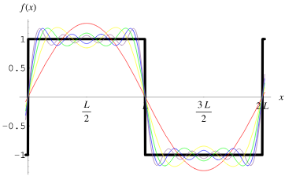

# Bildverstehen <br>

## Table of Contents
- [Bildverstehen ](#bildverstehen-)
  - [Table of Contents](#table-of-contents)
  - [Fragen](#fragen)
- [Introduction](#introduction)
  - [Color Models](#color-models)
  - [Histogram](#histogram)
  - [Fragen](#fragen-1)
- [Fourier](#fourier)
  - [Filter](#filter)
  - [Discrete Cosinus Transformation (DCT)](#discrete-cosinus-transformation-dct)
  - [Kompression](#kompression)
  - [Fragen](#fragen-2)
- [Characteristics](#characteristics)
  - [Mean](#mean)
  - [Mean Square Deviation (MSD)](#mean-square-deviation-msd)
  - [Histogramm](#histogramm)
  - [Entropie](#entropie)
    - [Aufgabe](#aufgabe)
  - [Fragen](#fragen-3)
- [Modifications](#modifications)
  - [Grey Value Transformations](#grey-value-transformations)
  - [Gamma-Transformation](#gamma-transformation)
    - [Beispiel](#beispiel)
  - [Histogram Equalization](#histogram-equalization)
  - [Fragen](#fragen-4)
- [Kernels](#kernels)
  - [Grenzen](#grenzen)
  - [Kerneltypen](#kerneltypen)
  - [Fragen](#fragen-5)
- [Transformation](#transformation)
- [Rekonstruktion](#rekonstruktion)
- [Neuronale Netze](#neuronale-netze)
  - [Wiederholung](#wiederholung)
  - [CNN](#cnn)
    - [Convolutional Layer](#convolutional-layer)
  - [Fragen](#fragen-6)
  - [Berechnung](#berechnung)
- [Klassifikation](#klassifikation)


## Fragen
1. You know the similarities and relations between the human and an artificial perception system

&emsp; &emsp; &emsp; Light → Sensor → Transportation → Processing

1. You can explain how a digital picture is created and how it is represented in the digital world

&emsp; &emsp; &emsp; Light, Bayer Filter, Photodiodes, RGB

1. You analyze the RGB representation and its effects on forcing the real world into a matrix
structure

&emsp; &emsp; &emsp; Quantification is happening, every pixel is a mix of intensities of the 3 colour channels


# Introduction
## Color Models


## Histogram 
* distribution of colors
* possible x3 fot all channels
* analyze over- & underexposure

(see cv_03 p.33) 

<br>

## Fragen
1. What words are represented by the letters HSV of the respective color model?

&emsp; &emsp; &emsp; Hue, Saturation, Value

2.  For a given image, assume we increase all three values (RGB) by a factor of x, will the image
get darker or brighter?

&emsp; &emsp; &emsp; Brighter

1.  You plan to change a specific color of an image without affecting its hue or saturation. Into
which color model would you translate the image to do this modification smoothly?

&emsp; &emsp; &emsp; HSV

<br>

# Fourier 
Jedes Signal kann aus Sinuskurven zusammengesetzt werden. Bei **2D** Bildern jede Zeile und Spalte als Signal betrachten.

## Filter
* Low-Pass-Filter: Blurring
* High-Pass-Filter: Edge Detection

Der Cut-Off bestimmt die Grenzfrequenz (wie Viertelkreis von oben links).

## Discrete Cosinus Transformation (DCT)
Aufteilung in 8x8 Blöcke, die dann in den Frequenzraum transformiert werden.


## Kompression
* Jedes JPEG Bild wird in 8x8 Blöcke zerlegt und dann in den Frequenzraum transformiert.
* So lässt sich jedes Bild als Summe von Sinuskurven darstellen.
* Weglassen von hohen Frequenzen führt zu **Kompression**


## Fragen 
1. Erläutern Sie in eigenen Worten die Grundidee einer Fourier-Transformation im 1D-Signalraum.

&emsp; &emsp; &emsp; Zerlegen eines Signals in seine Frequenzkomponenten

2. Zeichnen Sie eine entsprechende Frequenzansicht eines Rechtecksignals, ohne es zu berechnen.

&emsp; &emsp; &emsp; 

3. Zeichnen Sie für die folgende Frequenzansicht die entsprechende Zeitansicht.

&emsp; &emsp; &emsp; **LERNEN**


# Characteristics
## Mean
Mittelwert der Pixelwerte

## Mean Square Deviation (MSD)
Standardabweichung vom Mittelwert

## Histogramm
Verteilung der Pixelwerte
* Zeichnen: x-Achse Pixelwerte, y-Achse Anzahl Pixel
* Normalisieren: Histogramm auf 0-1 skalieren
* aus dem Histogramm lassen sich die anderen Werte berechnen
* Werte ab zB 200 abschneiden, um Hintergurund zu entfernen

## Entropie
Maß für Informationsgehalt (H) 
* 0 = keine Information

### Aufgabe
Entropie und andere Werte berechnen, siehe [cv_06_characteristics](https://moodle.thi.de/pluginfile.php/745275/mod_resource/content/0/CV_6_Characteristics.pdf) auf moodle. 

## Fragen
1. Mittelwert, Standardabweichung und Entropie zuordnen 
2. Histogramme zeichnen
3. Wenn der Kontrast eines Bildes erhöht wird, wie verändert sich die Entropie?

&emsp; &emsp; &emsp; Entropie nimmt zu, da größerer Bereich von Pixelintensitäten.


# Modifications
Man verändert Pixelwerte zum Beispiel um...
* redundante Informationen zu entfernen.
* den Fokus auf bestimmte Informationen zu legen.
* als Preprocessing für weitere Analysen. 

## Grey Value Transformations
(Seite 11 in [cv_07_modifications](https://moodle.thi.de/pluginfile.php/746652/mod_resource/content/0/CV_7_Modifications.pdf) um Formeln anwenden zu können.)

Falls die Transformation zu Werten außerhalb von ```G={0,255}``` führt, Grenzwert nutzen (dafür gibt es bessere Methoden). 

## Gamma-Transformation
Gamma-Korrektur: $f(g) = 255 * (g/255)^\gamma$ um zwischen ```0``` und ```255``` zu bleiben.

Siehe [cv_07_modifications](https://moodle.thi.de/pluginfile.php/746652/mod_resource/content/0/CV_7_Modifications.pdf) Seite 17.

### Beispiel


## Histogram Equalization
Gleichmäßige Verteilung der Pixelwerte, führt bei homogenen Bereichen zu Noise!

## Fragen 
1. Unterschied linearer und nichtlinearer Transformationen

&emsp; &emsp; &emsp; _lernen_

2. Wenn wir ein Bild mit Gamma-Transformation umwandeln und dabei einen Gamma-Wert größer als 1 verwenden, wird das Bild heller oder dunkler werden?

&emsp; &emsp; &emsp; Dunkler

3. Lineare Transformation auf Bild anwenden.

&emsp; &emsp; &emsp; _üben_

4. Warum ist es eine gute Idee, eine Nachschlagetabelle zu verwenden, wenn man den Histogrammausgleich an einem Bild durchführt?

&emsp; &emsp; &emsp; _lernen_


# Kernels
Matrix, die auf ein Bild angewendet werden kann.

## Grenzen
**Skip Border** <br>
Das Bild wird kleiner. 

**Extend Border** <br>
Das Bild bleibt gleich groß, aber die Ränder werden mit den Nachbarn aufgefüllt.

**Concatate** <br>
Bild jeweils an den Seiten hinzufügen.

**Mirror** <br>
'Spiegeln' der Matrix, um alle Seiten (insgesamt x8).

## Kerneltypen
**Identity** <br>
Das Bild bleibt gleich. <br>


**Box Blur** <br>
Mittelwert der Nachbarn, Bild wird unscharf. <br>


**Gaussian Blur** <br>
Unschärfe mit Gauss Verteilung der Nachbarn. <br>


**Sharpen** <br>
Bild wird schärfer mit genaueren Kanten. <br>


**Sobel** <br>
Filter um Kanten zu erkennen, ```x``` und ```y``` Richtung. <br>


Beide Filter können kombiniert werden, um die Kanten zu verstärken. <br>

$H = \sqrt{H_x^2 + H_y^2}$ 

Die Richtung der Kanten kann mit dem ```arctan``` berechnet werden. <br>

$\theta = arctan(\frac{H_y}{H_x})$
<!--
Check if x/y is correct.
-->


**Dilation** <br>
Kernel (z.B. in Kreuzform) der maximalen Wert der Nachbarn auf die Pixel anwendet. Kann über mehrere Iterationen angewendet werden.

**Erosion** <br>
Genau das Gegenteil, minimaler Wert der Nachbarn. Strukturen im Bild werden dünner. <br>


**Opening** <br>
Erosion gefolgt von Dilation. Entfernt Noise im Bild. <br>

**Closing** <br>
Dilation gefolgt von Erosion. Entfernt Löcher in Objekten im Vorgrund. <br> 


**Gabor Filter** <br>
Für Analyse von Texturen, eine Kombination as Sinus und Gauss. <br>
* $\lambda$ = Wellenlänge der Sinusfunktion
* $\theta$ = Orientierung der Sinusfunktion
* $\psi$ = Phasenverschiebung der Sinusfunktion
* $\sigma$ = Standardabweichung der Gaussfunktion
* $\gamma$ = Aspektverhältnis der Gaussfunktion

Der Filter erkennet Kanten in einer bestimmten Orientierung. <br>

<!--

-->

## Fragen
1. Definiere einen 4x4 Filter der das Bild schärft.

&emsp; &emsp; &emsp; _hello_

2. Filter auf ein Bild anwenden. 

&emsp; &emsp; &emsp; _siehe Probeklausur_

3. In eigenen Worten erklären, wie ein Sobel-Filter funktioniert.

&emsp; &emsp; &emsp; Starke Änderungen in x- oder y-Richtung werden erkannt. 

&emsp; &emsp; &emsp; → _lernen_


# Transformation
(siehe cv_10)

# Rekonstruktion
(siehe cv_11)

# Neuronale Netze
## Wiederholung
Weight Initialization <br>
Zufällige Werte sind zu ungenau, da zu groß oder klein möglich. <br>
Xavier Initialization gut für Sigmoid und ```tanh```, nicht bei ```ReLU```. <br>
He Initialization gut für ```ReLU```. <br>

**Loss** <br>
Konvexe Loss-Funktionen haben auch nur ein Minimum. <br>
* Huber Loss (Kombination aus L1 und L2, für Regression)
* 0-1 Loss (für Klassifikation)
* Hinge Loss
* logistische Loss-Funktion
* logistische Sigmoidd-Funktion 
* exponentieller Loss

**Optimizer** <br>
* Gradient Descent
* Adam (adatpive Learnrate)
* RMSProp (adatpive Learnrate)

**Momentum** <br> 
Nimmt Richtung des Gradienten mit, um schneller zu konvergieren. <br>

## CNN
Um Bilder zu analysieren werden unmengen an Neuronen benötigt. <br>

**Idee** <br>
 Netz für Feature Extraction und ein Netz für Klassifikation. <br>

### Convolutional Layer
Lokale Suche nach Features im Bild mit Hilfe von Kernels, Paddng um Größe des Bildes zu erhalten.


Zum Beispiel kann Max-Pooling verwendet werden, um die Größe des Bildes zu reduzieren. <br>

## Fragen 
1. Wieso werden CNNs verwendet und wie funktionieren sie?

&emsp; &emsp; &emsp; CNNs eignen such gut für Bildverarbeitung, da sie die Größe des Bildes reduzieren und Features extrahieren können. _Lernen_

2. Output-Dimension mit Input und Parameter berechnen. 

&emsp; &emsp; &emsp; _rechnen_

## Berechnung 

```
output_height = (input_height + padding_height_top + padding_height_bottom - kernel_height) / stride_height + 1
output_width = (input_width + padding_width_left + padding_width_right - kernel_width) / stride_width + 1
```

# Klassifikation
...
