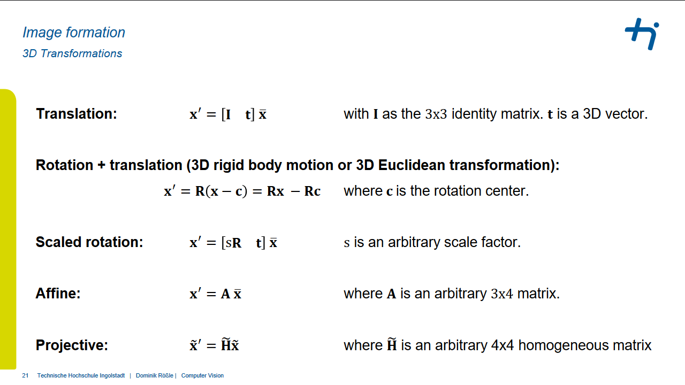
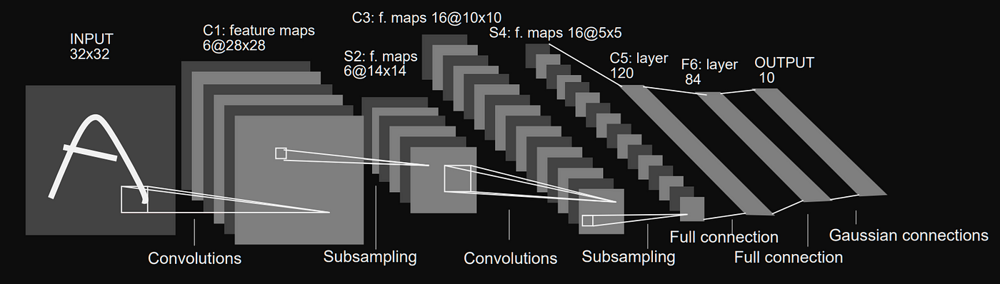
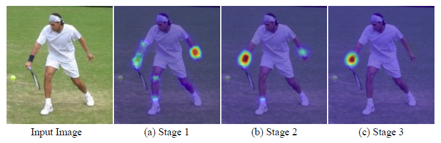
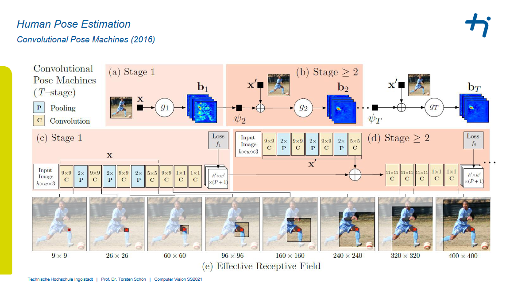
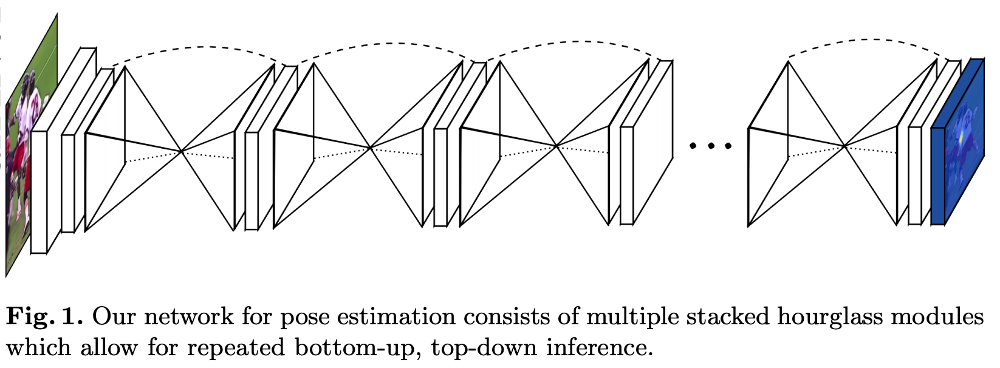
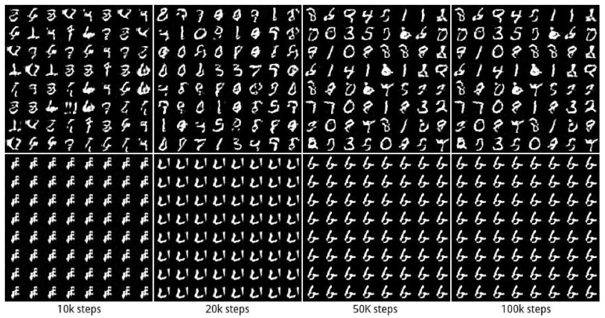

# Bildverstehen <br>

## Table of Contents
- [Bildverstehen ](#bildverstehen-)
  - [Table of Contents](#table-of-contents)
  - [Fragen](#fragen)
- [Introduction](#introduction)
  - [Color Models](#color-models)
  - [Histogram](#histogram)
  - [Fragen](#fragen-1)
- [Fourier](#fourier)
  - [Filter](#filter)
  - [Discrete Cosinus Transformation (DCT)](#discrete-cosinus-transformation-dct)
  - [Kompression](#kompression)
  - [Fragen](#fragen-2)
- [Characteristics](#characteristics)
  - [Mean](#mean)
  - [Mean Square Deviation (MSD)](#mean-square-deviation-msd)
  - [Histogramm](#histogramm)
  - [Entropie](#entropie)
    - [Aufgabe](#aufgabe)
  - [Fragen](#fragen-3)
- [Modifications](#modifications)
  - [Grey Value Transformations](#grey-value-transformations)
  - [Gamma-Transformation](#gamma-transformation)
    - [Beispiel](#beispiel)
  - [Histogram Equalization](#histogram-equalization)
  - [Fragen](#fragen-4)
- [Kernels](#kernels)
  - [Grenzen](#grenzen)
  - [Kerneltypen](#kerneltypen)
  - [Fragen](#fragen-5)
- [Transformation](#transformation)
- [Rekonstruktion](#rekonstruktion)
- [Neuronale Netze](#neuronale-netze)
  - [Wiederholung](#wiederholung)
  - [CNN](#cnn)
    - [Convolutional Layer](#convolutional-layer)
  - [Fragen](#fragen-6)
  - [Berechnung](#berechnung)
- [Klassifikation](#klassifikation)
  - [Netze](#netze)
  - [Gewichtsreduktion](#gewichtsreduktion)
  - [Skip Connections](#skip-connections)
  - [Cardinality](#cardinality)
  - [Fragen](#fragen-7)
- [Object Detection](#object-detection)
  - [Region Proposal](#region-proposal)
  - [Fast R-CNN](#fast-r-cnn)
  - [Faster R-CNN](#faster-r-cnn)
  - [YOLO](#yolo)
  - [Transformer](#transformer)
  - [Fragen](#fragen-8)
- [Semantic Segmentation](#semantic-segmentation)
  - [Fully Convolutional Networks (FCN)](#fully-convolutional-networks-fcn)
  - [U-Net](#u-net)
  - [PSPNet](#pspnet)
  - [DeepLab](#deeplab)
  - [Instance Segmentation](#instance-segmentation)
  - [Transformer](#transformer-1)
  - [Autoencoder](#autoencoder)
  - [Fragen](#fragen-9)
- [Human Pose Estimation](#human-pose-estimation)
  - [Convolutional Pose Machines](#convolutional-pose-machines)
  - [Stacked Hourglass](#stacked-hourglass)
  - [OpenPose](#openpose)
  - [Fragen](#fragen-10)
- [Generative Adversarial Networks](#generative-adversarial-networks)
  - [Aufbau](#aufbau)
  - [Probleme](#probleme)
  - [Typen](#typen)
- [Praktika](#praktika)


## Fragen
1. You know the similarities and relations between the human and an artificial perception system

&emsp; &emsp; &emsp; Light → Sensor → Transportation → Processing

1. You can explain how a digital picture is created and how it is represented in the digital world

&emsp; &emsp; &emsp; Light, Bayer Filter, Photodiodes, RGB

1. You analyze the RGB representation and its effects on forcing the real world into a matrix
structure

&emsp; &emsp; &emsp; Quantification is happening, every pixel is a mix of intensities of the 3 colour channels


# Introduction
## Color Models


## Histogram 
* distribution of colors
* possible x3 fot all channels
* analyze over- & underexposure

(see cv_03 p.33) 

<br>

## Fragen
1. What words are represented by the letters HSV of the respective color model?

&emsp; &emsp; &emsp; Hue, Saturation, Value

2.  For a given image, assume we increase all three values (RGB) by a factor of x, will the image
get darker or brighter?

&emsp; &emsp; &emsp; Brighter

1.  You plan to change a specific color of an image without affecting its hue or saturation. Into
which color model would you translate the image to do this modification smoothly?

&emsp; &emsp; &emsp; HSV

<br>

# Fourier 
Jedes Signal kann aus Sinuskurven zusammengesetzt werden. Bei **2D** Bildern jede Zeile und Spalte als Signal betrachten.

## Filter
* Low-Pass-Filter: Blurring
* High-Pass-Filter: Edge Detection

Der Cut-Off bestimmt die Grenzfrequenz (wie Viertelkreis von oben links).

## Discrete Cosinus Transformation (DCT)
Aufteilung in 8x8 Blöcke, die dann in den Frequenzraum transformiert werden.


## Kompression
* Jedes JPEG Bild wird in 8x8 Blöcke zerlegt und dann in den Frequenzraum transformiert.
* So lässt sich jedes Bild als Summe von Sinuskurven darstellen.
* Weglassen von hohen Frequenzen führt zu **Kompression**


## Fragen 
1. Erläutern Sie in eigenen Worten die Grundidee einer Fourier-Transformation im 1D-Signalraum.

&emsp; &emsp; &emsp; Zerlegen eines Signals in seine Frequenzkomponenten

2. Zeichnen Sie eine entsprechende Frequenzansicht eines Rechtecksignals, ohne es zu berechnen.

&emsp; &emsp; &emsp; 

3. Zeichnen Sie für die folgende Frequenzansicht die entsprechende Zeitansicht.

&emsp; &emsp; &emsp; **LERNEN**


# Characteristics
## Mean
Mittelwert der Pixelwerte

## Mean Square Deviation (MSD)
Standardabweichung vom Mittelwert

## Histogramm
Verteilung der Pixelwerte
* Zeichnen: x-Achse Pixelwerte, y-Achse Anzahl Pixel
* Normalisieren: Histogramm auf 0-1 skalieren
* aus dem Histogramm lassen sich die anderen Werte berechnen
* Werte ab zB 200 abschneiden, um Hintergurund zu entfernen

## Entropie
Maß für Informationsgehalt (H) 
* 0 = keine Information

### Aufgabe
Entropie und andere Werte berechnen, siehe [cv_06_characteristics](https://moodle.thi.de/pluginfile.php/745275/mod_resource/content/0/CV_6_Characteristics.pdf) auf moodle. 

## Fragen
1. Mittelwert, Standardabweichung und Entropie zuordnen 
2. Histogramme zeichnen
3. Wenn der Kontrast eines Bildes erhöht wird, wie verändert sich die Entropie?

&emsp; &emsp; &emsp; Entropie nimmt zu, da größerer Bereich von Pixelintensitäten.


# Modifications
Man verändert Pixelwerte zum Beispiel um...
* redundante Informationen zu entfernen.
* den Fokus auf bestimmte Informationen zu legen.
* als Preprocessing für weitere Analysen. 

## Grey Value Transformations
(Seite 11 in [cv_07_modifications](https://moodle.thi.de/pluginfile.php/746652/mod_resource/content/0/CV_7_Modifications.pdf) um Formeln anwenden zu können.)

Falls die Transformation zu Werten außerhalb von ```G={0,255}``` führt, Grenzwert nutzen (dafür gibt es bessere Methoden). 

## Gamma-Transformation
Gamma-Korrektur: $f(g) = 255 * (g/255)^\gamma$ um zwischen ```0``` und ```255``` zu bleiben.

Siehe [cv_07_modifications](https://moodle.thi.de/pluginfile.php/746652/mod_resource/content/0/CV_7_Modifications.pdf) Seite 17.

### Beispiel


## Histogram Equalization
Gleichmäßige Verteilung der Pixelwerte, führt bei homogenen Bereichen zu Noise!

## Fragen 
1. Unterschied linearer und nichtlinearer Transformationen

&emsp; &emsp; &emsp; _lernen_

2. Wenn wir ein Bild mit Gamma-Transformation umwandeln und dabei einen Gamma-Wert größer als 1 verwenden, wird das Bild heller oder dunkler werden?

&emsp; &emsp; &emsp; Dunkler

3. Lineare Transformation auf Bild anwenden.

&emsp; &emsp; &emsp; _üben_

4. Warum ist es eine gute Idee, eine Nachschlagetabelle zu verwenden, wenn man den Histogrammausgleich an einem Bild durchführt?

&emsp; &emsp; &emsp; _lernen_


# Kernels
Matrix, die auf ein Bild angewendet werden kann.

## Grenzen
**Skip Border** <br>
Das Bild wird kleiner. 

**Extend Border** <br>
Das Bild bleibt gleich groß, aber die Ränder werden mit den Nachbarn aufgefüllt.

**Concatate** <br>
Bild jeweils an den Seiten hinzufügen.

**Mirror** <br>
'Spiegeln' der Matrix, um alle Seiten (insgesamt x8).

## Kerneltypen
**Identity** <br>
Das Bild bleibt gleich. <br>


**Box Blur** <br>
Mittelwert der Nachbarn, Bild wird unscharf. <br>


**Gaussian Blur** <br>
Unschärfe mit Gauss Verteilung der Nachbarn. <br>


**Sharpen** <br>
Bild wird schärfer mit genaueren Kanten. <br>


**Sobel** <br>
Filter um Kanten zu erkennen, ```x``` und ```y``` Richtung. <br>


Beide Filter können kombiniert werden, um die Kanten zu verstärken. <br>

$H = \sqrt{H_x^2 + H_y^2}$ 

Die Richtung der Kanten kann mit dem ```arctan``` berechnet werden. <br>

$\theta = arctan(\frac{H_y}{H_x})$
<!--
Check if x/y is correct.
-->


**Dilation** <br>
Kernel (z.B. in Kreuzform) der maximalen Wert der Nachbarn auf die Pixel anwendet. Kann über mehrere Iterationen angewendet werden.

**Erosion** <br>
Genau das Gegenteil, minimaler Wert der Nachbarn. Strukturen im Bild werden dünner. <br>


**Opening** <br>
Erosion gefolgt von Dilation. Entfernt Noise im Bild. <br>

**Closing** <br>
Dilation gefolgt von Erosion. Entfernt Löcher in Objekten im Vorgrund. <br> 


**Gabor Filter** <br>
Für Analyse von Texturen, eine Kombination as Sinus und Gauss. <br>
* $\lambda$ = Wellenlänge der Sinusfunktion
* $\theta$ = Orientierung der Sinusfunktion
* $\psi$ = Phasenverschiebung der Sinusfunktion
* $\sigma$ = Standardabweichung der Gaussfunktion
* $\gamma$ = Aspektverhältnis der Gaussfunktion

Der Filter erkennet Kanten in einer bestimmten Orientierung. <br>

<!--

-->

## Fragen
1. Definiere einen 4x4 Filter der das Bild schärft.

&emsp; &emsp; &emsp; _hello_

2. Filter auf ein Bild anwenden. 

&emsp; &emsp; &emsp; _siehe Probeklausur_

3. In eigenen Worten erklären, wie ein Sobel-Filter funktioniert.

&emsp; &emsp; &emsp; Starke Änderungen in x- oder y-Richtung werden erkannt. 

&emsp; &emsp; &emsp; → _lernen_


# Transformation
...

## Translation
Verschiebung des Bildes um $t_x$ und $t_y$.

$x' = [I t] \overline{x}$ <br>

$I = \begin{bmatrix} 1 & 0 \\ 0 & 1 \end{bmatrix}$ <br>

$\overline{x}' = \begin{bmatrix} I &t \\ 0^T & 1 \end{bmatrix} \overline{x}$

$t$ ist der Wert der Translation, zum Beispiel $t = \begin{bmatrix} 50 \\ 50 \end{bmatrix}$

## Euclidean
Kombination aus Rotation und Translation. <br>

$x' = \begin{bmatrix} R & t \end{bmatrix} \overline{x}$

Hierbei ist $R$ die Rotationsmatrix $R = \begin{bmatrix} cos(\theta) & -sin(\theta) \\ sin(\theta) & cos(\theta) \end{bmatrix}$.

## Similarity
Kombination aus Rotation, Translation und Skalierung - es bleibt die Form des Bildes erhalten. <br>

$x' = \begin{bmatrix} sR & t \end{bmatrix} \overline{x}$ <br>

$x' = \begin{bmatrix} s cos(\theta) & -s sin(\theta) & t_x \\ s sin(\theta) & s cos(\theta) & t_y \end{bmatrix} \overline{x}$

Hier isit der Skalierungsfaktor $s$ zum Beispiel $s = 0.5$.


## Affine
Rotation um eine Achse, Skalierung und Translation - parralelle Linien bleiben parralell. <br>

$x' = A \overline{x}$ <br>

$x' = \begin{bmatrix} a_{00} & a_{01} & a_{02} \\ a_{10} & a_{11} & a_{12} \end{bmatrix} \overline{x}$

$A$ ist eine beliebige $2 \times 3$ Matrix. <br>

<details><summary>Matrix-Infos</summary>

$a_{00}$ und $a_{11}$ sind die Skalierungsfaktoren. <br>
$a_{01}$ und $a_{10}$ sind die Shearingfaktoren in $x$ und $y$ Richtung. <br>
$a_{02}$ und $a_{12}$ sind die Translationen in $x$ und $y$ Richtung. <br>

</details> <br>


## Projective
Verzerrung im Raum, gerade Linien bleiben gerade. <br>

$\widetilde{x}' = \widetilde{H} \widetilde{x}$ <br>

Hier ist $\widetilde{H}$ eine homogene $3 \times 3$ Matrix. Für inhomogene Ergebnisse müssen die Koordinaten normalisiert werden. 

$x' = \frac{h_{00}x + h_{01}y + h_{02}}{h_{20}x + h_{21}y + h_{22}}$ <br>
$y' = \frac{h_{10}x + h_{11}y + h_{12}}{h_{20}x + h_{21}y + h_{22}}$ <br> 

<details><summary>Matrix-Infos</summary>

$a_{00}$ und $a_{11}$ sind die Skalierungsfaktoren. <br>
$a_{01}$ und $a_{10}$ sind die Shearingfaktoren in $x$ und $y$ Richtung. <br>
$a_{02}$ und $a_{12}$ sind die Translationen in $x$ und $y$ Richtung. <br>
$a_{20}$ und $a_{21}$ kodieren die perspektivische Verzerrung in $x$ und $y$ Richtung. <br>

</details> <br>

<details><summary>Zusammenfassung</summary>



</details> <br>


# Rekonstruktion
(siehe cv_11)


# Neuronale Netze
## Wiederholung
Weight Initialization <br>
Zufällige Werte sind zu ungenau, da zu groß oder klein möglich. <br>
Xavier Initialization gut für Sigmoid und ```tanh```, nicht bei ```ReLU```. <br>
He Initialization gut für ```ReLU```. <br>

**Loss** <br>
Konvexe Loss-Funktionen haben auch nur ein Minimum. <br>
* Huber Loss (Kombination aus L1 und L2, für Regression)
* 0-1 Loss (für Klassifikation)
* Hinge Loss
* logistische Loss-Funktion
* logistische Sigmoidd-Funktion 
* exponentieller Loss

**Optimizer** <br>
* Gradient Descent
* Adam (adatpive Learnrate)
* RMSProp (adatpive Learnrate)

**Momentum** <br> 
Nimmt Richtung des Gradienten mit, um schneller zu konvergieren. <br>

## CNN
Um Bilder zu analysieren werden unmengen an Neuronen benötigt. <br>

**Idee** <br>
 Netz für Feature Extraction und ein Netz für Klassifikation. <br>

### Convolutional Layer
Lokale Suche nach Features im Bild mit Hilfe von Kernels, Paddng um Größe des Bildes zu erhalten.


Zum Beispiel kann Max-Pooling verwendet werden, um die Größe des Bildes zu reduzieren. <br>

## Fragen 
1. Wieso werden CNNs verwendet und wie funktionieren sie?

&emsp; &emsp; &emsp; CNNs eignen such gut für Bildverarbeitung, da sie die Größe des Bildes reduzieren und Features extrahieren können. _Lernen_

2. Output-Dimension mit Input und Parameter berechnen. 

&emsp; &emsp; &emsp; _rechnen_

## Berechnung 

```python
output_height = (input_height + padding_height_top + padding_height_bottom - kernel_height) / stride_height + 1
output_width = (input_width + padding_width_left + padding_width_right - kernel_width) / stride_width + 1
```

Beispiel mit ```N``` (Anzahl Batches), ```H``` (Höhe), ```W``` (Breite), ```C``` (Anzahl Channels), ```KW``` (Kernelbreite), ```KH``` (Kernelhöhe), ```KC``` (Kernel Channel), ```SH``` (Stride Höhe), ```SW``` (Stride Breite), ```P_H1, P_H2``` (Padding Höhe), ```P_W1, P_W2``` (Padding Breite). <br>

  
```python
input [N H W C] = [100 255 255 64]
kernel [H W C] = [7 7 64]
stride [H W] = [3 4]
padding [P_H1 P_H2 P_W1 P_W2] = [2 2 2 2]
output_cnannel2 = 128
```

Damit ergibt sich folgendes. 
```python
output [N H W C] = [100 85 64 128]
```
<!--
What is a top-1 error?
-> The top-1 error is the percentage of test images for which the correct label is not among the top 1 predicted labels.

What is a top-5 error?
-> The top-5 error is the percentage of test images for which the correct label is not among the top 5 predicted labels.


-->

# Klassifikation
Art von Supervised Learning, bei dem ein Objekt einer Klasse zugeordnet wird. <br>

## Netze
(siehe [moodle](https://moodle.thi.de/pluginfile.php/753246/mod_resource/content/0/CV_15_Classification%20Architectures.pdf) Seite 7 zu **Inception**) <br>

### LeNet
Ein simples Convolutional Neural Network von 1998, nutzt Backpropagation. <br>

<details><summary>Struktur</summary>



Wurde angewendet auf den ```MNIST``` Datensatz. <br>

</details> <br>

<!-- 

SONNTAG
https://www.google.com/search?q=alexnet+structure&tbm=isch#imgrc=nI9KY6aOxK-1zM

https://www.google.com/search?q=nn+vs+cnn

https://www.google.com/search?q=unet&tbm=isch#imgrc=K-wr6kKnRJ4HPM

https://www.google.com/search?q=sigmoid

https://www.google.com/search?q=How+does+VGGNet+reduce+weights%3F

https://www.google.com/search?q=cv+inception+module&tbm=isch#imgrc=psQyoxlGuaY1hM

https://moodle.thi.de/pluginfile.php/753246/mod_resource/content/0/CV_15_Classification%20Architectures.pdf
----------- S7

-->

### AlexNet
...

## Gewichtsreduktion
Darstellung von GoogLeNet von 2015. 


## Skip Connections
In Theorie sollten Netzwerke je tiefer sie sind auch besser werden oder besser als ihre einzelnen Teile. <br>
In der Praxis ist das nicht so, siehe **Degradation** Problem. <br>


Skip Connections helfen dabei, indem das Netzwerk nur die  Residuals lernen muss. <br>

_A residual connection (skip connection) connects the output of one earlier convolutional layer to the input of another future convolutional layer several layers later (e.g. a numer of intermediate convolutional steps are skipped)._


Für sehr tiefe Netze können auch ```Skip 3 Layers``` verwendet werden. <br>

## Cardinality
Bis jetzt wurden zwei Probleme außer Acht gelassen.
* Receptive Fields sind relativ klein für einzelne Channels
* es werden keine Relationen zwischen den Channels gelernt

<!-- add images -->

## Fragen 
1. Zeichne ein Inception Modul und erkläre die einzelnen Schritte. Wieso wird es verwendet?

&emsp; &emsp; &emsp; _lernen_

2. Was ist eine Skip Connection und wieso wird sie verwendet?

&emsp; &emsp; &emsp; Skip-Connectionssind zusätzliche Verbindungen in einem neuronalen Netz, die dazu beitragen, das versuchen, das Vanishing-Gradient Problem zu lösen und einen direkten Informationsfluss zwischen frühen und späten Schichten zu ermöglichen, was zu einer verbesserten Leistung und Optimierung tiefer Netze führt.

3. Architektur für ein beschriebenes Problem aufzeichnen und erklären.

&emsp; &emsp; &emsp; _üben_ mit LeNet, AlexNet, VGG, ResNet, GoogLeNet, Inception


# Object Detection
Object-Detection kombiniert Klassifikation und Regression. <br>
Nach Klassifikation nun mit Boundry Box die jeweiligen Objekte im Bild markieren. Evaluation mit Intersection over Union (IoU). <br>

$IoU = \frac{overlap}{union}$

Oft wird ein threshold von ```0.5``` oder ```0.75``` verwendet, um als true positive zu gelten. <br>

Wie viel ```%``` der vorhergesagten Boxen sind richtig? <br>
$Precision = \frac{TP}{TP + FP}$ 

Wie viel ```%``` der tatsächlichen Boxen wurden richtig vorhergesagt? <br>
$Recall = \frac{TP}{TP + FN}$

**Beispiel** <br>
Annahme, man hat 3TP und 4 FP. <br>

|   | prec | recall | prec_int |
| --- | --- | --- | --- |
| TP | $\frac{1}{1} = 1$ | $\frac{1}{3} = 0.33$ | $1$ |
| FP | $\frac{1}{2} = 0.5$ | $\frac{1}{3} = 0.33$ | $1$ |
| TP | $\frac{2}{3} = 0.67$ | $\frac{2}{3} = 0.67$ | $0.67$ |
| FP | $\frac{2}{4} = 0.5$ | $\frac{2}{3} = 0.67$ | $0.67$ |
| FP | $\frac{2}{5} = 0.4$ | $\frac{2}{3} = 0.67$ | $0.67$ |
| TP | $\frac{3}{6} = 0.5$ | $\frac{3}{3} = 1$ | $0.5$ |
| FP | $\frac{3}{7} = 0.43$ | $\frac{3}{3} = 1$ | $0.5$ |

Und als Graph ergibt sich folgendes. 


**average Precision** <br>
Alle Precision Werte werden gemittelt. <br>

$AP = \frac{1}{n} \sum_{i=1}^{n} prec_i$

$= \frac{1}{11} (1 + 1 + 1 + 1 + 0.67 0.67 + 0.67 + 0.5 + 0.5 + 0.5 + 0.5)$

$\approx 0.728$

**mean average Precision** <br>
Mittelwert über alle Klassen, gut für Evaluation. <br>

## Region Proposal
Paper zu ```R-CNN``` von 2014. <br>
Vorschläge für die Regionen aus dem Bild erstellen, dann mit CNN die Features extrahieren und dann mit ```SVM``` die Klassifikation durchführen. <br>


Vorgegangen wird wie folgt. <br>

1. 2000 kategorisch unabhangige Regionen aus dem Bild extrahieren
2. auf ```227x227``` skalieren
3. für jede Region ein ```4096```-dimensionales Feature Vektor extrahieren (AlexNet)
4. non-maximum suppression (Regionen zusammenfassen)
5. für jede Klasse ein ```SVM``` trainieren
6. Bounding Box Regression

**Probleme** <br>
Sehr langsam, da region proposal 2000 mal durchgeführt werden muss.

## Fast R-CNN
Paper zu ```Fast R-CNN``` von 2015. <br>
Idee ist, das ```CNN``` nur einmal durchzuführen und dann die Regionen zu extrahieren. 
Zudem wird ```SVM``` durch ```Softmax``` ersetzt, ```ROI``` Pooling Layer wird verwendet. 


Für genaue Erklärung zu ```ROI``` Pooling Layer siehe [towardsdatascience](https://scribe.rip/understanding-region-of-interest-part-1-roi-pooling-e4f5dd65bb44). 

**Vorteile** <br>
* höhere Qualität der Erkennung
* schneller als ```R-CNN```
* kein Speicher benötigt wie in der ```R-CNN``` Pipeline

**Nachteile** <br>
* Region PRoposal mit Selective Search ist immer noch langsam
* ```ROI``` Pooling verliert Informationen

## Faster R-CNN
Im Vergleich zu ```Fast R-CNN``` wird die Region Proposal durch ein trainerbares ```RPN``` ersetzt.
Für jede Box wird werden ```k``` Ankerpunkte (Anchors) erstellt (mit unterschiedlichen Größen und Seitenverhältnissen). 
Es entstehen ```2k``` Scores (Objekt/kein Objekt) und ```4k``` Koordinaten (Bounding Box).


Trainiert wird auf Basis von ```IoU```, mit ```VGG``` als Backbone. Das ```CNN``` wird so geteilt zwischen dem ```RPN``` und ```R-CNN``` Teil. 

<details><summary>Vergleich</summary>
Vergleich der ersten drei Ansätze.

</details>

## YOLO
Paper zu ```YOLO``` von 2015. <br>
Ansatz ist, das Bild in ein $SxS$ Grid zu unterteilen und für jede Zelle eine Bounding Box vorherzusagen. Am Ende werden die Box-Probabilities mit den Klassen-Probabilities multipliziert.


Die Architektur basiert auf dem ```GoogLeNet```, mit 25 Convolutional und 2 Fully Connected Layer. Vortrainiert auf ```1000-class ImageNet``` mit Input von ```448x448```.


Seit 2015 gab es viele weitere Versionen, wie ```YOLOv2```, ```YOLOv3``` und ```YOLOv4```. 

## Transformer
Siehe [moodle](https://moodle.thi.de/pluginfile.php/756070/mod_resource/content/0/CV_17_Object_Detection%20II.pdf) Seite 34.

## Fragen
1. Aus den Ergebnissen an einem Beispiel die ```AP``` berechnen.

&emsp; &emsp; &emsp; _üben_

2. Definieren einer Netzwerkstruktur die 300 unterschiedliche Objekte erkennen kann auf farbigen Bildern. Welche **Loss-Funktion** wird verwendet?

&emsp; &emsp; &emsp; _lernen_

3. Den Unterschied von ```R-CNN```, ```Fast R-CNN``` und ```Faster R-CNN``` erklären.

4. Erkläre wie die ```YOLO``` Architektur funktioniert.

&emsp; &emsp; &emsp; Aufteilung in Gitter mit individuellen Predictions - wird wieder zusammengefügt.

5. Was sind die Vor- und Nachteile von ```YOLO``` im Vergleich zu ```Faster R-CNN```?

&emsp; &emsp; &emsp; Schneller, da das gesamte Bild nur einmal durchlaufen wird. <br>
&emsp; &emsp; &emsp; Nicht so genau, vor allem bei kleinen Objekten.

6. Wie kann die Transformer-Architektur für Objekterkennung verwendet werden?

&emsp; &emsp; &emsp; _lernen_


# Semantic Segmentation
Ziel ist, jedes Pixel einer Klasse zuzuordnen - also eine Segmentation Mask zu erstellen. Zum Beispiel für einen Blur-Effekt auf einfachen Fotos oder für die Erkennung von Hirntumoren.

## Fully Convolutional Networks (FCN)
Paper zu ```FCN``` von 2015. <br>
Funktionoert auf beliebigen Bildgrößen, Aufklösung sinkt dabei. Kann gelöst werden mit zum Beispiel...
* Bilinear Interpolation (not trained)
* Transposed Convolutions (trained)

**Bilinear Interpolation** <br>
Einfache Interpolation, die das Bild vergrößert. 

**Transposed Convolutions** <br>
Wie eine normale Convolution, nur dass die Input-Feature Map angepasst ist. 


Für Rechenbeispiel siehe [moodle](https://moodle.thi.de/pluginfile.php/756088/mod_resource/content/0/CV_18_Semantic_Segmentation.pdf) Seite 16. 


## U-Net
Paper zu ```U-Net``` von [2015](https://arxiv.org/pdf/1505.04597.pdf). <br>
Besteht aus einem Encoder-Decoder-Netzwerk, mit ```skip connections``` zwischen den Layern, die Informationen aus dem Encoder direkt an den Decoder weitergeben. Ermöglicht eine detailierte Segmentierung.


Manchmal kommt es aber dazu, dass Kontext im Bild nicht verwendet wird (zum Beispiel wird ein Boot als Auto erkannt, ohne den Kontext 'See' zu berücksichtigen).

## PSPNet
Paper zu ```PSPNet``` von [2016](https://arxiv.org/pdf/1612.01105.pdf). <br>

Siehe [moodle](https://moodle.thi.de/pluginfile.php/756088/mod_resource/content/0/CV_18_Semantic_Segmentation.pdf) Seite 32.

## DeepLab
Paper zu ```DeepLab``` von [2017](https://arxiv.org/pdf/1706.05587.pdf). <br>
Löst Probleme eines ```CNNs``` mit ```Dilated Convolutions```. 

**Dilated Convolutions** <br>
Den Kernel (Input) vergrößern, indem Lücken zwischen den Elementen eingefügt werden.

Siehe [moodle](https://moodle.thi.de/pluginfile.php/756088/mod_resource/content/0/CV_18_Semantic_Segmentation.pdf) Seite 35.

**Atrous Convolutions** <br>
Beim Upsampling kann somit das Receptive Field vergrößert werden. 


<!-- 
Foliensatz 2 hat weitere Themen 

Image Warps in Downloads für vorheriges Thema
-->

**DeepLab v2** <br>
Paper zu ```DeepLab v2``` von [2017](https://arxiv.org/pdf/1606.00915.pdf). <br>
Erweitert ```DeepLab``` um ```CRF``` (Conditional Random Field) zur Verbesserung der Segmentierung.

**DeepLab v3** <br>
Paper zu ```DeepLab v3``` von [2018](https://arxiv.org/pdf/1706.05587.pdf). <br>


## Instance Segmentation
Eine Kombination aus ```Object Detection``` und ```Semantic Segmentation```. 


## Transformer
...

## Autoencoder
Modelle, die Encoding und Decoding anwenden und somit eine Rekonstruktion des Bildes erstellen. Wegen des ```Bottlenecks``` wird das Bild komprimiert.
* Denoising 
* Bildkompression
* Auflösung erhöhen

Autoencoder funktionieren unsupervised, deswegen gut geeignet für Daten ohne Labels - somit gut für das Pretraining von Modellen.

**Context Encoders** <br>
Nutzen Techniken zur Augmentation für den Feature-Vektor. Idee ist es, das Netz zur Rekonstruktion von Bildern zu trainieren, die zufällig aus dem Originalbild entfernt wurden. 

## Fragen 
Fragen wurden im moodle-Kurs hochgeladen. 


# Human Pose Estimation 
Ziel ist es, die Position von (z.B.) Gelenken im Körper zu erkennen.

## Convolutional Pose Machines
Paper zu ```Convolutional Pose Machines``` von [2016](https://arxiv.org/pdf/1602.00134.pdf). <br>

Eine Sequenz von ```CNNs``` um 2D-maps zu erstellen mit Heatmaps für die Positionen der Gelenke.



<details><summary>genauere Darstellung</summary>

Foliensatz auf [moodle](https://moodle.thi.de/pluginfile.php/758820/mod_resource/content/0/CV_20_Human_Pose_Estimation.pdf) Seite 13.


</details> <br>

Im ersten Teil des ```CPM``` wird die Heatmap nur auf dem lokalen Bild erzeugt - mit ```5``` ConvLayer mti einer ```1x1``` Convolution (also ein ```FCNN```).
Im zweiten Teil wird das Bild als Input verwendet, sowie die Feature-Outputs von der Heatmap (```belief maps```) des vorherigen Layers (größeres Receptive Field).

<details><summary>genauere Darstellung</summary>

The spatial context from the shoulder, nexk and head help to eliminate wrong detections (red) and strengthen the correct ones (green).


</details> <br>

Zitat aus der Publikation.

> Large receptive fields can be archieved either by pooling at the expense of precision, increasing the kernel size of the convolutional filters at the expense of increasing the number of parameters, or by increasing the number of convolutional layers at the risk of encountering vanishing gradients during training.

Jeder Schritt des Netzwerks hat eine Loss-Funktion, die Ground-Truth-Heatmaps wird mit Gauss-Funktion über den Körperteilen erstellt. Typisherweise ```Fehler``` wenn mehere Personen im Bild sind. 

## Stacked Hourglass 
Paper zu ```Stacked Hourglass``` von [2016](https://arxiv.org/pdf/1603.06937.pdf). <br>
<!-- Der Ansatz von ```Stacked Hourglass``` Blöcken ist es, -->



Am Anfang ```7x7``` Convolution mit Stride ```2``` und MaxPooling - am Ende eine ```1x1``` Convolution.

Im Paper wurden ```8``` Stacked Hourglass Blöcke verwendet, mit Data Augmentation - das Training hat etwa ```3``` Tage gedauert. 
Auch hier oft ```Fehler``` bei mehreren Personen im Bild.

## OpenPose
Paper zu ```OpenPose``` von [2018](https://arxiv.org/pdf/1812.08008.pdf). 

Nutzt ```Part Affinity Maps (PAF)``` um die Verbindung zwischen den Körperteilen zu erkennen. Also ein ```2D``` Vektorfeld, das die Koordinaten und Ausrichtung der Körperteile enthält.

1. ```Feedforward``` Netzwerk sagt ein Set an ```2D``` Confidence Maps vorher.
2. Es werden ```2D``` Vektor ```PAFs``` gelernt, die die Verbindugen beinhalten.
3. Beide werden kombiniert um ```2D Key Points``` für alle Personen zu erhalten. 

Sehr gute Performance, auch bei mehreren Personen im Bild.

## Fragen
1. Was sind Herausforderungen in der Human Pose Estiamtion und wie können diese (2) bewältigt werden?

&emsp; &emsp; &emsp; _lernen_

2. Was ist ein Stacked Hourglass Netzwerk, wie funktioniert es und wo wird es eingesetzt?

&emsp; &emsp; &emsp; _lernen_

3. Wie n utzt OpenPose Part Affinity Maps und was ist der Vorteil?

&emsp; &emsp; &emsp; _lernen_


# Generative Adversarial Networks
Ziel ist es, künstliche Daten zu generieren, die von echten Daten nicht zu unterscheiden sind. <br>

## Aufbau 
Zur Visualisierung von GANs, siehe [ganlab](https://poloclub.github.io/ganlab/), [Playground](https://reiinakano.com/gan-playground/) und [Image2Image](https://affinelayer.com/pixsrv/). <br>

**Generator** <br>
Generiert Daten, die weiter zum Discriminator gegeben werden. <br>

**Discriminator** <br>
Versucht zu erkennen, ob die Daten vom Generator oder vom echten Datensatz stammen. <br>


Das Training kann sehr lange (bis zu mehreren Wochen) dauern, es gibt keine gute Methode zur Evaluation - menschliches Einschreiten ist notwendig. 

## Probleme
Falls der Generator zu gut wird, kann der Discriminator nicht mehr lernen, auch wenn noch Verbesserungspotential vorhanden ist.

**Mode Collapse** <br>
Der Generator generiert immer die selben Daten, die der Discriminator nicht mehr unterscheiden kann und somit nicht mehr lernen kann. 

Es werden also gute Daten generiert, die aber keine Diversität haben. Lösen durch ```minibatch GANs``` - der Diskriminator schaut sich einen Mini-Batch an Daten an und erkennt fehlende Abwechslung. 

<details><summary>Erläuterung</summary>

Darstellung von Mode Collapse auf dem MNIST-Datenatz. <br>


Es werden Daten aus den Mini-Batches gezogen, die wenig Abwechslung zeigen (zum Beispiel mit ```L2```-Norm) und diese dann zum Discriminator weitergegeben. Diese Daten unterscheiden sich den echten Daten, dadurch kann mehr Diversität erzeugt werden.

</details> <br>

Weitere Architekturen sind ```Conditional GANs``` oder ```Deep Convolutional GANs```. 

## Anwendungen
Kann zum Beispiel gut für Anonymisierung von Gesichtern verwendet werden. Zuerst wird das Gesicht erkannt und z.B. ausgeschnitten, dann wird ein GAN verwendet um ein neues Gesicht zu generieren und drauf zu setzen.

## Fragen
1. Erkläre wie ein GAN funkioniert und welche Komponenten es hat. Wie genau wird trainiert?

&emsp; &emsp; &emsp; _lernen_

2. Was ist Mode Collapse und wieso tritt es auf? 

&emsp; &emsp; &emsp; _lernen_

3. Wasn kann verwendet werden um ein GAN so zu beeinflussen, spezifische Bilder zu generieren?

&emsp; &emsp; &emsp; _lernen_


# Praktika
<!--- to be continued --->
