# Maschinelles Lernen 2
Prof. Dr. Sören Grottrup <br>
Prof. Dr. Michael Botsch

## Inhalt
- [Maschinelles Lernen 2](#maschinelles-lernen-2)
  - [Inhalt](#inhalt)
- [Einleitung](#einleitung)
  - [Wiederholung](#wiederholung)
  - [universelle Approximationstheorie](#universelle-approximationstheorie)
- [Training von Neuronalen Netzen](#training-von-neuronalen-netzen)
  - [Gradientenabstiegsverfahren](#gradientenabstiegsverfahren)
    - [Algorithmus](#algorithmus)
  - [Backpropagation](#backpropagation)
  - [Batch-Verfahren](#batch-verfahren)
    - [stochastischer Gradientenabstieg](#stochastischer-gradientenabstieg)
    - [Mini-Batch-Gradientenabstieg](#mini-batch-gradientenabstieg)
- [Varianten von SGD](#varianten-von-sgd)
  - [Herausforderungen](#herausforderungen)
  - [Momentum](#momentum)
  - [adaptive Lernraten](#adaptive-lernraten)
    - [Adagrad](#adagrad)
    - [RMSProp](#rmsprop)
    - [Adam](#adam)
- [Methoden zur Verbesserung des Trainings](#methoden-zur-verbesserung-des-trainings)
  - [Vanishing \& Exploding Gradients](#vanishing--exploding-gradients)
  - [Initialisierung der Gewichte](#initialisierung-der-gewichte)
  - [Batch Normalization](#batch-normalization)
- [Regularization](#regularization)


# Einleitung
## Wiederholung
Wiederholung vom Stoff aus ML1.

**Feedforward Neural Network** <br>

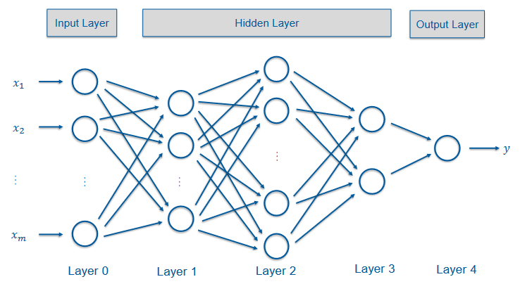


**Aktivierungsfunktionen** <br>
- Identität $f(x) = x$
- $\tanh(x) = \frac{e^x - e^{-x}}{e^x + e^{-x}}$	
- logistische Sigmoid $\sigma(x) = \frac{1}{1 + e^{-x}}$
- Rectified Linear Unit (ReLU) $f(x) = \max(0, x)$


<!--
https://moodle.thi.de/pluginfile.php/738545/mod_resource/content/0/02%20Einfuehrung%20in%20Neuronale%20Netze.pdf
-->

## universelle Approximationstheorie
Neurale Netze mit einem Hidden-Layer mit Sigmoid-Aktivierungsfunktion und linearem Output können jede (stetige) Funktion approximieren. So existiert für eine Zielfunktion `f` ein neuronales Netz, welches diese Funktion hinreichend gut darstellen kann. <br>
Das Theorem ist für Regressionen (gut) und Klassifikationen (Output-Layer ohne Transformation in Wahrscheinlichkeiten) anwendbar. <br>

<details><summary>Regression</summary>
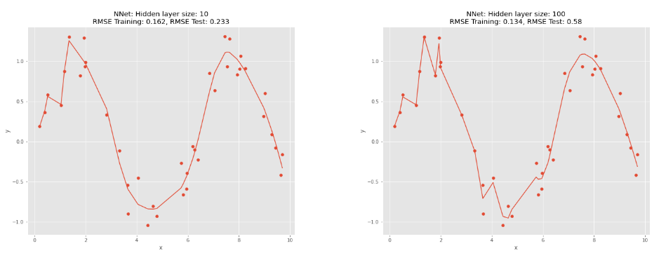
</details> <br>

<details><summary>Klassifikation</summary>
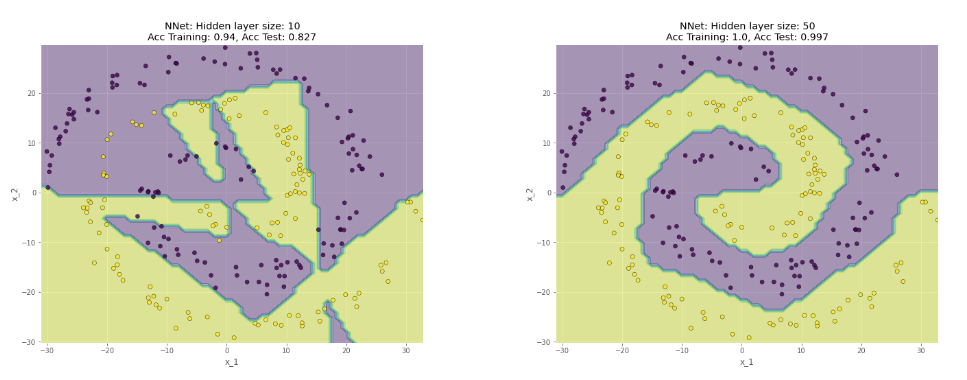
</details> <br>


# Training von Neuronalen Netzen
Verschiedene Methoden zum Training von Neuronalen Netzen. <br>

## Gradientenabstiegsverfahren
Ziel ist die Optimierung der Hyperparameter `W` und `b` des Neuronalen Netzes, doass die Kosten `C` minimiert werden. <br>

**Verlustfunktion** <br>
Die Verlustfunktion ist die Funktion, welche die Differenz zwischen dem Output des Netzes und dem gewünschten Output berechnet. $L(y, f(x))$ sollte also möglichst klein sein. 

**Kostenfunktion** <br>
Die gesamten Kosten des Neuronalen Netzes `f` ist dann das Mittel aller Fehler über den Datensatz.

$C(f) = C(W, b) = \frac{1}{n} \sum_{i=1}^n L(y^{(i)}, f(x^{(i)})$ <br>

**Regression** <br>
Bei der Regression wird typischerweise der `L2-Loss` genommen. 

$L(y, f(x)) = (y-f(x))^2$ 

<!--
oder $L(y, f(x)) = \frac{1}{2}(y-f(x))^2$ <br>
-->

Kosrenfunktion ist dann die Summe der quadrierten Fehler. <br>

$MSE(f) = \frac{1}{n} \sum_{i=1}^n (y^{(i)} - f(x^{(i)}))^2$ <br>

**Klassifikation** <br>
Bei einer binären Klassifikation wird typischerweise die `Cross-Entropy-Funktion` verwendet. <br>

$L(y, f(x)) = -y \log(f_1(x)) - (1-y) \log(1-f_1(x))$ <br>

Kostenfunktion ist das arithmetische Mittel über die Samples. <br>

$CE(f) = \frac{1}{n} \sum_{i=1}^n -y^{(i)} \log(f_1(x^{(i)})) - (1-y^{(i)}) \log(1-f_1(x^{(i)}))$ <br>

Bei multiklassen Klassifikation wird der verallgemeinerte `logistische Loss` verwendet. <br>

### Algorithmus
Beim Gradient-Descent-Verfahren wird folgender Algorithmus verwendet. 

<details><summary>ausklappen</summary>

1. wähle Lernrate $\alpha > 0$, eine maximale Lerngröße $N$ sowie eine Konvergenzschwelle $\epsilon > 0$
2. wähle zufälige Anfangsparameter $W_n$ (Gewichte) & $b_n$ (Bias)
3. berechne die Kosten mit den aktuellen Parametern $C(W, b)$
4. bestimme die Gradienten der Gewichte $\triangledown_W C(W, b)$ und des Bias $\triangledown_b C(W, b)$
5. aktualisiere die Parameter gemäß $W := W - \alpha \triangledown_W C(W, b)$ und $b := b - \alpha \triangledown_b C(W, b)$
6. wiederhole die Schritte `3` & `4` bis eine der Abbruchbedingungen erfüllt ist
    - die Änderung ist nicht mehr groß (`Konvergenz`)
    - die maximale Anzahl $N$ an Iterationen wurde erreicht (`Zeitlimit`) 

</details> <br>

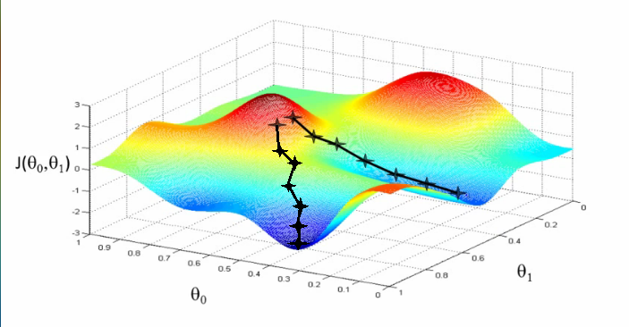 <br>

## Backpropagation
Das Training eines neuronales Netzes mit `Gradient-Decent` besteht aus zwei iterativen Schritten. 

**Forward-Propagation** <br>
Die Eingabedaten werden durch das Netz propagiert und die Ausgabe berechnet (Berechnung der Kosten).

**Backward-Propagation** <br>
Die Gradienten der Gewichte und des Bias werden berechnet und die Parameter aktualisiert (Update der Gewichte und Biases). 

<!-- insane amount of math -->

## Batch-Verfahren
Normalerweise wird beim Gradientenabstieg in jeder Iteration der gesamte Trainingsdatensatz zur Kostenberechnung verwendet. Bei großen Datensätzen ist dies jedoch sehr rechenintensiv. <br> 

**Algorithmus** <br>
Beim Batch-Verfahren wird folgender Algorithmus verwendet.

<details><summary>ausklappen</summary>

1. initialisiere die Parameter (Gewichte & Biases)
2. solange kein Abbruchkriterium erfüllt ist
    - berechne die Gradienten der Verlustfunktion für jeden Datenpunkt $D_train = \{(x^{(1)}, y^{(1)}), ..., (x^{(n)}, y^{(n)})\}$
    - mittele die Gradienten $\triangledown_{\theta} C(\theta) = \frac{1}{n} \sum_{s=1}^n \triangledown_{\theta} L(y^{(s)}, f(x^{(s)}))$
    - Update der Parameter $\theta := \theta - \alpha \triangledown_{\theta} C(\theta)$

</details> <br

**Vorteile** <br>
- der Gradientenabstieg ist stabil, da alle Trainingsdaten für die Anpassung verwendet werden
- die Kotsen sind monoton fallend 
- der Algorithmus ist deterministisch

**Nachteile** <br>
- bei jedem Update werden alle Daten benötigt (viel Speicher)
- bei jedem Update werden die Gradienten für alle Daten berechnet (rechenintensiv)
- bei redundanten Daten werden auch Samples berücksichtigt, die wenig zur Anpassung beitragen (unnötig)
- globales Minimum wird eventuell verpasst

**Epochen** <br>
Eine Epoche bezeichnet den Durchlauf des gesamten Trainingsdatensatzes zur Anpassung der Parameter. <br>

**Batch** <br>
Als Batch wird eine Teilmenge $D_{batch}$ der Trainingsdaten $D_{train}$ bezeichnet, sprich $D_{batch} \subset D_{train}$. <br>

> Beim Batch-Gradientenabstieg ist der gesamte Trainingsdatensatz der Batch.

### stochastischer Gradientenabstieg
Beim `SGD` wird durch die einzelnen Samples im Trainingsdatensatz iteriert und für jedes einzelne Sample ein Update der Parameter durchgeführt. <br>

> Jeder Datenpunkt ist ein Batch. 

> Es werden mehrere Epochen durchlaufen, damit ein Sample häufiger berücksichtigt wird.

> Zu Beginn der Epochen sollte der Trainingsdatensatz zufällig sortiert werden.


**Algorithmus** <br>
Beim stochastischen Gradientenabstieg wird folgender Algorithmus verwendet.

<details><summary>ausklappen</summary>

1. initialisiere die Parameter (Gewichte & Biases)
2. solange kein Abbruchkriterium erfüllt ist (für jede Epoche)
    - mische die Trainingsdaten
    - iteriere durch alle Samples und führe jeweils ($x^{(s)}, y^{(s)}$) einzeln ein Update aus $\theta := \theta - \alpha \triangledown_{\theta} L(y^{(s)}, f(x^{(s)}))$

</details> <br>
<!-- Bild -->

**Vorteile** <br>
- es werden viele kleine Updates der Parameter durchgeführt
- wenig Speicherplatz nötig
- kann mit Redundanzen effizient umgehen

> effizeintes und schnelles Lernen bei großen Datensätzen

**Nachteile** <br>
- die Kosten werden duch ein Sample nicht gut approximiert (kann lange Trainingzeiten bedeuten)
- Matrix-Operationen können nicht verwendet werden (langsames Training).
- Konvergenz ist nicht garantiert (und wir)

**Vergleich der Verfahren** <br>
`SGD` springt mehr herum, `GD` ist stabiler. <br>
<details><summary>Vergleich</summary>
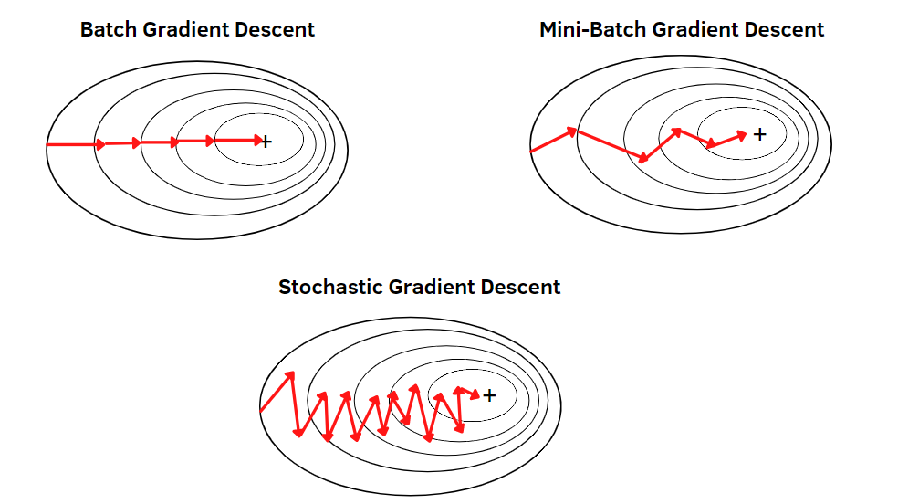 <br>
</details> <br>

### Mini-Batch-Gradientenabstieg
Beim `Mini-Batch-Gradientenabstieg` wird ein zufälliger Teil des Trainingsdatensatzes als Batch verwendet. <br>

> Der Batch ist eine zufällige Teilmenge des Trainingsdatensatzes.

> Gute Kombination zwischen Batch- & SGD-Verfahren.

Es werden mehrere Epochen durchlaufen, damit ein Sample häufiger berücksichtigt wird. <br>

**Algorithmus** <br>
Beim Mini-Batch-Gradientenabstieg wird folgender Algorithmus verwendet.

<details><summary>ausklappen</summary>

1. initialisiere die Parameter (Gewichte & Biases)
2. solange kein Abbruchkriterium erfüllt ist (für jede Epoche)
    - teile die Trainingsdaten zufällig in Batches gleicher Größe
    - iteriere über alle Batches und führe auf jedem ein Update der Parameter durch $\theta := \theta - \alpha \frac{1}{n_{b}} \sum_{(x,y) \in D_{b}} \triangledown_{\theta} L(y, f(x))$ mit Batch $D_{b} \subset D_{train} = \{(x^{(1)}, y^{(1)}), ..., (x^{(n)}, y^{(n)})\}$ und $|D_{b}| = n_{b} < n$

</details> <br>

So werden viele kleinerer Updates der Parameter durchgeführt und es wird wenig Speicherplatz benötigt.

> effizeintes und schnelles Lernen 

Matrix-Operationen können verwendet werden, aber Konvergenz nicht garantiert. Die `Batch-Größe` ist ein Hyperparameter und muss geeignet gewählt werden. <br>

> Das Mini-Batch Verfahren ist dem Batch-Verfahren und dem SGD-Verfahren vorzuziehen!


# Varianten von SGD
Verschiedene Varianten des SGD-Verfahrens. <br>

## Herausforderungen
Ziel ist es, das Minimum der Kostenfunktion zu finden. Dies ist einfach bei konvexer Funktion, aber sehr schwierig bei hoch-komplexen Funktionen. <br>
- Sattelpunkte
- lokale Minima
- Wahl der Lernrate
- enge Täler (langsame Konvergenz)

> Übung mit Zuordnung der Hyperparameter und Graphen.

**Noisy Gradients** <br>
Sattelpunkten kann entkommen werden, indem man mit Zufall "herausspringt" - mit Rauschen der Gradienten. <br>
Das `Mini-Batch-Verfahren` erzeugt genau diesen Zufall. 

## Momentum
Oft ist die Gradientenrichtung nicht die Richtung des Minimums, es wird stark hin- und hergesprungen. 

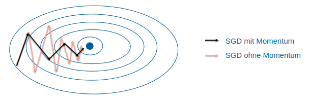 <br>

Mit Momentum wird der "Schwung" der letzten Gradientenrichtung beibehalten. Sei $u_{k.-1}$ der Update-Term des letzten Schrittes, dann ist der Update-Term des aktuellen Schrittes $u_k = \alpha \triangledown_{\theta} C(\theta) + \gamma u_{k-1}$. 

Mit `Momemtum` werden die Parameter nun aktualisiert mit $\theta = \theta - u_k = \theta - ( \alpha \triangledown_{\theta} C(\theta) - \gamma u_{k-1})$.

> $\gamma$ ist der Momentum-Koeffizient und sollte zwischen $0$ und $1$ liegen - üblich ist $0.9$.

> $u_k$ wird auch Geschwindigkeit genannt.

Momentum akkumuliert das exponentielle Mittel der vergangenen Gradienten mit $\gamma$ aös Gewichtungsfaktor, der Update-Term ist eine rekurisve Formel. 

$\theta = \theta_{k-a} - ( \alpha  \sum_{i=1}^k \gamma^{k-i} \triangledown_{\theta_i} C(\theta_{i}) + \gamma^k u_0)$

Im Spezialfall, dass alle Gradienten gleich sind, ergibt sich $\theta = \theta_{k-1} - \alpha \triangledown_{\theta} C(\theta) \frac{1} {1 - \gamma}$.

**Algorithmus** <br>
Beim Momentum-Verfahren wird folgender Algorithmus verwendet.

<details><summary>ausklappen</summary>

1. lege Lernrate $\alpha$ und Momentum $\gamma$ fest
2. initialisiere die Parameter $\theta$ (Gewichte & Bias) und Geschwindigkeit $u = 0$
3. solange kein Abbruchkriterium erfüllt ist
    - berechne den Gradienten der Kostenfunktion für die Sampel im aktuellen Batch $D_b (n_b = |D_b|)$ mit $\triangledown_{\theta} C(\theta) = \frac{1}{n_b} \sum_{(x,y) \in D_b} \triangledown_{\theta} L(y, f(x))$
    - berechne die Geschwindigkeit $u := \gamma u + \alpha \triangledown_{\theta} C(\theta)$
    - Update der Parameter $\theta := \theta - u$

</details> <br>

Zur [Visualisierung](https://distill.pub/2017/momentum/) hier reinschauen!

**Vorteile** <br>
- beschleunigt das Training bei...
    - Noisy Gradients
    - kleinen aber einheitlichen Gradienten
    - großen Krümmungen
- kann aus lokalen Minima entkommen
- Narrow Valleys können schneller durchquert werden

**Nachteile** <br>
- Wurde $\gamma$ zu groß gewählt, kann zusätzliche Oszillation entstehen.

> Eine weitere Variante ist `Nesterov Momentum`, bei der der Gradient vor dem Update berechnet wird.

<!-- nachholen -->

## adaptive Lernraten
Um den Algorithmus in ein lokales Minimum zu zwingen, kann die Lernrate $\alpha$ über die Zeit verringert werden. 

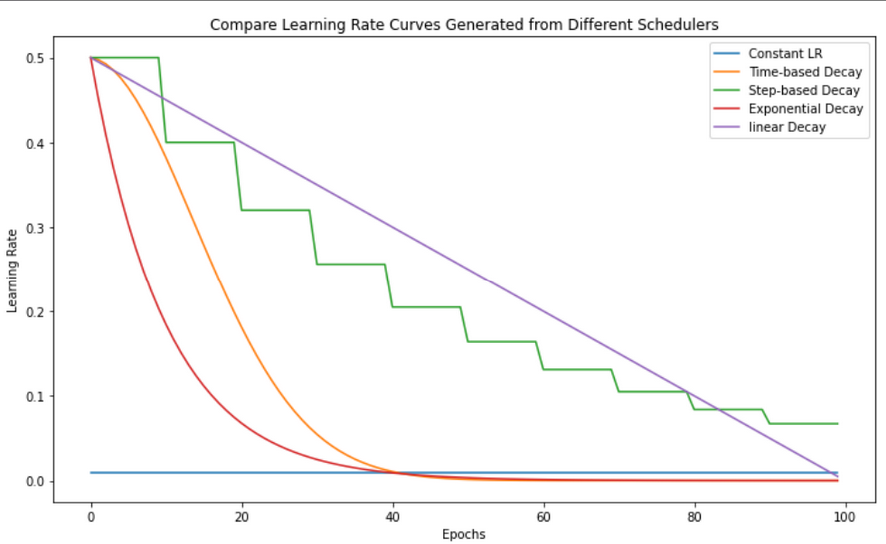 <br>

**Linear Decay** <br>
Eine gängige Methode ist die lineare Verringerung der Lernrate. 

<details><summary>ausklappen</summary>

1. Wähle eine Start-Lernrate $\alpha_0$ und eine End-Lernrate $\alpha_\tau$ mit $\alpha_0 > \alpha_\tau$.
2. Ändere während `SGD` die Lernrate und nehme in der $k$-ten Iteration (Epoche, $k <= \tau$) die Lernrate $\alpha_k = (1 - \epsilon) \alpha_0 + \epsilon \alpha_\tau = \alpha_0 - \frac{k}{\tau} (\alpha_0 - \alpha_\tau)$ mit $\epsilon = \frac{k}{\tau}$.
3. Haben wir mehr als $\tau$ Iterationen durchgeführt, so blebt die Lernrate konstant $\alpha_k = \alpha_\tau$.

</details> <br>

**Time Decay** <br>
Eine weitere Methode ist die zeitbasierte Verringerung der Lernrate.

<details><summary>ausklappen</summary>

1. Wähle eine Start-Lernrate $\alpha_0$ und eine Verringungsrate $d$ mit $d > 0$.
2. Ändere während `SGD` die Lernrate rekursiv und nehme in der $k$-ten Iteration (Epoche) die Lernrate $\alpha_k = \alpha_{k-1} \frac{1}{1 + d k}$.

</details> <br>

**Stepwise Decay** <br>
Verringerung der Lernrate nach einer festgelegten Anzahl an Iterationen.

<details><summary>ausklappen</summary>

1. Wähle eine Start-Lernrate $\alpha_0$, eine Verringerungsrate $d$ mit $d > 0$ und eine Anzahl an Iterationen $E$ nach denen eine Verringerung stattfinden soll.
2. Ändere während `SGD` die Lernrate sukzessive nach $E$ Iterationen (Epochen) und nehme in der $k$-ten Iteration (Epoche) die Lernrate $\alpha_k = \alpha_{0} \cdot d^e$ mit $e = \lfloor \frac{k}{E} \rfloor$.

</details> <br>

**Vorteile** <br>
- Fluktuation um ein (lokales) Minimum wird verringert!

**Nachteile** <br>
- Es gibt nun mehr Hyperparameter, die vorher bestimmt werden müssen.
- Dies bringt wiederrum Verschlechterungspotential!
- Ist die Lernrate zum Beispiel zu klein geworden, kann der Algorithmus nicht mehr lernen. 

> Frühes verringern der Lernrate kann zu einem `Quick-Win` führen, welcher dann letztendlich schlechter als der ursprüngliche Wert ist.

### Adagrad
Mit `Ada`ptive `Grad`ienten wird die Lernrate für jeden Parameter individuell angepasst. <br>

> AdaGrad skaliert $\alpha$ umgekehrt proportiinal zur Wurzel der Summe der quadrierten Gradienten der Vergangenheit. 

> Parameter mit größerer Ableitungen der Verlustfunktion erhalten eine schnelle Verringerung der Lernrate und umgekehrt.

<details><summary>ausklappen</summary>

Siehe [Foliensatz](https://moodle.thi.de/pluginfile.php/743303/mod_resource/content/1/04%20Varianten%20von%20SGD.pdf) Seite 52.

</details> <br>

**Nachteile** <br>
- Die Aufsummierung der quadratischen Gradienten kann zu extrem schnellem Abfallen der Lernrate führen.

**Idee von AdaGrad** <br>
Je größer die Ableitung eines Parameter, desto schneller und weiter sind wir in diese Richtung zum Minimum gegenagen (beschrieben durch $G_{t, i}$). 

> Der Parameter wurde schon stark angepasst, muss also nicht mehr so stark verändert werden. 

Dünn besetzte Feature haben typeischerweise kleine gemittelte Gradienten. 

> AdaGrad gibt diesen einen größeren Einfluss beim Lernen!

Dünn besetzte Features sind Features, wenn im Datensatz oft `0` vorkommt - zum Beispiel beim One-Hot-Encoding. So wird dort nicht viel gelernt und die anderen Features werden zu stark in den Vordergrund gerückt.

> So können Satelpunkte viel besser vermieden werden.

### RMSProp
Eine Verbesserung von AdaGrad ist `RMSProp`, soll die schnelle Verringerung der Lernrate verhindern. <br>


<details><summary>ausklappen</summary>

Siehe [Foliensatz](https://moodle.thi.de/pluginfile.php/743303/mod_resource/content/1/04%20Varianten%20von%20SGD.pdf) Seite 59.

Zusätzlich zum AdaGrad-Algorithmus wird eine `Verfallsrate` (Decay-Rate) $d \in [0, 1)$ gewählt. 

</details> <br>

Anstatt der Aufsummierung der quadrierten Gradienten wird jetzt ein exponentiell gewichteter Mittelwert (mit
Verfallsrate $d$) betrachtet. 

<!--
> RMSProp ist ein sehr effektiver Optimizer und findet häufig Anwendung. 
-->

> Typische Werte für $d$ sind $0.9$ oder $0.99$ (je größer, desto mehr Effekt auf die Lernrate).

### Adam
Adam ist eine Kombination aus `Momentum` und `RMSProp`.

<details><summary>ausklappen</summary>

Siehe [Foliensatz](https://moodle.thi.de/pluginfile.php/743303/mod_resource/content/1/04%20Varianten%20von%20SGD.pdf) Seite 64.

</details> <br>

**Vorteile** <br>
...

**Schwierigkeiten** <br>
Adam hat manchmal ein Problem zu generalisieren (`Overfitting`). Hier zeigt SGD mit Momentum eine bessere Generalisierungseigenschaft. 

> SWATS (Switching from Adam to SGD) ersetzt nach einem Start mit Adam durch SGD.

Im Verlgiech können also verschiedene Optimizer abhängig vom Problem verschieden abschneiden.

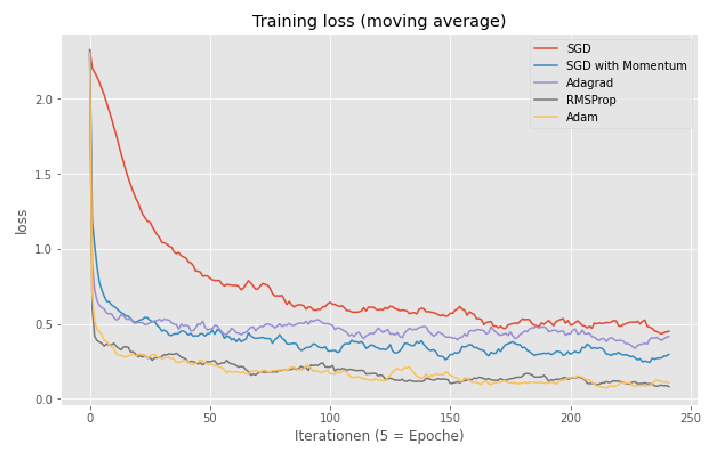 <br>

Zum Beispiel bei Bildklassifikation auf bekannten Datensätzen schneidet Adam oft schlechter als SGD ab. <br>

**AMSGrad** <br>
Eine Variation von Adam, die neue gewichtete Summe der quadrierten Gradienten $G_{t,i} = \beta_2 \cdot G_{t-1, i} + (1 - \beta_2) \cdot g_{t, i}^2$ mit dem in der vorherigen Iteration nur verwendet, falls sie größer ist - also $\hat{G}_{t, i} = \max(\hat{G}_{t-1, i}, G_{t, i})$. <br> 
Der Parameter-Update ist dann $\theta_{t+1, i} = \theta_{t, i} - \frac{\alpha}{\epsilon + \sqrt{\hat{G}_{t, i}}} \cdot u_{t, i}$.

> AMSGrad soll sicher stellen, dass die Lernrate monoton fällt.

**Adamax** <br>
Anstatt (wie bei Adam) die Lernrate mittels der Summe der quadrierten Gradienten anzupassen, wird bei `Adamax` der maximale Gradient (der Vergangenheit) verwendet, sprich $G_{t, i} = \max(\beta_2 \cdot G_{t-1, i}, |g_{t, i}|)$. <br>
Der Parameter-Update ist dann $\theta_{t+1, i} = \theta_{t, i} - \frac{\alpha}{\epsilon + G_{t, i}} \hat{u}_{t, i}$.


# Methoden zur Verbesserung des Trainings
Verschiedene Methoden zur Verbesserung des Trainings. <br>

## Vanishing & Exploding Gradients 
Das Problem der `Exploding und Vanishing Gradients` tritt beim Training Neuronaler Netze mittels SGD und Backpropagation auf.

**Exploding Gradients** <br>
Die Ableitung nach dem Gewicht ist sehr groß, dadurch werden die Parameter stark geändert. So kann die FLuktuation auch sehr groß werden - das Training wird instabil. Im schlimmsten Fall divergiert das Training.

> Mathematisch bedeutet dies, viele der Produkte liegen unter $-1$ oder über $1$.

**Vanishing Gradients** <br>
Hier ist die Ableitung wiederum annähernd `0`, weshalb fast kein Update der Parameter durchgeführt wird. Im Extremfall stoppt das Lernen für diesen Parameter. 

> Mathematisch bedeutet dies, viele der Produkte liegen zwischen $-1$ und $1$.

<details><summary>Mathematik</summary>
<!--
$\frac{dL(y,a^{(L)})}{dw_{2,2}^{(1)}} 
-->

Siehe [Foliensatz](https://moodle.thi.de/pluginfile.php/747685/mod_resource/content/1/05%20Methoden%20zur%20Verbesserung%20des%20Trainings.pdf) Seite 6.

</details> <br>

> Probleme treten insbesondere bei tiefen Netzen und RNNs auf. 

**Erkennen** <br>
- Das Modell verbessert sich sehr langsam oder stoppt früh während des Trainings. 
- Die Gewichte nahe des Output-Layers ändert sich, Gewichte nahe des Input-Layers ändern sich jedoch wenig. 
- Gewichte werden sehr schnell klein (nahe 0) oder ganz `0`.

**Gradient Clipping** <br>
Beim `Clipping` werden die Gradienten gestutzt, sobald sie einen minimalen oder maximalen Wert überschreiten.

$g = (g_1, ..., g_n) = (\triangledown_{\theta_1} C(\theta), ..., \triangledown_{\theta_n} C(\theta))$ <br>

Hier kann nach Value $g_i := h | g_i := H$ oder nach Norm $g_i := H \cdot \frac{g}{||g||}$ gestutzt werden. <br>

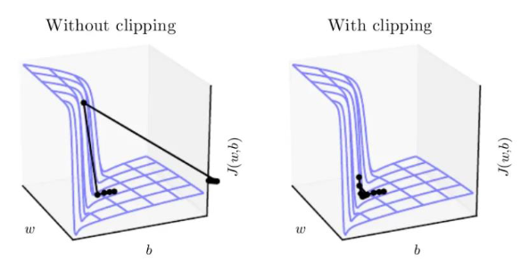 <br>


## Initialisierung der Gewichte
Die `Weight-Initalization` ist ein wichtiger Schritt beim Training von Neuronalen Netzen. Bei der Einführung des Gradientenabstiegs wurden die Gewichte $W^{(1)}, ..., W^{(L)}$ zufällig initialisiert. 

> Bei konstanter Initialiserung kann das Netzwerk `nicht` vernünftig lernen! 

Auf Seite 31 im [Foliensatz](https://moodle.thi.de/pluginfile.php/747685/mod_resource/content/1/05%20Methoden%20zur%20Verbesserung%20des%20Trainings.pdf) wird genauer darauf eingegangen. Generell sollten Gewichte aber immer zufällig initialisiert werden.

**Standardnormalverteilung** <br>
Die Gewichte werden zufällig aus einer Standardnormalverteilung gezogen. Problem hier ist, dass mit einer `tanh`-Aktivierungsfunktion bei vielen Neuronen zu sehr kleinen Gradienten führt - das Vanishing Gradient Problem tritt auf. 

**Xavier-Initialisierung** <br>
Die Gewichte werden zufällig aus einer Normalverteilung mit $\mu = 0$ und $\sigma = 1$ gezogen, danach mit $\sqrt{\frac{1}{size^{l-1}}}$ multipliziert. Es gibt aber auch die Skalierung mit $\sqrt{\frac{2}{size^{l-1} + size^{l}}}$ - diese ist Standard bei `PyTorch`.

> Variante 2 ist ein Mittelweg, um die Varianz bei Forward- & Backpropagation konstant zu halten. 

Hierzu mehr im [Foliensatz](https://moodle.thi.de/pluginfile.php/747685/mod_resource/content/1/05%20Methoden%20zur%20Verbesserung%20des%20Trainings.pdf) auf Seite 50. 

> Xaver-Initalisierung oft bei `tanh`-Aktivierungsfunktion.

**He-Initialisierung** <br>
Für die `ReLU`-Aktivierungsfunktion wird oft die Kaiming-He-Initialisierung verwendet. Hier werden die Gewichte zufällig aus einer Normalverteilung mit $\mu = 0$ und $\sigma = 1$ gezogen, danach mit $\sqrt{\frac{2}{size^{l-1}}}$ multipliziert.

<!-- Normalverteilung, Formel, S. 59 -->

Die Gewichte können auch mittels Gleichverteilung $[-1, 1]$ initialisiert werden, dann ergibt sich der Skalierungsfaktor $\sqrt{\frac{6}{n_{i-1}}}$.

> Geeignete Initalisierungen können dem Exploding & Vanishing Gradient Problem entgegenwirken.

## Batch Normalization
Bei der `Batch Normalization` werden die Features normalisiert. <br>

**Standardisierung** <br>
Bei der Standardisierung werden alle Feature zentriert und standardisiert, $E(x) = 0$ und $Var(x) = 1$. 

**Normierung** <br>
Bei der Normierung wreden alle Features auf das Intervall $[0, 1]$ gemapped, alternativ auch auf $[-1, 1]$. 

> Wieso sollte man die Inputvariablen normalisieren?

Bei `SGD` führen verschieden große Features zu unterschiedlich großen Gradienten - also ein Feature mit dem Wert $0.1$ geht in Features mit den Wertebereichen $100$ schnell unter. 

> Die Gewichte leben auf unterschiedlichen Skalen.

> Eine geeignete Lernrate zu finden ist nahezu unmöglich.

Beispiele zur Normalisierung auf Seite 70 im [Foliensatz](https://moodle.thi.de/pluginfile.php/747685/mod_resource/content/1/05%20Methoden%20zur%20Verbesserung%20des%20Trainings.pdf). <br>

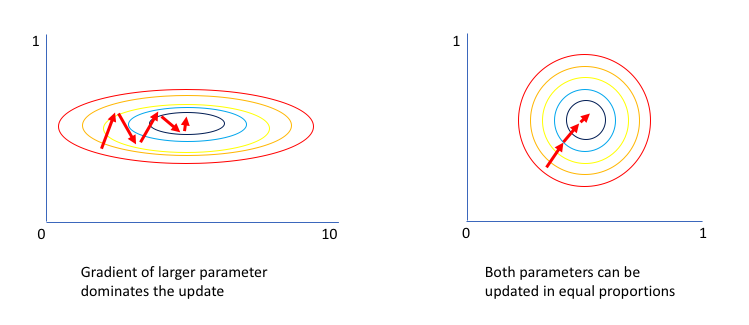 <br>

**Batch Normalization** <br>
Hier wird in jedem Layer die Aktivierungsfunktion (bzw. die $z$-Werte) normalisiert - der Algorithmus ist wie folgt. 

<details><summary>ausklappen</summary>

1. Gegeben sei ein Mini-Bacth $B$ der Größe $m$ und seien $z_{k,1}^(l), ..., z_{k,m}^{(l)}$ die Werte der $m$ Samples in einem Hidden-Layer $l$ für das Neuron $k$. 
2. Berechne das aritmetiscche Mittel und die Varianz (für das Neuron und den Mini-Batch) $\mu = \frac{1}{m} \sum_{i=1}^m z_{i}^{(l)}$ und $\sigma^2 = \frac{1}{m} \sum_{i=1}^m (z_{i}^{(l)} - \mu)^2$.
3. Normalisiere die $z$-Werte mit $z_{i, norm}^{(l)} = \frac{z_{i}^{(l)} - \mu}{\sqrt{\sigma^2 + \epsilon}}$. 
4. Transofrmiere die normalisierten Werte mit zwei Parametern $\gamma, \beta \in \mathbb{R}$ mit $\tilde{z}_{i}^{(l)} = \gamma \cdot z_{i, norm}^{(l)} + \beta$.
5. Wende die Aktivierungsfunktion $\phi^{(l)} aif die Werte $\tilde{z}_{i}^{(l)}$ an und gebe diese weiter an den nächsten Layer. 

</details> <br>

> Die Parameter $\gamma$ und $\beta$ zählen zu den Hyperparametern und werden mit SGD gelernt.

> Standardmäßig wird $\gamma = 1$ und $\beta = 0$ gewählt.

**Python** <br>
In `PyTorch` kann die Batch Normalization mit `nn.BatchNorm1d` durchgeführt werden. <br>

```python	
class Net batchNorm(nn.Module): 
  def __init__(self): 
    super(Net_batchNorm, self).__init__()
    self.input_size = input_size

    self.nn.Linear(input_size, 128)
    self.bn1 = nn.BatchNorm1d(128)      # Anwendung
    self.fc2 = nn.Linear(128, 64)
    self.bn2 = nn.BatchNorm1d(64)       # Anwendung
    self.fc3 = nn.Linear(64, 10)

  def forward(self, x):
    x = x.view(-1, input_size)
    x = F.relu(self.bn1(self.fc1(x)))   # Batch Normalization
    x = F.relu(self.bn2(self.fc2(x)))   # Batch Normalization
    x = self.fc3(x)
    return  F.log_softmax(x, dim=1)
```

**Verlgeich** <br>
Abhängig vom Problem wird mit Batch-Normalisation sschneller und stabiler gelern. 

<details><summary>ausklappen</summary>

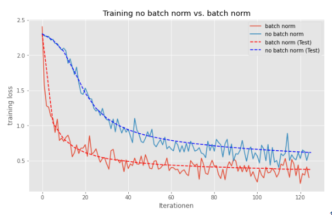 <br>

</details> <br>

**Covariante-Shift** <br>
Der Kovarianten-Shift bezeichnet die Veränderung der Verteilung der Input-Variablen. Genauer beschrieben in [Foliensatz](https://moodle.thi.de/pluginfile.php/747685/mod_resource/content/1/05%20Methoden%20zur%20Verbesserung%20des%20Trainings.pdf) auf Seite 92. 

<!--
nachholen 
-->

# Regularization
Verschiedene Methoden zur Regularisierung von Neuronalen Netzen. <br>

**Wiederholung** <br>
Beim `Overfitting` wird das Modell zu stark an die Trainingsdaten angepasst, sodass es nicht mehr generalisiert. <br>

<details><summary>Bias und Varianz</summary>

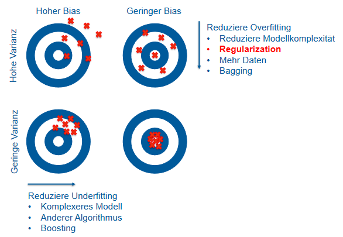 <br>

</details> <br>

Wie kann man Overfitting im Neuronalen Netz verhindern? <br>

> Reduzierung der Komplexität des Netzes (am besten automatisch).

**Vorgehen** <br>
Manuelles Entfernen von Neuronen ist keine Lösung. Angenommen, die Kostenfunktion ist 

$C_R(f) = \frac{1}{n} \sum_{i=1}^n (L(y^{(i)}, f_A^{(i)}(x^{(i)})) + 10^3 \cdot \beta_4^2 + 10^3 \cdot \beta_4^2$

dann müssen $\beta_3 \approx 0$ und $\beta_4 \approx 0$ sein. So werden durch die Hinzunahme der extra Terme die Gewichte $\beta_3$ und $\beta_4$ im Training nahe $0$ gezwungen - es wird also innerhalb des Trainingsprozesses vereinfacht. 

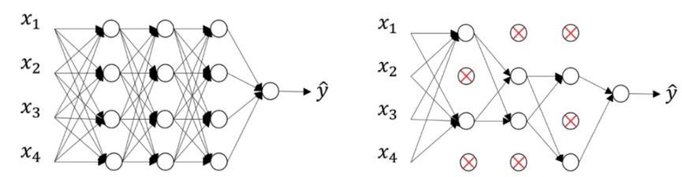 <br>

**p-Norm** <br>
Gegeben sei ein Vektor $x=(x_1, ..., x_n) - dann ist die $p$-Norm definiert als $||x||_p = (\sum_{i=1}^n |x_i|^p)^{\frac{1}{p}}$. <br>

Insbesondere die $2$-Norm $||x||_2 = \sqrt{\sum_{i=1}^n x_i^2}$ und die $1$-Norm $||x||_1 = \sum_{i=1}^n |x_i|$ sind von Bedeutung. <br>

## L2-Regularisierung
Bei der `L2`-Regularisierung werden große Netzwerke durch einen Bestrafungsterm $\lambda ||W||_2^2$ in der Kostenfunktion bestraft. 

> Viele Gewichte werden so nahe $0$ gezwingen während des Trainings.

Dies führt zu einem einfacheren Netzwerk und verhindert Overfitting. Die Kostenfunktion sieht hierbei wie folgt aus.

$C_R(f) = \frac{1}{n} \sum_{i=1}^n L(y^{(i)}, f(x^{(i)})) + \lambda \sum_{l=1}^L \sum_{i=1}^{n_{l-1}} \sum_{j=1}^{n_l} (w_{i,j}^{(l)})^2$

<!-- Notation fehlt -->

In der Norm-Schreibweise vereinfacht dann $C(f) + \lambda ||W||_2^2$. <br>

**Regularisierungsparameter** <br>
$\lambda$ ist der Regularisierungsparameter und kontrolliert den Grad der Bestrafung. 

| höheres $\lambda$ | niedrigeres $\lambda$ |
| --- | --- |
| große Gewichte werden stärker bestarft | große Gewichte werden teilweise toleriert |
| die Gewichte haben einen starken <br> Einfluss auf die Kosten | die Gewichte haben einen schwachen <br> Einfluss auf die Kosten |
| die Minimierung des Bestrafungsterms <br> steht im Vordergrund | die Verringerung des Verlustes <br> steht im Vordergrund |
| die Gewichte werden klein | wenige der Gewichte werden klein |
| das Modell wird einfacher | das Modell bleibt komplex |

$\lambda$ ist ein Hyperparameter und muss geeignet gewählt werden.

> Ein zu größes $\lambda$ kann zu Underfitting führen.

Mit `tanh` als Aktivierungsfunktion verschwindet die nicht-Linearität im Netzwerk annähernd, da die meisten $z$-Werte um $0$ liegen wo die `tanh` nahezu linear ist - es ergibt sich ein einfacheres Netz. 

<details><summary>Backpropagation</summary>

Siehe [Foliensatz](https://moodle.thi.de/pluginfile.php/750384/mod_resource/content/0/06%20Regularization.pdf) Seite 25. 

</details> <br>

**Weight Decay** <br>
Die `Weight Decay` ist eine Variante der L2-Regularisierung, bei der die Gewichte mit einem Faktor verringert werden, die Anpassung sieht wie folgt aus. 

$w_{i,j}^{(l)} = (1-\alpha \frac{\lambda}{n}) \cdot w_{i,j}^{(l)} - \alpha \cdot \triangledown_{w_{i,j}^{(l)}} C(\theta)$

`L2`-Regularisierung verringert also nur das Gewicht in jedem Schritt um den Faktor $(1-\alpha \frac{\lambda}{n})$. Die Hyperparameter $\lambda$ und $\alpha$ sollten so gewählt werden, dass $(1-\alpha \frac{\lambda}{n}) \isin (0,1)$.

**Python** <br>
In `PyTorch` kann die L2-Regularisierung mit `weight_decay` in der Optimizer-Klasse durchgeführt werden. <br>

```python
optimizer = optim.SGD(model.parameters(), lr=alpha, weight_decay=0.001)
```

## L1-Regularisierung
Anstatt der `2`-Norm kann auch die `1`-Norm verwendet werden. Sei $f$ ein Netzwerk mit $l$ Layern und Gewichtsmatrizen $W^{(1)}, ..., W^{(l)}$, dann ist die Kostenfunktion wiefolgt definiert.

$C_R(f) = \frac{1}{n} \sum_{i=1}^n L(y^{(i)}, f(x^{(i)})) + \lambda \sum_{l=1}^L \sum_{i=1}^{n_{l-1}} \sum_{j=1}^{n_l} |w_{i,j}^{(l)}| = C(f) + \lambda ||W||_1$

<detais><summary>Backpropagation</summary>

Siehe [Foliensatz](https://moodle.thi.de/pluginfile.php/750384/mod_resource/content/0/06%20Regularization.pdf) Seite 31.

</details> <br>

**Update der Gewichte** <br>
Falls $w_{i,j}^{(l)} >= 0$ ist, so wird $w_{i,j}^{(l)}$ um $\lambda - \alpha \cdot \triangledown_{w_{i,j}^{(l)}} C(\theta)$ verringert. <br>
Falls $w_{i,j}^{(l)} < 0$ ist, so wird $w_{i,j}^{(l)}$ um $-\lambda - \alpha \cdot \triangledown_{w_{i,j}^{(l)}} C(\theta)$ erhöht.

> Die Gewichte werden also durch $\lambda$ in Richtung $0$ gedrückt.

> Bei `L1` werden mehr Gewichte bei $0$ gesetzt als bei `L2`.

<!-- Ridge- und Lasso-Regression -->

## Dropout
Die Idee von `Dropout` ist es, das Netzwerk zu vereinfachen, indem `zufällig` Neuronen deaktiviert werden. <br>

> Durch das zufällige Entfernen der Neuronen ist das `Subnetz` für jedes Update der Gewichte & Biases anders.

Bei linearer Regression werden ebenso Neuronen deaktiviert, also 

$f_A(x) = \beta_0 + \beta_1 x_1 + \beta_2 x_2 + ... + \beta_n x_n$ = \sum_{i=1}^n \beta_i x_i$

fallen einige $\beta_i$ weg - eine Vorhersage kann nicht auf wenigen Feature basieren. Die Features müssen so genereller gelernt werden und alle Features müssen einbezogen werden.

<!-- Features lol -->

**hidden Layer** <br>
Ein Neuron in einem Hidden-Layer kann sich nciht darauf veralssen, dass die Aktivierung eines Neurons im vorherigen Layer immer da ist. 

> Es kann also nicht Informationen aus einem Neuron allein extrahieren!

Es muss generelle Informationen aus allen Aktivierungen des vorherigen Layers extrahieren, die Gewichte werden über alle Aktivierungen so ausgeglichener verteilt.

> Das neuronale Netz generalisiert besser.

**(binäre) Maske** <br>
Durch eine `Maske` wird die Auswahl der zu entfernenden Neuronen abgebildet. $\mu = (m_1, ..., m_n)$ mit $m_i \in \{0, 1\}$ und $m_i = 1$ bedeutet, dass das Neuron $i$ aktiviert ist. <br>

**zufällige Auswahl** <br>
Beim zufälligen Entfernen der Neuronen wird eine Maske $\mu$ zufällig generiert, also wird für jeden Eintrag eine Münze geworfen mit einer Wahrscheinlichkeit $p \in (0,1)$ gewählt, $P(\mu_i = 1) = p$ wobei p auch **Dropout-Rate** genannt wird (standardmäßig $p \in [0.5, 0.8]$). <br>

**Layer Auswahl** <br>
Es kann auch eine Dropout-Rate für jeden Layer festgelegt werden. Großes $p_i$ bedeutet, dass viele Neuronen im Layer erhalten bleiben und umgekehrt. 

> Die Wahl der $p_i$ beeinflusst den *Grad der Einfachheit* des Netzes.

> Falls $p_i = 1$ ist, so wird der Layer nicht verändert.

## Inverted Dropout
Hier werden die übrigen Neuronen passend `skaliert`, sodass die Aktivierung des Layers gleich bleibt. Es wird wiefolgt vorgegangen.

<details><summary>ausklappen</summary>

1. Definiere das neuronale Netz mit insgesamt $B$ Neuronen (über alle Layer) und initialisiere $G_i$ und $B_i$. 
2. Definiere die Drouput-Raten $p_1, ..., p_{L-1}$ zur Beibehaltung der Neuronen in den Layern. 
3. Trainiere das neuronale Netz (z.B. via Mini-Batch) und tue in jeder Iteration folgendes. 
    1. Generiere **zufällig** eine Maske $\mu$ mit den obigen Dropout-Raten.
    2. Benutze die maske $\mu$ zur Erstellung des Subnetzes $Net_{\mu}$.
    3. Führe die Schritte des Gradientenabstiegs für den aktuellen Mini-Batch auf dem Subnetz $Net_{\mu}$ aus durch:
        - Forward.Propagation des Mini-Batches auf $Net_{\mu}$ mit Reskalierung der Aktivierungen (multipliziere jede Aktivierung im Layer $l$ mit dem Faktor $\frac{1}{p_l}$ (**inverted Schritt**)).
        - Berechnung der Kosten des Mini-Batches für $Net_{\mu}$.
        - Berechnung der Gradienten der Gewichte & Biases in $Net_{\mu}$ (Backpropagation).
        - Update der Gewichte & Biases des Subnetzes $Net_{\mu}$.

</details> <br>

In jeder Iteration wird ein anderes (zufälliges) Subnetz $Net_{\mu}$ verwendet, durch die zufällige Änderung wird Rauschen hinzugefügt (verhindert Overfitting). <br>

<!-- Wieso ist Skalierung notwendig? -->

**Python** <br>
Die reskalierung muss nicht im Training, sondern kann auch später während der Testphase erfolgen. In `PyTorch` muss also zwischen Training und Test unterschieden werden. <br>

```python
def train(epoch, network):
  network.train()     # Training-Modus
...

def test(epoch, network):
  network.eval()      # Test-Modus
...
```

Dropout wird wiefolgt in `PyTorch` implementiert. <br>

```python
class Net_dropout(nn.Module): 
  def __init__(self): 
    super(Net_dropout, self).__init__()
    self.input_size = input_size

    self.fc1 = nn.Linear(input_size, 128)
    self.do1 = nn.Dropout(p=0.5)      # Dropout
    self.fc2 = nn.Linear(128, 64)
    self.do2 = nn.Dropout(p=0.5)      # Dropout
    self.fc3 = nn.Linear(64, 10)

  def forward(self, x):
    x = x.view(-1, input_size)
    x = F.relu(self.fc1(x))
    x = self.do1(x)                  # Dropout
    x = F.relu(self.fc2(x))
    x = self.do2(x)                  # Dropout
    x = self.fc3(x)
    return  F.log_softmax(x, dim=1)
```

## Ensemble
Idee der Ensemble-Modelle ist es, einzelne Modelle zu kombinieren. <br>

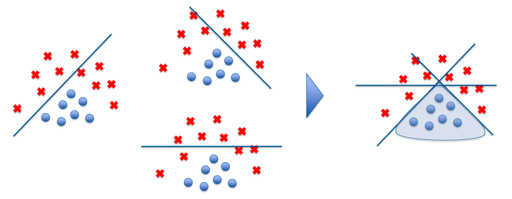 <br>

## Early Stopping
Beim `Early Stopping` wird das Training abgebrochen, sobald die Evaluationsmetrik innerhalb einer vorgegebenen ANzahl an Epochen keine Verbesserung mehr aufweist. <br>

## Data Augmentation
Oft sind zu wenig Daten vorhanden für die Komplexität der Fragestelung. Mit `Data Augmentation` können neue Daten generiert werden. <br>

**Bilderkennung** <br>
Rotation, Skalierung, Pixel versetzen, SPiegelung, Rauschen, Färbung, Schattierung, Verzerrung, etc.

**Spracherkennung** <br>
Geschwindigkeit, Rauschen, Tonlage, etc.

<!--
# Optimierung von Hyperparametern
...
-->