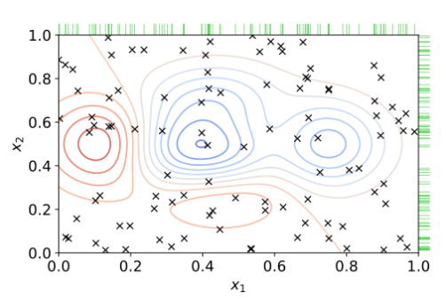

# Maschinelles Lernen 2
Mitschrift und Zusammenfassung des Vortrags von Prof. Dr. Sören Gröttrup (SL) und Prof. Dr. Michael Botsch (USL) an der Technischen Hochschule Ingolstadt. Alle Rechte liegen bei den Originalautoren, Inhalte ohne Gewähr. <br>

## Inhalt
- [Maschinelles Lernen 2](#maschinelles-lernen-2)
  - [Inhalt](#inhalt)
- [Einleitung](#einleitung)
  - [Wiederholung](#wiederholung)
  - [universelle Approximationstheorie](#universelle-approximationstheorie)
- [Training von Neuronalen Netzen](#training-von-neuronalen-netzen)
  - [Gradientenabstiegsverfahren](#gradientenabstiegsverfahren)
    - [Algorithmus](#algorithmus)
  - [Backpropagation](#backpropagation)
  - [Batch-Verfahren](#batch-verfahren)
    - [stochastischer Gradientenabstieg](#stochastischer-gradientenabstieg)
    - [Mini-Batch-Gradientenabstieg](#mini-batch-gradientenabstieg)
- [Varianten von SGD](#varianten-von-sgd)
  - [Herausforderungen](#herausforderungen)
  - [Momentum](#momentum)
  - [adaptive Lernraten](#adaptive-lernraten)
    - [Adagrad](#adagrad)
    - [RMSProp](#rmsprop)
    - [Adam](#adam)
- [Methoden zur Verbesserung des Trainings](#methoden-zur-verbesserung-des-trainings)
  - [Vanishing \& Exploding Gradients](#vanishing--exploding-gradients)
  - [Initialisierung der Gewichte](#initialisierung-der-gewichte)
  - [Batch Normalization](#batch-normalization)
- [Regularization](#regularization)
  - [L2-Regularisierung](#l2-regularisierung)
  - [L1-Regularisierung](#l1-regularisierung)
  - [Dropout](#dropout)
  - [Inverted Dropout](#inverted-dropout)
  - [Ensemble](#ensemble)
  - [Early Stopping](#early-stopping)
  - [Data Augmentation](#data-augmentation)
- [Unsuperivsed Learning](#unsuperivsed-learning)
- [Ähnlichkeitsmaße](#ähnlichkeitsmaße)
  - [Sequenzen](#sequenzen)
- [Lagrange-Multiplikatoren](#lagrange-multiplikatoren)
- [Dimensionalitätsreduktion](#dimensionalitätsreduktion)
  - [Hauptkomponentenanalyse](#hauptkomponentenanalyse)
    - [Beispiel](#beispiel)
- [Clusteranalyse](#clusteranalyse)
  - [partitionierende Clusterverfahren](#partitionierende-clusterverfahren)
    - [k-Means](#k-means)
    - [k-Medoids](#k-medoids)
  - [modellebasierte Clusterverfahren](#modellebasierte-clusterverfahren)
  - [hierarchische Clusterverfahren](#hierarchische-clusterverfahren)
  - [wahrscheinlichkeitsbasierte Clusterverfahren](#wahrscheinlichkeitsbasierte-clusterverfahren)
    - [DBSCAN](#dbscan)


# Einleitung
## Wiederholung
Wiederholung vom Stoff aus ML1.

**Feedforward Neural Network** <br>


**Aktivierungsfunktionen** <br>
- Identität $f(x) = x$
- $\tanh(x) = \frac{e^x - e^{-x}}{e^x + e^{-x}}$	
- logistische Sigmoid $\sigma(x) = \frac{1}{1 + e^{-x}}$
- Rectified Linear Unit (ReLU) $f(x) = \max(0, x)$


<!--
https://moodle.thi.de/pluginfile.php/738545/mod_resource/content/0/02%20Einfuehrung%20in%20Neuronale%20Netze.pdf
-->

## universelle Approximationstheorie
Neurale Netze mit einem Hidden-Layer mit Sigmoid-Aktivierungsfunktion und linearem Output können jede (stetige) Funktion approximieren. So existiert für eine Zielfunktion `f` ein neuronales Netz, welches diese Funktion hinreichend gut darstellen kann. <br>
Das Theorem ist für Regressionen (gut) und Klassifikationen (Output-Layer ohne Transformation in Wahrscheinlichkeiten) anwendbar. <br>

<details><summary>Regression</summary>

</details> <br>

<details><summary>Klassifikation</summary>

</details> <br>


# Training von Neuronalen Netzen
Verschiedene Methoden zum Training von Neuronalen Netzen. <br>

## Gradientenabstiegsverfahren
Ziel ist die Optimierung der Hyperparameter `W` und `b` des Neuronalen Netzes, doass die Kosten `C` minimiert werden. <br>

**Verlustfunktion** <br>
Die Verlustfunktion ist die Funktion, welche die Differenz zwischen dem Output des Netzes und dem gewünschten Output berechnet. $L(y, f(x))$ sollte also möglichst klein sein. 

**Kostenfunktion** <br>
Die gesamten Kosten des Neuronalen Netzes `f` ist dann das Mittel aller Fehler über den Datensatz.

$C(f) = C(W, b) = \frac{1}{n} \sum_{i=1}^n L(y^{(i)}, f(x^{(i)})$ <br>

**Regression** <br>
Bei der Regression wird typischerweise der `L2-Loss` genommen. 

$L(y, f(x)) = (y-f(x))^2$ 

<!--
oder $L(y, f(x)) = \frac{1}{2}(y-f(x))^2$ <br>
-->

Kosrenfunktion ist dann die Summe der quadrierten Fehler. <br>

$MSE(f) = \frac{1}{n} \sum_{i=1}^n (y^{(i)} - f(x^{(i)}))^2$ <br>

**Klassifikation** <br>
Bei einer binären Klassifikation wird typischerweise die `Cross-Entropy-Funktion` verwendet. <br>

$L(y, f(x)) = -y \log(f_1(x)) - (1-y) \log(1-f_1(x))$ <br>

Kostenfunktion ist das arithmetische Mittel über die Samples. <br>

$CE(f) = \frac{1}{n} \sum_{i=1}^n -y^{(i)} \log(f_1(x^{(i)})) - (1-y^{(i)}) \log(1-f_1(x^{(i)}))$ <br>

Bei multiklassen Klassifikation wird der verallgemeinerte `logistische Loss` verwendet. <br>

### Algorithmus
Beim Gradient-Descent-Verfahren wird folgender Algorithmus verwendet. 

<details><summary>ausklappen</summary>

1. wähle Lernrate $\alpha > 0$, eine maximale Lerngröße $N$ sowie eine Konvergenzschwelle $\epsilon > 0$
2. wähle zufälige Anfangsparameter $W_n$ (Gewichte) & $b_n$ (Bias)
3. berechne die Kosten mit den aktuellen Parametern $C(W, b)$
4. bestimme die Gradienten der Gewichte $\triangledown_W C(W, b)$ und des Bias $\triangledown_b C(W, b)$
5. aktualisiere die Parameter gemäß $W := W - \alpha \triangledown_W C(W, b)$ und $b := b - \alpha \triangledown_b C(W, b)$
6. wiederhole die Schritte `3` & `4` bis eine der Abbruchbedingungen erfüllt ist
    - die Änderung ist nicht mehr groß (`Konvergenz`)
    - die maximale Anzahl $N$ an Iterationen wurde erreicht (`Zeitlimit`) 

</details> <br>

 <br>

## Backpropagation
Das Training eines neuronales Netzes mit `Gradient-Decent` besteht aus zwei iterativen Schritten. 

**Forward-Propagation** <br>
Die Eingabedaten werden durch das Netz propagiert und die Ausgabe berechnet (Berechnung der Kosten).

**Backward-Propagation** <br>
Die Gradienten der Gewichte und des Bias werden berechnet und die Parameter aktualisiert (Update der Gewichte und Biases). 

<!-- insane amount of math -->

## Batch-Verfahren
Normalerweise wird beim Gradientenabstieg in jeder Iteration der gesamte Trainingsdatensatz zur Kostenberechnung verwendet. Bei großen Datensätzen ist dies jedoch sehr rechenintensiv. <br> 

**Algorithmus** <br>
Beim Batch-Verfahren wird folgender Algorithmus verwendet.

<details><summary>ausklappen</summary>

1. initialisiere die Parameter (Gewichte & Biases)
2. solange kein Abbruchkriterium erfüllt ist
    - berechne die Gradienten der Verlustfunktion für jeden Datenpunkt $D_train = \{(x^{(1)}, y^{(1)}), ..., (x^{(n)}, y^{(n)})\}$
    - mittele die Gradienten $\triangledown_{\theta} C(\theta) = \frac{1}{n} \sum_{s=1}^n \triangledown_{\theta} L(y^{(s)}, f(x^{(s)}))$
    - Update der Parameter $\theta := \theta - \alpha \triangledown_{\theta} C(\theta)$

</details> <br

**Vorteile** <br>
- der Gradientenabstieg ist stabil, da alle Trainingsdaten für die Anpassung verwendet werden
- die Kotsen sind monoton fallend 
- der Algorithmus ist deterministisch

**Nachteile** <br>
- bei jedem Update werden alle Daten benötigt (viel Speicher)
- bei jedem Update werden die Gradienten für alle Daten berechnet (rechenintensiv)
- bei redundanten Daten werden auch Samples berücksichtigt, die wenig zur Anpassung beitragen (unnötig)
- globales Minimum wird eventuell verpasst

**Epochen** <br>
Eine Epoche bezeichnet den Durchlauf des gesamten Trainingsdatensatzes zur Anpassung der Parameter. <br>

**Batch** <br>
Als Batch wird eine Teilmenge $D_{batch}$ der Trainingsdaten $D_{train}$ bezeichnet, sprich $D_{batch} \subset D_{train}$. <br>

> Beim Batch-Gradientenabstieg ist der gesamte Trainingsdatensatz der Batch.

### stochastischer Gradientenabstieg
Beim `SGD` wird durch die einzelnen Samples im Trainingsdatensatz iteriert und für jedes einzelne Sample ein Update der Parameter durchgeführt. <br>

> Jeder Datenpunkt ist ein Batch. 

> Es werden mehrere Epochen durchlaufen, damit ein Sample häufiger berücksichtigt wird.

> Zu Beginn der Epochen sollte der Trainingsdatensatz zufällig sortiert werden.


**Algorithmus** <br>
Beim stochastischen Gradientenabstieg wird folgender Algorithmus verwendet.

<details><summary>ausklappen</summary>

1. initialisiere die Parameter (Gewichte & Biases)
2. solange kein Abbruchkriterium erfüllt ist (für jede Epoche)
    - mische die Trainingsdaten
    - iteriere durch alle Samples und führe jeweils ($x^{(s)}, y^{(s)}$) einzeln ein Update aus $\theta := \theta - \alpha \triangledown_{\theta} L(y^{(s)}, f(x^{(s)}))$

</details> <br>
<!-- Bild -->

**Vorteile** <br>
- es werden viele kleine Updates der Parameter durchgeführt
- wenig Speicherplatz nötig
- kann mit Redundanzen effizient umgehen

> effizeintes und schnelles Lernen bei großen Datensätzen

**Nachteile** <br>
- die Kosten werden duch ein Sample nicht gut approximiert (kann lange Trainingzeiten bedeuten)
- Matrix-Operationen können nicht verwendet werden (langsames Training).
- Konvergenz ist nicht garantiert (und wir)

**Vergleich der Verfahren** <br>
`SGD` springt mehr herum, `GD` ist stabiler. <br>
<details><summary>Vergleich</summary>
 <br>
</details> <br>

### Mini-Batch-Gradientenabstieg
Beim `Mini-Batch-Gradientenabstieg` wird ein zufälliger Teil des Trainingsdatensatzes als Batch verwendet. <br>

> Der Batch ist eine zufällige Teilmenge des Trainingsdatensatzes.

> Gute Kombination zwischen Batch- & SGD-Verfahren.

Es werden mehrere Epochen durchlaufen, damit ein Sample häufiger berücksichtigt wird. <br>

**Algorithmus** <br>
Beim Mini-Batch-Gradientenabstieg wird folgender Algorithmus verwendet.

<details><summary>ausklappen</summary>

1. initialisiere die Parameter (Gewichte & Biases)
2. solange kein Abbruchkriterium erfüllt ist (für jede Epoche)
    - teile die Trainingsdaten zufällig in Batches gleicher Größe
    - iteriere über alle Batches und führe auf jedem ein Update der Parameter durch $\theta := \theta - \alpha \frac{1}{n_{b}} \sum_{(x,y) \in D_{b}} \triangledown_{\theta} L(y, f(x))$ mit Batch $D_{b} \subset D_{train} = \{(x^{(1)}, y^{(1)}), ..., (x^{(n)}, y^{(n)})\}$ und $|D_{b}| = n_{b} < n$

</details> <br>

So werden viele kleinerer Updates der Parameter durchgeführt und es wird wenig Speicherplatz benötigt.

> effizeintes und schnelles Lernen 

Matrix-Operationen können verwendet werden, aber Konvergenz nicht garantiert. Die `Batch-Größe` ist ein Hyperparameter und muss geeignet gewählt werden. <br>

> Das Mini-Batch Verfahren ist dem Batch-Verfahren und dem SGD-Verfahren vorzuziehen!


# Varianten von SGD
Verschiedene Varianten des SGD-Verfahrens. <br>

## Herausforderungen
Ziel ist es, das Minimum der Kostenfunktion zu finden. Dies ist einfach bei konvexer Funktion, aber sehr schwierig bei hoch-komplexen Funktionen. <br>
- Sattelpunkte
- lokale Minima
- Wahl der Lernrate
- enge Täler (langsame Konvergenz)

> Übung mit Zuordnung der Hyperparameter und Graphen.

**Noisy Gradients** <br>
Sattelpunkten kann entkommen werden, indem man mit Zufall "herausspringt" - mit Rauschen der Gradienten. <br>
Das `Mini-Batch-Verfahren` erzeugt genau diesen Zufall. 

## Momentum
Oft ist die Gradientenrichtung nicht die Richtung des Minimums, es wird stark hin- und hergesprungen. 

 <br>

Mit Momentum wird der "Schwung" der letzten Gradientenrichtung beibehalten. Sei $u_{k.-1}$ der Update-Term des letzten Schrittes, dann ist der Update-Term des aktuellen Schrittes $u_k = \alpha \triangledown_{\theta} C(\theta) + \gamma u_{k-1}$. 

Mit `Momemtum` werden die Parameter nun aktualisiert mit $\theta = \theta - u_k = \theta - ( \alpha \triangledown_{\theta} C(\theta) - \gamma u_{k-1})$.

> $\gamma$ ist der Momentum-Koeffizient und sollte zwischen $0$ und $1$ liegen - üblich ist $0.9$.

> $u_k$ wird auch Geschwindigkeit genannt.

Momentum akkumuliert das exponentielle Mittel der vergangenen Gradienten mit $\gamma$ aös Gewichtungsfaktor, der Update-Term ist eine rekurisve Formel. 

$\theta = \theta_{k-a} - ( \alpha  \sum_{i=1}^k \gamma^{k-i} \triangledown_{\theta_i} C(\theta_{i}) + \gamma^k u_0)$

Im Spezialfall, dass alle Gradienten gleich sind, ergibt sich $\theta = \theta_{k-1} - \alpha \triangledown_{\theta} C(\theta) \frac{1} {1 - \gamma}$.

**Algorithmus** <br>
Beim Momentum-Verfahren wird folgender Algorithmus verwendet.

<details><summary>ausklappen</summary>

1. lege Lernrate $\alpha$ und Momentum $\gamma$ fest
2. initialisiere die Parameter $\theta$ (Gewichte & Bias) und Geschwindigkeit $u = 0$
3. solange kein Abbruchkriterium erfüllt ist
    - berechne den Gradienten der Kostenfunktion für die Sampel im aktuellen Batch $D_b (n_b = |D_b|)$ mit $\triangledown_{\theta} C(\theta) = \frac{1}{n_b} \sum_{(x,y) \in D_b} \triangledown_{\theta} L(y, f(x))$
    - berechne die Geschwindigkeit $u := \gamma u + \alpha \triangledown_{\theta} C(\theta)$
    - Update der Parameter $\theta := \theta - u$

</details> <br>

Zur [Visualisierung](https://distill.pub/2017/momentum/) hier reinschauen!

**Vorteile** <br>
- beschleunigt das Training bei...
    - Noisy Gradients
    - kleinen aber einheitlichen Gradienten
    - großen Krümmungen
- kann aus lokalen Minima entkommen
- Narrow Valleys können schneller durchquert werden

**Nachteile** <br>
- Wurde $\gamma$ zu groß gewählt, kann zusätzliche Oszillation entstehen.

> Eine weitere Variante ist `Nesterov Momentum`, bei der der Gradient vor dem Update berechnet wird.

<!-- nachholen -->

## adaptive Lernraten
Um den Algorithmus in ein lokales Minimum zu zwingen, kann die Lernrate $\alpha$ über die Zeit verringert werden. 

 <br>

**Linear Decay** <br>
Eine gängige Methode ist die lineare Verringerung der Lernrate. 

<details><summary>ausklappen</summary>

1. Wähle eine Start-Lernrate $\alpha_0$ und eine End-Lernrate $\alpha_\tau$ mit $\alpha_0 > \alpha_\tau$.
2. Ändere während `SGD` die Lernrate und nehme in der $k$-ten Iteration (Epoche, $k <= \tau$) die Lernrate $\alpha_k = (1 - \epsilon) \alpha_0 + \epsilon \alpha_\tau = \alpha_0 - \frac{k}{\tau} (\alpha_0 - \alpha_\tau)$ mit $\epsilon = \frac{k}{\tau}$.
3. Haben wir mehr als $\tau$ Iterationen durchgeführt, so blebt die Lernrate konstant $\alpha_k = \alpha_\tau$.

</details> <br>

**Time Decay** <br>
Eine weitere Methode ist die zeitbasierte Verringerung der Lernrate.

<details><summary>ausklappen</summary>

1. Wähle eine Start-Lernrate $\alpha_0$ und eine Verringungsrate $d$ mit $d > 0$.
2. Ändere während `SGD` die Lernrate rekursiv und nehme in der $k$-ten Iteration (Epoche) die Lernrate $\alpha_k = \alpha_{k-1} \frac{1}{1 + d k}$.

</details> <br>

**Stepwise Decay** <br>
Verringerung der Lernrate nach einer festgelegten Anzahl an Iterationen.

<details><summary>ausklappen</summary>

1. Wähle eine Start-Lernrate $\alpha_0$, eine Verringerungsrate $d$ mit $d > 0$ und eine Anzahl an Iterationen $E$ nach denen eine Verringerung stattfinden soll.
2. Ändere während `SGD` die Lernrate sukzessive nach $E$ Iterationen (Epochen) und nehme in der $k$-ten Iteration (Epoche) die Lernrate $\alpha_k = \alpha_{0} \cdot d^e$ mit $e = \lfloor \frac{k}{E} \rfloor$.

</details> <br>

**Vorteile** <br>
- Fluktuation um ein (lokales) Minimum wird verringert!

**Nachteile** <br>
- Es gibt nun mehr Hyperparameter, die vorher bestimmt werden müssen.
- Dies bringt wiederrum Verschlechterungspotential!
- Ist die Lernrate zum Beispiel zu klein geworden, kann der Algorithmus nicht mehr lernen. 

> Frühes verringern der Lernrate kann zu einem `Quick-Win` führen, welcher dann letztendlich schlechter als der ursprüngliche Wert ist.

### Adagrad
Mit `Ada`ptive `Grad`ienten wird die Lernrate für jeden Parameter individuell angepasst. <br>

> AdaGrad skaliert $\alpha$ umgekehrt proportional zur Wurzel der Summe der quadrierten Gradienten der Vergangenheit. 

> Parameter mit größerer Ableitungen der Verlustfunktion erhalten eine schnelle Verringerung der Lernrate und umgekehrt.

<details><summary>ausklappen</summary>

Siehe [Foliensatz](https://moodle.thi.de/pluginfile.php/743303/mod_resource/content/1/04%20Varianten%20von%20SGD.pdf) Seite 52.

</details> <br>

**Nachteile** <br>
- Die Aufsummierung der quadratischen Gradienten kann zu extrem schnellem Abfallen der Lernrate führen.

**Idee von AdaGrad** <br>
Je größer die Ableitung eines Parameter, desto schneller und weiter sind wir in diese Richtung zum Minimum gegenagen (beschrieben durch $G_{t, i}$). 

> Der Parameter wurde schon stark angepasst, muss also nicht mehr so stark verändert werden. 

Dünn besetzte Feature haben typeischerweise kleine gemittelte Gradienten. 

> AdaGrad gibt diesen einen größeren Einfluss beim Lernen!

Dünn besetzte Features sind Features, wenn im Datensatz oft `0` vorkommt - zum Beispiel beim One-Hot-Encoding. So wird dort nicht viel gelernt und die anderen Features werden zu stark in den Vordergrund gerückt.

> So können Satelpunkte viel besser vermieden werden.

### RMSProp
Eine Verbesserung von AdaGrad ist `RMSProp`, soll die schnelle Verringerung der Lernrate verhindern. <br>


<details><summary>ausklappen</summary>

Siehe [Foliensatz](https://moodle.thi.de/pluginfile.php/743303/mod_resource/content/1/04%20Varianten%20von%20SGD.pdf) Seite 59.

Zusätzlich zum AdaGrad-Algorithmus wird eine `Verfallsrate` (Decay-Rate) $d \in [0, 1)$ gewählt. 

</details> <br>

Anstatt der Aufsummierung der quadrierten Gradienten wird jetzt ein exponentiell gewichteter Mittelwert (mit
Verfallsrate $d$) betrachtet. 

<!--
> RMSProp ist ein sehr effektiver Optimizer und findet häufig Anwendung. 
-->

> Typische Werte für $d$ sind $0.9$ oder $0.99$ (je größer, desto mehr Effekt auf die Lernrate).

### Adam
Adam ist eine Kombination aus `Momentum` und `RMSProp`.

<details><summary>ausklappen</summary>

Siehe [Foliensatz](https://moodle.thi.de/pluginfile.php/743303/mod_resource/content/1/04%20Varianten%20von%20SGD.pdf) Seite 64.

</details> <br>

**Vorteile** <br>
...

**Schwierigkeiten** <br>
Adam hat manchmal ein Problem zu generalisieren (`Overfitting`). Hier zeigt SGD mit Momentum eine bessere Generalisierungseigenschaft. 

> SWATS (Switching from Adam to SGD) ersetzt nach einem Start mit Adam durch SGD.

Im Verlgiech können also verschiedene Optimizer abhängig vom Problem verschieden abschneiden.

 <br>

Zum Beispiel bei Bildklassifikation auf bekannten Datensätzen schneidet Adam oft schlechter als SGD ab. <br>

**AMSGrad** <br>
Eine Variation von Adam, die neue gewichtete Summe der quadrierten Gradienten $G_{t,i} = \beta_2 \cdot G_{t-1, i} + (1 - \beta_2) \cdot g_{t, i}^2$ mit dem in der vorherigen Iteration nur verwendet, falls sie größer ist - also $\hat{G}_{t, i} = \max(\hat{G}_{t-1, i}, G_{t, i})$. <br> 
Der Parameter-Update ist dann $\theta_{t+1, i} = \theta_{t, i} - \frac{\alpha}{\epsilon + \sqrt{\hat{G}_{t, i}}} \cdot u_{t, i}$.

> AMSGrad soll sicher stellen, dass die Lernrate monoton fällt.

**Adamax** <br>
Anstatt (wie bei Adam) die Lernrate mittels der Summe der quadrierten Gradienten anzupassen, wird bei `Adamax` der maximale Gradient (der Vergangenheit) verwendet, sprich $G_{t, i} = \max(\beta_2 \cdot G_{t-1, i}, |g_{t, i}|)$. <br>
Der Parameter-Update ist dann $\theta_{t+1, i} = \theta_{t, i} - \frac{\alpha}{\epsilon + G_{t, i}} \hat{u}_{t, i}$.


# Methoden zur Verbesserung des Trainings
Verschiedene Methoden zur Verbesserung des Trainings. <br>

## Vanishing & Exploding Gradients 
Das Problem der `Exploding und Vanishing Gradients` tritt beim Training Neuronaler Netze mittels SGD und Backpropagation auf.

**Exploding Gradients** <br>
Die Ableitung nach dem Gewicht ist sehr groß, dadurch werden die Parameter stark geändert. So kann die FLuktuation auch sehr groß werden - das Training wird instabil. Im schlimmsten Fall divergiert das Training.

> Mathematisch bedeutet dies, viele der Produkte liegen unter $-1$ oder über $1$.

**Vanishing Gradients** <br>
Hier ist die Ableitung wiederum annähernd `0`, weshalb fast kein Update der Parameter durchgeführt wird. Im Extremfall stoppt das Lernen für diesen Parameter. 

> Mathematisch bedeutet dies, viele der Produkte liegen zwischen $-1$ und $1$.

<details><summary>Mathematik</summary>
<!--
$\frac{dL(y,a^{(L)})}{dw_{2,2}^{(1)}} 
-->

Siehe [Foliensatz](https://moodle.thi.de/pluginfile.php/747685/mod_resource/content/1/05%20Methoden%20zur%20Verbesserung%20des%20Trainings.pdf) Seite 6.

</details> <br>

> Probleme treten insbesondere bei tiefen Netzen und RNNs auf. 

**Erkennen** <br>
- Das Modell verbessert sich sehr langsam oder stoppt früh während des Trainings. 
- Die Gewichte nahe des Output-Layers ändert sich, Gewichte nahe des Input-Layers ändern sich jedoch wenig. 
- Gewichte werden sehr schnell klein (nahe 0) oder ganz `0`.

**Gradient Clipping** <br>
Beim `Clipping` werden die Gradienten gestutzt, sobald sie einen minimalen oder maximalen Wert überschreiten - mehr bei [Papers with Code](https://paperswithcode.com/method/gradient-clipping) mit Visualisierung. 

$g = (g_1, ..., g_n) = (\triangledown_{\theta_1} C(\theta), ..., \triangledown_{\theta_n} C(\theta))$ <br>

Hier kann nach Value $g_i := h | g_i := H$ oder nach Norm $g_i := H \cdot \frac{g}{||g||}$ gestutzt werden. <br>

 <br>

## Initialisierung der Gewichte
Die `Weight-Initalization` ist ein wichtiger Schritt beim Training von Neuronalen Netzen. Bei der Einführung des Gradientenabstiegs wurden die Gewichte $W^{(1)}, ..., W^{(L)}$ zufällig initialisiert. 

> Bei konstanter Initialiserung kann das Netzwerk `nicht` vernünftig lernen! 

Auf Seite 31 im [Foliensatz](https://moodle.thi.de/pluginfile.php/747685/mod_resource/content/1/05%20Methoden%20zur%20Verbesserung%20des%20Trainings.pdf) wird genauer darauf eingegangen. Generell sollten Gewichte aber immer zufällig initialisiert werden.

**Standardnormalverteilung** <br>
Die Gewichte werden zufällig aus einer Standardnormalverteilung gezogen. Problem hier ist, dass mit einer `tanh`-Aktivierungsfunktion bei vielen Neuronen zu sehr kleinen Gradienten führt - das Vanishing Gradient Problem tritt auf. 

**Xavier-Initialisierung** <br>
Die Gewichte werden zufällig aus einer Normalverteilung mit $\mu = 0$ und $\sigma = 1$ gezogen, danach mit $\sqrt{\frac{1}{size^{l-1}}}$ multipliziert. Es gibt aber auch die Skalierung mit $\sqrt{\frac{2}{size^{l-1} + size^{l}}}$ - diese ist Standard bei `PyTorch`.

> Variante 2 ist ein Mittelweg, um die Varianz bei Forward- & Backpropagation konstant zu halten. 

Hierzu mehr im [Foliensatz](https://moodle.thi.de/pluginfile.php/747685/mod_resource/content/1/05%20Methoden%20zur%20Verbesserung%20des%20Trainings.pdf) auf Seite 50. 

> Xaver-Initalisierung oft bei `tanh`-Aktivierungsfunktion.

**He-Initialisierung** <br>
Für die `ReLU`-Aktivierungsfunktion wird oft die Kaiming-He-Initialisierung verwendet. Hier werden die Gewichte zufällig aus einer Normalverteilung mit $\mu = 0$ und $\sigma = 1$ gezogen, danach mit $\sqrt{\frac{2}{size^{l-1}}}$ multipliziert.

<!-- Normalverteilung, Formel, S. 59 -->

Die Gewichte können auch mittels Gleichverteilung $[-1, 1]$ initialisiert werden, dann ergibt sich der Skalierungsfaktor $\sqrt{\frac{6}{n_{i-1}}}$.

> Geeignete Initalisierungen können dem Exploding & Vanishing Gradient Problem entgegenwirken.

## Batch Normalization
Bei der `Batch Normalization` werden die Features normalisiert. <br>

**Standardisierung** <br>
Bei der Standardisierung werden alle Feature zentriert und standardisiert, $E(x) = 0$ und $Var(x) = 1$. 

**Normierung** <br>
Bei der Normierung wreden alle Features auf das Intervall $[0, 1]$ gemapped, alternativ auch auf $[-1, 1]$. 

> Wieso sollte man die Inputvariablen normalisieren?

Bei `SGD` führen verschieden große Features zu unterschiedlich großen Gradienten - also ein Feature mit dem Wert $0.1$ geht in Features mit den Wertebereichen $100$ schnell unter. 

> Die Gewichte leben auf unterschiedlichen Skalen.

> Eine geeignete Lernrate zu finden ist nahezu unmöglich.

Beispiele zur Normalisierung auf Seite 70 im [Foliensatz](https://moodle.thi.de/pluginfile.php/747685/mod_resource/content/1/05%20Methoden%20zur%20Verbesserung%20des%20Trainings.pdf). <br>

 <br>

**Batch Normalization** <br>
Hier wird in jedem Layer die Aktivierungsfunktion (bzw. die $z$-Werte) normalisiert - der Algorithmus ist wie folgt. 

<details><summary>ausklappen</summary>

1. Gegeben sei ein Mini-Bacth $B$ der Größe $m$ und seien $z_{k,1}^(l), ..., z_{k,m}^{(l)}$ die Werte der $m$ Samples in einem Hidden-Layer $l$ für das Neuron $k$. 
2. Berechne das aritmetiscche Mittel und die Varianz (für das Neuron und den Mini-Batch) $\mu = \frac{1}{m} \sum_{i=1}^m z_{i}^{(l)}$ und $\sigma^2 = \frac{1}{m} \sum_{i=1}^m (z_{i}^{(l)} - \mu)^2$.
3. Normalisiere die $z$-Werte mit $z_{i, norm}^{(l)} = \frac{z_{i}^{(l)} - \mu}{\sqrt{\sigma^2 + \epsilon}}$. 
4. Transofrmiere die normalisierten Werte mit zwei Parametern $\gamma, \beta \in \mathbb{R}$ mit $\tilde{z}_{i}^{(l)} = \gamma \cdot z_{i, norm}^{(l)} + \beta$.
5. Wende die Aktivierungsfunktion $\phi^{(l)} aif die Werte $\tilde{z}_{i}^{(l)}$ an und gebe diese weiter an den nächsten Layer. 

</details> <br>

> Die Parameter $\gamma$ und $\beta$ zählen zu den Hyperparametern und werden mit SGD gelernt.

> Standardmäßig wird $\gamma = 1$ und $\beta = 0$ gewählt.

**Python** <br>
In `PyTorch` kann die Batch Normalization mit `nn.BatchNorm1d` durchgeführt werden. <br>

```python	
class Net batchNorm(nn.Module): 
  def __init__(self): 
    super(Net_batchNorm, self).__init__()
    self.input_size = input_size

    self.nn.Linear(input_size, 128)
    self.bn1 = nn.BatchNorm1d(128)      # Anwendung
    self.fc2 = nn.Linear(128, 64)
    self.bn2 = nn.BatchNorm1d(64)       # Anwendung
    self.fc3 = nn.Linear(64, 10)

  def forward(self, x):
    x = x.view(-1, input_size)
    x = F.relu(self.bn1(self.fc1(x)))   # Batch Normalization
    x = F.relu(self.bn2(self.fc2(x)))   # Batch Normalization
    x = self.fc3(x)
    return  F.log_softmax(x, dim=1)
```

**Verlgeich** <br>
Abhängig vom Problem wird mit Batch-Normalisation sschneller und stabiler gelern. 

<details><summary>ausklappen</summary>

 <br>

</details> <br>

**Covariante-Shift** <br>
Der Kovarianten-Shift bezeichnet die Veränderung der Verteilung der Input-Variablen. Genauer beschrieben in [Foliensatz](https://moodle.thi.de/pluginfile.php/747685/mod_resource/content/1/05%20Methoden%20zur%20Verbesserung%20des%20Trainings.pdf) auf Seite 92. 

<!--
nachholen 
-->

# Regularization
Verschiedene Methoden zur Regularisierung von Neuronalen Netzen. <br>

**Wiederholung** <br>
Beim `Overfitting` wird das Modell zu stark an die Trainingsdaten angepasst, sodass es nicht mehr generalisiert. <br>

<details><summary>Bias und Varianz</summary>

 <br>

</details> <br>

Wie kann man Overfitting im Neuronalen Netz verhindern? <br>

> Reduzierung der Komplexität des Netzes (am besten automatisch).

**Vorgehen** <br>
Manuelles Entfernen von Neuronen ist keine Lösung. Angenommen, die Kostenfunktion ist 

$C_R(f) = \frac{1}{n} \sum_{i=1}^n (L(y^{(i)}, f_A^{(i)}(x^{(i)})) + 10^3 \cdot \beta_4^2 + 10^3 \cdot \beta_4^2$

dann müssen $\beta_3 \approx 0$ und $\beta_4 \approx 0$ sein. So werden durch die Hinzunahme der extra Terme die Gewichte $\beta_3$ und $\beta_4$ im Training nahe $0$ gezwungen - es wird also innerhalb des Trainingsprozesses vereinfacht. 

 <br>

**p-Norm** <br>
Gegeben sei ein Vektor $x=(x_1, ..., x_n) - dann ist die $p$-Norm definiert als $||x||_p = (\sum_{i=1}^n |x_i|^p)^{\frac{1}{p}}$. <br>

Insbesondere die $2$-Norm $||x||_2 = \sqrt{\sum_{i=1}^n x_i^2}$ und die $1$-Norm $||x||_1 = \sum_{i=1}^n |x_i|$ sind von Bedeutung. <br>

## L2-Regularisierung
Bei der `L2`-Regularisierung werden große Netzwerke durch einen Bestrafungsterm $\lambda ||W||_2^2$ in der Kostenfunktion bestraft. 

> Viele Gewichte werden so nahe $0$ gezwingen während des Trainings.

Dies führt zu einem einfacheren Netzwerk und verhindert Overfitting. Die Kostenfunktion sieht hierbei wie folgt aus.

$C_R(f) = \frac{1}{n} \sum_{i=1}^n L(y^{(i)}, f(x^{(i)})) + \lambda \sum_{l=1}^L \sum_{i=1}^{n_{l-1}} \sum_{j=1}^{n_l} (w_{i,j}^{(l)})^2$

<!-- Notation fehlt -->

In der Norm-Schreibweise vereinfacht dann $C(f) + \lambda ||W||_2^2$. <br>

**Regularisierungsparameter** <br>
$\lambda$ ist der Regularisierungsparameter und kontrolliert den Grad der Bestrafung. 

| höheres $\lambda$ | niedrigeres $\lambda$ |
| --- | --- |
| große Gewichte werden stärker bestarft | große Gewichte werden teilweise toleriert |
| die Gewichte haben einen starken <br> Einfluss auf die Kosten | die Gewichte haben einen schwachen <br> Einfluss auf die Kosten |
| die Minimierung des Bestrafungsterms <br> steht im Vordergrund | die Verringerung des Verlustes <br> steht im Vordergrund |
| die Gewichte werden klein | wenige der Gewichte werden klein |
| das Modell wird einfacher | das Modell bleibt komplex |

$\lambda$ ist ein Hyperparameter und muss geeignet gewählt werden.

> Ein zu größes $\lambda$ kann zu Underfitting führen.

Mit `tanh` als Aktivierungsfunktion verschwindet die nicht-Linearität im Netzwerk annähernd, da die meisten $z$-Werte um $0$ liegen wo die `tanh` nahezu linear ist - es ergibt sich ein einfacheres Netz. 

<details><summary>Backpropagation</summary>

Siehe [Foliensatz](https://moodle.thi.de/pluginfile.php/750384/mod_resource/content/0/06%20Regularization.pdf) Seite 25. 

</details> <br>

<!--
**Weight Decay** <br>
Die `Weight Decay` ist eine Variante der L2-Regularisierung, bei der die Gewichte mit einem Faktor verringert werden, die Anpassung sieht wie folgt aus.
-->
Wird auch `Weight Decay` genannt. Das Update der Gewichte sieht wie folgt aus. 

$w_{i,j}^{(l)} = (1-\alpha \frac{\lambda}{n}) \cdot w_{i,j}^{(l)} - \alpha \cdot \triangledown_{w_{i,j}^{(l)}} C(\theta)$

`L2`-Regularisierung verringert also nur das Gewicht in jedem Schritt um den Faktor $(1-\alpha \frac{\lambda}{n})$. Die Hyperparameter $\lambda$ und $\alpha$ sollten so gewählt werden, dass $(1-\alpha \frac{\lambda}{n}) \isin (0,1)$.

**Python** <br>
In `PyTorch` kann die L2-Regularisierung mit `weight_decay` in der Optimizer-Klasse durchgeführt werden. <br>

```python
optimizer = optim.SGD(model.parameters(), lr=alpha, weight_decay=0.001)
```

## L1-Regularisierung
Anstatt der `2`-Norm kann auch die `1`-Norm verwendet werden. Sei $f$ ein Netzwerk mit $l$ Layern und Gewichtsmatrizen $W^{(1)}, ..., W^{(l)}$, dann ist die Kostenfunktion wiefolgt definiert.

$C_R(f) = \frac{1}{n} \sum_{i=1}^n L(y^{(i)}, f(x^{(i)})) + \lambda \sum_{l=1}^L \sum_{i=1}^{n_{l-1}} \sum_{j=1}^{n_l} |w_{i,j}^{(l)}| = C(f) + \lambda ||W||_1$

<detais><summary>Backpropagation</summary>

Siehe [Foliensatz](https://moodle.thi.de/pluginfile.php/750384/mod_resource/content/0/06%20Regularization.pdf) Seite 31.

</details> <br>

**Update der Gewichte** <br>
Falls $w_{i,j}^{(l)} >= 0$ ist, so wird $w_{i,j}^{(l)}$ um $\lambda - \alpha \cdot \triangledown_{w_{i,j}^{(l)}} C(\theta)$ verringert. <br>
Falls $w_{i,j}^{(l)} < 0$ ist, so wird $w_{i,j}^{(l)}$ um $\lambda - \alpha \cdot \triangledown_{w_{i,j}^{(l)}} C(\theta)$ erhöht.

> Die Gewichte werden also durch $\lambda$ in Richtung $0$ gedrückt.

> Bei `L1` werden mehr Gewichte bei $0$ gesetzt als bei `L2`.

<!-- Ridge- und Lasso-Regression -->

## Dropout
Die Idee von `Dropout` ist es, das Netzwerk zu vereinfachen, indem `zufällig` Neuronen deaktiviert werden. <br>

> Durch das zufällige Entfernen der Neuronen ist das `Subnetz` für jedes Update der Gewichte & Biases anders.

Bei linearer Regression werden ebenso Neuronen deaktiviert, also 

$f_A(x) = \beta_0 + \beta_1 x_1 + \beta_2 x_2 + ... + \beta_n x_n$ = $\sum_{i=1}^n \beta_i x_i$

fallen einige $\beta_i$ weg - eine Vorhersage kann nicht auf wenigen Feature basieren. Die Features müssen so genereller gelernt werden und alle Features müssen einbezogen werden.

<!-- Features lol -->

**hidden Layer** <br>
Ein Neuron in einem Hidden-Layer kann sich nciht darauf veralssen, dass die Aktivierung eines Neurons im vorherigen Layer immer da ist. 

> Es kann also nicht Informationen aus einem Neuron allein extrahieren!

Es muss generelle Informationen aus allen Aktivierungen des vorherigen Layers extrahieren, die Gewichte werden über alle Aktivierungen so ausgeglichener verteilt.

> Das neuronale Netz generalisiert besser.

**(binäre) Maske** <br>
Durch eine `Maske` wird die Auswahl der zu entfernenden Neuronen abgebildet. $\mu = (m_1, ..., m_n)$ mit $m_i \in \{0, 1\}$ und $m_i = 1$ bedeutet, dass das Neuron $i$ aktiviert ist. <br>

**zufällige Auswahl** <br>
Beim zufälligen Entfernen der Neuronen wird eine Maske $\mu$ zufällig generiert, also wird für jeden Eintrag eine Münze geworfen mit einer Wahrscheinlichkeit $p \in (0,1)$ gewählt, $P(\mu_i = 1) = p$ wobei p auch **Dropout-Rate** genannt wird (standardmäßig $p \in [0.5, 0.8]$). <br>

**Layer Auswahl** <br>
Es kann auch eine Dropout-Rate für jeden Layer festgelegt werden. Großes $p_i$ bedeutet, dass viele Neuronen im Layer erhalten bleiben und umgekehrt. 

> Die Wahl der $p_i$ beeinflusst den *Grad der Einfachheit* des Netzes.

> Falls $p_i = 1$ ist, so wird der Layer nicht verändert.

## Inverted Dropout
Hier werden die übrigen Neuronen passend `skaliert`, sodass die Aktivierung des Layers gleich bleibt. Es wird wiefolgt vorgegangen.

<details><summary>ausklappen</summary>

1. Definiere das neuronale Netz mit insgesamt $B$ Neuronen (über alle Layer) und initialisiere $G_i$ und $B_i$. 
2. Definiere die Drouput-Raten $p_1, ..., p_{L-1}$ zur Beibehaltung der Neuronen in den Layern. 
3. Trainiere das neuronale Netz (z.B. via Mini-Batch) und tue in jeder Iteration folgendes. 
    1. Generiere **zufällig** eine Maske $\mu$ mit den obigen Dropout-Raten.
    2. Benutze die maske $\mu$ zur Erstellung des Subnetzes $Net_{\mu}$.
    3. Führe die Schritte des Gradientenabstiegs für den aktuellen Mini-Batch auf dem Subnetz $Net_{\mu}$ aus durch:
        - Forward.Propagation des Mini-Batches auf $Net_{\mu}$ mit Reskalierung der Aktivierungen (multipliziere jede Aktivierung im Layer $l$ mit dem Faktor $\frac{1}{p_l}$ (**inverted Schritt**)).
        - Berechnung der Kosten des Mini-Batches für $Net_{\mu}$.
        - Berechnung der Gradienten der Gewichte & Biases in $Net_{\mu}$ (Backpropagation).
        - Update der Gewichte & Biases des Subnetzes $Net_{\mu}$.

</details> <br>

In jeder Iteration wird ein anderes (zufälliges) Subnetz $Net_{\mu}$ verwendet, durch die zufällige Änderung wird Rauschen hinzugefügt (verhindert Overfitting). <br>

<!-- Wieso ist Skalierung notwendig? -->

**Python** <br>
Die reskalierung muss nicht im Training, sondern kann auch später während der Testphase erfolgen. In `PyTorch` muss also zwischen Training und Test unterschieden werden. <br>

```python
def train(epoch, network):
  network.train()     # Training-Modus
...

def test(epoch, network):
  network.eval()      # Test-Modus
...
```

Dropout wird wiefolgt in `PyTorch` implementiert. <br>

```python
class Net_dropout(nn.Module): 
  def __init__(self): 
    super(Net_dropout, self).__init__()
    self.input_size = input_size

    self.fc1 = nn.Linear(input_size, 128)
    self.do1 = nn.Dropout(p=0.5)      # Dropout
    self.fc2 = nn.Linear(128, 64)
    self.do2 = nn.Dropout(p=0.5)      # Dropout
    self.fc3 = nn.Linear(64, 10)

  def forward(self, x):
    x = x.view(-1, input_size)
    x = F.relu(self.fc1(x))
    x = self.do1(x)                  # Dropout
    x = F.relu(self.fc2(x))
    x = self.do2(x)                  # Dropout
    x = self.fc3(x)
    return  F.log_softmax(x, dim=1)
```

## Ensemble
Idee der Ensemble-Modelle ist es, einzelne Modelle zu kombinieren. <br>

 <br>

## Early Stopping
Beim `Early Stopping` wird das Training abgebrochen, sobald die Evaluationsmetrik innerhalb einer vorgegebenen ANzahl an Epochen keine Verbesserung mehr aufweist. <br>

## Data Augmentation
Oft sind zu wenig Daten vorhanden für die Komplexität der Fragestelung. Mit `Data Augmentation` können neue Daten generiert werden. <br>

**Bilderkennung** <br>
Rotation, Skalierung, Pixel versetzen, Spiegelung, Rauschen, Färbung, Schattierung, Verzerrung, etc.

**Spracherkennung** <br>
Geschwindigkeit, Rauschen, Tonlage, etc.

<!--
nicht klausurrelevant 

# Optimierung von Hyperparametern
Die Optimierung von Hyperparametern ist ein wichtiger Schritt beim Training von Neuronalen Netzen. <br>

**generelles Vorgehen** <br>
Vorgehen bei der Bestimmung der optimalen Hyperparameter.

1. Splitte den Datensatz in drei Teile - Training, Validierung & Test.
2. Trainiere Modelle für **unterschiedliche Werte der Hyperparameter**.
3. Validiere die Modelle auf dem Validierungssdatensatz und wähle dasjenige mit der besten Performance.
4. Bestätige den Fehler auf dme Testdatensatz es gewählten finalen Modells.

## Grid-Search
Bei der `Rastersuche` (Grid-Search) werden für jeden zu optimierenden Hyperparemeter die einzelnen, zu untersuchenden Werte händisch festgelegt. <br>

**Beispiel** <br>
Lernrate $\alpha \in \{0.1, 0.01, 0.001\}$ <br>
Dropout-Rate $p \in \{0.5, 0.8\}$ <br>
Neuronen im Layer $n_l \in \{12, 24, 42, 102\}$ 

> Es werden also $3 \cdot 2 \cdot 4 = 24$ Modelle trainiert.

Die Ergebnisse lassen sich im Raster visualisieren, deshalb auch der Name `Grid-Search`. <br>

<details><summary>Grid</summary>

 <br>

</details> <br>

**Vorteile** <br>
- Ist einfach, leicht verständlich und straightfoward.
- Es kann einfach paralleliert werden, da die Modelle nicht von einander abhängen.

**Nachteile** <br>
- Manuelles Festlegen der Hyperparameter ist aufwendig.
- Sehr rechenintensiv, da viele Modelle ausprobiert werden müssen.

## Random-Search
Bei der `Zufallssuche` (Random-Search) werden die zu untersuchenden Werte der Hyperparameter zufällig ausgewählt. <br>

**Beispiel** <br>
Lernrate $\alpha \in [0.001, 0.1]$ <br>
Dropout-Rate $p \in [0.5, 0.8]$ <br>
Neuronen im Layer $n_l \in [8, 128]$

> Gezogene Kombinationen sind zum Beispiel $(\alpha, p, n_l) = (0.1, 0.8, 8)$.

Auch hier können die Ergebnisse in einem Raster visualisiert werden. <br>

<details><summary>Grid</summary>

 <br>

</details> <br>

**Vorteile** <br>
- Kann einfach parallelisiert werden, ist auch einfach verständlich.
- Meistens eine bessere Performance als Grid-Search, da nicht abhängig von einem Gitter. 
- Häufig reichen weniger zu trainierende Modelle aus.

**Nachteile** <br>
- Es ist auch rechenintensiv, da viele Modelle ausprobiert werden müssen.
- Durch zufällige Auswahl kann es sein, dass bestimmte Bereiche nicht abgedeckt werden.

**Quais-Random** <br>
Durch verschiedene Techniken lassen sich bessere Zufallszahlen generieren - zum Beispiel mit der Sobol- oder Halton-Sequenz. Hierzu mehr auf [Wikipedia](https://en.wikipedia.org/wiki/Low-discrepancy_sequence). <br>

## Bayessche Optimierung
Die Idee ist es, schon evaluierte Kombinationen von Hyperparametern zu verwenden, um neue Kombinationen zu generieren. <br>

$h: Hyperparameter \rightarrow Performance$ <br>
$h(x) = Score \: des \: mit \: den \: Hyperparametern \: x \: trainierten \: Modells$ <br>

Das beste Modell ist dann durch $x^* = argmax_{h(x)}$ gegeben. Vorgegangen wird dann wie folgt.

<details><summary>ausklappen</summary>

Zuerst wird ein probabilistisches Modell $P(Score|Hyp)$ für die Hyperparameter $x$ und deren vorhergesagt Performance $h$ erstellt. <br>

1. Generiere über diese Verteilung neue Vorschläge für Hyperparameterkominationen. 
2. Trainiere die zugehörigen Modelle und berechne den Score. 
3. Date die opige Verteilung mittels des Satzes von Bayes up, also $P(h|x) = \frac{P(Hyp|Score) P(Score)}{P(Hyp)}$.

</details> <br>

Weitere Informationen und Varianten im [Foliensatz](https://moodle.thi.de/pluginfile.php/753281/mod_resource/content/0/07%20Optimierung%20von%20Hyperparametern.pdf) ab Seite 18.

## Evaolutionäre Algorithmen
...

-->

<!--
ab hier Teil von Hr. Botsch
-->

# Unsuperivsed Learning

# Ähnlichkeitsmaße
Verschiedene Ähnlichkeitsmaße für die Bewertung von Clustern. <br>

<!-- ## Unähnlichkeitsmaße -->

**Hamming-Abstand** <br>
Der `Hamming-Abstand` ist die Anzahl der unterschiedlichen Einträge zweier Vektoren. <br>

<details><summary>Beispiel</summary>

$v_1 = \begin{pmatrix} 1 \\ 0 \end{pmatrix}$ und $v_2 = \begin{pmatrix} 0 \\ 0 \end{pmatrix}$ somit $H(v_1, v_2) = 1$.

</details> <br>

**Euklidische Norm** <br>
Bekanntestes Distanzmaß, auch `L2-Norm` genannt. <br>

$d(v_1, v_2) = \sqrt{\sum_{i=1}^n (v_{1,i} - v_{2,i})^2}$ <br>

<!-- ## Ähnlichkeitsmaße -->

**Manhattan-Abstand** <br>
Der `Manhattan-Abstand` ist die Summe der absoluten Differenzen der Einträge zweier Vektoren - auch `L1-Norm` genannt. <br>

$M(v_1, v_2) = \sum_{i=1}^n |v_{1,i} - v_{2,i}|$ <br>

<details><summary>Beispiel</summary>

$v_1 = \begin{pmatrix} 2 \\ -1 \end{pmatrix}$ und $v_2 = \begin{pmatrix} 0 \\ 3 \end{pmatrix}$ und $a=1$ somit $M(v_1, v_2) = 6$.

</details> <br>

**L-Ähnlichkeiten** <br>
Die $L_{\infty}$- und $L_{-\infty}$-Ähnlichkeit beschreiben jeweils den größten bzw. kleinsten Unterschied zweier Vektoren. <br>

**Cosinus-Ähnlichkeit** <br>
Die Cosinus-Ähnlichkeit ist ein Maß für die Ähnlichkeit zweier Vektoren - auch `Cosinus-Similarity` genannt. <br>

$cos(v_1, v_2) = cos(\theta) = \frac{v_1 \cdot v_2}{||v_1|| \cdot ||v_2||}$ <br>

Sie liegt zwischen $-1$ und $1$, wobei $1$ für eine perfekte Ähnlichkeit steht. <br>

**Überlapp-Ähnlichkeit** <br>
Ähnlich zur Cosinus-Ähnlichkeit. 

$overlap(v_1, v_2) = \frac{v_1 \cdot v_2}{min(||v_1||, ||v_2||)}$ <br>

$min$ ist hier der kleinere der beiden Vektor-Beträge. <br>

**Dice-Ähnlichkeit** <br>
Auch ähnlich zur Cosinus-Ähnlichkeit, nur mit weiteren Faktoren. 

$D(v_1, v_2) = \frac{2 \cdot v_1 \cdot v_2}{||v_1||^2 + ||v_2||^2}$ <br>

<!-- nicht geprüft -->
Wobei $||v_1||^2$ auch gekürzt als $v_1^2$ geschrieben werden kann. <br>

**Jaccard-Ähnlichkeit** <br>
Die Jaccard-Ähnlichkeit ist ein Maß für die Ähnlichkeit zweier Vektoren - besonders gut bei kategorischen Daten. <br>

<!-- 
$J(v_1, v_2) = \frac{v_1 \cdot v_2}{||v_1||^2 + ||v_2||^2 - v_1 \cdot v_2}$ <br>
-->
$J(v_1, v_2) = \frac{v_1 \cap v_2}{v_1 \cup v_2}$ <br>

**binäre Vektoren** <br>
...

## Sequenzen
Verschiedene Ähnlichkeitsmaße für Sequenzen. <br>

**Dynamic Time Warping** <br>
In Anwendungen, in denen die Ähnlichkeit der Form wichtig ist, ist ein ein anderes Unähnlichkeitsmaß als die Minkowski-Metrik besser geeignet - Dynamisches Time Warping (`DTW`).

<!-- S. 23 -->

# Lagrange-Multiplikatoren
<!-- S. 32 -->

# Dimensionalitätsreduktion
Techniken zur Reduktion der Input-Variablen eines Datensatzes.

> Dadurch soll es (fast) keinen Informationsverlust geben.

> Variablen im verkleinerten Datensatz vollen die Daten (fast) genao so gut beschreiben.

Dimensionsreduktion wird oft bei der Visualisierung von Daten verwendet, aber auch zur Reduzierung der benötigten Ressourcen. _Curse of Dimensionality_ da die Aufgabe sehr schwierig sein kann bei vielen Variablen.- viele Input-Variablen können zu Overfitting führen.

> Ein Modell, welches auf einem Trainingsdatensatz mit wenigen Variablen trainiert wurde, ist simpler und die Schätzungen sind stabiler.

<!-- 
https://moodle.thi.de/mod/resource/view.php?id=310194
S. 6
nachholen 
-->

## Hauptkomponentenanalyse
Die `Principal Component Analysis` (`PCA`) ist eine Technik zur Reduktion der Dimensionen, indem wenige Hautkomponenten die Daten beschreiben - durch geeignete Linearkombination der Input-Variablen. <br>

**Totale Varianz** <br>
Seien $x_1, ..., x_n$ die Input-Variablen, dann ist die totale Varianz gegeben durch

$TVar = \sum_{i=1}^m Var(x_i)$. <br>

**lineare Approximation** <br>
Die lineare Approximation kann als iterativer Prozess beschrieben werden.

<details><summary>ausklappen</summary>

1. Suche die Gerade, welche die Daten am besten approximiert (Fehlermaß ist der euklidische Abstand).
2. Suche eine weitere Gerade durch den Mittelpunkt der Daten, welche orthogonal zur ersten Geraden steht und die Daten am besten approximiert.
3. Suche eine weitere Gerade durch den Mittelpunkt der Daten, welche orthogonal zu den ersten beiden Geraden steht und die Daten am besten approximiert.
4. Wiederhole Schritt 3 bis genau so viele Geraden gefunden wurden, wie Input-Variablen vorhanden sind.

</details> <br>

 <br>

Durch Rotation kann man die Daten entlang der Achsen der konservierten Hauptkomponenten (`HK`) legen (im Bild, ca. 45° im Uhrzeigersinn drehen).

> Die erste HK beschreibt den Großteil der Varianz, die zweite HK den Großteil der verbleibenden Varianz, etc.

> Die Daten sind vollständig beschrieben durch unkorrelierte Variablen, welche absteigend einen Großteil der Varianz beschreiben.

**Haupkomponenten** <br>
Gegeben seien $n$ Datenpunkte $x^{(1)}, ..., x^{(n)}$ mit $x^{(i)} = (x_1^{(i)}, ..., x_m^{(i)})$ - es liegen also $m$ Variablen vor. <br>

**Zentrieren** <br>
Sei $\hat{x}^{(i)} = \frac{1}{n} \sum_{i=1}^n x_i^{(k)}$ das arithmetische Mittel der Variable $x_i$. Wir zentrieren die Daten mit $x_i^{(k)} 	\leftarrow x_i^{(k)} - \hat{x}_i$. <br>

> Das aritmetishce Mittel ist für alle Variablen $0$, die Daten liegen um den Ursprung.

<!-- 
Kovarianz-Matrix
S. 14 - 19
-->

### Beispiel
Der `MINT`-Datensatz besteht aus 70.000 Bildern von handgeschriebenen Ziffern. Jedes Bild ist ein $28 \times 28$ Pixel großes Graustufenbild. <br>

 <br>

<!--
## Lineare Diskriminanzanalyse
...
-->

# Clusteranalyse
Die `Clusteranalyse` ist ein Verfahren zur Gruppierung von Datenpunkten in Cluster - also das automatische Labeln von Input-Daten. 

- **hartes Clustering** - Unterteilung des Datensatzes in Cluster
- **fuzzy Clustering** - Zugehörigkeitswahrscheinlichkeit zu den Elementen

> Clustering ist ein subjektiver Prozess, da die Cluster nicht eindeutig sind.

<!--
**Rational Clustering** <br>
Das `ähnlichkeitsbasierte´ Clustering ist ...

**Feature-Based Clustering** <br>
Das `merkmalsbasierte` Clustering ist ...
-->

## partitionierende Clusterverfahren
Hierbei handelt es sich um `merkmalsbasierte` Clusterverfahren, bei denen die Daten in eine vorgegebene Anzahl $K$ von CLustern $C_1, ..., C_K$ gruppiert werden, sodass eine Kostenfunktion minimiert wird. <br>

> Jeder Punkt $v_m$ aus $D$ kann eindeutig einem Cluster $C_k$ zugeordnet werden.

Aufgabe ist es, Repräsentanten $c_k$ der einzelnen Cluster zu finden, die die Datenpunkte des Clusters möglichst gut abbilden. <br>

Wenn also $d(v_m,c_k) die Distanz zwischen dem Datenpunkt $v_m$ und dem Repräsentanten $c_k$ ist, so ist die Optimierungsaufgabe wie folgt definiert.

${\{c_1, ..., c_K\}} = argmin_{\{c_1', ..., c_K'\}} \sum_{m=1}^M min_{k=1, ..., K} d(v_m, c_k')$ <br>

Führt man für jeden Datenpunkt die Variable $z_m \in \{1, ..., K\}$ ein, welche die Zugehörigkeit zu einem Cluster angibt, so lässt sich die Optimierungsaufgabe wie folgt schreiben.

${\{c_1, ..., c_K ; z_1, ..., z_M\}} = argmin_{\{c_1', ..., c_K' ; z_1', ..., z_M'\}} \sum_{m=1}^M d(v_m, c_{z_m}')$ <br>

Die Aufgabe ist nicht konvex, es werden iterativ nur `lokale` Minima gefunden. <br>

### k-Means
Das bekannteste partitionierende Clusterverfahren ist `k-Means` - hier wird das `Block Coordinate Descent`-Verfahren verwendet. <br>

1. Es werden $K$ Cluster festgelegt. 
2. CLusterzentren werden zufällig initialisiert.
3. Jeder Datenpunkt $v_m$ aus $D$ wird dem nächsten Zentrum zugeordnet - die Zentren bleiben **konstant**. [`a1`]
4. Neue Clusterzentren werden berechnet, wobei nun die Zugehörigkeit der Datenpunkte **konstant** bleibt. [`a2`]
5. Schritt `3` und `4` werden wiederholt, bis sich die Clusterzentren nicht mehr signifikant ändern.

<details><summary>Formeln</summary>

[`a1`] $\{z_1, ..., z_M\} = argmin_{\{z_1', ..., z_M'\}} \sum_{m=1}^M d(v_m, c_{z_m'})$ <br>
[`a2`] $\{c_1, ..., c_K\} = argmin_{\{c_1', ..., c_K'\}} \sum_{m=1}^M min_{k=1, ..., K} d(v_m, c_{z_m}')$ <br>

</details> <br>

Oft wird als Distanzmaß der quadrierte euklidische Abstand verwendet, dann ist die Optimierungsaufgabe einfacher. 

$z_m = argmin_k = \{ ||v_m - c_k||_2^2 \}$ <br>

Entsprechend der L2-Norm ist die Formel für die Clusterzentren nun auch simpler definiert.

$c_k = \argmin_{c_k'} \sum_{m:z_m = k} ||v_m - c_k'||_2^2$ <br>

Diese GLeichung von $c_k$ kann durch Nullsetzen der Ableitung nach $c_k'$ gelöst werden.

**Vorteile** <br>
- Algorithmus ist gut **universell** einsetzbar.
- Komplexität ist **linear** in den relevanten Größen (K, M, N) und damit für **große** Datenmengen geeignet.

**Nachteile** <br>
- Die Anzahl der Cluster $K$ muss **vorher** festgelegt werden.
- Die Ergebnisse hängen von der zufälligen Initialisierung ab.
- **Ausreißer** beeinflussen wegen **L2**-Norm stark das Ergebnis.

Nun muss zuerst die Anzahl $K$ der Cluster festgelegt werden, hierzu eignet sich ein `Silhouetten-Koeffizient`. <br>

$s(v_m) = \frac{d(v_m, c_{q_m}) - d(v_m, c_{z_m})}{max\{d(v_m, c_{q_m}), d(v_m, c_{z_m})\}}$ <br>

Die einzelnenSilhouetten-Wert liegt zwischen $-1$ und $1$, wobei $1$ für eine gute Zugehörigkeit zu einem Cluster steht. Der **Koeffizient** beschreibt den Mittelwert und je größer, desto höher ist die **Strukturierung** der Daten. <br>

| Strukturierung | Werte | 
| -------------- | ----- |
| stark          | $0.75 \leq s(v) \leq 1$   |
| mittel         | $0.5 \leq s(v) \leq 0.75$ |
| schwach        | $0.25 \leq s(v) \leq 0.5$ |
| keine Struktur | $0 \leq s(v) \leq 0.25$   |

**Initialisierungen** <br>
Die Initialisierung der Clusterzentren ist wichtig, da die Ergebnisse stark davon abhängen. <br>

- `Forgy`-Initialisierung - zufällige Auswahl von $K$ Datenpunkten als Zentren.
- `Random Partition`-Initialisierung - zufällige Zuweisung eines CLusters zu jedem Datenpunkt.
- `Furthest First`-Initialisierung - erstes Zentrum zufällig, dann dasjenige, welches am weitesten vom bisherigen Zentrum entfernt ist, iterativ.
- `Subset Furthest First`-Initialisierung - wie `Furthest First` - nur um Ausreißer nicht als Zentrum zu wählen - wähle die neuen Zentren nur aus einer Untermenge. 

**Visualisierung** <br>
Bei der graphischen Darstellung werden die CLuster gut sichtbar. <br>

 <br>

<!-- 
S. 102 genaueres Beispiel
-->

### k-Medoids
Statt die Zentren der CLuster als Repräentanten der Datenpunkte zu wählen, sind auch `Medoids` möglich. Das sind Datenpunkte, deren mittlere Distanz zu den anderen Datenpunkten im selben Cluster minimal ist. <br>

**Partitioning Around Medoids** <br>
Der Algorithmus `PAM` ist der bekannteste Algorithmus für `k-Medoids`. <br>

1. Es werden $K$ Medoids aus $D$ ausgewählt.
2. Distanzmatrix $M \times M$ mit dem $(m,l)$-ten Eintrag $d(v_m, v_l)$ wird berechnet.
3. Jeder Datenpunkt $D$ wird dem nächstgelegenen Medoid zugeordnet.
4. Nun wird für jedes CLuster und deren Datenpunkte überprüft, ob ein Wechsel des Medoids zu einer Verbesserung (bessere mittlere Distanz) führt - falls ja, wird der Medoid gewechselt.
5. Falls in `4` ein Medoid geändert wurde, wird Schritt `3` wiederholt, ansonsten ist der Algorithmus beendet.

Eine weitere Variante ist `CLARA` - mehr dazu im [Foliensatz](https://moodle.thi.de/pluginfile.php/659214/mod_resource/content/1/Vorabversion_ML2_UnsupervisedLearning.pdf) ab S. 106. 

**Fuzzy k-Means** <br>
Bei k-Means hängt die Lösung stark von den Positionen der Clusterzentren ab - bei `Fuzzy k-Means` wird die Zugehörigkeit der Datenpunkte zu den Clustern als Wahrscheinlichkeit definiert. Die Zugehörigkeit von $v_m$ zu dem CLuster $k$ ist gegeben durch

$u_{k,m} = \frac{1}{\sum_{j=1}^K (\frac{d(v_m, c_k)}{d(v_m, c_j)})^{\frac{2}{\alpha-1}}}$

wobei $\alpha \in [1, \infty)$ ein Parameter ist, der die `Fuzzyness` des Clusters bestimmt (ist häufig $2$). $d(v_m, c_k)$ ist die euklidische Distanz zwischen dem Datenpunkt $v_m$ und dem Clusterzentrum $c_k$. Clusterzentren werden wiefolgt berechnet.

$c_k = \frac{\sum_{m=1}^M u_{k,m}^{\alpha} v_m}{\sum_{m=1}^M u_{k,m}^{\alpha}}$ <br>

Der Algorithmus ist wie folgt definiert.

1. Zufällig werden Zugehörigkeiten $u_{k,m}$ für alle Datenpunkte $v_m$ zugewiesen.
2. Jedes Clusterzentrum $c_k$ wird berechnet. 
3. Jeder Zugehörigkeitsanteil der Datenpunkte wird berechnet, siehe oben.
4. Schritt `2` und `3` werden wiederholt, bis sich die Zugehörigkeiten nicht mehr signifikant ändern.

## modellebasierte Clusterverfahren
Merkmalsbasierte Verfahren, bei denen die Daten durch ein Modell beschrieben werden - Grundidee ist, dass die Datenpunkte aus einer **Mischverteilung** gezogen werden. <br>

Jeder Datenpunkt hat eine WDF (Wahrscheinlichkeitsdichtefunktion) $p(v_m)$, welche die Wahrscheinlichkeit angibt, dass der Datenpunkt $v_m$ aus der Mischverteilung gezogen wurde. <br>

<!-- 
vervollständigen mit anderen Quellen um die Grundlagen zu verstehen
S. 115
-->

## hierarchische Clusterverfahren
<!-- 
vervollständigen mit anderen Quellen um die Grundlagen zu verstehen
S. 148
vermutlich nicht so relevant wie modell. Cl.
-->

## wahrscheinlichkeitsbasierte Clusterverfahren
Grundidee ist, dass ein Cluster an dichten Punkten (hohe Dichte) ist und von anderen Clustern durch Bereiche mit geringer **Punktdichte** getrennt ist. <br>

**Vorteile** <br>
- Cluster von beliebiger **Form** können erkannt werden.
- Ausreißer können gut erkannt werden.
- Die Anzahl der Cluster muss **nicht** vorher festgelegt werden.

### DBSCAN
Der `Density-Based Spatial Clustering of Applications with Noise` (`DBSCAN`) ist ein weit verbreitetes Verfahren zur Clusteranalyse. Es gibt im Algorithmus zwei Parameter, $\epsilon$ und $minPts$. <br>

<!-- Links
- https://scribe.rip/mlearning-ai/dbscan-demystified-understanding-how-this-parameter-free-algorithm-works-89e03d7d7ab
- https://www.analyticsvidhya.com/blog/2020/09/how-dbscan-clustering-works/
-->

 - $\epsilon$ definiert die **Nachbarschaftslänge** eines Punktes (falls der Abstand kleiner als $\epsilon$ ist, so kann Punkt A Punkt B erreichen).
 - $minPts$ definiert die Mindestanzahl an Punkten, die in der Nachbarschaft eines Punktes liegen müssen, damit dieser als Kernpunkt definiert wird - also die **Dichte**.

Es wird zusätzlich zwischen drei Arten von Punkten unterschieden.

- **Kernpunkte** - Datenpunkte, die selbst _dicht_ sind.
- **Randpunkte** - auch Dichte-erreichbare-Punkte genannt, sind von Kernpunkt erreichbar, aber selbst nicht _dicht_.
- **Rauschpunkte** - Datenpunkte die weder _dicht_ sind, noch von einem Kernpunkt erreichbar sind.

 <br>

Da Dichte-Erreichbarkiet nicht symmatrisch ist, wurde die **Dichte-Verbundenheit** eingeführt. Zwei Punkte sind dichte-verbunden, wenn es eine Kette von Kernpunkten gibt, von denen beide Punkte erreichbar sind - die durch dieselben Kernpunkte erreichbaren Punkte bilden das Cluster. <br>

**Herausforderungen** <br>
- Curse of Dimensionality - bei hochdimensionalen Daten kann die Dichte nicht mehr gut bestimmt werden, Lösung ist hier die [Dimensionsredutkion](#dimensionalitätsreduktion).
- Parameterwahl - die Parameter $\epsilon$ und $minPts$ müssen geeignet gewählt werden. 

