# Projektmanagement

## Inhalt
- [Projektmanagement](#projektmanagement)
  - [Inhalt](#inhalt)
- [Grundlagen](#grundlagen)
  - [Was ist ein Projekt? ](#was-ist-ein-projekt-)
    - [Unterschiede](#unterschiede)
    - [Ist das ein Projekt?](#ist-das-ein-projekt)
  - [Erfolgsfaktoren](#erfolgsfaktoren)
    - [Teufelsquadrat](#teufelsquadrat)
  - [Kriterien für den Projekterfolg](#kriterien-für-den-projekterfolg)
  - [PDCA-Zyklus](#pdca-zyklus)
- [Vorgehensmodelle](#vorgehensmodelle)
  - [Wasserfallmodell](#wasserfallmodell)
  - [V-Modell](#v-modell)
  - [Spiralmodell](#spiralmodell)
  - [Projektorganisation](#projektorganisation)
    - [Rollen](#rollen)
    - [Projektmanagement in der Linie](#projektmanagement-in-der-linie)
    - [Einfluss-Projektorganisation](#einfluss-projektorganisation)
    - [Matrix-Projektorganisation](#matrix-projektorganisation)
    - [reine Projektorganisation](#reine-projektorganisation)
- [Projektdefinition](#projektdefinition)
  - [Phasenmodell](#phasenmodell)
  - [Projektziele](#projektziele)
    - [SMART](#smart)
  - [Anforderungen](#anforderungen)
  - [Projektumfeld](#projektumfeld)
  - [Risikoanalyse](#risikoanalyse)
- [Projektplanung](#projektplanung)
  - [Projektstrukturplanung (PSP)](#projektstrukturplanung-psp)
  - [Phasenplan](#phasenplan)
  - [Ablauf- und Terminplan](#ablauf--und-terminplan)
  - [Resourcen- und Kostenplan](#resourcen--und-kostenplan)
- [Projektstart](#projektstart)
  - [Scope](#scope)
- [Projektfortschritt](#projektfortschritt)
  - [Projektcontrolling](#projektcontrolling)
    - [Fortschrittskontrolle](#fortschrittskontrolle)
  - [Projektsteuerung](#projektsteuerung)
- [Projektabschluss](#projektabschluss)
  - [Dokumentation](#dokumentation)
  - [Abschluss](#abschluss)


# Grundlagen
## Was ist ein Projekt? <br>
Ein Projekt ist ein Vorhaben, das im Wesentlichen durch die Einmaligkeit der Bedingungen in ihrer Gesamtheit gekennzeichnet ist, wie zum Beispiel
* Zielvorgabe,
* zeitlich, finanzielle, personelle und andere Begrenzungen,
* Abgrenzung gegenüber anderen Vorhaben,
* projektspezifische Organisation.

### Unterschiede

| Kategorie       | Beschreibung                                                                                                                                                                                                                 | Beispiel                                         |
|-----------------|------------------------------------------------------------------------------------------------------------------------------------------------------------------------------------------------------------------------------|--------------------------------------------------|
| Routineaufgaben | Hoher Wiederholungsgrad, Ausgangslage, Aktivitäten und Ziel **bekannt**. | Beschaffung von Teilen, Führen einer Registratur |
| Projekte        | Einmalige, vernetzte Abläufe, wobei Ausgangslage und Ziel bekannt, Aktivitäten zum Teil **noch offen**, Unsicherheiten in der Zielerreichung | Produktentwicklung, Umstellung der IT            |
| Programme       | Vernetzte Einzelprojekte, Ergebnis in Form allgemeiner Zielvorstellung definiert, Einzelprojekte noch weitgehend offen. | Einführung von TQM, Aufbau eines neuen Marktes   |

### Ist das ein Projekt?
* hat eine klare Zielvorgabe
* ist zeitlich begrenzt
* Ressourcen sind begrenzt
* projektspezifische Organisation
* ist neu und einzigartig
* ist komplex

## Erfolgsfaktoren
Dreieck mit Kosten, Zeit und Leistung - Kundennutzen in der Mitte. <br>

### Teufelsquadrat
Die Produktivität (Fläche) ist konstant. <br>
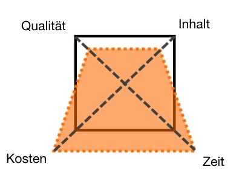

## Kriterien für den Projekterfolg
* Durchführung (in time, in budget & in quality)
* Zufriedenheit der Kunden
* minimale Abweichung vom Projektziel
* keine Beeinträchtigung des Unternehmensablaufs 
* klare Ziele die bekannt sind
* Transparenz 
* Erkennen von Risiken
* Kommunikation und Teamansatz

## PDCA-Zyklus
Plan-Do-Check-Act <br>
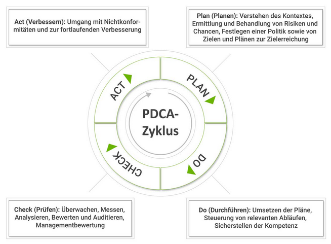

# Vorgehensmodelle
Zusammenstellung von Methoden und Elementen zu Prozessen und Phasen des Prijektablaufs. <br>
* bildet Rahmen
* verbessert Übersichtlichkeit
* dient als Leitfaden
* frühzeitige Fehlererkennung
* projektbegleitende Dokumentation

Die Modelle sind abhängig von der Projektart und deren Eigenschaften. <br>

<!--
weiter bei 02
https://moodle.thi.de/pluginfile.php/557847/mod_resource/content/6/PM_KI_Kap2_GrundlagePM_he_2023_1-0.pdf

Liste von Moodle beachten
-->

## Wasserfallmodell
Bekanntestes Vorgehensmodell bei Softwareentwicklung, bei der jede Phase abgeschlossen werden muss bevor die nächste beginnt. <br>
Am Ende jeder Phase muss ein Ergebnis erreicht werden. <br>

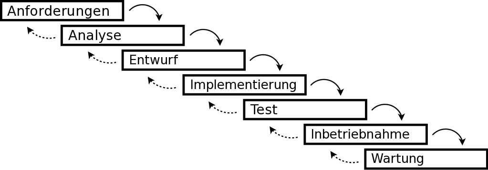

**Vorteile** <br>
* leicht verständlich und schnell anwendbar
* Dokumente stellen Nachvollziehbarkeit sicher

**Nachteile** <br>
* nur für einfache Projekte geeignet
* frühes Festlegen der Anforderungen
* inflexibel gegenüber Änderungen
* Software bildet nur den Anforderungsstand zu Beginn ab

<!--
| Vorteile | Nachteile |
|----------|-----------|
| point    | point     |
| point    | point     |
-->

## V-Modell
Entwicklungsprozess in drei Sichten (Anwender, Architektur, Implementierung) mit integrierter Qualitätssicherung. <br>
Klare Beschreibung der erwarteten (Zwischen-) Ergebnisse. <br>

**Verifikation**: Stimmt Spezifikation und PRodukt überein? <br>
**Validierung**: Stimmt Software für den Einsatzzweck? <br>

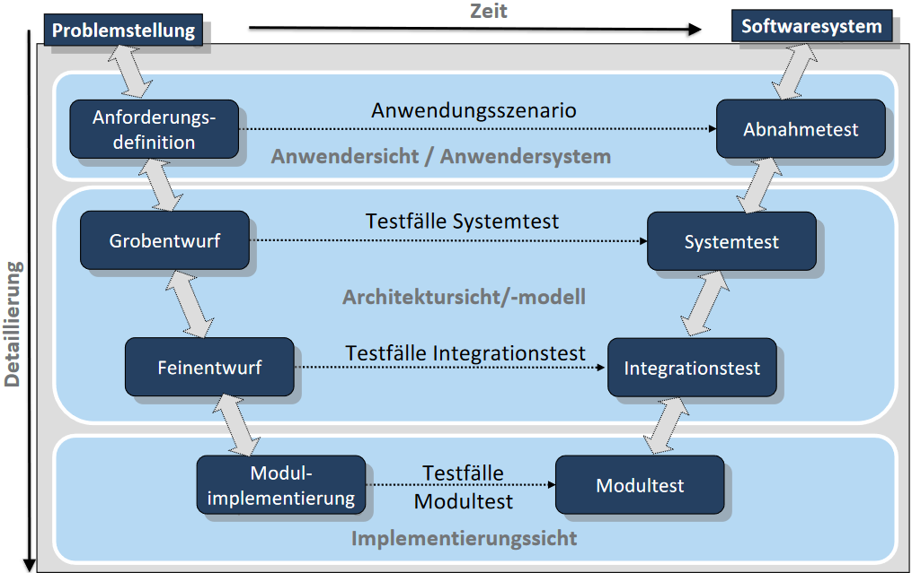
<!-- replace image maybe -->

**Vorteile** <br>
* frühzeitiges Erkennen von Risiken und Fehler
* Gewährleistung der Qualität
* Verringerung der Abhängigkeit des Auftraggebers
* verbesserte Kommunikation 

**Nachteile** <br>
* sehr starres Modell
* nur anwendbar bei Projekten mit klarer Zielsetzung
* hoher Dokumentationsaufwand und späte Ergebnisse

## Spiralmodell
In diesem Fall das iterativ inkrementelle Vorgehensmodell, wobei die Entwicklung von den Kernanforderungen ausgeht und die **alle Anforderungen nicht von Anfang an** bekannt sind. <br>

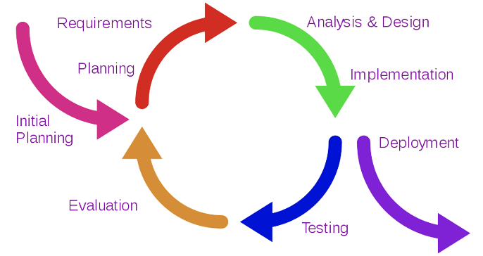

**Vorteile** <br>
* schnelle Reaktionszeiten 
* verbesserte Kommunikation
* schnelles Feedback
* vereinfachter Abnahmeprozess (durch Teilabnahmen)
* qualitativ besseres Ergebis durch frühes Feedback
* bereichsübergreifend 

**Nachteile** <br>
* hoher Koordinationsaufwand
* fehlende Transparenz des aktuellen Projektstandes
* gute Vertrauensbasis zwischen Auftraggeber und Auftragnehmer vorausgesetzt


## Projektorganisation
<!-- S. 19 -->
| Rolle | Beschreibung |
|-------|--------------|
| Auftraggeber | stellt Resourcen (Zeit, Geld) zur Verfügung <br> definiert den Auftrag und Ziele |
| Lenkungsausschuss | ernennt Projektleiter <br> klärt Konflikte <br> kennt Projektziele, fachliche und technische Anforderungen <br> Abnahme und kann Projektteam entlassen |
| Projektleiter | verantwortlich für Projektplanung und -durchführung sowie Erfolg <br> benötigt richtige Kompetenzen (Führung, ...) | 
| Projektbüro | siehe [moodle S.21](https://moodle.thi.de/pluginfile.php/557847/mod_resource/content/6/PM_KI_Kap2_GrundlagePM_he_2023_1-0.pdf) |

Visualisierung der Rollen in klassischen (IT-) Projekten. <br>

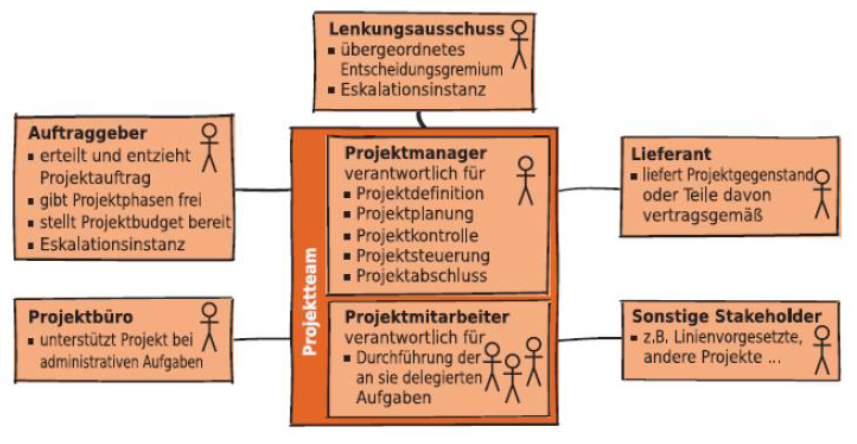

### Rollen 
(siehe [moodle S.28](https://moodle.thi.de/pluginfile.php/557847/mod_resource/content/6/PM_KI_Kap2_GrundlagePM_he_2023_1-0.pdf) zur RACI-Matrix) <br>

Am Beispiel Autoreparatur. <br>

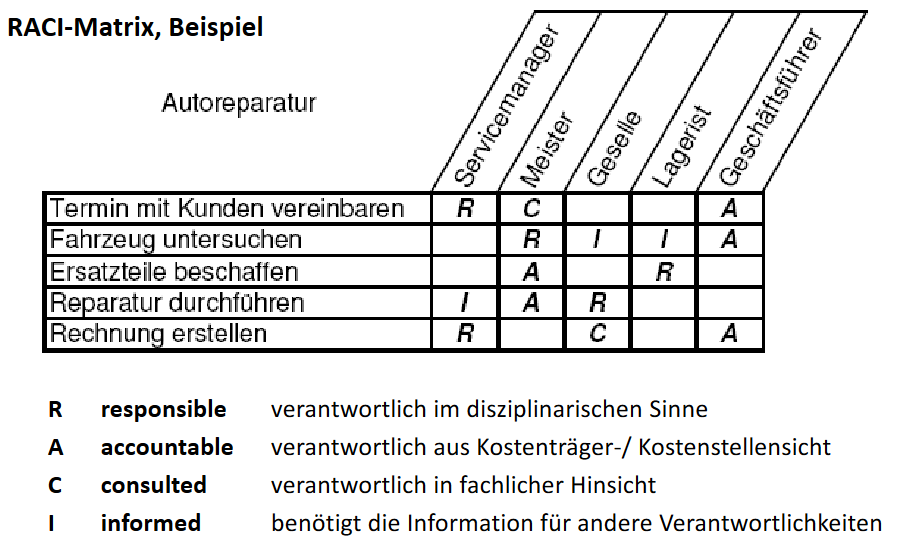

<!--
vervollständigen ab Seite 36 (moodle)
-->

### Projektmanagement in der Linie
**Prinzip** <br>
* Projektleiter und -mitarbeiter verbleiben in der Linie
* Projektleiter hat keine Weisungsbefugnis (nur Weisungsbefugnis)

**Vorteile** <br>
* keine organisatorischen Veränderungen erforderlich

**Nachteile** <br>
* Linie sticht Projekt
* kaum Möglichkeiten zum Aufbau von Teamgeist

**Anwendung** <br>
* fachbezogene Projekte mit geringer Mitarbeit aus der Linie

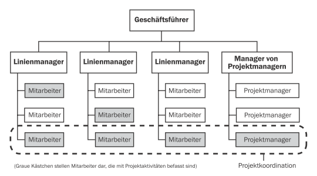

### Einfluss-Projektorganisation
**Prinzip** <br>
* Projektleiter in einer Stabfunktion
* Projektmitarbeiter weiter in der Linie
* Projektleiter hat nur Kooridnationsbefugnisse, keine Weisungsbefugnis

**Vorteile** <br>
* geringe organisatorische Änderung erforderlich
* hohe Akzeptanz durch die Linie

**Nachteile** <br>
*kein direkter Einfluss und keine rasche Reaktion auf Änderungen (da immer erst über Linienvorgesetzten)
* fehlender Teamgeist

**Anwendung** <br>
* Kundenprojekte (die Bedeutung gegenüber dem Kunden soll demonstriert werden)
* Organisationsprojekte, die das gesamte Unternehmen betreffen (z.B. Softwareeinführung)

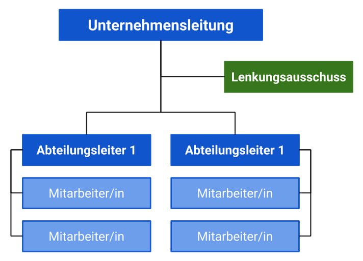

### Matrix-Projektorganisation
**Prinzip** <br>
* Überlagerung von funktionaler Organisation (vertikal) mit projektorientierter Organisation (horizontal).
* Aufteilung der Befugnisse (und Verantwortungen) zwischen Linie und Projekt

**Vorteile** <br>
* organisatorische Verankerung und somit hohe Aufmerksamkeit des Projektes
* keine Auslastungsprobleme, da Mitarbeiter in mehreren Projekten eingesetzt werden können

**Nachteile** <br>
* Projektmitarbeiter sind zwei Leitern unterstellt (Projekt- und Linienmanager) mit Konfliktpotential
* hohe Belastung der Mitarbeiter 
* hoher Koordinations- und Abstimmungsaufwand

**Anwendung** <br>
* Projekte mit unterschiedlichen Fachbereichen und Spezialisten
* Projekte mit hoher Bedeutung für das Unternehmen
* wiederkehrende Projekte

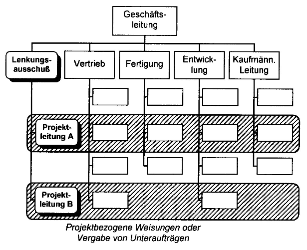

### reine Projektorganisation
**Prinzip** <br>
* eigene Abteilung für ein Projekt, Projekt-Leiter und -Mitarbeiter in einer Einheit
* wird nach Abschluss des Projektes wieder aufgelöst
* Projektleiter hat Koordinations- und Weisungsbefugnis

**Vorteile** <br>
* hohe Motivation, Teamgeist und Zusammenhalt
* schnelle Reaktion im Projekt
* Mitarbeiter konzentrieren sich auf das Projekt
* geringes Konfliktpotential

**Nachteile** <br>
* nach Abschluss, Auflösung der Struktur benötigt Stellen ind er Linie
* Projektorganisation zu Lasten der Linie

**Anwendung** <br>
* Taskforce
* Projektabteilung

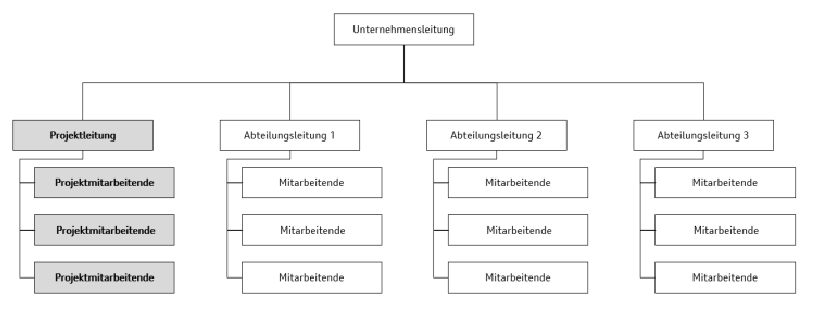


# Projektdefinition
Projektmanagementphasen
* Initialisierung
* Definition
* Planung
* Steuerung
* Abschluss

sind projektspezifisch, ein IT-Projekt hat andere Phasen als ein Bau-Projekt. 

## Phasenmodell
Eine **Phase** ist ein zeitlicher Abschnitt im Projekt, alle zusammen ergeben das Phasenmodell. <br>
Dadurch wird die Komplexität des Projektes verringert, es wird überschaubarer und die Transparenz wird erhöht. <br> 

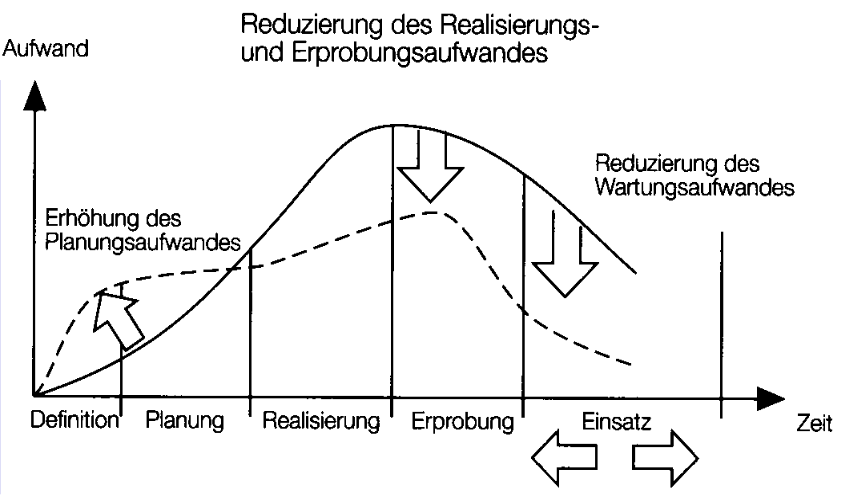

## Projektziele 
### SMART
Ziele sollten SMART sein. <br>

| | | |
|-|-|-|
| **S** | specific | einfach, verständlich und präzise |
| **M** | measurable | eindeutige Kriterien zur Prüfung |
| **A** | achievable | realistisch erreichenbar |
| **R** | relevant | für das Projekt relevant und zum Gesamtziel |
| **T** | time-bound | zeitlich einzuordnen, planbar |

## Anforderungen
**funktionale Anforderungen** <br>
Was das System oder PRodukt tut, welche Daten es verarbeitet oder welches Verhalten vom System gewünscht wird. 

**nicht-funktionale Anforderungen** <br>
Qualitätsanforderungen: Wie gut, schnell, sicher, erweiterbar, ... das gesamte System oder Teie davon sein sollen. <br>
geforderte Rahmenbedingungen: Unter welchen technischen oder organisatorischen Vorhaben das System entwickelt werden soll, zum Beispiel Forschung nach Nutzung bestimmer Technologien, Zeit- oder Geldvorgaben, ... <br>

**Lastenheft** <br>
Gesamtheit der Anforderungen des Auftraggebers an das System (WAS). <br>

**Pflichtenheft** <br>
Im Pflichtenheft dokumentiert der Auftragnehmer, wie er die im Lastenheft gestellten Anforderungen umsetzen will (WIE & WOMIT). <br>

Jedes Ziel oder Jede Anforderung ist...
* mit eindeutiger ```ID``` versehen
* einem Anforderer zugeordnet
* präzise, verständlich, widerspruchsfrei und positiv formuliert
* zur Umsetzung geeignet
* verifizierbar (prüfbar, messbar)
* priorisiert (muss, kann, soll)
* nachverfolgbar
* in einer zentralen Liste dokumentiert
* von Auftraggeber und dem Projektteam akzeptiert

**Anforderungsformulierung** <br>
Folgendes Beispiel zur Formulierung. 

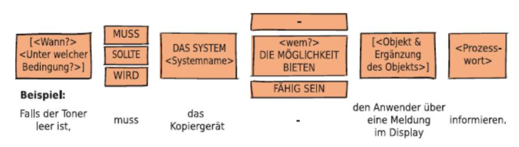

**Traceability** <br>
Anforderungen und alle daraus abgeleiteten Elemente müssen über die gesamte Lebensdauer des Systems nachverfolgbar sein. 
* Woher kommt die Anforderung?
* Wie hängt sie mit anderen Anforderungen zusammen?

## Projektumfeld
DIe Umgebung, die das Projekt direkt oder indirekt beeinflusst. <br>
* zeitlicher Kontext
* sachlicher Kontext 
* sozialer Kontext

**Projektumfeldanalyse** <br>
Die Identifikation von Faktoren, die das Projekt beeinflussen können. <br>
* Rahmenbedingungen identifizieren
* idetiifizieren von allen Stakeholdern
* Projektrisiken früh erkennen

| | soziale Faktoren | sachliche Faktoren |
|-|-|-|
| intern | Auftraggeber <br> Anwender <br> Projektteam <br> Fachbereich | Budgetrahmen <br> Geschäftsprozesse <br> Betriebsvereinbarungen <br> interne Richtlinien |
| extern | beteiligte externe Firmen <br> Serviceprovider | Gesetze <br> Normen, Standards <br> Marktentwicklung <br> Konjunktur |
| | Stakeholderanalyse | Risikoanalyse |

**Stakeholder** <br>
Personen oder Gruppen, die am Projekt beteiligt, interessiert oder von den Auswirkungen betroffen sind. <br>
* Kunde
* Mitarbeiter
* Eigentümer (des Unternehmens)
* Dienstleister
* Gesellschaft

<!-- Seite 39 -->

**Stakeholderanalyse** <br>
Eine Stakeholderanalyse ist das methodische Vorgehen im Projektmanagement um mit den Ansprüchen, Erwartungen, Herausforderungen und Bedenken qualifiziert umzugehen. 

Ist Grundlage für rechtzeitige, zielgruppenspezifische und glaubwürdige Kommunikation. 

Ziel ist es, Widerstände zu vermeiden, Unterstützung zu gewinnen und Informationen zu gewinnen. 

1. Identifikation potentieller Stakeholder
2. Sammlung von Informationen
3. strategische Einordnung
4. Vorhersage des Stakeholderverhaltens
5. Maßnahmen planen und umsetzen

Die Interessensmatrix sieht wiefolgt aus. 

| # | Stakeholder | Einstellung zum Projekt (```+```, ```-```, ```0```) | Erwartungen (```+```), Beffürchtungen (```-```) | Betroffenheit (```H```, ```M```, ```G```) | Macht & Einfluss (```H```, ```M```, ```G```) |  Maßnahmen |
|-|-|-|-|-|-|-|
| 1 | Entwickler | ```0``` | ```+``` | ```G``` | ```M``` | Erstellung eines funktionalen Prototypen |
| 2 | Geschäftskunde | ```0``` | ```-``` | ```G``` | ```M``` | Informationsgespräche |
| 3 | Softwareanbieter | ```+``` | ```+``` | ```M``` | ```G``` | Projekteinbindung |
| 4 | Enduser | ```0``` | ```-``` | ```H``` | ```H``` | Lockangebote |
| 5 | Datenschutzbeauftragter | ```-``` | ```-``` | ```G``` | ```M``` | Hacktest |
| 6 | Management | ```+``` | ```+``` | ```H``` | ```H``` |  |
| 7 | Sicherheitsbeauftragter | ```-``` | ```-``` | ```G``` | ```M``` | Verhandlungssache |

Zur alternativen Darstellung, siehe [moodle](https://moodle.thi.de/pluginfile.php/562601/mod_resource/content/12/PM_KI_Kap3-1a_Definition_he_2023_1-0.pdf) Seite 50.

<!-- Beispiel mti Studiengang -->

Beeinflussing der Stakeholder durch...
* Kommunikation
* Einladungen 
* Prototypen
* Infoveranstaltungen

## Risikoanalyse
**Projektrisiken** <br>
Unsichere Ereignisse oder mögliche Situationen mit negativen Auswirkungen auf den Projekterfolg. 

**Projektrisikomanagement** <br>
Identifikation, Klassifikatin und Bewertung von Projektrisiken aller Art sowie Masnahmen zur Risikobewältigung.

1. Risikoidentifikation
2. Risikobewertung
3. Risikoabsicherung

Darstellung der Risiken, wobei ```x``` die Eintrittswahrscheinlichkeit und ```y``` die Auswirkung darstellt. 

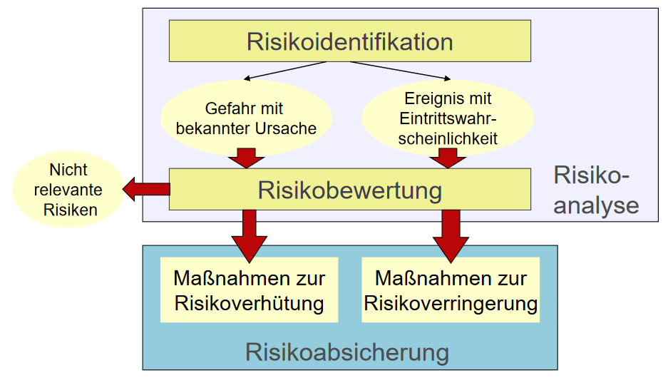

**Risikoabsicherung** <br>
* Risikovermeidung
* Risikoverminderung
* Risikobegrenzung
* Risikoverlageurng
* Risikoakzeptanz

Im erwähnten Graph von vorhin können Rikiken in Nähe des Kooridnatenursprungs akzeptiert werden, wobei Risiken oben rechts vermieden werden sollten.

**Beispiel** <br>
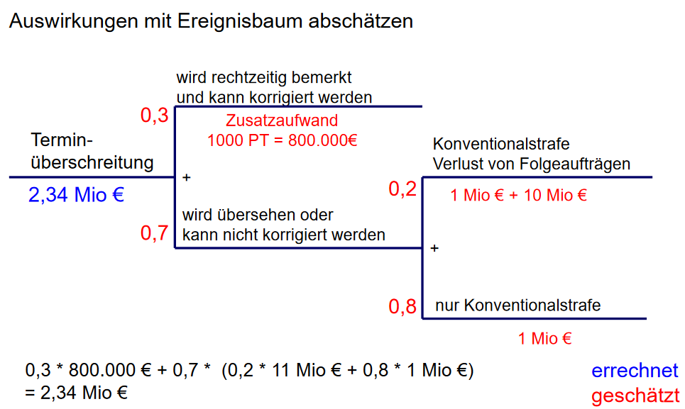


# Projektplanung
Die Wirkung der Planungstätigkeiten ist relevant für den Projekterfolg, siehe [Phasenmodell](#phasenmodell).

Wichtige Schritte der Projektplanung sind...
* Projektstrukturplan
* [Phasenplan](#phasenplan)
* Ablauf- und Terminplan
* Resourcen- und Kostenplan

## Projektstrukturplanung (PSP)
Erfassung und Beschreibung aller Teilaufgaben des Projekts sowie deren Beziehungen. Ziel ist eine Zerlegung in plan- und kontrollierbare Teilauftgaben sowei Transaprenz und Verantwortlichkeit den einzelnen Aufgaben zuzuordnen.

**Projektstrukturplan** <br>
Graphische Darstellung der Teilaufgaben und deren Beziehungen in den verschiedenen Ebenen. 

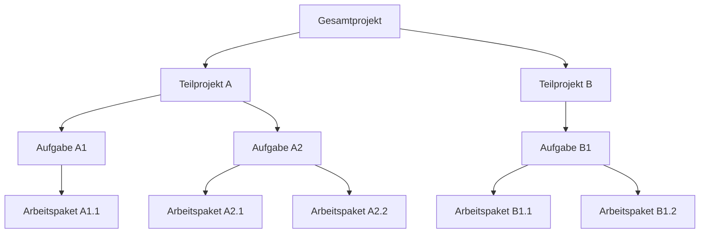

**Arbeitspakete** <br>
Teil des Projekts, der im Plan nicht weiter aufgeteilt werden kann. Beschreibung so genau wie möglich, zum Beispiel mit...
* Name, Nummer, Version und Status
* inhaltliche Beschreibung
* geplante Ergebnisse
* Vorraussetzungen für die Ausführung
* geplante Dauer 
* geplanter Aufwand
* Veranstwortlicher

**Ansatz** <br>
Beim ```Bottom-Up```-Ansatz werden die Arbeitspakete zuerst definiert und dann zu Teilaufgaben und schließlich zum Projektstrukturplan zusammengefügt. Gut für neue Projekte. <br>
Hingegen werden beim ```Top-Down```-Ansatz die Aufgaben zuerst definiert und dann in Teilaufgaben und Arbeitspakete zerlegt, gut geeignet für bereits bekannte Projekte.

## Phasenplan
Gliederung des zeitlichen Ablaufs des Projekts, bei Meilensteilen wird der Projektfortschritt gemessen - es kann über Abbruch, Fortführung oder Korrektur entschieden werden.

## Ablauf- und Terminplan
Der ABlaufplan legt die sachlogische Reihenfolge der Arbeitspakete fest. Der Terminplan ergänzt den Ablaufplan durch die Berücksichtigung von Resourcen und Wartezeiten. 

**Meilensteinpläne** <br>
Terminlisten für wichtige Ereignisse und Ergebnisse. 
<details><summary>Beispiel</summary>
| # | Vorgang | Dauer | Vorgänger |
|---|---------|-------|-----------|
| 1 | Entwicklungsantrag stellen und genehmigen | 10 | - |
| 2 | Schaltung entwerfen | 3 | 1 |
| 3 | Stückliste erstellen | 1 | 2 |
| ... | ... | ... | ... |
| n | Prototyp testen | 3 | 5 |

Kann gut in einem Netzplan dargestellt werden.
</details> <br>

**Balkenpläne** <br>
Graphische Darstellung der Zeitdauer von Arbeitspaketen auf Zeitachse mit Start- und Endterminen.
<details><summary>Beispiel</summary>
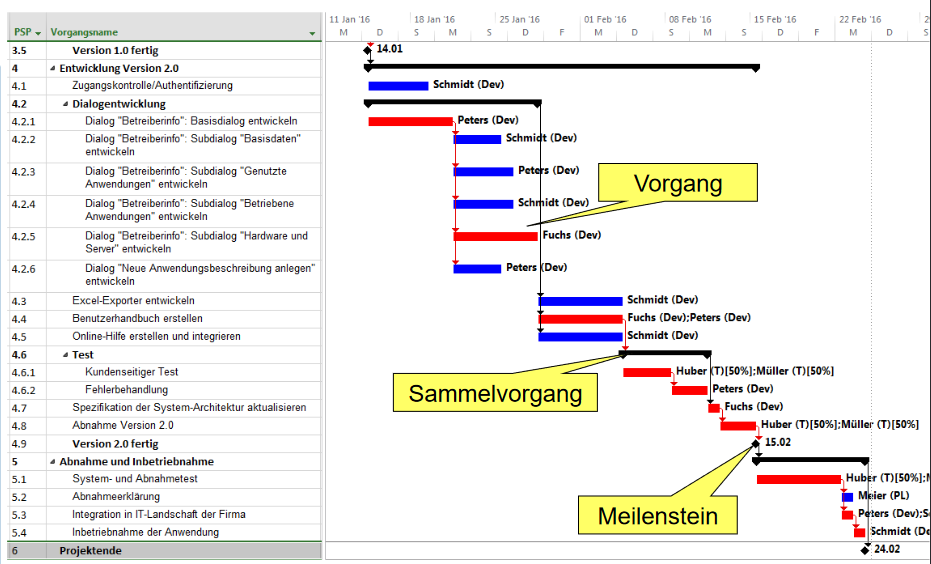 <br>
Balkenplan ist so nicht prüfungsrelevant. 
</details> <br>

**Netzpläne** <br>
Graphische Darstellung der Ablaufstruktur eines Projekts, zeigt logische und zeitliche Abfolge der Aufgaben. 
<details><summary>Beispiel</summary>
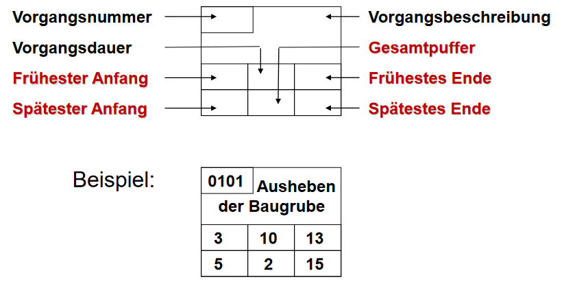 <br>
Kann in einem ```Netzplan``` mir anderen Knoten dargestellt werden.
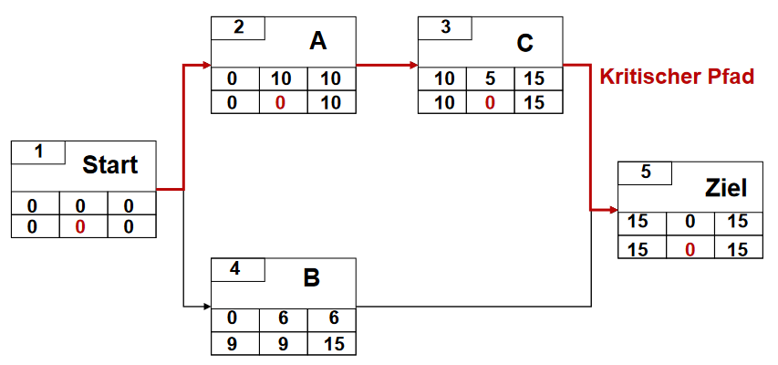
</details> <br>

## Resourcen- und Kostenplan
Überarbeitung der Planung mit dem Ziel einer Terminbeschlunigung, zum Beispiel durch Parallelisierung oder optimierten Resourceneinsatz sowei ein beschränkter Arbeitsumfang. 

**Terminbeschleunigung** <br>
Nur sinnvoll auf dem kritischen Pfad. 


<!-- to be continued on p. 74 -->

# Projektstart
Bilet die Nahtstelle zwischen Vorbereitung und Realisierung. Folgendes sollte bereits zum Projektstart vorliegen...
* Projektziele
* Projektbudget
* Projektleiter und -team

Der Projektauftrag als Ergebbnis der Definitionphase. 
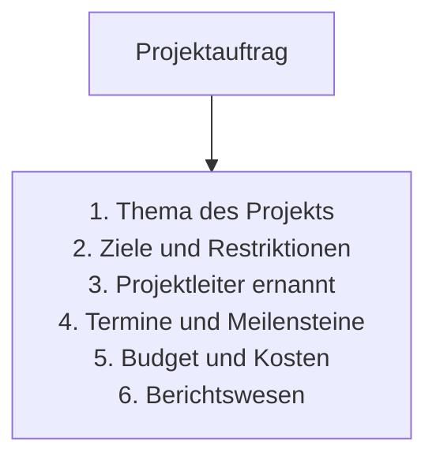

## Scope
Die Inhalts- und Umfangsbeschreibung beschreibt den Inhalt sowie den Umfang des Projekts, sowie die wichtigtsen Liefergegenstände.

**Scope Statement** <br>
Siehe [moodle](https://moodle.thi.de/pluginfile.php/567247/mod_resource/content/5/PM_KI_Kap3-2_Kickoff_he_2023_1-0.pdf) Seite 13.
<!-- Bild einfügen -->


# Projektfortschritt
Der Projektfortschritt wird anhand von Meilensteinen gemessen.
<!-- check this info -->

## Projektcontrolling
Geht über die reine Überwachungsfunktion hinaus und enthält auch die Verantwortlichkeiten für Planung und Steuerung. 
* Verfolgung der projektrelevanten [Zielgrößen](## "Sachziel, Terminziel & Kostenziel")
* Vergleich mit Projektplan
* feststellen von Planabweichungen

**1. Projektdatenerfassung** <br>
Erhebung, Überprüfung und Aufbereitung von Daten zur aktuellen Projektsituation.

**2. Soll-Ist-Vergleich** <br>
Vergleich zwischen Planung und erreichten ist-Werten sowie Feststellung von Abweichungen zwischen Plan und Stand. 

**3. Abweichungsanalyse** <br>
Ermittlung der Gründe für Abweichungen sowie Aufzeigen möglicher Korrekturmaßnahmen.

**4. Steuerungsmaßnahmen** <br>
Beschluss, Durchführung und Kontrolle von Maßnahmen zur Erreichung der Projektziele. 

### Fortschrittskontrolle
Sinn ist das Erkennen von kritischen Entwicklungen in dem Verhältnis. 

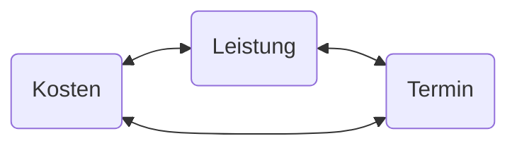

Mit ```20%``` des Aufwandes werden bereits ```80%``` der Leistung erbracht und für die letzten ```20%``` werden ```80%``` des Aufwandes benötigt.

**Kontrolle auf Basis der Ist-Werte** <br>
Zum Beispiel mit der Zeit aknn der Fortschritt gemessen werden.

$FGR_{ist} = \frac{t_{verstrichen}}{t_{gesamt}}$

**Kontrolle auf Basis der Restwerte** <br>
Beispielsweise kann mit den bisher angefallenen und geplanten Kosten zur Vollendung der Fortschritt gemessen werden.

$FGR_{ist} = \frac{K_{ist}}{K_{ist} + K_{rest}}$

**Kontrolle auf Basis von Leistungsmaßen** <br>
Messung des Fortschritts anhand von Leistungsmaßen, zum Beispiel Anzahl der erstellten Codezeilen. 

**0/100-Methode** <br>
Meilenstein wird erst dann erreicht, wenn das Arbeitspaket vollständig abgeschlossen ist.

**50/50-Methode** <br>
Mit Beginn eines Vorgangs werden 50% der budgetierten Kosten
dem Fertigstellungswert zugerechnet. Erst nach der Abnahme des Arbeitsergebnissen werden die restlichen 50% dem Fertigstellungswert gutgeschrieben.

**20/80-Methode** <br>
Analog zur ```50/50``` Methode. 

Das Problem beim Ermitteln des ```FSG``` ist, dass er oft zu optimistisch eingeschätzt wird.

**Meilensteinanalyse** <br>
Ziel der Meilenstein-Trendanalyse ist, Trendaussagen darüber treffen zu können, ob die geplanten Meilensteintermine voraussichtlich eingehalten werden, sich verzögern oder ob Meilensteinergebnisse voraussichtlich schon früher als geplant vorliegen werden.

Das ```MTA```-Diagramm zeigt die Entwicklung der Meilensteintermine über die Zeit.

<details><summary>MTA-Diagramm</summary>
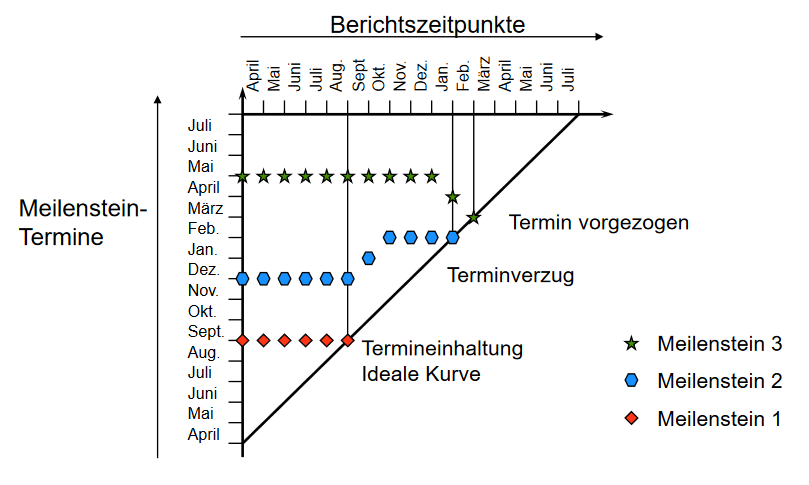 <br>
<!-- alternative: 19_mta.bmp -->
</details> <br>

**Kosten-Trend-Analyse** <br>
Die Kostentrendanalyse (KTA) ist eine Methode zum Kostencontrolling in Projekten und zeigt den erwartbaren Verlauf der Projektkosten.

<details><summary>KTA-Diagramm</summary>
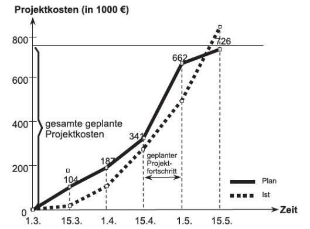 <br>
</details> <br>

## Projektsteuerung
Die Verknüpfung von allgemeinen Projektmanagement zu einem ganzheitlichen Konzept der Projektführung. Ziele sind...
* Früherkennung von Abweichungen
* Steuermaßnahmen früh einzuleiten
* Entwicklung des zukünftigen Projektverlaufs

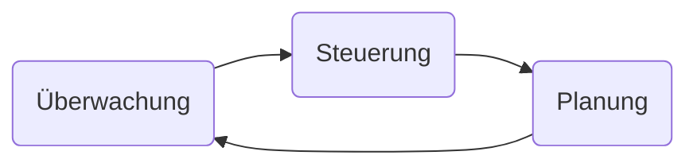

**Abweichungsanalyse und Steuerungsprozess** <br>
Wesentlich bei der Festlegung von Maßnahmen ist die Berücksichtigung der Reaktionszeit.

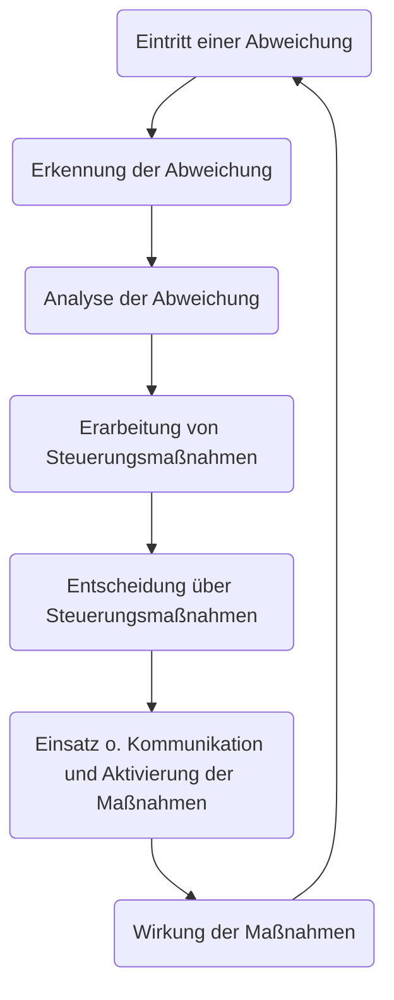

<!--
https://moodle.thi.de/pluginfile.php/567384/mod_resource/content/9/PM_KI_Kap3-3_Fortschritt_und_Trend_he_2023_1-0.pdf
-->


# Projektabschluss
## Dokumentation
Gute DOkumentation erleichtert die EInarbeitung oder rasche Orientierung neuer Mitarbeiter, sichert zudem Wissen für Personalausfall oder -verlust. Nachvollziehbarkeit ist somit garantiert und nach Abschluss kann einiges wiederverwendet werden.

**Produkt** <br>
Erzeignis oder Ergebnis eines Tätigkeitsvorhabens, erbrachte Leistung zum Beispiel eine Diensleistung oder ein Softwareprodukt. 

**Projekt** <br>
Zielorientiertes Vorhaben zur Herstellung des Produkts. 

**Prozess** <br>
Eigentliches Vorgehen im Projekt zur Herstellung des Produkts.

| Produktdokumentation | Projektdokumentation |
| -------------------- | -------------------- |
| Systemspezifikation <br> Funktionsspezifikation <br> Designspezifikation <br> Programmlisting <br> Benutzerhandbuch <br> ... | Projektauftrag <br> Projektziele <br> Projektkalkulation <br> Projektstrukturplan <br> Terminplan <br> Kostenplan <br> Qualitätssicherungsbericht <br> Fortschrittsberichte <br> ... | 

**Zielsetzung** <br>
Aktuellen Stand des Projekts in schriftlicher Form festhalten und Prognosen für den weiteren Verlauf des Projekts treffen.

**Rückmeldung** <br>
Termininformationen von den Arbeitspaket-Verantwortlichen, zum Beispiel Anfangs- und Endtermin oder Restbearbeitungsdauer - sowie Kosten- und Aufwandsüberwaachung.

**Projekthanbuch** <br>
Nimmt alle Projektdokumente und sonstigen Unterlagen auf, durchnummerierte Struktur und gut aufgegliedert (angelehnt an den Projektstrukturplan).

**Projekttagebuch** <br>
Zeichnet chronologisch alle wichtigen Ereignisse auf, ähnlich wie Protokolle. 

## Abschluss
Das Projektende ist zeitlich und personell begrenzt - wenn das Projektziel erreicht ist. Letzte Aufgaben zum Ende des Projekts sind...
* formale Abnahme durch den Auftraggeber
* Projektdokumentation (siehe [Dokumentation](#dokumentation))
* Übergabe der Veranstwortung der Ergebnisse 
* Freigabe von Ressourcen
*  kurzer Abschlussbericht

Sowie die kritische Projektaufarbeitung.
* kritische Aufarbeitung des Projekts
* Projektanalyse (Fragebögen, Befragungen)
* Nachkalkulation
* Evaluation der Ergebnisse
* Projektabschlusssitzung vorbereiten
* Abschlussbericht verfassen

Auf der Beziehungsebene fallen folgende Aufgaben an...
* Teammeetings bis zum Projektende
* Abschwächen des Teamgedanken entgegenwirken
* Mitarbeitenden frühzeitig neue Aufgaben zuweisen
* Mitarbeitenden Feedback geben
* abschließendes Gespräch mit den Mitarbeitenden
* Feedback der Stakeholder einfordern

**Projektabschlusssitzung** <br>
Die Projektabschlusssitzung ist ein formelles Treffen, bei dem die Projektergebnisse präsentiert werden.
* Sind die Projektziele erreicht worden? 
* Ist der Auftraggeber zufrieden?
* Was ist gut oder schlecht gelungen?
* Wie war das Klima im Team?
* Wie war die Zusammenarbeit mit Externen? 
* Was wurde gelernt für die Zukunft?

**Projektabschlussbericht** <br>
Der Projektabschlussbericht ist ein formelles Dokument, das die Projektergebnisse dokumentiert. 

**Sonsitges** <br>
Die Kundenzufriedenheit kann am Ende erfragt werden, um Feedback zu sammeln und in anderen Projekten einzusetzen. Der Projektabschluss sollte gefeiert werden als Event. 


# agiles Projektmanagement
...
