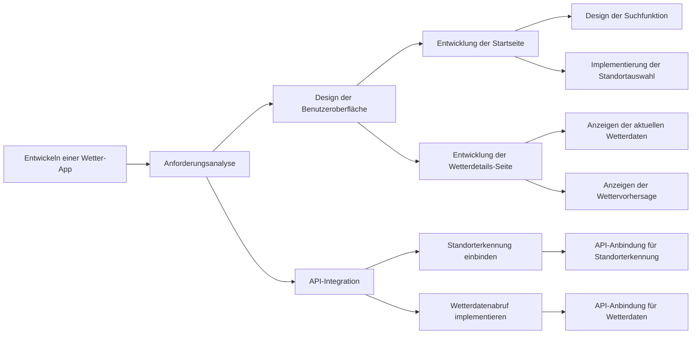
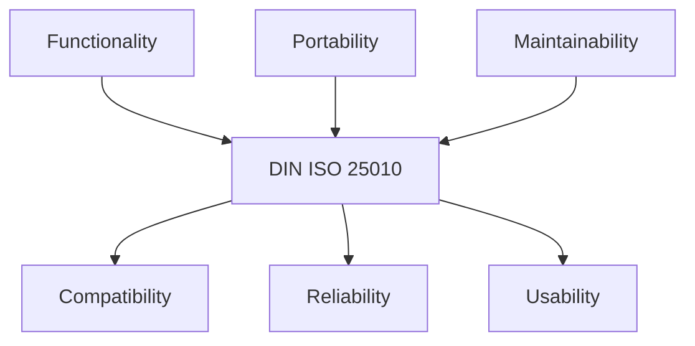
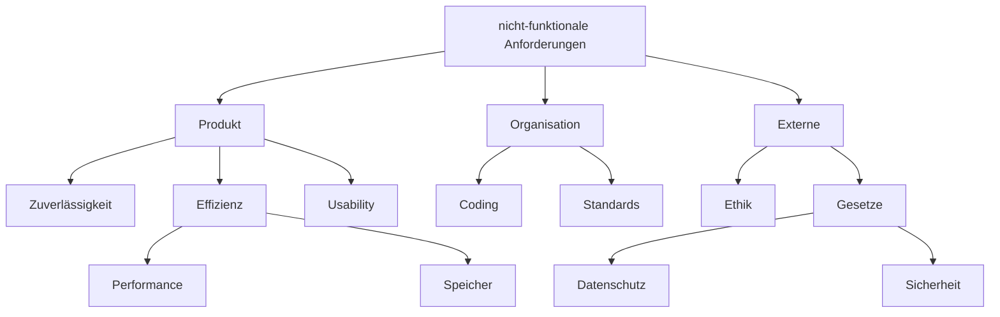

# Software-Engineering

# Table of Contents
- [Software-Engineering](#software-engineering)
- [Table of Contents](#table-of-contents)
- [Einführung](#einführung)
  - [Software](#software)
  - [Software-Engineering](#software-engineering-1)
  - [Modellierung](#modellierung)
  - [Ziele](#ziele)

# Einführung
## Software
Software umfasst zum Beispiel Tabellenkalkulation oder Grafikbearbeitung und beinhaltet immer Dokumentation und zur Ausführung notwendige Daten. 

**Software-Krise**  
Die Programmsysteme der 1960er wurden zunehmendn komplexer und die Entwicklungskosten stiegen. Als Folge scheiterten extrem viele Softwareentwicklungsprojekte - heute werden nur etwa 6% aller Projekte erfolgreich abgeschlossen.

## Software-Engineering
Die Anwendung von Ingenieurs-Methoden zur Erstellung qualitativ hochwertiger Software - folgendes muss bereitgestellt werden.
* Prinzipien (Grundsätze und Regeln)
* Methoden (Art der Durchführung) 
* Werkzeuge (Hilfe bei Entwicklung der Software)

Nicht nur technische Aspekte sind wichtig, insbesondere auch soziale und organisatorische Aspekte - 'Menschen macht Projekte'.

## Modellierung
In den Ingenieursdisziplinen ist das Arbeiten mit Modellen ein fester Bestandteil der Vorgehensweise.

**Partitionierung**  
Ein Problemkreis wird schrittweise in kleinere Problemkreise zerlegt, reduziert somit die Komplexität.

Beispiel

Beispiel zur Partitionierung anhand einer Wetter-App.

  

**Abstraktion**  
Durch das Weglassen von Detail-Informationen wird der Blick auf wesentliche Aspekte ermöglicht.

**Projektion**  
Betrachtung des gleichen Sachverhalts aus unterschiedlichen Perspektiven, ergeben sich aus verschiedener Personengruppen und technischen Aspekten.

## Ziele
Softwareentwicklung erfolgt streng zielorientiert nach wirtschaftlichen Aspekten. 

**Qualität**  
Ergibt sich aus der Gesamtheit der Eigenschaften und Merkmale eines Produkts - typischerweise in Lastenheft beschrieben, siehe [Softwarequalität](#softwarequalität).

**Kosten**  
Normalerweise sind die Wartungnskosten höher als die Entwicklungskosten. 

| Kostenart | Beschreibung |
| --- | --- |
| Entwicklungskosten | Kosten für Personal und Ausstattung |
| Wartungskosten | Kosten nach Installation des Produkts |
| Fehlerbeseitigung | Kosten für Korrektur von Fehlern |
| Anpassung | Kosten für Anpassung an neue Anforderungen |
| Vertrieb | für den Vertrieb des Produkts |

Die Entwicklungskosten setzen sich z.B. aus der Analyse und dem Entwurf, dem Testen und dem Codieren zusammen.
Die Wartung lässt sich in Verbesserung, Portierung und Fehlerkorrektur unterteilen.  
Optimalerweise sinken die Warungskosten mit der Zeit während die Entwicklungskosten steigen.

**Zeit und Termine**  
Die Zeit ist ein wichtiger Faktor, da die Kosten mit der Zeit steigen. 

<!-- Ausblick Phasenmodell -->

# Softwarequalität
Die Gesamtheit von Eigenschaften und Merkmalen einer Einheit (das heißt eines Produkts oder einer Tätigkeit) bezüglich ihrer Eignung, festgelegte und vorausgesetzte Erfordernisse zu erfüllen. 

<!-- Qualitätsmodell -->

## DIN ISO 25010

## Qualitätsmaßnahmen
Es ist praktisch nicht möglich, mit vertretbarem Aufwand fehlerfreie Software zu entwickeln.

**Fehler**  
Ein Fehler ist die Abweichung eines beobachteten oder gemessenen Wertes, Zustandes oder Verhaltens eines Softwareprodukts von dem spezifizierten oder als richtig Erwarteten.

* Prozessqualität
* Mitarbeitende
* Reife der Technologie
* Qualität der verwendeten Werkzeuge

Viele verschiedene Eunflussfaktoren auf die Qualität von Software. 

**konstruktive Maßnahmen**  
Maßnahmen in Bezug auf das Personal, die Organisation oder der Technik - sorgen dafür, dass der Entwicklungsprozess und die Software eine bestimmte Qualität aufweisen.

**analytische Maßnahmen**  
Zum Beispiel statische oder dynamische Tests - sind Maßnahmen zur Ermittlung der aktuellen Software-Qualität. Sie bringen per se keine Qualität, führen aber zu weiteren Maßnahmen der Qualitätsverbesserung.

# Analysephase
Die Analysephase ist die erste und eine der wichtigsten Phasen im Gesamtmodell. Fragen zur Funktionalität, den Randbedingungen und den Eigenheiten des Systems werden geklärt.

**Aktivitäten**  
* Analyse des Ist-Zustandes 
* Analyse der Machbarkeit (Risiko % Kosten)
* Definition des Systemkontexts
* Bestimmung der Anforderungen

**Ergebnisse**  
* Pflichtenheft
* Konzept der Benutzeroberfläche
* Analysemodell

<!-- Planungsphase und Definitionspahse -->

## Anforderungen
Legen fest, was man von einem Softwaresystem als Eigenschaften erwartet.

> Die App muss den aktuellen Standort des Benutzers erkennen und die Wetterdaten für diesen Standort anzeigen.

Generell sind Anforderungen schwer zu ermitteln, da Beteiligte die Anforderungen oft nicht klar formulieren können oder Fachsprache und -wissen fehlt. Auch können die Interessen der einzelnen Beteiligten unterschiedlich sein.

**funktionale Anforderungen**  
Definiert eine vom System zu erbringende Funktion. 
* Was tut das System?
* Wie reagierte das System auf Eingaben?

**nicht-funktionale Anforderungen**  
Werden auch Qualitätsanforderungen genannt, definieren eine qualitative Eigenschaft, die das System erfüllen muss, zum Beispiel...

**Randbedingungen**  
Eine organisatorische oder teschnologische Vorgabe, die Art und Weise einschränkt, wie das System realisiert werden kann. 

> Das System muss bis spätestens September 2024 zur Verfügung stehen.

> Das System soll mit Web-Services realisiert werden. 

## Requirements Engineering
Feststellung aller relevanten Anforderungen an ein Softwaresystem und deren Dokumentation.
* Ermittlung
* Dokumentation
* Prüfung und Abstimmung
* Verwaltung

**Systemkontext**  
Teil der Umgebung eines Systems, der für die Definition und das Verständnis der Anforderungen relevant ist.
* Personen und Stakeholder
* Systeme mit Leistungsbezug
* teschnsiche oder organisatorische Prozesse
* Dokumente (Gesetze, Standards, Normen)

Beispiel

<!-- 
viel weggelassen 
-->

**Anforderungs-Dokumentation**  
<!--
NACHHOLEN 7.4
-->

## Anwendungsfälle
Ein Use-Case ist die Beschreibung einer Interaktion zwischen dem Benutzer mit dem System.

<!--
DIAGRAMM + Ü

PRIO 
-->

