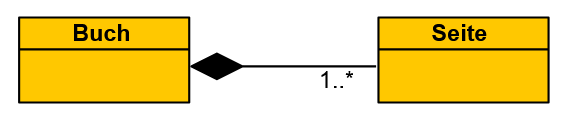

# Software-Engineering

# Table of Contents
- [Software-Engineering](#software-engineering)
- [Table of Contents](#table-of-contents)
- [Einführung](#einführung)
  - [Software](#software)
  - [Software-Engineering](#software-engineering-1)
  - [Modellierung](#modellierung)
  - [Ziele](#ziele)
- [Softwarequalität](#softwarequalität)
  - [DIN ISO 25010](#din-iso-25010)
  - [Qualitätsmaßnahmen](#qualitätsmaßnahmen)
- [Analysephase](#analysephase)
  - [Anforderungen](#anforderungen)
  - [Requirements Engineering](#requirements-engineering)
  - [Anwendungsfälle](#anwendungsfälle)
  - [GUI-Prototypen](#gui-prototypen)
  - [Aktivitätsdiagramme](#aktivitätsdiagramme)
  - [Domain](#domain)
  - [Syntax](#syntax)
- [Designphase](#designphase)
  - [4+1 Sichtenmodell](#41-sichtenmodell)
  - [Kriterien für guten Entwurf](#kriterien-für-guten-entwurf)


# Einführung
## Software
Software umfasst zum Beispiel Tabellenkalkulation oder Grafikbearbeitung und beinhaltet immer Dokumentation und zur Ausführung notwendige Daten. 

**Software-Krise** <br>
Die Programmsysteme der 1960er wurden zunehmendn komplexer und die Entwicklungskosten stiegen. Als Folge scheiterten extrem viele Softwareentwicklungsprojekte - heute werden nur etwa 6% aller Projekte erfolgreich abgeschlossen.

## Software-Engineering
Die Anwendung von Ingenieurs-Methoden zur Erstellung qualitativ hochwertiger Software - folgendes muss bereitgestellt werden.
* Prinzipien (Grundsätze und Regeln)
* Methoden (Art der Durchführung) 
* Werkzeuge (Hilfe bei Entwicklung der Software)

Nicht nur technische Aspekte sind wichtig, insbesondere auch soziale und organisatorische Aspekte - 'Menschen macht Projekte'.

## Modellierung
In den Ingenieursdisziplinen ist das Arbeiten mit Modellen ein fester Bestandteil der Vorgehensweise.

**Partitionierung** <br>
Ein Problemkreis wird schrittweise in kleinere Problemkreise zerlegt, reduziert somit die Komplexität.


<details><summary>Beispiel</summary>
Beispiel zur Partitionierung anhand einer Wetter-App.


</details> <br>

**Abstraktion** <br>
Durch das Weglassen von Detail-Informationen wird der Blick auf wesentliche Aspekte ermöglicht.

**Projektion** <br>
Betrachtung des gleichen Sachverhalts aus unterschiedlichen Perspektiven, ergeben sich aus verschiedener Personengruppen und technischen Aspekten.


## Ziele
Softwareentwicklung erfolgt streng zielorientiert nach wirtschaftlichen Aspekten. 

**Qualität** <br>
Ergibt sich aus der Gesamtheit der Eigenschaften und Merkmale eines Produkts - typischerweise in Lastenheft beschrieben, siehe [Softwarequalität](#softwarequalität).

**Kosten** <br>
Normalerweise sind die Wartungnskosten höher als die Entwicklungskosten. 

| Kostenart | Beschreibung |
| --- | --- |
| Entwicklungskosten | Kosten für Personal und Ausstattung |
| Wartungskosten | Kosten nach Installation des Produkts |
| Fehlerbeseitigung | Kosten für Korrektur von Fehlern |
| Anpassung | Kosten für Anpassung an neue Anforderungen |
| Vertrieb | für den Vertrieb des Produkts |

Die Entwicklungskosten setzen sich z.B. aus der Analyse und dem Entwurf, dem Testen und dem Codieren zusammen.
Die Wartung lässt sich in Verbesserung, Portierung und Fehlerkorrektur unterteilen. <br>
Optimalerweise sinken die Warungskosten mit der Zeit während die Entwicklungskosten steigen.

**Zeit und Termine** <br>
Die Zeit ist ein wichtiger Faktor, da die Kosten mit der Zeit steigen. 


<!-- Ausblick Phasenmodell -->

# Softwarequalität
Die Gesamtheit von Eigenschaften und Merkmalen einer Einheit (das heißt eines Produkts oder einer Tätigkeit) bezüglich ihrer Eignung, festgelegte und vorausgesetzte Erfordernisse zu erfüllen. 

<!-- Qualitätsmodell -->

## DIN ISO 25010


## Qualitätsmaßnahmen
Es ist praktisch nicht möglich, mit vertretbarem Aufwand fehlerfreie Software zu entwickeln.

**Fehler** <br>
Ein Fehler ist die Abweichung eines beobachteten oder gemessenen Wertes, Zustandes oder Verhaltens eines Softwareprodukts von dem spezifizierten oder als richtig Erwarteten.

* Prozessqualität
* Mitarbeitende
* Reife der Technologie
* Qualität der verwendeten Werkzeuge

Viele verschiedene Eunflussfaktoren auf die Qualität von Software. 

**konstruktive Maßnahmen** <br>
Maßnahmen in Bezug auf das Personal, die Organisation oder der Technik - sorgen dafür, dass der Entwicklungsprozess und die Software eine bestimmte Qualität aufweisen.

**analytische Maßnahmen** <br>
Zum Beispiel statische oder dynamische Tests - sind Maßnahmen zur Ermittlung der aktuellen Software-Qualität. Sie bringen per se keine Qualität, führen aber zu weiteren Maßnahmen der Qualitätsverbesserung.


# Analysephase
Die Analysephase ist die erste und eine der wichtigsten Phasen im Gesamtmodell. Fragen zur Funktionalität, den Randbedingungen und den Eigenheiten des Systems werden geklärt.

**Aktivitäten** <br>
* Analyse des Ist-Zustandes 
* Analyse der Machbarkeit (Risiko % Kosten)
* Definition des Systemkontexts
* Bestimmung der Anforderungen

**Ergebnisse** <br>
* Pflichtenheft
* Konzept der Benutzeroberfläche
* Analysemodell

<!-- Planungsphase und Definitionspahse -->

## Anforderungen
Legen fest, was man von einem Softwaresystem als Eigenschaften erwartet.

> Die App muss den aktuellen Standort des Benutzers erkennen und die Wetterdaten für diesen Standort anzeigen.

Generell sind Anforderungen schwer zu ermitteln, da Beteiligte die Anforderungen oft nicht klar formulieren können oder Fachsprache und -wissen fehlt. Auch können die Interessen der einzelnen Beteiligten unterschiedlich sein.

**funktionale Anforderungen** <br>
Definiert eine vom System zu erbringende Funktion. 
* Was tut das System?
* Wie reagierte das System auf Eingaben?

**nicht-funktionale Anforderungen** <br>
Werden auch Qualitätsanforderungen genannt, definieren eine qualitative Eigenschaft, die das System erfüllen muss, zum Beispiel...


**Randbedingungen** <br>
Eine organisatorische oder teschnologische Vorgabe, die Art und Weise einschränkt, wie das System realisiert werden kann. 

> Das System muss bis spätestens September 2024 zur Verfügung stehen.

> Das System soll mit Web-Services realisiert werden. 

## Requirements Engineering
Feststellung aller relevanten Anforderungen an ein Softwaresystem und deren Dokumentation.
* Ermittlung
* Dokumentation
* Prüfung und Abstimmung
* Verwaltung

**Systemkontext** <br>
Teil der Umgebung eines Systems, der für die Definition und das Verständnis der Anforderungen relevant ist.
* Personen und Stakeholder
* Systeme mit Leistungsbezug
* teschnsiche oder organisatorische Prozesse
* Dokumente (Gesetze, Standards, Normen)

<details><summary>Beispiel</summary>


</details> <br>

<!-- 
viel weggelassen 
-->

**Anforderungs-Dokumentation** <br>
...
<!--
NACHHOLEN 7.4
-->

## Anwendungsfälle
Ein Use-Case ist die Beschreibung einer Interaktion zwischen dem Benutzer mit dem System.

<details><summary>Beispiele</summary>


Und ein weiteres Beispiel mit einem Online-Shop. 


Ein letztes Beispiel mit Seminarverwaltung. 


</details> <br>

Im Use-Case-Diagramm sind Akteure (Figuren), Use-Cases (Boxen) und (gerichtete) Assotiationen (Linien und Pfeile) zu sehen. Die ```<<include>>```-Beziehung importiert Abläufe von dem Use-Case, auf den der Pfeil zeigt. Die ```<<extend>>```-Beziehung erweitert den Ablauf des Use-Cases. Einfache Pfeil-Verbindungen zeigen Vererbung an. 

**Dokumentation** <br>
Nicht festgelegt, aber zum Beispiel in einer Tabelle, welche Dinge wie Name, Kurzbeschreibung, Akteure, Auslöser, etc beinhaltet. 

**Include-Beziehung** <br>
Nicht optional, wierd immer importiert.

**Extend-Beziehung** <br>
Ist optional und abhängig von einer Bedingung.

**Sonsitges** <br>
Ein guter Use-Case sollte verstädnlich formuliert werden, ein Diagramm aus ca. 3-15 Cases bestehen - sonst aufteilen. 

**Aufgabe** <br>
Zum Üben ausklappen.

<details><summary>Aufgabe</summary>

In einer Online-Videothek können Kunden Filme ausleihen. Bei der Ausleihe wird das Alter des Kunden mit der FSK-Angabe des Films abgeglichen und gegebenenfalls die Ausleihe des Films verweigert. Die Bezahlung der Ausleihe erfolgt über ein Kontoguthaben (Prepaid), das der Kunde zu jederzeit auffüllen kann. Für die sichere Online-Zahlung bei der Guthabensauffüllung verwendet das System den externen Dienstleister "SuperPay". Administratoren sollen in der Lage sein, aus Kulanz direkt das Guthaben der Kunden zu erhöhen. 

</details>

<details><summary>Lösung</summary>


</details> <br>

## GUI-Prototypen
GUI-Systeme werden in Anwendungs-, Splash-, Unter-, Dialog und Mitteilungsfenster unterteilt. In der Analysephase lassen sich GUIs zum Beispiel planen mit...
* Prototypen
* Mockups
* Skizzen

Mockups (insbesindere Wireframes) sind verbundene Skizzen der GUI, die die Funktionalität und den Aufbau der GUI zeigen. 

## Aktivitätsdiagramme
Stellen Abläufe und Prozesse im System dar, zum Beispiel für die Beschreibung eines Use-Cases.


Das Beispiel zeigt den Ablauf für die Wetter-App beim Starten. Startknoten ist zum Beispiel ein Kreis, eine Entschiedung wird mit einer Raute dargestellt - für genaue Syntax siehe [moodle](https://online-lectures-cs.thi.de/se-ss2021-ki/#/7/7). 

<details><summary>Beispiel</summary>

Beispiel zum Ablauf "Getränk kaufen".


</details> <br>

Für weitere Übungen siehe [moodle](https://online-lectures-cs.thi.de/se-ss2021-ki/#/7/33).

## Domain
Beim Einsatz von Modellen in der Softwareentwicklung ist ein wichtiges Ziel, einen nahtlosen Übergang vom Problem zur Implementierung zu ermöglichen. Durch das "Domain Modelling" kann der Problembereich in der Sprache der Anwender modelliert werden, sodass die analysierten Klassen, Attribute und Methoden in der Implementierung verwendet werden können. Das Domänenmodell stellt dabei eine abstrakte Darstellung des Wissens über den Problembereich dar.


Es ersleichtert die Kommunikation und setzt essenzielles Fachwissen voraus. Im Beispiel wurde die UML-Klassendiagramm-Syntax verwendet.

## Syntax
Ein Klassendiagramm beschreibt eine Menge von Klassen mit ihren Eigenschaften. 


Die Sichtbarkeit von Attributen ist wiefolgt beschrieben. 

| Symbol | Name | Beschreibung |
| --- | --- | --- |
| + | public | öffentlich, für alle Elemente sichtbar |
| - | private | nur für Objekte dieser Klasse sichtbar |
| # | protected | sichtbar nur für Instanzen und Instanzen abgeleiteter Klassen |
| ~ | package | sichtbar für alle Elemente im gleichen Package |

**Wertebereiche** <br>
Ein ```/``` vor einem Attribut bedeutet, dass es sich um ein abgeleitetes Attribut handelt, wie zum Beispiel das Alter aus dem Geburtsdatum. 

```bash
+ getAge(dateOfBirth : Date) : int
```

Die Rückgabetypen von Operationen werden in der Klammer angegeben, ähnlich die Parameter der Operation. 

**abstrakte Klassen** <br>
Abstrakte Klassen können nicht instanziiert werden und werden kursiv geschrieben. 

**Assoziationen** <br>
Assoziationen beschreiben die Beziehungen zwischen Klassen.


**Aggregation** <br>
Eine Aggregation ist eine spezielle Assoziation, bei der ein Objekt aus mehreren anderen Objekten besteht.

<details><summary>Beispiel</summary>



</details> <br>

Aggregation bedeutet, das Teil kann ohne das Ganze existieren (z.B. Person in Team). Dahingegen kann eine Komposition nicht ohne das Ganze existieren (siehe Beispiel oben).

**Generalisierung** <br>
Ist eine Beziehung zwischen einer spezialisierten Klasse und einer allgemeinen Klasse, zum Beispiel sind Dozenten und Studierende beides Personen.


Pfeile zeigen dabei auf die Oberklasse (falsch in Diagramm).

<!-- 
Objektdiagramme 
-->

**Aufgabe** <br>
Zum Üben ausklappen.

<details><summary>Aufgabe</summary>

In einer Online-Videothek können Kunden Filme ausleihen. Bei der Ausleihe wird das Alter des Kunden mit der FSK-Angabe des Films abgeglichen und gegebenenfalls die Ausleihe des Films verweigert. Die Bezahlung der Ausleihe erfolgt über ein Kontoguthaben (Prepaid), das der Kunde zu jederzeit auffüllen kann. 

</details>

<details><summary>Lösung</summary>


</details> <br>

Weitere Aufgaben auf [moodle](https://online-lectures-cs.thi.de/se-ss2021-ki-ref0/#/8/4). 


# Designphase
Softwarearchitektur und –design hilft bei der strukturierten und hierarchischen Anorderung von Systemkomponenten und der Beschreibung der Beziehungen.


**Softwareentwurf** <br>
Das Architekturprinzip der konzeptionellen Integrität (conceptual integrity) ist eingehalten, wenn Entwurfsentscheidungen im gesamten System durchgängig angewendet und Speziallösungen vermieden werden.

**Designphase** <br>
Verfolgt das Ziel, wie und womit die Realisierung erfolgen soll. 

**Architekturentwurf** <br>
Im Kontext der Softwareentwicklung verbindet man mit dem Begriff Architektur sowohl die Softwarearchitektur als auch die Systemarchitektur des Softwareprodukts.

Ziel des Entwurfs sind überschaubare und handhabbare Einheiten und die Festlegung der Lösungsstruktur.sowie die Entwicklung von einem User-Interface-Design.

**Entwurfprozess** <br>
Im Grobentwurf werden die einzelnen Bausteine des Systems und deren Beziehungen zueinander festgelegt. 

Im Feinentwurf werden Detailstrukturen des Systems beschrieben, also wie jeder Baustein in seiner inneren Struktur aufgebaut ist.

## 4+1 Sichtenmodell
Es müssen verschiedene Sichten (sog. Blueprints) auf das Systems zu einer Gesamtarchitektur vereinigt werden.

**logische Sicht** <br>
Fokus liegt auf der Darstellung eines Produktmodells, welches typischerweise um Designpakete erweitert wird. Zielgruppe sind Endanwender und Entwickler.

<details><summary>Details</summary>


Transfer vom Produktmodell zum Implementierungsmodell.

</details> <br>

**Struktursicht** <br>
Fokus der Struktursicht ist die Beschreibung der statischen Struktur der Software in Form von Subsystemen und Komponenten. Die Ergebnisse haben Zwecke wie Requiroemant-Zurodnung, Arbeitsorganisation, Projektfortsschritt, Wiederverwendung, oder Sicherheit - Zielgruppe ist die Entwicklung. 


**physikalische Sicht** <br>
Zuordnung der Softwarekomponenten auf physikalische Hardware und Verteilung der einzelnen Komponenten. Wichtiger Aspekt ist die Sicherstellung der nicht-funktionalen Anforderungen wie Availability, Reliability, Performance oder Scalability.

Zielgruppen der physikalischen Sicht sind die Teams aus den Phasen Entwicklung sowie Wartung/Betrieb.

<details><summary>Details</summary>


Die bei der Modellierung entstehenden Artefakte sind UML-Deployment-Diagramme. Diese können für die Dokumentation der Netzwerkstruktur verwendet werden.

</details> <br>

**Ablaufsicht** <br>
Abbildung des Produktmodells auf ein Verarbeitungsmodell, Zielgruppe ist die Entwicklung und Wartung. 

<details><summary>statische Betrachtung</summary>


Stellt die Ablaufsicht alle an der Verarbeitung beteiligten Klassen dar.

</details> <br>

<details><summary>dynamische Betrachtung</summary>


Verwendung von Sequenzdiagrammen, stellt dynamischen Ablauf dar, in welcher Abfolge welche Klasse wann mit welcher interagiert. Zum Beispiel das Verbinden von Client mit WebServer. 

</details> <br>

**Szenarien** <br>
Eine Instanz eines allgemeinen Use-Cases - ist eine Abstraktion der relevanten Anforderungen. 

## Kriterien für guten Entwurf
Die nachfolgend genannten Kriterien gelten auf allen Ebenen des Entwurfs.

**Korrektheit** <br>
Erfüllung der Anforderungen sowie Sicherstellung der nichtfunktionalen Anforderungen - siehe [Anforderungen](#anforderungen).

**Wiederverwendung** <br>
Gleichartige Aufgaben wolltensollten nicht mehrfach implementiert realisiert werden und zukünftige Weiterentwicklungen sollten berücksichtigt werden.

**Verständlichkeit** <br>
Gute Dokumentation und genauer PRogrammstil mit logischer Struktur.

**Anpassbarkeit** <br>
Einfache Anpassung an neue Anforderungen oder Funktionen. 


<!-- 
https://jojozhuang.github.io/tutorial/mermaid-cheat-sheet/
add images beneath und mabye ### 
https://online-lectures-cs.thi.de/se-ss2021-ki-ref2/#/3/20
-->

**Kohäsion** <br>
Hohe Kohäsion bedeutet, dass die Elemente einer Komponente eng zusammenhängen. 

**Kopplung** <br>
Maß für die Abhängigkeit zwischen Komponenten - geringe Kopplung erleichtert die Wartbarkeit und macht Systeme stabiler.


