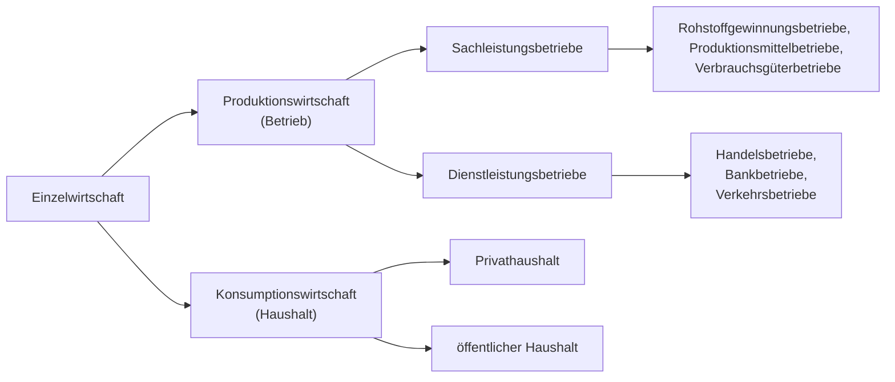

# Grundlagen der Betriebswirtschaft und des Gründertums

## Inhalt
- [Grundlagen der Betriebswirtschaft und des Gründertums](#grundlagen-der-betriebswirtschaft-und-des-gründertums)
  - [Inhalt](#inhalt)
- [Einführung](#einführung)
  - [Was ist BWL?](#was-ist-bwl)
  - [Wirtschaftlichkeitsprinzip](#wirtschaftlichkeitsprinzip)
  - [Betriebstypen](#betriebstypen)
  - [Zielkonzeption](#zielkonzeption)
  - [Fragen](#fragen)

# Einführung
## Was ist BWL?
Einfach gesagt lässt sich folgendes sagen.

> Gegenstand und Erkenntnisobjekt der  Betriebswirtschaftslehre ist das Wirtschaften von Betrieben.

**Wirtschaften**  
Entscheiden über knappe Ressourcen angesichts _unendlicher_ Bedürfnisse.

**Effektivität**  
Zielorientiert handeln (wirtschaften) - die richtigen Dinge tun. 

**Effizienz**  
Handlungsorientiert, ressourcenorientiert tätig sein (wirtschaften). 

**Betriebswirtschaftslehre**  
Lehre vom Wirtschaften der Betriebe. 

**Management**  
Unternehmensführung ist die zielgerichtete Gestaltung und Entwicklung von Unternehmen.

**betriebswirtschaftliche Funktion**  
Produktion, Absatz, Beschaffung, Führung, Organisation, Personalverwaltung.

**Controlling**  
Steuerung, Planung, Informationsversorgung und Kontrollle des Unternehmens. 

**Stakeholder**  
Interessensgruppen, Anspruchsgruppen - alle Subjekte und Grupe, die Ansprüche gegenüber dem Unternehmen haben. 

**Shareholder**  
Anteilseigener des Unternehmens.

<!-- wichtig -->

**strategsich**  
Langfristig (länger als `3-5` Jahre) ausgerichtet.

**operativ**  
Kurzfristig (bis `1` Jahr) ausgerichtet, das Tagesgeschäft betreffend (Umsetzung). 

<!-- wichtig -->

**Corporate Identity**  
Identität eines Unternehmens, inspesondere Corporate Design, Communication, etc. 

**Unternehmensvision**  
Generelle unternehmerische Leitidee. 

**Ziel**  
Zukünftig angestrebter Zustand. 

**Markt**  
Ort, an dem Angebot und Nachfrage aufeinander treffen.

**Input**  
Einsatzfaktor (z.B. Arbeitskraft, Hilfsstoffe, Betriebsstoffe, etc.)

**Output**  
Resultat (z.B. Beratungsleidung, Auto, etc.)

**Kennzahl**  
Maßzahl, die der Quantifizierung dient. 

**qualitative Faktoren**  
Faktoren ohne direkte, monetäre Ausdrucksweise.

**quantitative Faktoren**  
Faktoren die sich direkt ohne Umwege in Geldeinheiten bewerten lassen.

## Wirtschaftlichkeitsprinzip
Unter dem Wirtschaftlichkeitsprinzip versteht man die ökonomische Forderung, die verfügbaren Mittel (Güter, Ressourcen etc.) möglichst effizient und effektiv zu nutzen, um ein bestimmtes Ziel zu erreichen. 

| mengenmäßige Wirtschaftlichkeit | wertmäßige Wirtschaftlichkeit |
| --- | --- |
| _Maximalprinzip_ | _Budgetprinzip_ |
| Ein **maximaler** Ertrag soll durch einen gegebenen Einsatz erzielt werden. | Mit gegebenenem Einsatz soll ein **maimaler**, wertmäßiger Ertrag erzielt werden. |
| _Minimalprinzip_ | _Sparprinzip_ |
| Mit **minimalem** gegebenen Einsatz soll ein bestimmter Ertrag erzielt werden. | Mit gegebenem Ertrag soll ein **minimaler** Einsatz erzielt werden. | 

## Betriebstypen
Verschiedene Betriebstypen, die sich in der Art der Leistungserstellung unterscheiden.

**Unternehmensgröße**  
Anzahl der Beschäftigten, Umsatz, Bilanzsumme, etc. beeinflussen die Art des Unternehmens.

| Unternehmensgröße | Beschäftigte | Umsatz €/y |
| --- | --- | --- |
| Kleinstunternehmen | < 10 | < 1 Mio. |
| Mittelunternehmen | < 500 | < 50 Mio. |
| Großunternehmen | > 500 | > 50 Mio. |

Dies ist die Definition nach IfM-Bonn.

## Zielkonzeption
...
<!-- S. 35 -->

**Gesamtkapitalrentabilität**  
Die GKR ist eine Kennzahl, die die Rentabilität des eingesetzten Kapitals eines Unternehmens misst und wird wie folgt berechnet.

$GKR = \frac{(Gewinn + Fremdkapitalzinsen) \cdot 100\%}{Gesamtkapital}$

> Gesamtkapital = Eigenkapital + Fremdkapital

> Die Summe aus Gewinn und Fremdkapitalzinsen wird auch als Gesamtkapitalverzinsung bezeichnet.

> Die dem Kapitalgeber geschuldeten Fremdkapitalzinsen stellen einen betrieblichen Aufwand da, der den Unternehmergewinn schmälert. 

**Eigenkapitalrentabilität**  
Auch Return-on-Equity (ROE) genannt, ist eine Kennzahl, die die Rentabilität des eingesetzten Eigenkapitals eines Unternehmens misst und wird wie folgt berechnet.

$ROE = \frac{Gewinn \cdot 100\%}{Eigenkapital}$

> Die dem Kapitalgeber geschuldeten Fremdkapitalzinsen werden nicht berücksichtigt.

**Fremdkapitalrentabilität**  
Auch Return-on-Debt (ROD) genannt, ist eine Kennzahl, die die Rentabilität des eingesetzten Fremdkapitals eines Unternehmens misst und wird wie folgt berechnet.

$ROD = \frac{Fremdkapitalzinsen \cdot 100\%}{Fremdkapital}$

> Gibt die durchschnittliche Fremdkapitalverzinsung an.

**Umsatzrentabilität**  
Auch Return-on-Sales (ROS) genannt, ist eine Kennzahl, die die Rentabilität des Umsatzes eines Unternehmens misst und wird wie folgt berechnet.

$ROS = \frac{Gewinn \cdot 100\%}{Umsatzerlös}$

> Stellt das Verhältnis zwischen dem Gewinn eines Unternehmens und seinem Gesamtumsatz dar.

## Fragen
Kontrollfragen zum ersten Kapitel.

**Frage 01**  
In einer Schuhfabrik bestehen drei Fertigungsabteilungen (A, B, C), die verschiedene Schuhmodelle herstellen. Aus den Abteilungen sind folgende Informationen bekannt - bei einem Arbeitstag von 8 Stunden.

| Modell | Stundenlohn | Schuhe/Tag | Verkaufspreis |
| --- | --- | --- | --- |
| A | 25€ | 10 | 50€ |
| B | 30€ | 8 | 75€ |
| C | 35€ | 6 | 125€ |

Wie hoch ist die durchschnittliche Produktivität und Wirtschaftlichkeit der Mitarbeiter in den verschiedenen Abteilungen?

Antwort

**Produktivität**  
Die Produktivität ist gegeben durch $P = \frac{Ausbringungsmenge}{Einsatzmenge}$. 

...

**Wirtschaftlichkeit**  
Die Wirtschaftlichkeit ist gegeben durch $W = \frac{Ertrag}{Aufwand}$.
<!-- geprüft -->

$W_A = \frac{10P \cdot 50€}{25 \frac{€}{h} \cdot 8h} = 2.5$  
$W_B = \frac{8P \cdot 75€}{30 \frac{€}{h} \cdot 8h} = 2.5$  
$W_C = \frac{6P \cdot 125€}{35 \frac{€}{h} \cdot 8h} = 2.67$  

Modell `C` ist am wirtschaftlichsten und alle sind $>1$, somit kein Handlungsbedarf.

  

**Frage 02**  
Angenommen sei ein europaweit tätiger TV-Hersteller mit einem Gewinn von 95 Mio. Euro (10 % mehr als im Vorjahr). Die Eckdaten des Unternehmens sind folgende. 
- Jahresüberschuss vor Steuern: 95 Mio. Euro
- Eigenkapital am 31.12. laut Bilanz: 431 Mio. Euro
- Umsatz: 1.820 Mio. Euro

Ist das Unternehmen damit profitabel

Antwort

...

  

**Frage 03**  
Zur Herstellung von $4$ Kleidungsstücken werden $8m^2$ Material benötigt. Der Einkaufspreis pro $m^2$ Material sei $5€$, der Verkaufspreis je Kleidungsstück sei $20€$. Wie wirkt sich die Produktivitätssteigerung um $25$% am Beispiel des Minimalprinzips aus?

Antwort

...

  

# konstitutive Entscheidungen
Als konstitutive Entscheidungen bezeichnet man Führungsentscheidungen, die für Unternehmen von grundlegender Bedeutung sind und die einmalig (oder selten) getroffen werden.

## Standort
Der Standort eines Unternehmens ist von großer Bedeutung, da er die Wettbewerbsfähigkeit des Unternehmens beeinflusst - Standortfaktoren sind zum Beispiel folgende. 

**Inputorientiert**  
- Gewerbeimmobilien
- Material- & Rohstoffversorgung
- Arbeitskräfte (Angebot, Qualifikation, Kosten)
- Verkehrsanbindung
- Energieversorgung
- Umweltschutz & Entsorgung

**Outputorientiert**  
- Absatzmöglichkeiten
- Konkurrenz im Umfeld

**Abgabenorientiert**  
- Grund-, Gewerbe, Körperschafts & Einkommenssteuer usw.
- weitere Gebühren

Mit der **Nutzenanalyse** kann für jeden Standort ein Faktor ermittelt werden, der die Standortqualität beschreibt.

## Rechtsform
Die Rechtsform bestimmt die rechtlichen Rahmenbedingungen, unter denen das Unternehmen geführt wird. Eine Übersicht privater Rechtsformen ist folgend darstellt.

### Personengesellschaften
...

**Einzelunternehmung**  
...