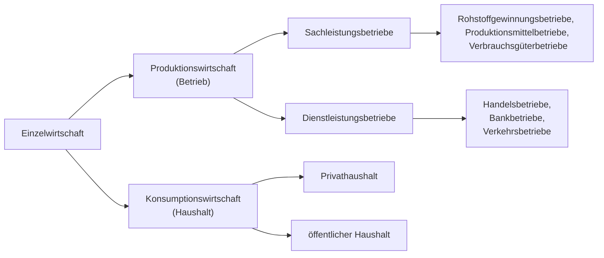

# Grundlagen der Betriebswirtschaft und des Gründertums

## Inhalt
- [Grundlagen der Betriebswirtschaft und des Gründertums](#grundlagen-der-betriebswirtschaft-und-des-gründertums)
  - [Inhalt](#inhalt)
- [Einführung](#einführung)
  - [Was ist BWL?](#was-ist-bwl)
  - [Wirtschaftlichkeitsprinzip](#wirtschaftlichkeitsprinzip)

# Einführung
## Was ist BWL?
Einfach gesagt lässt sich folgendes sagen.

> Gegenstand und Erkenntnisobjekt der  Betriebswirtschaftslehre ist das Wirtschaften von Betrieben.

**Wirtschaften**  
Entscheiden über knappe Ressourcen angesichts _unendlicher_ Bedürfnisse.

**Effektivität**  
Zielorientiert handeln (wirtschaften) - die richtigen Dinge tun. 

**Effizienz**  
Handlungsorientiert, ressourcenorientiert tätig sein (wirtschaften). 

**Betriebswirtschaftslehre**  
Lehre vom Wirtschaften der Betriebe. 

**Management**  
Unternehmensführung ist die zielgerichtete Gestaltung und Entwicklung von Unternehmen.

**betriebswirtschaftliche Funktion**  
Produktion, Absatz, Beschaffung, Führung, Organisation, Personalverwaltung.

**Controlling**  
Steuerung, Planung, Informationsversorgung und Kontrollle des Unternehmens. 

**Stakeholder**  
Interessensgruppen, Anspruchsgruppen - alle Subjekte und Grupe, die Ansprüche gegenüber dem Unternehmen haben. 

**Shareholder**  
Anteilseigener des Unternehmens.

<!-- wichtig -->

**strategsich**  
Langfristig (länger als `3-5` Jahre) ausgerichtet.

**operativ**  
Kurzfristig (bis `1` Jahr) ausgerichtet, das Tagesgeschäft betreffend (Umsetzung). 

<!-- wichtig -->

**Corporate Identity**  
Identität eines Unternehmens, inspesondere Corporate Design, Communication, etc. 

**Unternehmensvision**  
Generelle unternehmerische Leitidee. 

**Ziel**  
Zukünftig angestrebter Zustand. 

**Markt**  
Ort, an dem Angebot und Nachfrage aufeinander treffen.

**Input**  
Einsatzfaktor (z.B. Arbeitskraft, Hilfsstoffe, Betriebsstoffe, etc.)

**Output**  
Resultat (z.B. Beratungsleidung, Auto, etc.)

**Kennzahl**  
Maßzahl, die der Quantifizierung dient. 

**qualitative Faktoren**  
Faktoren ohne direkte, monetäre Ausdrucksweise.

**quantitative Faktoren**  
Faktoren die sich direkt ohne Umwege in Geldeinheiten bewerten lassen.

## Wirtschaftlichkeitsprinzip
Unter dem Wirtschaftlichkeitsprinzip versteht man die ökonomische Forderung, die verfügbaren Mittel (Güter, Ressourcen etc.) möglichst effizient und effektiv zu nutzen, um ein bestimmtes Ziel zu erreichen. 

| mengenmäßige Wirtschaftlichkeit | wertmäßige Wirtschaftlichkeit |
| --- | --- |
| _Maximalprinzip_ | _Budgetprinzip_ |
| Ein **maximaler** Ertrag soll durch einen gegebenen Einsatz erzielt werden. | Mit gegebenenem Einsatz soll ein **maimaler**, wertmäßiger Ertrag erzielt werden. |
| _Minimalprinzip_ | _Sparprinzip_ |
| Mit **minimalem** gegebenen Einsatz soll ein bestimmter Ertrag erzielt werden. | Mit gegebenem Ertrag soll ein **minimaler** Einsatz erzielt werden. | 

## Betriebstypen
Verschiedene Betriebstypen, die sich in der Art der Leistungserstellung unterscheiden.

**Unternehmensgröße**  
Anzahl der Beschäftigten, Umsatz, Bilanzsumme, etc. beeinflussen die Art des Unternehmens.

| Unternehmensgröße | Beschäftigte | Umsatz €/y |
| --- | --- | --- |
| Kleinstunternehmen | < 10 | < 1 Mio. |
| Mittelunternehmen | < 500 | < 50 Mio. |
| Großunternehmen | > 500 | > 50 Mio. |

Dies ist die Definition nach IfM-Bonn.

## Zielkonzeption
...
<!-- S. 35 -->

**Gesamtkapitalrentabilität**  
Die GKR ist eine Kennzahl, die die Rentabilität des eingesetzten Kapitals eines Unternehmens misst und wird wie folgt berechnet.

$GKR = \frac{(Gewinn + Fremdkapitalzinsen) \cdot 100\%}{Gesamtkapital}$

> Gesamtkapital = Eigenkapital + Fremdkapital

> Die Summe aus Gewinn und Fremdkapitalzinsen wird auch als Gesamtkapitalverzinsung bezeichnet.

> Die dem Kapitalgeber geschuldeten Fremdkapitalzinsen stellen einen betrieblichen Aufwand da, der den Unternehmergewinn schmälert. 

**Eigenkapitalrentabilität**  
Auch Return-on-Equity (ROE) genannt, ist eine Kennzahl, die die Rentabilität des eingesetzten Eigenkapitals eines Unternehmens misst und wird wie folgt berechnet.

$ROE = \frac{Gewinn \cdot 100\%}{Eigenkapital}$

> Die dem Kapitalgeber geschuldeten Fremdkapitalzinsen werden nicht berücksichtigt.

**Fremdkapitalrentabilität**  
Auch Return-on-Debt (ROD) genannt, ist eine Kennzahl, die die Rentabilität des eingesetzten Fremdkapitals eines Unternehmens misst und wird wie folgt berechnet.

$ROD = \frac{Fremdkapitalzinsen \cdot 100\%}{Fremdkapital}$

> Gibt die durchschnittliche Fremdkapitalverzinsung an.

**Umsatzrentabilität**  
Auch Return-on-Sales (ROS) genannt, ist eine Kennzahl, die die Rentabilität des Umsatzes eines Unternehmens misst und wird wie folgt berechnet.

$ROS = \frac{Gewinn \cdot 100\%}{Umsatzerlös}$

> Stellt das Verhältnis zwischen dem Gewinn eines Unternehmens und seinem Gesamtumsatz dar.

