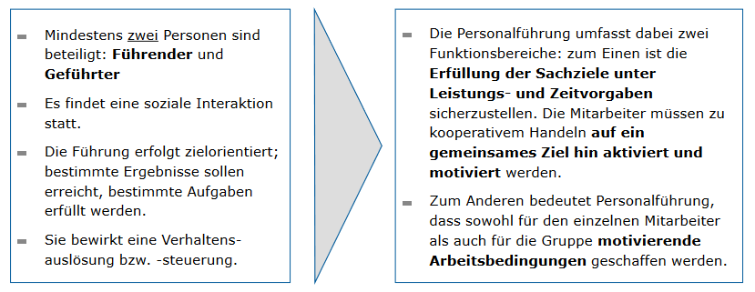
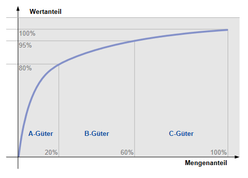
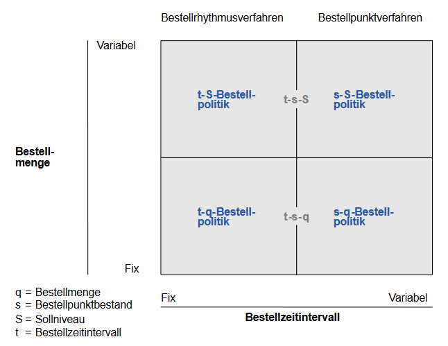

# Grundlagen der Betriebswirtschaft und des Gründertums

## Inhalt
- [Grundlagen der Betriebswirtschaft und des Gründertums](#grundlagen-der-betriebswirtschaft-und-des-gründertums)
  - [Inhalt](#inhalt)
- [Einführung](#einführung)
  - [Was ist BWL?](#was-ist-bwl)
  - [Wirtschaftlichkeitsprinzip](#wirtschaftlichkeitsprinzip)
  - [Betriebstypen](#betriebstypen)
    - [Entscheidung - 3](#entscheidung---3)
    - [Realisation - 4](#realisation---4)
  - [Informationsmanagement](#informationsmanagement)
  - [Personalführung](#personalführung)
  - [Organisation](#organisation)
  - [Fragen](#fragen)
- [Materialwirtschaft \& Produktion](#materialwirtschaft--produktion)
  - [Einkauf und Materialanalyse](#einkauf-und-materialanalyse)
  - [Materialrationalisierung](#materialrationalisierung)
  - [Materialdisposition](#materialdisposition)
    - [Bedarfsplanung](#bedarfsplanung)

<!-- VSC weigert sich, das Inhaltsverzeichnis ganz zu erstellen -->

# Einführung
## Was ist BWL?
Einfach gesagt lässt sich folgendes sagen.

> Gegenstand und Erkenntnisobjekt der  Betriebswirtschaftslehre ist das Wirtschaften von Betrieben.

**Wirtschaften**  
Entscheiden über knappe Ressourcen angesichts _unendlicher_ Bedürfnisse.

**Effektivität**  
Zielorientiert handeln (wirtschaften) - die richtigen Dinge tun. 

**Effizienz**  
Handlungsorientiert, ressourcenorientiert tätig sein (wirtschaften). 

**Betriebswirtschaftslehre**  
Lehre vom Wirtschaften der Betriebe. 

**Management**  
Unternehmensführung ist die zielgerichtete Gestaltung und Entwicklung von Unternehmen.

**betriebswirtschaftliche Funktion**  
Produktion, Absatz, Beschaffung, Führung, Organisation, Personalverwaltung.

**Controlling**  
Steuerung, Planung, Informationsversorgung und Kontrollle des Unternehmens. 

**Stakeholder**  
Interessensgruppen, Anspruchsgruppen - alle Subjekte und Grupe, die Ansprüche gegenüber dem Unternehmen haben. 

**Shareholder**  
Anteilseigener des Unternehmens.

<!-- wichtig -->

**strategsich**  
Langfristig (länger als `3-5` Jahre) ausgerichtet.

**operativ**  
Kurzfristig (bis `1` Jahr) ausgerichtet, das Tagesgeschäft betreffend (Umsetzung). 

<!-- wichtig -->

**Corporate Identity**  
Identität eines Unternehmens, inspesondere Corporate Design, Communication, etc. 

**Unternehmensvision**  
Generelle unternehmerische Leitidee. 

**Ziel**  
Zukünftig angestrebter Zustand. 

**Markt**  
Ort, an dem Angebot und Nachfrage aufeinander treffen.

**Input**  
Einsatzfaktor (z.B. Arbeitskraft, Hilfsstoffe, Betriebsstoffe, etc.)

**Output**  
Resultat (z.B. Beratungsleidung, Auto, etc.)

**Kennzahl**  
Maßzahl, die der Quantifizierung dient. 

**qualitative Faktoren**  
Faktoren ohne direkte, monetäre Ausdrucksweise.

**quantitative Faktoren**  
Faktoren die sich direkt ohne Umwege in Geldeinheiten bewerten lassen.

## Wirtschaftlichkeitsprinzip
Unter dem Wirtschaftlichkeitsprinzip versteht man die ökonomische Forderung, die verfügbaren Mittel (Güter, Ressourcen etc.) möglichst effizient und effektiv zu nutzen, um ein bestimmtes Ziel zu erreichen. 

| mengenmäßige Wirtschaftlichkeit | wertmäßige Wirtschaftlichkeit |
| --- | --- |
| _Maximalprinzip_ | _Budgetprinzip_ |
| Ein **maximaler** Ertrag soll durch einen gegebenen Einsatz erzielt werden. | Mit gegebenenem Einsatz soll ein **maimaler**, wertmäßiger Ertrag erzielt werden. |
| _Minimalprinzip_ | _Sparprinzip_ |
| Mit **minimalem** gegebenen Einsatz soll ein bestimmter Ertrag erzielt werden. | Mit gegebenem Ertrag soll ein **minimaler** Einsatz erzielt werden. | 

## Betriebstypen
Verschiedene Betriebstypen, die sich in der Art der Leistungserstellung unterscheiden.

**Unternehmensgröße**  
Anzahl der Beschäftigten, Umsatz, Bilanzsumme, etc. beeinflussen die Art des Unternehmens.

| Unternehmensgröße | Beschäftigte | Umsatz €/y |
| --- | --- | --- |
| Kleinstunternehmen | < 10 | < 1 Mio. |
| Mittelunternehmen | < 500 | < 50 Mio. |
| Großunternehmen | > 500 | > 50 Mio. |

Dies ist die Definition nach IfM-Bonn.

## Zielkonzeption
...
<!-- S. 35 -->

**Gesamtkapitalrentabilität**  
Die GKR ist eine Kennzahl, die die Rentabilität des eingesetzten Kapitals eines Unternehmens misst und wird wie folgt berechnet.

$GKR = \frac{(Gewinn + Fremdkapitalzinsen) \cdot 100\%}{Gesamtkapital}$

> Gesamtkapital = Eigenkapital + Fremdkapital

> Die Summe aus Gewinn und Fremdkapitalzinsen wird auch als Gesamtkapitalverzinsung bezeichnet.

> Die dem Kapitalgeber geschuldeten Fremdkapitalzinsen stellen einen betrieblichen Aufwand da, der den Unternehmergewinn schmälert. 

**Eigenkapitalrentabilität**  
Auch Return-on-Equity (ROE) genannt, ist eine Kennzahl, die die Rentabilität des eingesetzten Eigenkapitals eines Unternehmens misst und wird wie folgt berechnet.

$ROE = \frac{Gewinn \cdot 100\%}{Eigenkapital}$

> Die dem Kapitalgeber geschuldeten Fremdkapitalzinsen werden nicht berücksichtigt.

**Fremdkapitalrentabilität**  
Auch Return-on-Debt (ROD) genannt, ist eine Kennzahl, die die Rentabilität des eingesetzten Fremdkapitals eines Unternehmens misst und wird wie folgt berechnet.

$ROD = \frac{Fremdkapitalzinsen \cdot 100\%}{Fremdkapital}$

> Gibt die durchschnittliche Fremdkapitalverzinsung an.

**Umsatzrentabilität**  
Auch Return-on-Sales (ROS) genannt, ist eine Kennzahl, die die Rentabilität des Umsatzes eines Unternehmens misst und wird wie folgt berechnet.

$ROS = \frac{Gewinn \cdot 100\%}{Umsatzerlös}$

> Stellt das Verhältnis zwischen dem Gewinn eines Unternehmens und seinem Gesamtumsatz dar.

## Fragen
Kontrollfragen zum ersten Kapitel.

**Frage 01**  
In einer Schuhfabrik bestehen drei Fertigungsabteilungen (A, B, C), die verschiedene Schuhmodelle herstellen. Aus den Abteilungen sind folgende Informationen bekannt - bei einem Arbeitstag von 8 Stunden.

| Modell | Stundenlohn | Schuhe/Tag | Verkaufspreis |
| --- | --- | --- | --- |
| A | 25€ | 10 | 50€ |
| B | 30€ | 8 | 75€ |
| C | 35€ | 6 | 125€ |

Wie hoch ist die durchschnittliche Produktivität und Wirtschaftlichkeit der Mitarbeiter in den verschiedenen Abteilungen?

Antwort

**Produktivität**  
Die Produktivität ist gegeben durch $P = \frac{Ausbringungsmenge}{Einsatzmenge}$. 

...

**Wirtschaftlichkeit**  
Die Wirtschaftlichkeit ist gegeben durch $W = \frac{Ertrag}{Aufwand}$.
<!-- geprüft -->

$W_A = \frac{10P \cdot 50€}{25 \frac{€}{h} \cdot 8h} = 2.5$  
$W_B = \frac{8P \cdot 75€}{30 \frac{€}{h} \cdot 8h} = 2.5$  
$W_C = \frac{6P \cdot 125€}{35 \frac{€}{h} \cdot 8h} = 2.67$  

Modell `C` ist am wirtschaftlichsten und alle sind $>1$, somit kein Handlungsbedarf.

  

**Frage 02**  
Angenommen sei ein europaweit tätiger TV-Hersteller mit einem Gewinn von 95 Mio. Euro (10 % mehr als im Vorjahr). Die Eckdaten des Unternehmens sind folgende. 
- Jahresüberschuss vor Steuern: 95 Mio. Euro
- Eigenkapital am 31.12. laut Bilanz: 431 Mio. Euro
- Umsatz: 1.820 Mio. Euro

Ist das Unternehmen damit profitabel

Antwort

...

  

**Frage 03**  
Zur Herstellung von $4$ Kleidungsstücken werden $8m^2$ Material benötigt. Der Einkaufspreis pro $m^2$ Material sei $5€$, der Verkaufspreis je Kleidungsstück sei $20€$. Wie wirkt sich die Produktivitätssteigerung um $25$% am Beispiel des Minimalprinzips aus?

Antwort

...

  

# konstitutive Entscheidungen
Als konstitutive Entscheidungen bezeichnet man Führungsentscheidungen, die für Unternehmen von grundlegender Bedeutung sind und die einmalig (oder selten) getroffen werden.

## Standort
Der Standort eines Unternehmens ist von großer Bedeutung, da er die Wettbewerbsfähigkeit des Unternehmens beeinflusst - Standortfaktoren sind zum Beispiel folgende. 

**Inputorientiert**  
- Gewerbeimmobilien
- Material- & Rohstoffversorgung
- Arbeitskräfte (Angebot, Qualifikation, Kosten)
- Verkehrsanbindung
- Energieversorgung
- Umweltschutz & Entsorgung

**Outputorientiert**  
- Absatzmöglichkeiten
- Konkurrenz im Umfeld

**Abgabenorientiert**  
- Grund-, Gewerbe, Körperschafts & Einkommenssteuer usw.
- weitere Gebühren

Mit der **Nutzenanalyse** kann für jeden Standort ein Faktor ermittelt werden, der die Standortqualität beschreibt.

## Rechtsform
Die Rechtsform bestimmt die rechtlichen Rahmenbedingungen, unter denen das Unternehmen geführt wird. Eine Übersicht privater Rechtsformen ist folgend darstellt.

### Personengesellschaften
...

<!-- as table -->

|   | Gründung | Haftung | Gewinne | Sonstiges |
| --- | --- | --- | --- | --- |
| Einzelunternehmung | • einfach und formlos   • Firnemname enthält den Vor- und Nachnamen des Inhabers | • mindestens ein Gesellschafter haftet **persönlich** und **unbeschränkt** mit seinem eigenen Vermögen   • alleiniger Eigentümer trägt das gesamte Risiko | • Einzelunternehmer kann frei über die Gewinne verfügen   • Gewinne unterliegen nur der **Einkommenssteuer** |  |
| Gesellschaft bürgerlichen Rechts (`GbR`) | • durch Abschluss eines **Gesellschaftsvertrages**   • es werden **mindestens 2** Gesellschafter benötigt   • kann nicht in das Handelsregister eingetragen werden | • alle Gesellschafter **haften unbeschränkt** für Schulden, etc.   Führung erfolgt **gemeinsam** | • Vermögen gilt als **gemeinsames Vermögen** der Gesellschafter   • Gewinn- & Verlustberechnung erfolgt nach Köpfen | • endet mit Erreichen des beabsichtigten Zwecks |
| Offene Handeslgesellschaft (`OHG`) | • auch mit **Gesellschaftsvertrag** mit $>1$ Personen   • Firma und Namen **müssen** im **Handeslregister** eingetragen werden | • Gesellschafter haften **solidarisch** mit ihrem **gesamten Vermögen direkt** und **unbeschränkt**   • jeder Gesellschafter ist allein **vertretungs- und geschäftsführungsberechtigt** | • **Eigenkapitalerhöhung** ist durch Kapitaleinlagen möglich   • keine Körperschaftssteuer   • Gewinnausschüttung an Gesellschafter **$\ge 4%$ der Einlage** | • kann **klagen** und **verklagt** werden |
| Kommanditgesellschaft (`KG`) | | | | |
| Stille Gesellschaft | • **natürliche** sowie **juristische** Person   • wird **nicht** in das **Handelsregister** eingetragen | • **keine** Haftung mit der Einlage   • ist grundsätzlich **von der Geschäftsführung** und Vertretung **ausgeschlossen** | • Vermögenseinlage kann als **Kapital** oder **Wirtschaftsgüter** geleistet werden   • wird außerhaltb des Verhältnisses **nicht bekannt** | • Beteiligung mit einer Vermögenseinlage an einem Unternehmen |
| Partnerschaftsgesellschaft (`PartG`) | • **schriftliche** Gründung | | | • zum Beispiel Rechtsantälte, Ärzte oder Psychologen in gemeinsamen Verbund |

<!--
Zusammenfassugn in Tabelle auf S. 40
https://moodle.thi.de/pluginfile.php/700953/mod_resource/content/3/BWLG_Kapitel2_Konstitutive%20Entscheidungen.pdf
-->

### Kapitalgesellschaften
Bei der Gründung bestehen grundsätzlich bestimmte Formvorschriften (z. B. notar. Beurkundung, Regelung der Satzung). Die Gesellschaften unterliegen, da sie als juristische Person gelten, der Einkommen- und der Körperschaftsteuer.

**Haftung**  
Besonders bei den Kapitalgesellschaften ist die Haftung, welche hier **begrenzt** ist. 

**Dauer**  
Das Unternehmen existiert **unbefristet** und **unabhängig** von der Existenz der Gesellschafter - ein Wechsel dieser ist auch möglich. 

**persönlicher Kontakt**  
Führung durch angestellte Geschäftsführer, die nicht Gesellschafter sein müssen - abgestimmt wird nach **Höhe der Kapitalanteile**.

#### Gesellschaft mit beschränkter Haftung (`GmbH`)
Die `GmbH` ist eine der bekanntesten Rechtsformen und wird häufig von mittelständischen Unternehmen gewählt.

**Gründung**  
- Errichtung erfolgt furch eine oder mehrere Personen mit Abschluss eines **Gesellschaftsvertrages**, die notariell beurkundet werden muss - muss folgende Mindestbestimmungen enthalten.
  - **Firma** und **Sitz** der Gesellschaft
  - **Gegenstand** des Unternehmung (z.B. Eisenbahunternehmen)
  - Höhe des Stammkapitals
- Änderungen können nur mit einer **Mehrheit** von `75%` der Geseelschafter vorgenommen werden.
- Entsteht mit einer Eintragung in das **Handelsregister**.
- **Stammkapital** von mindestens `25.000€` muss vorhanden sein, jede einzelne Stammeinlage mind. `100€`.
- **Mindesteinzahlung** beträgt `25%` der Stammeinlage.
- Zwischen Gründung und Eintragung besteht bereits eine `GmbH i.G.` mit beschränkter Haftung. 

**Haftung**  
- Für die Verbindlichkeit der Gesellschaft haftet nur das **Geschäftsvermögen**.
- Mindesteins ein **Geschäftsführender** notwendig, der die Gesellschaft nach außen vertritt.
  - stellt **Jahresabschluss** fest
  - ... <!-- S. 44 -->

**Gewinne**  
- Die GmbH unterliegt der Körperschaftsteuerpflicht auf das Einkommen (Gewinn) der juristischen Person.

**Auflösung**  
- Ablauf der vereinbarten **Vertragsdauer**
- **Gesellschafterbeschluss** mit `75%` Mehrheit
- gerichtliches Urteil
- Eröffnung des **Konkurses**

#### Aktiengesellschaft (`AG`)
Die `AG` ist eine Kapitalgesellschaft, an der sich Eigenkapitalgeber durch den Erwerb von Aktien beteiligen können - zum Beispiel die DB Fernverkehr AG.

**Gründung**  
- Es reicht eine Person die den **Gesellschaftsvertrag** aufsetzt und die ersten Aktien übernimmt.
- Der Vertrag muss notariell beurkundet werden udn folgende Mindestbestimmungen enthalten.
  - **Firma**, **Sitz** und **Gegenstand** der Unternehmung
  - Höhe des **Grundkapitals**
  - Stückelung des **Aktienkapitals**
  - **Fungibilität** der Aktien
  - **Anzahl** der **Vorstandsmitglieder**
- Das **Grundkapital** muss mindestens `50.000€` betragen. 
- Erster **Aufsichtsrat** wird von Gründer bestimmt. 

**Organe**  
Siehe [Foliensatz](https://moodle.thi.de/pluginfile.php/700953/mod_resource/content/3/BWLG_Kapitel2_Konstitutive%20Entscheidungen.pdf) S. 52. 

**Vorstand**  
Der Vorstand besteht aus einer oder mehreren **natürlichen Personen**, welche **$max 5y$** bestellt werden können. Die Hauptaufgaben des Vorstands...

- **Leitet** die Gesellschaft
- **Berichterstattung** an den Aufsichtsrat
- Bekanntmachung des **Jahresabschlusses**
- Einberufung der **Hauptversammlung**

**Aufsichtsrat**  
Wird je nach **Mitbestimmungsgesetz** von der Hauptversammlulng für **$max 4y$** gewählt. Aufgaben beinhalten die Bestellung und Abberufung von Vorstandsmitgliedern, die Höchstzahl der Aufsichtsratsmitglieder ist an das **Grundkapital** gebunden.

| | |
| --- | --- |
| bis 1.5 Mio. € | 9 |
| bis 10 Mio. € | 15 |
| über 10 Mio. € | 21 |

SIEMENS hat zum Beispiel 20 Aufsichtsratsmitglieder.

**Hauptversammlung**  
Das **oberste Organ** der AG, welche folgende Aufgaben übernimmt. 

- **Wahl** des Aufsichtsrats
- **Entlastung** von Vorstand und Aufsichtsrat
- Satzungsänderungen
- Beschlüsse über wesentliche Kapitalveränderungsmaßnahmen
- Bestellung von **Prüfern**

In de rRegel wird in der Hauptversammlung nach dem **Mehrhetsprinzip** abgestimmt.- in der Regel einmal im Kahr durch den Vortsand einberufen.

#### Vergleich 

|  | GmbH | AG |
| --- | --- | --- |
| Gründung | • Sachgründungsbericht   • mind. 1 Gründer | • Gründungsprüfung   • mind. 1 Gründer |
| Firma | • Personen-, Sach- oder gemischte Firma möglich, Szusatz `GmbH` | • bei Neugründung nur noch Sachfirma möglich, Zusatz `AG` |
| Leitung | • Geschäftsführer **ohne** Zeitbeschränkung | • Vorstand **max.** 5 Jahre |  
| Aufsichtsrat | • nach dem BetrVG nur, wen nmehr als `500` Arbeitnehmer   • nach dem MitbestG mehr als `2000` Arbeitnehmer   | • durch das AktG zwingend vorgeschrieben |
| Gesamtheit der   Gesellschafter | • Gesellschafterversammlung   • Stimmrecht nach Geschäftsanteilen | • Hauptversammlung   • Stimmrecht nach Aktienbesitz |
| Mindestkapital | • Stammkapital mind. `25.000€` | • Grundkapital mind. `50.000€` |
| Anteil | • Stammeinlage (mind. `100€`) | • Aktie (mind. `1€`) |
| Nachschlusspflicht | • kann im Gesellschaftsvertrag vorgesehen werden | • nicht möglich |

<!-- bei Anteil fehlen paar Punkte -->

Vergleich aller Formen im [Foliensatz](https://moodle.thi.de/pluginfile.php/700953/mod_resource/content/3/BWLG_Kapitel2_Konstitutive%20Entscheidungen.pdf) auf S. 65.

#### Sonderformen
Mit der `SE` - der Europäischen Gesellschaft - können Unternehmen mit Sitz in der EU gegründet werden.

### Mischformen
Verschiedene Rechtsformen können auch kombiniert werden, zum Beispiel die `GmbH & Co. KG`.

**GmbH & Co. KG**  
Die `GmbH & Co. KG` ist eine **Personengesellschaft**, bei der die **Komplementäre** eine `GmbH` ist. Die `GmbH` ist somit **persönlich haftender Gesellschafter** und die **Kommanditisten** sind **beschränkt haftende Gesellschafter**.

## Zusammenarbeit
Als letzen Punkt ist  noch die Zusammenarbeit - beispielsweise eine Genossenschaft - wichtig.

### Kooperation
Hierbei bleibt die Selbstständigkeit der Unternehmen **erhalten**, es wird nur eine **freiwillige Zusammenarbeit** vereinbart.

- Die **wirtschaftliche** Entscheidungsfreiheit wird in den vertraglichen Beziehungen eingeschränkt.
- Zusammenarbeit entsteht durch Abstimmung oder *Ausgliederung** von **Funktionen**.

Eine Zusammenführung geschieht oft zur Steigerung der **Wettbewerbsfähigkeit**.

### Konzentration
Bei der Konzentration wird die Selbstständigkeit mindestens eines Teils der Unternehmen **aufgehoben**.

- Die beteiligten Unternehmen **geben** dabei ihre **wirtschaftliche Selbstständigkeit** auf.
- Geben die Unternehmen neben der wirtschaftlichen auch ihre **rechtliche** Selbstständigkeit auf, so spricht man von einer **Fusion**.

Es gibt Fusionskontrolle oder das Gesetzt gegen Wettbewerbsbeschränkungen (GWB) - zur Verhinderung von **Monopolen**.

> Bei einer Verschmelzung (`Fusioin`) durch Neubildung wird ein neues Unternehmen (AG) gegründet, auf welches das Vermögen der sich vereinigenden Gesellschaften als Ganzes übertragen wird. Die bisherigen Aktionäre tauschen ihre Aktien gegen Aktien der neuen Gesellschaft ein

## Fragen
Kontrollfragen zum zweiten Kapitel.

**Frage 01**  
Zu welcher Kategorie an Standortfaktoren zählt der Faktor „Arbeitskräfte“? Welche Kosten können für den Faktor Arbeitskräfte entstehen? Welchen Einfluss hat der Freizeitwert eines Standorts auf die Lohnkosten?

Antwort

...

  

**Frage 02**  
Sie wollen mit zwei weiteren Geschäftspartnern ein Unternehmen gründen, das sich mit der Herstellung und dem Vertrieb von Lebensmitteln beschäftigt. Sie alle sind insgesamt bereit, 10.000€ ins Unternehmen einzubringen. Nennen Sie drei Rechtsformen, die in dieser Konstellation nicht gewählt werden könnten.

Antwort

...

  

**Frage 03**  
Bei welchen der Rechtsformen sind alle Gesellschafter leitungsbefugt?  
`KG`, `GmbH`, `OHG`, `GbR`, `AG`

Antwort

- [ ] KG
- [ ] GmbH
- [x] OHG
- [x] GbR
- [ ] AG

> Antworten nicht geprüft.

  

Bei welchen der Rechtsformen sind mindestens zwei Gründer vorgeschrben?  
`GmbH`, `AG`, `OHG`, `KG`, `Einzelunternehmen`

Antwort

- [ ] GmbH
- [ ] AG
- [x] OHG
- [x] KG
- [ ] Einzelunternehmen

> Antworten nicht geprüft.

  

**weitere Fragen**  
Einige weitere Fragen zum zweiten Thema. 

ausklappen

> Wie werden konstitutive Entscheidungen definiert, und wo stehen sie in der betrieblichen Entscheidungshierarchie?
 
> Nach welchen Verfahren lässt sich eine betriebliche Standortwahl vornehmen? Nennen Sie jeweils zwei Beispiele!
 
> Wie wird eine Nutzwertanalyse bei der Bestimmung der optimalen Standortwahl erstellt?
 
> Was unterscheidet die Personengesellschaft von der Kapitalgesellschaft?
 
> Welche Kaufmann-Formen gibt es?
 
> Ihr Freund ist Arzt und möchte mit einem Kollegen eine Praxisgemeinschaft eröffnen. Zu welcher Rechtsform raten Sie ihm? Was ist bezüglich Haftung und Vertretung nach außen zu beachten?
 
> Was sind die Organe einer Aktiengesellschaft? Nennen Sie jeweils zwei Aufgaben jedes Organs
 
> Nennen und erläutern Sie drei Kriterien, wodurch sich Aktiengesellschaft und GmbH unterscheiden
 
> Wodurch kann die Wahl der Rechtsform eingeschränkt werden? Nennen Sie Beispiele für die einzelnen Einschränkungen!
 
> Welche Ziele werden mit Unternehmenszusammenschlüssen verfolgt?
 
> In der Industrie erfolgen häufig diagonale Zusammenschlüsse. Welche Motive werden damit verfolgt?

  

# Unternehmensführung
Unter der Unternehmensführung versteht man die zielgerichtete Gestaltung und Entwicklung von Unternehmen.

## Führungsfunktionen

Der idealtypische Ablauf der Unternehmensführung sieht wiefolgt aus. 

1. Analyse der Ausgangslage
2. Leitbild
3. Formulierung der Unternehmenspolitik
4. Implementierung der Politik
5. Evaluierung der Resultate

### Zielsetzung - 1
**Formalziele**  
- Produktivität
- Wirtschaftlichkeit
- Rentabilität und Gewinn

**Sachziele**  
- Leistungsziele
- Finanzziele
- Führungs- und Organisationsziele
- soziale und ökologische Ziele

Zielsuche - Zielformulierung - Zielabstimmung - Zielverbindlichkeit  
Formuliert nach `SMART`!

### Planung - 2 

| Planung | Eigenschaften |
| ------- | ------------- |
| strategisch | • langfristig (`5.10y`)   • Produktionsprogrammplanung   • oberste Führungsebene |
| taktische | • mittelfristig (`1-4y`)   • unterteilt strategische Planung in **Teilbereiche** |
| operativ | • kurzfristig (`<1y`)   • detaillierte Planung   • **mittlere** und **untere** Führungsebene |
| rollierend | • ursprüngliche Planung wird **revidiert** und **ergänzt** |
| Blockplanung | • Neuplanung am Ende der ursprünglichen Planung |
| retrograde Planung | • **top-down** Planung   • von oben nach unten mit Teilplänen |
| progressive Planung | • **bottom-up** Planung   • von unten nach oben mit Teilplänen |
| Gegenstromverfahren | • Kombination aus retrograder und progressiver Planung   • **vorläufiger** Plan von oben nach unten |

Kann auch gut in funktionale Gesichtspunkte unterteilt werden.

### Entscheidung - 3
Hier wird generell in drei Arten von Entscheidungen unterschieden.

**Entscheidung bei Sicherheit**  
Eine Maßnahme führt zu einem **eindeutig** bestimmten Ergebnis - es tritt zu `100%` ein.

**Entscheidung bei Risiko**  
Eine Maßnahme führt zu einem **wahrscheinlichen** Ergebnis - es tritt mit einer **bestimmten** Wahrscheinlichkeit ein - es liegt eine Wahrscheinlichkeitsverteilung vor.

**Entscheidung bei Ungewissheit**  
Eine Maßnahme führt zu einem **unbestimmten** Ergebnis - es tritt mit einer **unbestimmten** Wahrscheinlichkeit ein - es können keine Eintreffwahrscheinlichkeiten zugewiesen werden.

Mehr hierzu und Formeln auf S. 21 im [Foliensatz](https://moodle.thi.de/pluginfile.php/705225/mod_resource/content/7/BWLG_Kapitel3_Unternehmensf%C3%BChrung%20Entscheidung%20und%20Organisation.pdf). 

<!-- Aufgaben rechnen -->

**Beispiel**  
In einer Quizshow ist man ahnungslos, alle `4` Antworten sind mit einer Wahrscheinlichkeit von `25%` richtig - es geht um `125.000€`. Bei falscher Antwort fällt man auf `500€` zurück.

| | richtig | falsch |
| --- | --- | --- |
| zocken | `125.000€` | `500€` |
| aufhören | `64.000€` | `--` |

$E(Zocken) = 0.25 \cdot 125.000€ + 0.75 \cdot 500€ = 31.250€$  
$E(Aufhören) = 0.25 \cdot 64.000€ = 16.000€$

Nun fallen zwei Antworten weg, es bleiben `2` Antworten übrig - die Wahrscheinlichkeit steigt auf `50%`.

$E(Zocken) = 0.5 \cdot 125.000€ + 0.5 \cdot 500€ = 62.500€$  
$E(Aufhören) = 0.5 \cdot 64.000€ = 32.000€$

> Beispiel noch nicht geprüft.

<!--
Risikoneutral, Risikoavers, Risikofreudig
Beispiel auf S. 34
-->

### Realisation - 4
Die Realisation ist die Umsetzung der Entscheidung in die Praxis - hierbei ist die **Kontrolle** ein wichtiger Bestandteil.

## Informationsmanagement
Leitungshandeln in Bezug auf Information udn Kommunikation - hat die Aufgabe, den Produktionsfaktor _Information_ zu beschaffen.

- Ausgleich von Informationsnachfrage und -angebot
- Versorgung Entscheidungsträger mit Informationen
- Sicherung einer hohen Informationsqualität

## Personalführung
Ein kommunikativer Prozess der Einflussnahme auf die Mitarbeiter zur Erreichung der Unternehmensziele.

**autoritärer Führungsstil**  
Entscheidungen werden **ohne** Beteiligung der Mitarbeiter getroffen - diese haben mit den Entscheidungen zu leben.

**kooperativer Führungsstil**  
Trennung von Entscheidung, Ausführung und Kontrolle **gemildert** - durch **Delegation** werden die Entscheidungen auf die richtige Ebene gebracht.

**Laissz-faire Führungsstil**  
iele, Entscheidungen, Kontrolle, Interaktionsbeziehungen und Arbeitsorganisation bestimmen die Mitarbeitenden **weitgehend selbst**. Es wird auf Anweisungen von oben **verzichtet**.

<!-- 
**patriachalischer Führungsstil**  

kürzere Zusammenfassungen
-->

## Organisation
Die Organisation ist die **Gestaltung** und **Entwicklung** der Aufbau- und Ablauforganisation eines Unternehmens.

**Einliniensystem**  
Jeder Mitarbeitende ist nur einem Vorgesetzten unterstellt - graphisch also ein **Baum**.

| Vorteile | Nachteile |
| -------- | --------- |
| relativ einfach | fehlende Dynamik |
| eindeutige Verhältnisse | lange Entscheidungswege |
| klare Kompetenzen | unflexibel |
| genauer Instanzenweg |  | 

**Mehrliniensystem**  
Jeder Mitarbeitende ist mehreren Vorgesetzten unterstellt - graphisch also ein **Netz**.

| Vorteile | Nachteile |
| -------- | --------- |
| Spezialisierung von Führungskräften   kann genutzt werden |gefahr von Überschneidung | 
| kein lästiger Instanzenweg | mehrere Vorgesetzte können belastend sein |
| schnelle Entscheidungen | eventuell Aufgabenüberschneidung |

**Stabliniensystem**  
Kombination aus Ein- und Mehrliniensystem - unterteilt in z.B. Produktion und Verwaltung, ausgehend der Stabstelle. 

| Vorteile | Nachteile |
| -------- | --------- |
| einheitlicher Instantzenweg | Konfliktgefahr durch Trennung |
| Spezialisten für sachliche Probleme | Demotivation des Stabes durch   fehlende Entscheidungsbefugnis |
| Stäbe entlasten die Instanzen | hohe Zusammenarbeit erforderlich |
| klare Zuständigkeiten | |

**Spartenorganisation**  
Aufteilung nach Produkten, Regionen oder Kundengruppen - die Sparten sind weitgehend selbstständig.

| Vorteile | Nachteile |
| -------- | --------- |
| Motivation der Sparten(leiter)   durch hohes Verantwortungsgefühl | Sparten können gegeneinandern arbeiten |
| übersichtlich | Koordinationsprobleme |
|  | viele Führungskräfte |

**Matrixorganisation**  
Kombination aus Ein- und Mehrliniensystem - unterteilt Aufgaben in Zeilen  (z.B. Produkt A) und Spalten (z.B. Personalwesen).

| Vorteile | Nachteile |
| -------- | --------- |
| hohe Beteiligung der Mitarbeitenden | Konflikte | 
| Spezialisierungen | unklare Verhältnisse |
| Entlastung der Leitungsspitze | hoher Koordinationsaufwand |
| flache Hierarchie |  |

## Fragen 
<!-- 
https://moodle.thi.de/pluginfile.php/706897/mod_resource/content/2/BWLG_Kapitel3-Aufgaben und Kontrollfragen.pdf

Aufgabe 2!
-->

# Materialwirtschaft & Produktion
Die Materialwirtschaft ist ein Teilbereich der Unternehmensführung und befasst sich mit der Beschaffung, Lagerung und Bereitstellung von Materialien.

## Einkauf und Materialanalyse
Unter einem strategischem Einkaufsportfolio versteht man die **Analyse** und **Bewertung** der Materialien.

**ABC-Analyse**  
Methode zur Klassifizierung von Materialien nach ihrer **Wichtigkeit** - es wird zwischen `A`, `B` und `C` Materialien unterschieden.

| | |
| --- | --- |
| `A` | • eingehende Bestellvorbereitung   • aufwendige Disposition   • Kostenanalyse |
| `B` | • zwischen `A` und `C` |
| `C` | • Sammelbestellungen   • einfaches Bestellen   • einfache Lagerhaltung |

Graph

  

**XYZ-Analyse**  
Methode zur Klassifizierung von Materialien nach ihrer **Verfügbarkeit** - es wird zwischen `X`, `Y` und `Z` Materialien unterschieden.

| | |
| --- | --- |
| `X` | • regelmäßiger, Bedarfsverlauf   gute Prognose möglich |
| `Y` | • trendmäßig steigend oder fallender Bedarfsverlauf   • **saisonale** Schwankungen |
| `Z` | • unregelmäßiger Bedarfsverlauf oder **zufällige** Bedarfsentwicklung   • schlechte Prognose |

Die Darstellung erfolgt hier in einem Graph über die Zeit - zum Beispiel in Absatz in $St/m$. 

## Materialrationalisierung
Ist ein Instrument zur Kostensenkung beziehungsweise Leistungssteigerung. 

**Standardisierung**  
Vereinheitlichung von Materialien, Bauteilen, Verfahren, etc. - zum Beispiel durch Normen.

| Normung | Typung | Mengenstandardisierung |
| ------- | ------ | ---------------------- |
| • **vereinheitlichung** von Einzelteilen   • Festlegen von Größen, Form, etc. | • **vereinheitlichung** von Baugruppen | • "Normung des Materialverbrauchs"   • soll-ist-Vergleich zwischen **prognostiziertem** und **tatsächlichem** Materialverbrauch |

**Nummerung**  
Bei der Materialnummerung werden NUmmern für diverse Objekte vergeben - zum Beispiel Rohstoffe oder Einzelteile.

| Identifikation | Klassifikation | Prüfung |
| -------------- | ------------- | -------- |
| • **eindeutige** Identifizierung | • gruppierung von Objekten | • Prüf- oder **Kontrollnummer** |

Ein Beispiel für Klassifikation und Prüfung ist die `ISBN` mit ihrer `Prüfziffer`.

## Materialdisposition
Materialdisposition umfasst alle Maßnahmen zur **zeitgerechten** Beschaffung von Rohstoffen, Hilfsstoffen oder Handelswaren unter Kostenaspekten für ein Unternehmen.

### Bedarfsplanung
Die **vorrausschauende** Ermittlung des benötigten Materialbedarfs - es wird zwischen drei Arten unterschieden.

- `Primärbedarf` - Bedarf an Endprodukten
- `Sekundärbedarf` - Bedarf an Rohstoffen, etc.
- `Tertiärbedarf` - Bedarf an Hilfsstoffen, etc.

Die Bedarfsermittlung kann **verbrauchsorientiert** (berechnet aus den Vergangenheitswerten) oder **programmgesteuert** (Prognose aus Plänen) erfolgen - oder auch per **Schätzung**.

<!-- 
Mengenstückliste
Strukturstückliste
Baukastenstückliste
-->

## Bestandsplanung
Die Bestandsplanung ist das Bindeglied zwischen der Bedarfsplanung und der Beschaffungsplanung.

Beispiele hierzu im [Foliensatz](https://moodle.thi.de/pluginfile.php/708194/mod_resource/content/4/BWLG_Kapitel4_Materialwirtschaft%20und%20Produtionswirtschaft.pdf) ab S. 25.

## Beschaffungsplanung
Letzte Stufe der Materialdisposition - es werden fünf ENtscheidungen getroffen - Prinzipien, Kosten, Menge, Termine und Wege. 

**Beschaffungsprinzipien**  
- `Just-in-time` - Material wird erst dann **beschafft**, wenn es **benötigt** wird.
- `Fertigungsbeschaffung` - wird passend zur **Fertigung** beschafft.
- `Vorratebeschaffung` - Material wird **auf Vorrat** beschafft.
- `Einzelbeschaffung` - im Bedarfsfall wird **einzelne** Material beschafft.

**Beschaffungskosten**  
- `Anschaffungskosten` - $`Einzelpreis \times Menge`$
- `Bestellabwicklungskosten` - z.B. Personalkosten
- `Lagerhaltungskosten` - z.B. Lagermiete
- `Fehlmengenkosten` - z.B. Preisdifferenzen

<!--
$`Angebotspreis + Anschaffungskosten + Zuschläge - Rabatte - Skonto + Lagerkosten = Einstandspreis`$
-->

**Beschaffungsmenge**  
Zielsetzung bei der Optimierung der Bestellmenge ist es, das **Optimum** von Beschaffungsmenge, Einstandspreis, Lagerhaltungskosten und Bestellabwicklungskosten zu finden.

$x_{opt} = \sqrt{\frac{200 \cdot m \cdot a}{p \cdot q}}$  
$x_{opt}$ - optimale Bestellmenge  
$m$ - Gesamtjahresbedarf  
$a$ - Bestellabwicklungskosten  
$p$ - Einstandspreis (Summe der Kosten)  
$q$ - Lagerhaltungskosten

Mit der `Andler'schen` Formel kann die optimale Bestellmenge berechnet werden.

Beispiel

Ein Spielzeugproduzent fertigt in Serie Spielzeugautos. Die Autos sind mit einer Batterie ausgestattet, von denen im Gesamtjahr `10.000` Stück benötigt werden. Die Batterien werden fremdbezogen. Der Einstandspreis beläuft sich auf `0,30€` pro Stück. Die Bestellabwicklungskosten betragen `48€` und der Lagerhaltungssatz wird mit `20%` des durchschnittlichen Lagerwertes angenommen.

$x_{opt} = \sqrt{\frac{200 \cdot 10.000 \cdot 48}{0,30 \cdot 0,20}} = 4.000$

Diese Menge wird `10.000 : 4.000 = 2,5` mal pro Jahr (`5` mal in `2` Jahren) bestellt. Die jährlichen Bestellkosten betragen `2,5 x 48 = 120` Euro.

  

**Beschaffungswege**  
Es wird zwischen `direkten` und `indirekten` Beschaffungswegen unterschieden.

**Beschaffungstermine**  
Es wird zwischen `verbrauchs-` und `bedarfsgesteuerten` Beschaffungsterminen unterschieden.

# Produktionswirtschaft
Die wirtschaftliche Gestaltung und Durchführung der **Produktion** von Gütern und Dienstleistungen aus vorhandenen Produktionsfaktoren. Zielfelder könenn unter anderem sein...

- ``wirtschaftliche`` Ziele (Produktivität, Rentabilität, etc.)
- ``Umweltziele`` (Energieverbrauch, umweltfreundliche Produkte, etc.)
- ``Flexibilitätsziele`` (qualifizierte Arbeitskräfte, Anpassungsfähigkeit, etc.)
- ``Qualitätsziele`` (hoher Qualitätsstandard, wenig Reklamationen, etc.)
- ``Zeitziele`` (kurze Durchlaufzeiten, pünktliche Lieferung, etc.)
- ``personenbezogene`` Ziele (Arbeitssicherheit, Arbeitszufriedenheit, etc.)

## strategische Entscheidungen
Zum Beispiel die **Make-or-Buy** Entscheidung - es wird entschieden, ob ein Produkt selbst hergestellt oder von einem Lieferanten bezogen wird. Kriterien sind zum Beispiel...

- Beschaffbarkeit
- Risiko
- Umwelt

und sind sehr vielfältig. Oft ist es zum Beispiel günstiger, ein Produkt extern zu beziehen, als es selbst herzustellen.

## strategische Aufgaben - Produktionsprozesse
Wird von einem Produkt nur eine Einheit hergestellt, spricht man von **Einzelfertigung** - bei mehreren Einheiten von **Mehrfachfertigung**. Hier kann eine hohe Stückzahl eines Produkts hergestellt werden. 

- Massenanfertigung - Herstellung über einen langen Zeitraum
- Serienfertigung - Herstellung auf eine bestimmte Stückzahl

Zu den Fertigungstypen mehr im [Foliensatz](https://moodle.thi.de/pluginfile.php/708194/mod_resource/content/4/BWLG_Kapitel4_Materialwirtschaft%20und%20Produtionswirtschaft.pdf) auf S. 43. 

**Fertigungsverfahren**  
- `Punktprinzip` - Baustellen-, EInzelplaztfertigung
- `Werkstattprinzip` - in einer Werkstatt
- `Gruppenfertigung` - Bearbeitungszentrum
- `Fließfertigung` - FLießband- , Reihenfertigung

## operative Aufgaben - Produktionsprogrammplannung
Die Produktionsprogrammplannung ist die **langfristige** Planung der Produktionsmenge. 

**Periodenmenge**  
Die Periodenmenge ist die _Produktionsmenge_ in einem bestimmten _Zeitraum_ - zum Beispiel in einem Monat.

**Losgrößen**  
Die _optimale_ Losgröße muss der MEnge entsprechen, bei der sich ein _Minimum an Kosten pro Einheit_ der produzierten Menge ergibt.

$X_{opt} = \sqrt{\frac{2 \cdot E \cdot m}{s \cdot p}}$  
$k$ - Kosten je Einheit  
$m$ - Gesamtjahresbedarf  
$x$ - Stückzahl je Auflage (Losgröße)  
$s$ - Produktionskosten je Stück  
$p$ - Zinssatz  
$E$ - konstante Koste der Umrüstung je Los  

Gesamtkosten für optimale Losgröße: 

$K_{opt} = \sqrt{2 \cdot E \cdot m \cdot s \cdot p}$

<!-- 
Fragen 

https://moodle.thi.de/mod/resource/view.php?id=383690
-->
