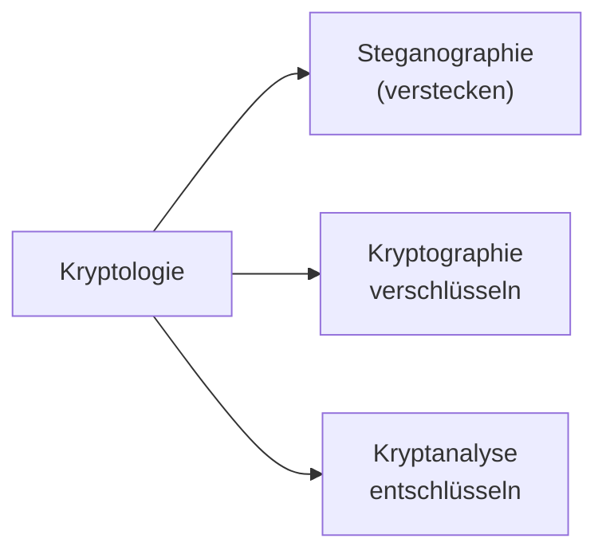

# IT-Security in der KI

## Inhalt
- [IT-Security in der KI](#it-security-in-der-ki)
  - [Inhalt](#inhalt)
- [Einführung](#einführung)
  - [Sicherheitsziele](#sicherheitsziele)
  - [Cybercrime](#cybercrime)
- [Kryptologie](#kryptologie)
  - [Stenanographie](#stenanographie)
  - [Kryptographie](#kryptographie)
    - [symmetrische Kryptographie](#symmetrische-kryptographie)
    - [polyalphabetische Kryptographie](#polyalphabetische-kryptographie)


# Einführung
Meist ist durch guet Prävention und Vorsorge ein Angriff vermeidbar. Dazu zähl zum Beispiel...

- ein eigener Meeting-Server
- eigene Moodle-Instanz
- externe Mail-Server und Adressen
- etc.

So kann ein Angriff nicht die ganze Infrastruktur lahmlegen (zum Beispiel beim Einsatz von Microsoft 365 mit Teams, Office und Outlook). 

**Safety** <br>
Kontrolle über bekannte Risiken - zum Beispiel durch Vorsorge, Prävention und Schutzmaßnahmen.

**Security** <br>
Sicherheit vor (gezielten) Störungen von außen - also Angriffen.

<details><summary>Eselbrücke</summary>
Sicherheitsdienst (Türsteher) nennt sich Security, nicht Safety.
</details>

## Sicherheitsziele

- Authentizität
- Integrität
- nicht-Abstreitbarkeit
- Verbindlichkeit
- Verfügbarkeit
- Privatsphäre
- Vertraulichkeit

**Vertraulichkeit, Integrität & Authentizität** <br>
Informationen bleiben im `vorhergesehenen` Kreis, sind `unverändert` und stammen von angegebenen `Absender`.
<!-- ausführlich später -->

**Authentifizierung** <br>
Nachweis der `Identität` (Shared Secret, Biometrie, ...). 

**nicht-Abstreitbarkeit** <br>
"Ich habe das nicht bestellt!" <br>
Nachweis möglich, somit abstreiten unmöglich.

**Verfügbarkeit** <br>
Vorhergesagte Nutzung durch vorhergesehene Nutzer ist möglich. 

**Privatsphäre** <br>
Grundrecht auf informationelle Selbstbestimmung (`DSGVO`, etc.), technisch hilft Anonymisierung.


## Cybercrime
...

# Kryptologie
Ist die Wissenschaft von der Verschlüsselung und Entschlüsselung von Informationen.



## Stenanographie
Technische Stenanographie ist zum Beispiel die Manipulation von Bild-, Audio- und Videodateien sowie Verstecken weiterer Dateien. 

Beispielsweise wird das diederwertigsten Farb-Bit als Daten-Bit verwendet. 
 

## Kryptographie
Verschlüsselung von Informationen.

### symmetrische Kryptographie
Zum Beispiel Caesa oder ROT13 - z.B.Verschiebung des Alphabets um einen bestimmten Wert. 
Kryptanalyse mit Mono-, Bi oder Trigrammen sowie Brute-Force möglich.

```python
# Verschiebung um 3
ABCDEFGHIJKLMNOPQRSTUVWXYZ
XYZABCDEFGHIJKLMNOPQRSTUVW
# mit Caesar
Gdv lvw hlq Ehlvslho.
Das ist ein Beispiel.
```

Allgemein kann auch ein String-Key angewendet werden, um diesen Wert wird dann das Alphabet verschoben. 

```python
key = "ZEBRA"
ABCDEFGHIJKLMNOPQRSTUVWXYZ
ZEBRACDFGHIJKLMNOPQSTUVWXY
```

Generell einfach zu entschlüsseln, da Bi- oder Trigramme verschieder verteilt sind (z.B. `ll -> yy`).

**Verbeserungen** <br>
Man kann ähnliche Zeichen (z.B. `u` und `v`) zusammenfassen sowie Satz- und Sonderzeichen ignorieren.

### polyalphabetische Kryptographie
Am Beispie der Vigenère-Verschlüsselung. 

```python
# verschlüsseln von text mit key
text = "Das ist ein Geheimtext"
key  = "THI NGO LST ADTKEYTHIN"
        ^ D & T

# Feld mit Alphabet
    v
 ABCDEFGHIJKLMNOPQRSTUVWXY
 ZABCDEFGHIJKLMNOPQRSTUVWX
 YZABCDEFGHIJKLMNOPQRSTUVW
 XYZABCDEFGHIJKLMNOPQRSTUV
 WXYZABCDEFGHIJKLMNOPQRSTU
 VWXYZABCDEFGHIJKLMNOPQRST
 UVWXYZABCDEFGHIJKLMNOPQRS 
>TUVWXYZABCDEFGHIJKLMNOPQR
 STUVWXYZABCDEFGHIJKLMNOPQ
    ^ (bei D von oben)
...

# ergibt als ersen Buchstaben
>W
```

<!--
ABC*D*EFGHIJKLMNOPQRSTUVWXY <br>
ZABCDEFGHIJKLMNOPQRSTUVWX <br>
YZABCDEFGHIJKLMNOPQRSTUVW <br>
XYZABCDEFGHIJKLMNOPQRSTUV <br>
WXYZABCDEFGHIJKLMNOPQRSTU <br>
VWXYZABCDEFGHIJKLMNOPQRST <br>
UVWXYZABCDEFGHIJKLMNOPQRS <br>
*T*UV**W**XYZABCDEFGHIJKLMNOPQR <br>
STUVWXYZABCDEFGHIJKLMNOPQ <br>
-->

Entscheidend ist die Key-Länge, bei `len(key) = 1` ist es Caesar, bei `len(key) < len(text)` sind es mehrere Caesar-Verschlüsselungen udn bei `len(key) = len(text)` ist es ein One-Time-Pad.

**Stromchiffren** <br>
Weiterentwicklung der polyalphabetischen Kryptographie.

<!--
--- S. 62 of 345
-->

...RC4 (S.94)

...Electronic Code Book Mode (S.98) 

...Cipher Block Chaining Mode (S.100)

...Cipher Feedback Mode (S.102)

**Data Encryption Standard** <br>
DES (USA, 1977) ist ein symmetrisches Blockchiffre mit 64 Bit Blockgröße (davon 56 Bit Schlüssel und 8 Bit Parität).

```
noch nicht geprüft

graph TD
    A[64bit Klartext] --> B[Eingangspermutation]
    B --> C[L-Block 32bit]
    B --> D[R-Block 32bit]
    D --> E[Expansion 48bit]
    E --> F[XOR]

    Q[64bit Schlüssel] --> R[Schlüssel-Permutation]
    R --> S[C-Block 28bit]
    R --> T[D-Block 28bit]
    T --> U[Schlüsselauswahl 48bit]
    S --> U
    
    U --> F
    F --> G[S1, S2, S3, ..., Sn]
    G --> H[Permutation 32bit]
    H --> I[XOR]

    C --> I
    I --> D
    I --> J[Ausgangspermutation 64bit]
    J --> K[Chiffretext 64bit]
```

**3DES** <br>
3DES ist eine Erweiterung von DES. 

**International Data Encryption Algorithm** <br>
IDEA ist eine symmetrische Blockchiffre mit 128bit-Schlüssel und 64bit-Blöcken, jeweils 8 Runden. 

**Advanced Encryption Standard** <br>
AES wurde 2000 "in Dienst gestellt" und ist eine symmetrische Blockchiffre mit 128bit-Blockgröße verschiedenen Schlüssellängen (128, 160, 192, 224, 256bit).

[Animation](https://www.cryptool.org/de/cto/aes-animation) & [Step-by-Step](https://www.cryptool.org/de/cto/aes-step-by-step)

**sicherer Schlüsselaustausch** <br>
Diffie-Hellman 