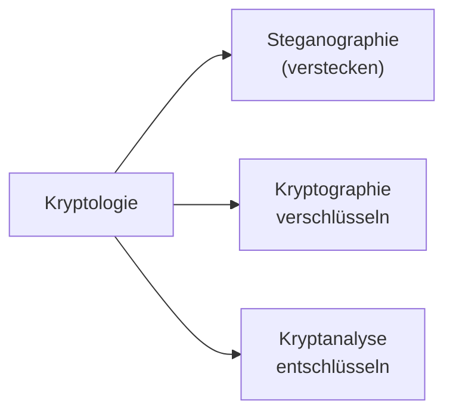
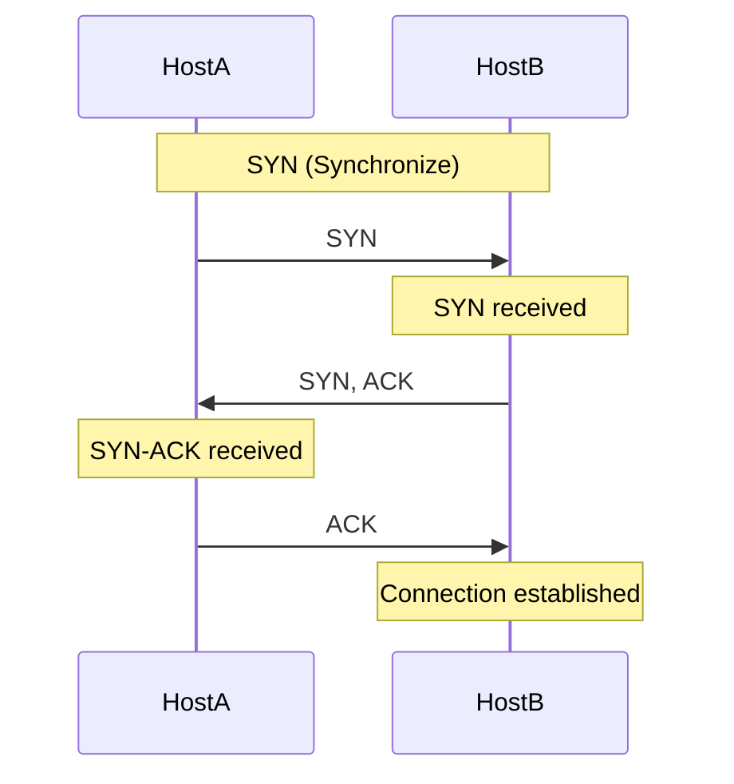
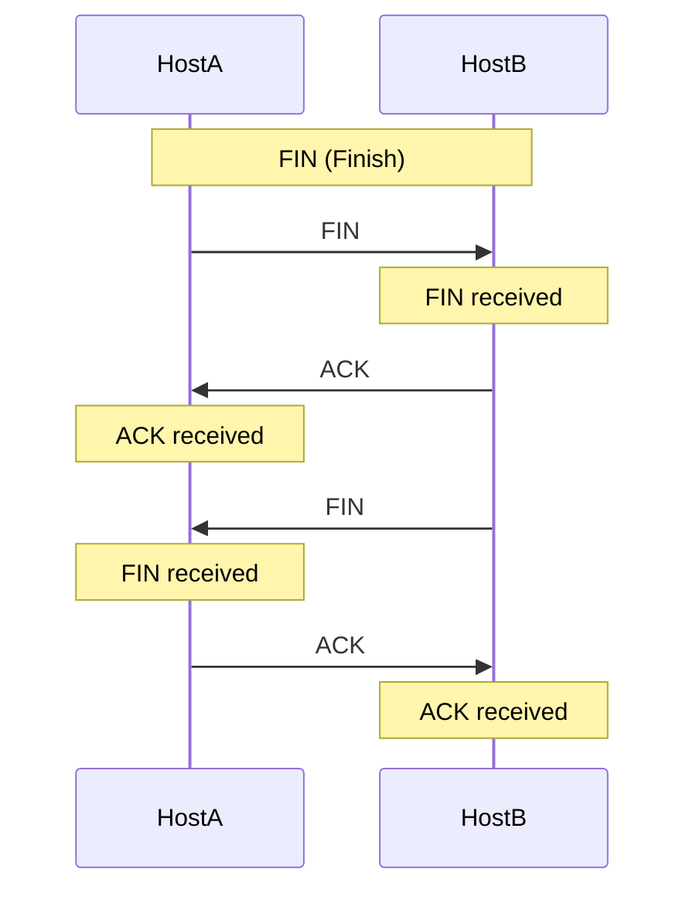

# IT-Security in der KI

## Inhalt
- [IT-Security in der KI](#it-security-in-der-ki)
  - [Inhalt](#inhalt)
- [Einführung](#einführung)
  - [Sicherheitsziele](#sicherheitsziele)
  - [Cybercrime](#cybercrime)
- [Kryptologie](#kryptologie)
  - [Stenanographie](#stenanographie)
  - [Kryptographie](#kryptographie)
    - [symmetrische Kryptographie](#symmetrische-kryptographie)
    - [polyalphabetische Kryptographie](#polyalphabetische-kryptographie)
    - [asymmetrische Kryptographie](#asymmetrische-kryptographie)
    - [hybride Verschlüsselung](#hybride-verschlüsselung)
  - [Integrität](#integrität)
  - [Authentiizität](#authentiizität)
- [Netzwerksicherheit](#netzwerksicherheit)
  - [Social Engineering](#social-engineering)


# Einführung
Meist ist durch guet Prävention und Vorsorge ein Angriff vermeidbar. Dazu zähl zum Beispiel...

- ein eigener Meeting-Server
- eigene Moodle-Instanz
- externe Mail-Server und Adressen
- etc.

So kann ein Angriff nicht die ganze Infrastruktur lahmlegen (zum Beispiel beim Einsatz von Microsoft 365 mit Teams, Office und Outlook). 

**Safety** <br>
Kontrolle über bekannte Risiken - zum Beispiel durch Vorsorge, Prävention und Schutzmaßnahmen.

**Security** <br>
Sicherheit vor (gezielten) Störungen von außen - also Angriffen.

<details><summary>Eselbrücke</summary>
Sicherheitsdienst (Türsteher) nennt sich Security, nicht Safety.
</details>

## Sicherheitsziele

- Authentizität
- Integrität
- nicht-Abstreitbarkeit
- Verbindlichkeit
- Verfügbarkeit
- Privatsphäre
- Vertraulichkeit

**Vertraulichkeit, Integrität & Authentizität** <br>
Informationen bleiben im `vorhergesehenen` Kreis, sind `unverändert` und stammen von angegebenen `Absender`.
<!-- ausführlich später -->

**Authentifizierung** <br>
Nachweis der `Identität` (Shared Secret, Biometrie, ...). 

**nicht-Abstreitbarkeit** <br>
"Ich habe das nicht bestellt!" <br>
Nachweis möglich, somit abstreiten unmöglich.

**Verfügbarkeit** <br>
Vorhergesagte Nutzung durch vorhergesehene Nutzer ist möglich. 

**Privatsphäre** <br>
Grundrecht auf informationelle Selbstbestimmung (`DSGVO`, etc.), technisch hilft Anonymisierung.


## Cybercrime
...

# Kryptologie
Ist die Wissenschaft von der Verschlüsselung und Entschlüsselung von Informationen.



## Stenanographie
Technische Stenanographie ist zum Beispiel die Manipulation von Bild-, Audio- und Videodateien sowie Verstecken weiterer Dateien. 

Beispielsweise wird das diederwertigsten Farb-Bit als Daten-Bit verwendet. 
 

## Kryptographie
Verschlüsselung von Informationen.

### symmetrische Kryptographie
Zum Beispiel Caesa oder ROT13 - z.B.Verschiebung des Alphabets um einen bestimmten Wert. 
Kryptanalyse mit Mono-, Bi oder Trigrammen sowie Brute-Force möglich.

```python
# Verschiebung um 3
ABCDEFGHIJKLMNOPQRSTUVWXYZ
XYZABCDEFGHIJKLMNOPQRSTUVW
# mit Caesar
Gdv lvw hlq Ehlvslho.
Das ist ein Beispiel.
```

Allgemein kann auch ein String-Key angewendet werden, um diesen Wert wird dann das Alphabet verschoben. 

```python
key = "ZEBRA"
ABCDEFGHIJKLMNOPQRSTUVWXYZ
ZEBRACDFGHIJKLMNOPQSTUVWXY
```

Generell einfach zu entschlüsseln, da Bi- oder Trigramme verschieder verteilt sind (z.B. `ll -> yy`).

**Verbeserungen** <br>
Man kann ähnliche Zeichen (z.B. `u` und `v`) zusammenfassen sowie Satz- und Sonderzeichen ignorieren.

### polyalphabetische Kryptographie
Am Beispie der Vigenère-Verschlüsselung. 

```python
# verschlüsseln von text mit key
text = "Das ist ein Geheimtext"
key  = "THI NGO LST ADTKEYTHIN"
        ^ D & T

# Feld mit Alphabet
    v
 ABCDEFGHIJKLMNOPQRSTUVWXY
 ZABCDEFGHIJKLMNOPQRSTUVWX
 YZABCDEFGHIJKLMNOPQRSTUVW
 XYZABCDEFGHIJKLMNOPQRSTUV
 WXYZABCDEFGHIJKLMNOPQRSTU
 VWXYZABCDEFGHIJKLMNOPQRST
 UVWXYZABCDEFGHIJKLMNOPQRS 
>TUVWXYZABCDEFGHIJKLMNOPQR
 STUVWXYZABCDEFGHIJKLMNOPQ
    ^ (bei D von oben)
...

# ergibt als ersen Buchstaben
>W
```

<!--
ABC*D*EFGHIJKLMNOPQRSTUVWXY <br>
ZABCDEFGHIJKLMNOPQRSTUVWX <br>
YZABCDEFGHIJKLMNOPQRSTUVW <br>
XYZABCDEFGHIJKLMNOPQRSTUV <br>
WXYZABCDEFGHIJKLMNOPQRSTU <br>
VWXYZABCDEFGHIJKLMNOPQRST <br>
UVWXYZABCDEFGHIJKLMNOPQRS <br>
*T*UV**W**XYZABCDEFGHIJKLMNOPQR <br>
STUVWXYZABCDEFGHIJKLMNOPQ <br>
-->

Entscheidend ist die Key-Länge, bei `len(key) = 1` ist es Caesar, bei `len(key) < len(text)` sind es mehrere Caesar-Verschlüsselungen udn bei `len(key) = len(text)` ist es ein One-Time-Pad.

**Stromchiffren** <br>
Weiterentwicklung der polyalphabetischen Kryptographie.

<!--
--- S. 62 of 345
-->

...RC4 (S.94)

...Electronic Code Book Mode (S.98) 

...Cipher Block Chaining Mode (S.100)

...Cipher Feedback Mode (S.102)

**Data Encryption Standard** <br>
DES (USA, 1977) ist ein symmetrisches Blockchiffre mit 64 Bit Blockgröße (davon 56 Bit Schlüssel und 8 Bit Parität).

```
noch nicht geprüft

graph TD
    A[64bit Klartext] --> B[Eingangspermutation]
    B --> C[L-Block 32bit]
    B --> D[R-Block 32bit]
    D --> E[Expansion 48bit]
    E --> F[XOR]

    Q[64bit Schlüssel] --> R[Schlüssel-Permutation]
    R --> S[C-Block 28bit]
    R --> T[D-Block 28bit]
    T --> U[Schlüsselauswahl 48bit]
    S --> U
    
    U --> F
    F --> G[S1, S2, S3, ..., Sn]
    G --> H[Permutation 32bit]
    H --> I[XOR]

    C --> I
    I --> D
    I --> J[Ausgangspermutation 64bit]
    J --> K[Chiffretext 64bit]
```

**3DES** <br>
3DES ist eine Erweiterung von DES. 

**International Data Encryption Algorithm** <br>
IDEA ist eine symmetrische Blockchiffre mit 128bit-Schlüssel und 64bit-Blöcken, jeweils 8 Runden. 

**Advanced Encryption Standard** <br>
AES wurde 2000 "in Dienst gestellt" und ist eine symmetrische Blockchiffre mit 128bit-Blockgröße verschiedenen Schlüssellängen (128, 160, 192, 224, 256bit).

[Animation](https://www.cryptool.org/de/cto/aes-animation) & [Step-by-Step](https://www.cryptool.org/de/cto/aes-step-by-step)

**sicherer Schlüsselaustausch** <br>
Die grundlegende Idee bei **Diffie-Hellman** ist, dass zwei Kommunikationspartner einen gemeinsamen Schlüssel aushandeln, ohne dass dieser übertragen wird. `Client` und `Server` wählen jeweils

- eine Primzahl `p` und
- eine Primitivwurzel `g` modulo `p`. 

Nun chiffriert der `Client` den Geheimtext mit seinem eigenen Schlüssel `S` (den er für sich behält). Das Chiffrat `Chiff(Text,S)` sendet er dann an den `Server`. Dieser verschlüsselt erneut mit seinem eigenen Schlüssel `E` (den er ebenfalls geheim hält), was das Doppelchiffrat `Chiff(Chiff(Text,S),E)` ergibt. Dieses sendet er an den `Client` zurück. Dieser entschlüsselt nun mit seinem Schlüssel `S` und erhält `Dechiff(Chiff(Chiff(Text,S),E),S)` = `Chiff(Text,E)`, welches er wieder an den `Server` sendet. Dieser entschlüsselt mit seinem Schlüssel `E` und erhält `Dechiff(Chiff(Text,E),E)` = `Text`.

**binäre Exponentiation** <br>
Die binäre Exponentiation ($y=x^k$) ist eine Methode, um eine Zahl `x` mit einer natürlichen Zahl `n` zu potenzieren. Idee ist $x^5 = x^4 \cdot x^1 = x^2 \cdot x^2 \cdot x^1$. Nun wird $k$ in binär umgewandelt - aus `1` mache "quadrieren und multiplizieren" und aus `0` mache "quadrieren" - wobei das erste `x` gestrichen wird und durch `x` ersetz wird, da Binärdarstellung immer mit `1` beginnt.

Beispiel: $7^{23}$ <br>
$23_{dez} = 10111_{bin}$ ergibt Q&M, Q, Q&M, Q&M, Q&M und nach dem Streichen x, Q, Q&M, Q&M, Q&M. 

$x \xrightarrow{Q} x^2 \xrightarrow{Q} x^4 \xrightarrow{M} x^5 \xrightarrow{Q} x^{10} \xrightarrow{M} x^{11} \xrightarrow{Q} x^{22} \xrightarrow{M} x^{23}$

<!-- weiter S. 169 --> 

**Diffie-Hellman** <br>
- Geheime Zufallszahlen $a$ und $b$ werden gewählt.
- `Client` wählt Zufallszahl $a, 1 \leq a \leq p-1$ und berechnet $A = g^a \mod p$.
- `Server` wählt Zufallszahl $b, 1 \leq b \leq p-1$ und berechnet $B = g^b \mod p$.
- Gegenseitiges Zusenden von $A$ und $B$.
- `Client` berechnet $K = B^a \mod p$.
- `Server` berechnet $K = A^b \mod p$.
- Beide haben nun den gleichen Schlüssel $K$, da 
  - $K = B^a \mod p = (g^b \mod p)^a \mod p = g^{ba} \mod p$ und
  - $K = A^b \mod p = (g^a \mod p)^b \mod p = g^{ab} \mod p$.
- $K$ ist der gemeinsame Schlüssel.

<!-- 
Beide Erklärungen bitte zusammenfassen und vereinfachen.
-->

### asymmetrische Kryptographie
Zum Beispiel RSA (Rivest, Shamir, Adleman, 1977) oder ElGamal (1985).

**RSA** <br>
Beim RSA-Verfahren wird wie folgt vorgegangen. 

- Wähle zwei zufällige Primzahlen $p$ und $q$.
- Der Public-Key setzt sich auch dem Zahlenpaar $(e,N)$ zusammen. 
- Der Private-Key setzt sich aus dem Zahlenpaar $(d,N)$ zusammen.

Grundidee ist, dass es sehr aufwendig ist, große Zahlen in ihre Primfaktoren zu zerlegen. Als Beispiel für einen Public Key wählt man

- $p = 11$ und $q = 13$.
- $N = p \cdot q = 11 \cdot 13 = 143$.
- $\varphi(N) = (p-1) \cdot (q-1) = 10 \cdot 12 = 120$.
- Nun wird $e = 23$ gewählt. 
- Der Public Key ist $(e,N) = (23,143)$.

Beim Private Key wird ähnlich vorgegangen.

- $p=11$ und $q=13$ plus $N=143$ und $e=23$.
- Nun wird $d$ wiefolgt berechnet:
  - $e \cdot d + k \ cdot \varphi(N) = 1$.
  - $23 \cdot d + k \cdot 120 = 1$.
  - $23 \cdot 47 + (-9) \cdot 120 = 1$.
  - $d = 47$.
- Der Private Key ist $(d,N) = (47,143)$.

Verschlüsselt wird nun mit dem Chiffrat $C$ und Klartext $K$.

- $K = 7$ als Beispiel
- $e=23$ und $N=143$.
- $C = K^e \mod N = 7^{23} \mod 143 = 2$.

Und entschlüsselt wird ebenso mit dem Chiffrat $C$ und Klartext $K$.

- $C = 2$ als Beispiel von oben.
- $d=47$ und $N=143$.
- $K = C^d \mod N = 2^{47} \mod 143 = 7$.

**Elliptic Curve** <br>
<!-- weiter auf S. 201, aber relevant? -->


**Vorteile** <br>
Bei der assymetrischen Kryptographie ist der Schlüsselaustausch sicher, da der Private Key nicht übertragen werden muss.

**Nachteile** <br>
Sehr rechenintensiv und längere Schlüssel nötig als bei der symmetrischen Kryptographie (bei gleicher Sicherheit).

### hybride Verschlüsselung
Das Problem bei symmetrischer Kryptographie ist der Schlüsselaustausch - bei dem Gegenstück die aufwendige Berechnung.

**Lösungsidee** <br>
- Erzeuge zufälligen, symmetrischen Sitzungsschlüssel $S$.
- Verschlüssele Nachricht $M$ mit $S$ symmetrisch, also $C_M = enc_{sym}(M,S)$.
- Verschlüssele $S$ asymmetrisch an Public-Key $K_pub$ des Empfängers, also $C_S = enc_{asym}(S,K_pub)$.
- Sende $(C_M,C_S)$ an Empfänger, der dann 
  - $S = dec_{asym}(C_S,K_priv)$ und
  - $M = dec_{sym}(C_M,S)$ berechnet.


## Integrität
Ziel ist das Nachweisen von Veränderungen an Daten. 

**Hashfunktion** <br>
Die Idee der Hash-Funktion ist es, eine Menge $M$ auf $M'$ abzubilden, wobei in der Regel $|M| > |M'|$ gilt. Bekannte Hash-Funktionen sind zum Beispiel `SHA`, `SHA256`, `SHA512` oder `MD5`.

- Nachricht `N` = `Hello World`
- `H = MD5(N)` = `b10a8db164e0754105b7a99be72e3fe5`
- Sende `N` und `H` 
- Angreifer manipuliert `N` zu `N'` = `Hallo Welt` udn berechnet neuen Hash `H'` = `5c372a32c9ae748a4c040ebadc51a829`
- Leitet `N'` und `H'` weiter
- Wie kann der Empfänger nun feststellen, dass `N` manipuliert wurde?

**Signatur** <br>
Die Idee der Signatur ist es, eine Nachricht `N` mit einem Private-Key `K_priv` zu signieren und mit dem Public-Key `K_pub` zu verifizieren.

- Sender 
  - Nachricht `N`, `Hash H=hash(N)`
  - Signatur `S=enc(N,K_priv)`
- senden von `N` und `S`
- Empfänger
  - `hash(N)`
  - `dec(S,K_pub)`
  - Nachricht unverändert, wenn `hash(N) = dec(S,K_pub)`

> Denn $K_{pub} muss zu K_{priv} passen, den nur der Sender kennt!

## Authentiizität
Ziel ist das Nachweisen der Identität eines Kommunikationspartners - mit Zertifikaten vertrauenswürdiger Herausgeber (`Root-CA`) oder Signatur.

**SSL/TLS** <br>
Authentifiziert den Server und ggf auch die Clients, stellt Integrität der Datenübertragung und vertrauliche Kommunikation sicher - Grundidee ist

- Generierung zufälliger **symmetrischer** Schlüssel
- AUstausch mit **asymmetrischer** Verschlüsselung
- Kommunikation mit **symmetrischer** Verschlüsselung

<!--
SSL/TSL
Ablauf

nachholen
S. 249
-->

# Netzwerksicherheit
<!-- ## Angriff auf Netze -->
Angegriffen werden kann unter anderem die Datenübertragung (belauschen, unterdrücken oder manipulieren) sowie die Verfügbarkeit eines Systems - auch Reconnaisanve (Datensammlung)  ist relevant. 

## Social Engineering
<!-- S 15 -->
Ziel ist es Informationen zu sammeln, um an Daten zu kommen - einen Einstieg zu finden.

**Erreichbarkeit** <br>
Mit `ping` kann die Erreichbarkeit von Systemen getestet werden, oder `portscan` um offene Ports zu finden.

**Netzinfrastruktur** <br>
Mit `traceroute` kann die Netzinfrastruktur ermittelt werden, also über welche Server die Datenpakete laufen.

**Dienste** <br>
Die angebotenen Dienste können mit `portscan` analysiert werden, um Schwachstellen zu finden.

**Versionen** <br>
Verwendete Versionen können mittels `Connect Scan` oder `Version Scan` ermittelt werden.

**Betriebssystem** <br>
Durch `Fingerprints` kann das verwendete Betriebssystem ermittelt werden.

### Hintergrundwissen
**Handshake** <br>
Ein Verfahren zum Aufbau verlustfreier Datenübertragung zwischen `2` Instanzen ist der `3-Way-Handshake`.



<details><summary>GIF von WIkipedia</summary>


</details>

Auch möglich ist ein `4-Way-Handshake` mit `FIN` (Finish).


