# Quantum Technologies and Information
Transcript and summary of the lecture given by Prof Dr. Ulrich Margull at the Ingolstadt University of Applied Sciences. All rights reserved by the original author(s). 

## Contents
- [Quantum Technologies and Information](#quantum-technologies-and-information)
  - [Contents](#contents)
- [Classical Bits and Gates](#classical-bits-and-gates)
- [Single Qubits](#single-qubits)
  - [Single Qubit Gates](#single-qubit-gates)
    - [Pauli Gates](#pauli-gates)
    - [Hadamard Gate](#hadamard-gate)
- [Quantum Registers (and Entanglement)](#quantum-registers-and-entanglement)
  - [CNOT (controlled Pauli-X)](#cnot-controlled-pauli-x)
  - [Entanglement](#entanglement)
  - [SWAP-Gate](#swap-gate)
  - [Toffoli-Gate](#toffoli-gate)
  - [Multiple Hadamard Gates](#multiple-hadamard-gates)
- [Quantum Algorithms](#quantum-algorithms)
  - [Deutsch Algorithm](#deutsch-algorithm)
  - [Deutsch-Jozsa Algorithm](#deutsch-jozsa-algorithm)
    - [Oracle Function](#oracle-function)
  - [Grover Algorithm](#grover-algorithm)
- [Error Correction](#error-correction)
- [Quantum Communication](#quantum-communication)
  - [Bell States](#bell-states)
  - [Teleportation](#teleportation)

# Classical Bits and Gates
One bit is represented by an vector $0 = \begin{pmatrix} 1 \\ 0 \end{pmatrix}$ or $1 = \begin{pmatrix} 0 \\ 1 \end{pmatrix}$. The boolean `NOT` gate is represented by the matrix $\begin{pmatrix} 0 & 1 \\ 1 & 0 \end{pmatrix}$.

**AND-Gate** <br>
The AND-Gate has `2` input bits, therefore two bits are represented by a 4-dimensional vector. 

$`00 = \begin{pmatrix} 1 \\ 0 \\ 0 \\ 0 \end{pmatrix}`$, $01 = \begin{pmatrix} 0 \\ 1 \\ 0 \\ 0 \end{pmatrix}$, $10 = \begin{pmatrix} 0 \\ 0 \\ 1 \\ 0 \end{pmatrix}$, $11 = \begin{pmatrix} 0 \\ 0 \\ 0 \\ 1 \end{pmatrix}$

<details><summary>math</summary>

The related matrix has has $2 \times 4$ dimensions.

$\begin{pmatrix} q_1 \\ q_2 \end{pmatrix} = \begin{pmatrix} x_{11} & x_{12} & x_{13} & x_{14} \\ x_{21} & x_{22} & x_{23} & x_{24} \end{pmatrix} \begin{pmatrix} a_1 \\ a_2 \\ b_1 \\ b_2 \end{pmatrix}$ 

</details> <br>

And the `boolean-AND` therefore is represented by following matrix

$AND = \begin{pmatrix} 1 & 1 & 1 & 0 \\ 0 & 0 & 0 & 1 \end{pmatrix}$

**NAND-Gate** <br>
The NAND-Gate is the negation of the AND-Gate. Therefore the matrix is the negation of the AND-Gate matrix.

$`NAND = \begin{pmatrix} 0 & 1 \\ 1 & 0 \end{pmatrix} \cdot \begin{pmatrix} 1 & 1 & 1 & 0 \\ 0 & 0 & 0 & 1 \end{pmatrix} = \begin{pmatrix} 0 & 0 & 0 & 1 \\ 1 & 1 & 1 & 0 \end{pmatrix}`$

**Parralel Gates** <br>
The most simple case are two `NOT` gates in parralel. 

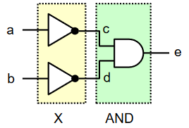

Now we have two inputs and two outputs, both are 4-dimensional vectors. 

$`a= \begin{pmatrix} a_0 \\ a_1 \end{pmatrix}$, $b= \begin{pmatrix} b_0 \\ b_1 \end{pmatrix}$ and the input then is $a \otimes b = \begin{pmatrix} a_0 b_0 \\ a_0 b_1 \\ a_1 b_0 \\ a_1 b_1 \end{pmatrix}`$

<details><summary>example</summary>

$`|01\rangle = \begin{pmatrix} 0 \\ 1 \end{pmatrix} \otimes \begin{pmatrix} 1 \\ 0 \end{pmatrix} = \begin{pmatrix} 1 \cdot \begin{pmatrix} 0 \\ 1 \end{pmatrix} \\ 0 \cdot \begin{pmatrix} 0 \\ 1 \end{pmatrix} \end{pmatrix} = \begin{pmatrix} 0 \\ 1 \\ 0 \\ 0 \end{pmatrix}`$.

</details> <br>

The same applies to the gates - the combination of both parallel gates is the tensor product of the infdividual gates.

$`X = NOT \otimes NOT = \begin{pmatrix} 0 & 1 \\ 1 & 0 \end{pmatrix} \otimes \begin{pmatrix} 0 & 1 \\ 1 & 0 \end{pmatrix} = \begin{pmatrix} 0 \cdot \begin{pmatrix} 0 & 1 \\ 1 & 0 \end{pmatrix} & 1 \cdot \begin{pmatrix} 0 & 1 \\ 1 & 0 \end{pmatrix} \\ 1 \cdot \begin{pmatrix} 0 & 1 \\ 1 & 0 \end{pmatrix} & 0 \cdot \begin{pmatrix} 0 & 1 \\ 1 & 0 \end{pmatrix} \end{pmatrix} = \begin{pmatrix} 0 & 0 & 0 & 1 \\ 0 & 0 & 1 & 0 \\ 0 & 1 & 0 & 0 \\ 1 & 0 & 0 & 0 \end{pmatrix}`$

<details><summary>example</summary>

For example, the input $|01\rangle$ yields the output $|10\rangle$.

$`\begin{pmatrix} 0 & 0 & 0 & 1 \\ 0 & 0 & 1 & 0 \\ 0 & 1 & 0 & 0 \\ 1 & 0 & 0 & 0 \end{pmatrix} |01\rangle = X \begin{pmatrix} 0 \\ 1 \\ 0 \\ 0 \end{pmatrix} = \begin{pmatrix} 0 \\ 0 \\ 1 \\ 0 \end{pmatrix} = |10\rangle`$

</details> <br>

The concatenation of the two steps $x$ and $AND$ is the normal product of the matrices (in reverse order).

$`|e\rangle = AND \cdot X = \begin{pmatrix} 1 & 1 & 1 & 0 \\ 0 & 0 & 0 & 1 \end{pmatrix} \cdot X = \begin{pmatrix} 0 & 1 & 0 & 0 \\ 1 & 0 & 0 & 0 \end{pmatrix}|ab\rangle`$

<details><summary>example</summary>

For example, the input $|01\rangle$ yields $|0\rangle$ as output.

$`\begin{pmatrix} 0 & 1 & 1 & 1 \\ 1 & 0 & 0 & 0 \end{pmatrix} |01\rangle = \begin{pmatrix} 0 & 1 & 1 & 1 \\ 1 & 0 & 0 & 0 \end{pmatrix} \begin{pmatrix} 0 \\ 1 \\ 0 \\ 0 \end{pmatrix} = \begin{pmatrix} 1 \\ 0 \end{pmatrix} = |0\rangle`$

</details> <br>

# Single Qubits
A single qubit is represented by a 2-dimensional vector.

$`| \psi \rangle = \alpha |0\rangle + \beta |1\rangle = \alpha \begin{pmatrix} 1 \\ 0 \end{pmatrix} + \beta \begin{pmatrix} 0 \\ 1 \end{pmatrix} = \begin{pmatrix} \alpha \\ \beta \end{pmatrix}`$

The qubit is normalized, therefore $|\alpha|^2 + |\beta|^2 = 1$ and $\alpha, \beta \in \mathbb{C}$. The fact  that a qubit is partly in state $|0\rangle$ and $|1\rangle$ is called _superposition_.

When we measure the qubit, the probability of the measured state is given by

$`P(|0\rangle) = |\alpha|^2$ and $P(|1\rangle) = |\beta|^2`$

and the sum of both will be $1$.

<!-- 
https://moodle.thi.de/pluginfile.php/703143/mod_resource/content/20/QCI_script.pdf

S. 19
-->

**Special Qubits** <br>
There are two common special qubits, the $|+\rangle$ and $|-\rangle$ qubit.

$`|+\rangle = \frac{1}{\sqrt{2}} (|0\rangle + |1\rangle)`$ <br>
$`|-\rangle = \frac{1}{\sqrt{2}} (|0\rangle - |1\rangle)`$ <br>

In this case, the probability of measuring $|0\rangle$ or $|1\rangle$ is the same. 

**Measurement** <br>
When doing a measurement, we cannot directly find out the state of the qubit - we cannot measure the amplitudes $\alpha$ and $\beta$ of the states, so we need to repeat the measurement multiple times to get a histogram of the results. 

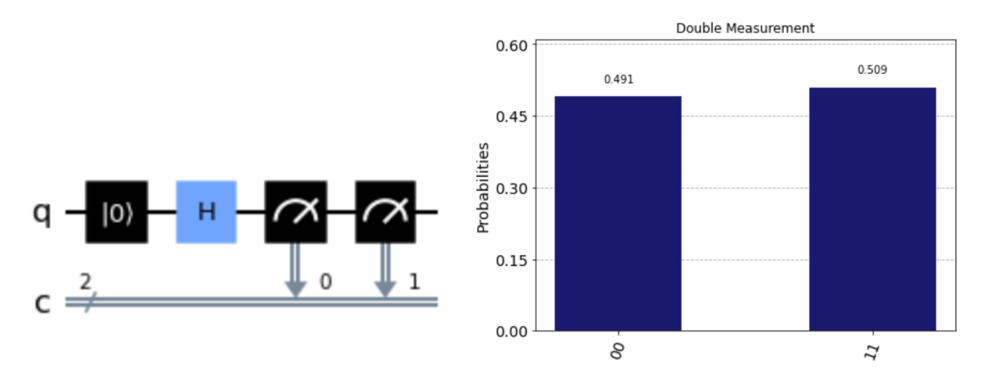

In this case, a qubit in _superposition_ is measured twice - the first time produces a random qubit, where the second measurement produces the same result. Thus, `00` is common and `01` and `10` do not occur.

<!--
4.1.3 Polar Form
4.1.4 Bloch Sphere
-->

## Single Qubit Gates
A quantum gate is an operator that acts on the state of one (or more) qubits. This operators are represented by unitary matrices.

### Pauli Gates
The Pauli gates are the most common gates. 

**Pauli-X** <br>
The Pauli-X gate exchanges the amplitudes of the qubit. 

$`X|\psi\rangle = X(|\alpha|0\rangle + \beta|1\rangle) = \begin{pmatrix} 0 & 1 \\ 1 & 0 \end{pmatrix} \begin{pmatrix} \alpha \\ \beta \end{pmatrix} = \begin{pmatrix} \beta \\ \alpha \end{pmatrix} = \beta|0\rangle + \alpha|1\rangle`$

It is also caled a `bit-flip` gate - when applying to the base states $|0\rangle$ and $|1\rangle$, the result is the opposite state.

**Pauli-Z** <br>
The Pauli-Z gate changes the sign of the $\beta$ amplitude.

$`Z|\psi\rangle = Z(|\alpha|0\rangle + \beta|1\rangle) = \begin{pmatrix} 1 & 0 \\ 0 & -1 \end{pmatrix} \begin{pmatrix} \alpha \\ \beta \end{pmatrix} = \begin{pmatrix} \alpha \\ -\beta \end{pmatrix} = \alpha|0\rangle - \beta|1\rangle`$

It is also called a `phase-flip` gate - when applying to the base state $Z|1\rangle$, the result is $-|1\rangle$.

**Pauli-Y** <br>
The Pauli-Y gate is a bit more complicated gate, it has an imaginary factor. 

$`Y|\psi\rangle = Y(|\alpha|0\rangle + \beta|1\rangle) = \begin{pmatrix} 0 & -i \\ i & 0 \end{pmatrix} \begin{pmatrix} \alpha \\ \beta \end{pmatrix} = i \begin{pmatrix} -\beta \\ \alpha \end{pmatrix} = -i\beta|0\rangle + i\alpha|1\rangle`$

**Information** <br>
When two of the same gates are applied, the result is the identity matrix.

$`X \cdot X = Y \cdot Y = Z \cdot Z = I_2 = \begin{pmatrix} 1 & 0 \\ 0 & 1 \end{pmatrix}`$

### Hadamard Gate
The Hadamard gate is a very common gate, it is used to create superposition - it applies to the base states like this. 

$`H|0\rangle = \frac{1}{\sqrt{2}} \begin{pmatrix} 1 & 1 \\ 1 & -1 \end{pmatrix} \begin{pmatrix} 1 \\ 0 \end{pmatrix} = \frac{1}{\sqrt{2}} \begin{pmatrix} 1 \\ 1 \end{pmatrix} = \frac{1}{\sqrt{2}} (|0\rangle + |1\rangle) = |+\rangle`$ <br>

$`H|1\rangle = \frac{1}{\sqrt{2}} \begin{pmatrix} 1 & 1 \\ 1 & -1 \end{pmatrix} \begin{pmatrix} 0 \\ 1 \end{pmatrix} = \frac{1}{\sqrt{2}} \begin{pmatrix} 1 \\ -1 \end{pmatrix} = \frac{1}{\sqrt{2}} (|0\rangle - |1\rangle) = |-\rangle`$

These are superposition states, the probability of measuring both states is equal. Hadamard is also it's own inverse, so $`H \cdot H = 1`$.

$$H\ket{u}={1\over\sqrt{2}}(\ket{0}+(-1)^u\ket{1})$$ 

In more general words, the Hadamard gate on one qubit produces the result above.

<!-- 
more on 2 dimensional on p. 48
-->

# Quantum Registers (and Entanglement)
<!-- 2 Qubit Register 5.1.1 -->

## CNOT (controlled Pauli-X)
The CNOT, `CX`-gate or controlledd Pauli-X is a 2-qubit gate with a control qubit, which remains unchanged and the qubit it operates on. 

- If the control-qubit is `0`, the second qubit is not changed. 
- If the control-qubit is `1`, the second qubit is flipped.

Let $q_1$ be the control-gate and $q_0$ the controlled gate, then CNOT has the following form. 

$`CNOT = \begin{pmatrix} 1 & 0 & 0 & 0 \\ 0 & 1 & 0 & 0 \\ 0 & 0 & 0 & 1 \\ 0 & 0 & 1 & 0 \end{pmatrix}`$ 

In `Qiskit`, the CNOT gate is defined as 

```python
qc.cx(q[0], q[1])
```

and it looks like this.

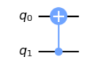

Applied on the base states the qubit corresponds to a classical `XOR`-gate.

| input | output |
| ----- | ------ |
| 00    | 00     |
| 01    | 01     |
| 10    | 11     |
| 11    | 10     |

## Entanglement
Two or more qubits are called _entangled_, if their state cannot be described as the tensor product of some individual qubits.

## SWAP-Gate
The SWAP-Gate swaps the two qubits - as simple as that. 

| input | output |
| ----- | ------ |
| 00    | 00     |
| 01    | 10     |
| 10    | 01     |
| 11    | 11     |

The SWAP-Gate is defined as

$`SWAP = \begin{pmatrix} 1 & 0 & 0 & 0 \\ 0 & 0 & 1 & 0 \\ 0 & 1 & 0 & 0 \\ 0 & 0 & 0 & 1 \end{pmatrix}`$

and in `Qiskit` code it looks like this

```python
qc.swap(q[0], q[1])
```

and the visual representation is as follows.

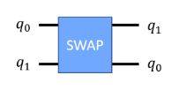

## Toffoli-Gate
The Toffoli-Gate is a 3-qubit gate, with two control qubits and one target qubit. The target qubit is flipped, if both control qubits are `1`.

| input | output |
| ----- | ------ |
| 000   | 000    |
| 001   | 001    |
| 010   | 010    |
| 011   | 011    |
| 100   | 100    |
| 101   | 101    |
| **110**   | **111**    |
| **111**   | **110**    |

The Toffoli-Gate is defined as

$`CNOT = \begin{pmatrix} 1 & 0 & 0 & 0 & 0 & 0 & 0 & 0 \\ 0 & 1 & 0 & 0 & 0 & 0 & 0 & 0 \\ 0 & 0 & 1 & 0 & 0 & 0 & 0 & 0 \\ 0 & 0 & 0 & 1 & 0 & 0 & 0 & 0 \\ 0 & 0 & 0 & 0 & 1 & 0 & 0 & 0 \\ 0 & 0 & 0 & 0 & 0 & 1 & 0 & 0 \\ 0 & 0 & 0 & 0 & 0 & 0 & 0 & 1 \\ 0 & 0 & 0 & 0 & 0 & 0 & 1 & 0 \end{pmatrix}`$

and in `Qiskit` code it looks like this

```python
qc.ccx(q[0], q[1], q[2])
```

and the visual representation is as follows.

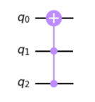

## Multiple Hadamard Gates
Note that hadamard operates on each qubit seperately, so we do not get entanglement from it.

$H^{\otimes 2} =
	{1\over\sqrt{2}}\begin{pmatrix}1&1\\1&-1\end{pmatrix} \otimes 
	{1\over\sqrt{2}}\begin{pmatrix}1&1\\1&-1\end{pmatrix} =
	{{1}\over{2}}\begin{pmatrix}
		1&1&1&1\\1&-1&1&-1\\
		1&1&-1&-1\\1&-1&-1&1
	\end{pmatrix}$

The visual representation is as follows.

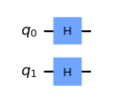

When applying a Hadamard on a base vector $|u\rangle$, we get this

$H\ket{u}={1\over\sqrt{2^1}}(\ket{0}+(-1)^u\ket{1})$

where $u$ is in $\{0,1\}$ using summation, we can write this as

$H\ket{u}={1\over\sqrt{2}}\sum_{\nu\in \{0,1\} }(-1)^{\nu\cdot u}\ket{\nu}$

where $\nu\cdot u$ is the dot product of the two vectors.

# Quantum Algorithms
## Deutsch Algorithm
Let's assume we have a binary function with one input and one output and let's ask the question if the function is **constant** or **balanced** - balanced means that teh function produces different values as the input changes. 

- the output is always `0` (constant)
- the output is always `1` (constant)
- identity function `f(x) = x` (balanced)
- negation function `f(x) = !x` (balanced)

The classical approach would be to evaluate the function for all possible inputs and check if the output values. This is not possible with only **one function call** - two are needed. 

But with quantum computing, we can do this with only **one function call**! The problem is that the constant functions are **not** reversible - the solution is quite simple, we add a qubit. 

- one qubit is the input of the function and remains unchanged 
- the second qubit (initial `0`) is the output of the function

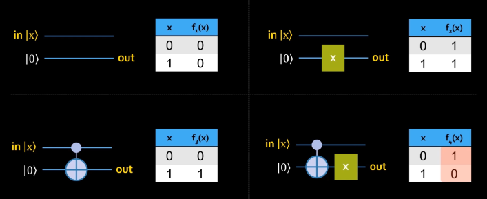

> How is a balanced function detected with only one function call?

1. Initialisation of both qubits with `1` (inverting the `0` states).
2. Apply Hadamard to both qubits which puts them into superposition $\frac{1}{\sqrt{2}}(|0\rangle + |1\rangle)$.
3. Apply the function to both qubits like before.
4. Measure both qubits (the upper one is enough).

The result is either `01` or `11` - if the function is balanced, the result is `01`, if the function is constant, the result is `11`.

<!-- 
visualisation of the algorithm
-->

## Deutsch-Jozsa Algorithm
The Deutsch-Jozsa algorithm is an extension of the Deutsch algorithm, now with $n$ input qubits where $f: x\mapsto y, x\in \{0,1\}^n, y\in \{0,1\}$ and the question once again is if the function is constant or balanced.

### Oracle Function
The quantum function in the algorithm is called the **Oracle Function** - the input is $n$ qubits and to make it reversible, another qubit to store the result - also called an _ancillary_ qubit.

**Example** <br>
With $n=2$, the oracle function takes two input qubits and the ancillary qubit (set to `0`). It has three output qubits, the first two are the input qubits and the third is $0\oplus f(b)$, where $\oplus$ is a XOR function.

Now there are two constant functions, one producing always `0` (change nothing on the _a_-qubit) and one producing always `1` (flip the _a_-qubit). An example for a balanced function would be a `CNOT` on one _b_-qubit and the _a_-qubit.

<!-- 
example on page 45
-->

<!-- 
exercise on page 46
do it!
-->

**Algorithm** <br>
One system call is enough to find the answer with the Deutsch-Jozsa algorithm. 

1. All $n$ inputs qubits are set to `0` and the ancillary qubit is set to `1`.
2. Apply Hadamard to all qubits.
3. magic Oracle Function
4.  Apply Hadamard the first $n$ qubits - not the ancillary qubit.
5.  Measure the first $n$ qubits.

If the measurement is `000...0`, the function is constant, otherwise it is balanced.


## Grover Algorithm
Given unsorted data, how do we find a specific element? The classical approach is to iterate over - in the worst case - all elements.

With a dataset of $N$ elements, the **Grover** algorithm can find the element in $\sqrt{N}$ steps.

**Oracle Function** <br>
Usually we would have a boolean function that yields the answer to the question if the element is the one we are looking for. 

But with the Grover algorithm, we have a **binary** input and can represent $2^n$ numbers with $n$ qubits - in addition to a qubit for the output of the function.

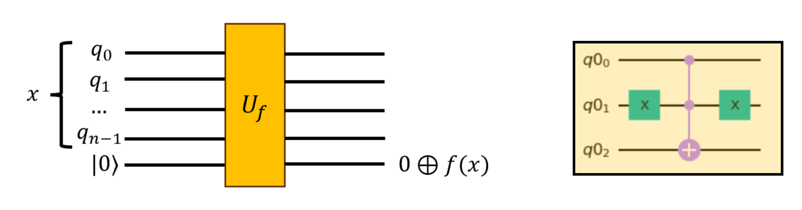

For example (see above) the oracle to determine the wanted element `01` so that $f(01) = 1$ could be the [Toffoli gate](#toffoli-gate) with the first two qubits as control qubits. 

> The Toffoli switches the lowest qubit if $q_0$ and $q_1$ are `1`.

But as usual - to use the power of quantum computing - we start with Hadamard on some qubits to achieve **superposition**.

> The auxiliary qubit is flipped when the correct target state is found.

**Phase Flip** <br>
The Grover algorithm works by using a `phase-flip` to mark the correct state. It encodes the result of the oracle function with Hadamard so the output to finding `01` would be as follows. 

$\frac{1}{2}(|100\rangle - |101\rangle + |110\rangle + |111\rangle)$

As we can se, the target state is flipped (to `-`) and all others are unchanged.

<details><summary>Circuit</summary>

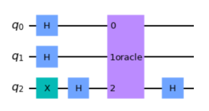

</details> <br>

**Amplitude Amplification** <br>
The flipped phase does not help us as we **cannot** measure it. 

<!--
p. 55
ask someone 
-->

## Shor Algorithm
Classic RSA encryption is based on the fact that it is hard to factorize a large number into two primes. The Shor algorithm can factorize a number in managable time. 

<details><summary>RSA</summary>

1. Find two prime numbers $p$ and $q$.
2. Calculate $n = p \cdot q$ and $\phi(n) = (p-1) \cdot (q-1)$.
3. Choose a small number $e$ that is coprime to $\phi(n)$.
4. Now find a number $d$ so that $d \cdot e \equiv 1 \mod \phi(n)$.
5. The public key is $e$ and the private key is $d$.
6. Encrypt a message $m$ with $\widetilde{m} = m^e \mod n$.
7. Decrypt the message with $m = \widetilde{m}^d \mod n$.

Test with $p = 47$ and $q = 59$, now $n = 2773$ and $\phi(n) = 46 \cdot 58 = 2668$. Choose $e = 17$ and $d = 157$.

| Text | HA | LL | OW | EL | T |
| ---- | -- | -- | -- | -- | - |
| $m$ | 0801 | 1212 | 1523 | 0512 | 2000 |
| $\widetilde{m}$ | 2480 | 2345 | 1107 | 1278 | 317 |

`801^17 mod 2773 = 2480`

</details> <br> 

The circuit will look like this and takes $n=log(N)$ and $m=log(N^2)=2 \cdot log(N) = 2n$ qubits.

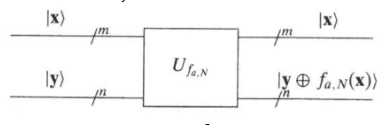


# Error Correction
In classical information theory, using multiple transmissions can reduce the error rate arbitrarily. 

In a quantum system, states of qubits can be changed by the environment - this is called **decoherence**.

> A photon can be absorbed by the environment and the state is lost.

> Or the photon collides with another particle and the state is flipped. 

If the particle is in a superposition, the interaction then **entangles** the particle and photon. Any further changes to the photon will also affect the particle.

> phase flip = Z
> bit flip = X
> no change = I

## Error Detection
The simplest way to detect an error is to apply some gates to the qubit and then measure them. 

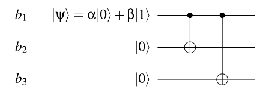

Here the state $\alpha|0\rangle + \beta|1\rangle$ will become $\alpha|000\rangle + \beta|111\rangle$ and if an error occurs within the two gates, an error is detected.

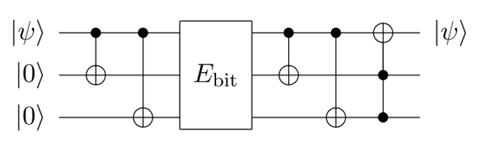

The circuit above can detect a bitflip on $|\psi\rangle$ and returns the corrected state - the $E_bit$ function simulates the error and flips the qubit. 


# Quantum Communication
Quantum communication is the transmission of quantum information. 

## Bell States
The Bell states are a set of four quantum states that are maximally entangled.

$|\Phi^+\rangle = \frac{1}{\sqrt{2}} (|00\rangle + |11\rangle)$ <br>
$|\Phi^-\rangle = \frac{1}{\sqrt{2}} (|00\rangle - |11\rangle)$ <br>
$|\Psi^+\rangle = \frac{1}{\sqrt{2}} (|01\rangle + |10\rangle)$ <br>
$|\Psi^-\rangle = \frac{1}{\sqrt{2}} (|01\rangle - |10\rangle)$ <br>

**Entanglement** <br>
How to test if two qubits are entangled?

> If a state cannot be seperated, it is entangled.

$a_0 a_3 - a_1 a_2 = 0$ 

If the result is `0`, the qubits are entangled - only if no $a_i$ is `0`. In other words, if there is a dot product, the equation is `0`. 

## Teleportation
The goal of Quantum Teleportation is to transport a qubit $|\psi\rangle$ from Alice to Bob.

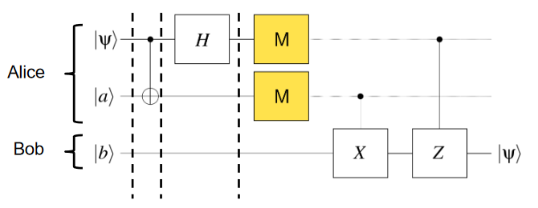

1. First we create a Bell state $\Phi^+ = \frac{1}{\sqrt{2}} (|00\rangle + |11\rangle)$ between Alice and Bob (which means each one gets one qubit).
2. Now Alice applies a `CNOT` on $|\psi\rangle$ and the first qubit of the Bell state (so $|\alpha\rangle$), then a `Hadamard` on $|\psi\rangle$. Now she measures both qubits and sends the result to Bob - which could be `00`, `01`, `10` or `11` and are all equally likely.
3. The result can be transmitted classically to Bob. 
4. Bob then - depending on the results - applies `Pauli-X` and/or `Pauli-Z` and gets the qubit $|\psi\rangle$.

<!--
this is not that much
try to understand well
-->

# Qunatum Hardware
Usually a quantum computer needs qubits, which can be **initialised** (with ground states) and needs to **robustly** store this information. Operations such as **quantum gates** should also be possible as well as **measurements**.

- superconducting circuits (e.g. transmons)
- photons
- atom- or ion-traps

These are the most common approaches to quantum computing with many more in development.

**Quantum Volume** <br>
The quantum volume is a metric to measure the performance of a quantum computer. It relies on the number of **qubits**, number of possible steps before the qubits **decay** and the **error rate** of them. 

## Superconducting Transmon Qubit
Their coherency is approximately $30-100 \mu s$ and a common gate takes approximately $10-30 ns$ to execute.

> State of the art are 72 qubits!

They rely on superconducting circuits and can be used for universal quantum computing, IBM currently has `1121` qubits available (as of Dec. 23) - error rates are about $1%$ but very low temperatures are required (around $10mK$) to achieve this.

## Photonic Qubits
Based on photons, this technology has a longer decoherence time and operates at light speed, so very good for communication - storage of the photos is the problem here. 

> Just a handful of qubits are possible. 

Technically speaking, mirrors are used to reflect the photons. This also works at room temperature and the gate operations are very fast.

## Atom Traps
Atoms are trapped in e.g. a magnetic field at low temperatures. a qubit state corresponds to the energy level of the atom - light can change this state. 

> Just a handful of atoms or ions.

Best for universal computing, but once again low temperatures ($\approx 10mK$) are required - but a high coherence time is possible. 