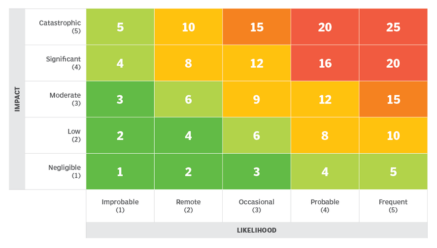

# IT-Security in der KI
Mitschrift und Zusammenfassung des Vortrags von Patrizia Heinl an der Technischen Hochschule Ingolstadt. Alle Rechte liegen bei den Originalautoren. 

# Inhalt 
- [IT-Security in der KI](#it-security-in-der-ki)
- [Inhalt](#inhalt)
- [Einführung](#einführung)
  - [STRIDE](#stride)
  - [Angriffstypen](#angriffstypen)
- [Risikomanagemenet](#risikomanagemenet)
  - [Ursache und Wirkung](#ursache-und-wirkung)
  - [Zeitfaktor](#zeitfaktor)
  - [Risiko-Heatmap](#risiko-heatmap)
  - [Risikostrategien](#risikostrategien)

# Einführung
Bei dem Einsatz von KI-Systemen liegt ein wichtiger Schwerpunkt auf der Sicherheit.

**Vertrauenswürdigkeit**  
Mit einem _vertraulichem_ System ist gemeint, dass zum Beispiel ein **Bias** minimiert wird und **Menschenrechte** eingehalten werden. Aber auch **Transparenz** - also die Erkl#rbarkeit der Entscheidungen - ist wichtig.

**Sicherheit**  
Ein _sicheres_ System ist zum Beispiel gegen **Angriffe** geschützt. Zudem ist die **Robustheit** gegenüber Störungen wichtig. 

`Identify` - `Protect` - `Detect` - `Respond` - `Recover`

**Angriffe**  
Hier wird noch gategorisiert in **Motivation**, **Profile**, **Fähigkeiten** und **Wissen** des Angreifers.

## STRIDE
Methodik zur Identifikation von Sicherheitsrisiken für _herkömmliche_ Software.

| Sicherheitsziel | Bedrohung |
| --------------- | --------- |
| Authentizität | `S`poofing - Nutzer gibt sich als jemand anderes aus |
| Integrität | `T`ampering - Daten werden verändert |
| Nichtabstreitbarkeit | `R`epudiation - Angreifer löscht Logs |
| Vertraulichkeit | `I`nformation Disclosure - sensible Daten werden weitergegeben |
| Verfügbarkeit | `D`enial of Service - System wird lahmgelegt |
| Authorisierung | `E`levation of Privilege - Angreifer erhält höhere Rechte |

Eine angepasste Methode für KI ist notwendig, da sich die Bedrohungen unterscheiden.

- Trainingsdatensätze vor Modellbildung manipuliert werden können.
- Manipulation in der Supply-Chain möglich.
- Kettenreaktion möglich, da hoher Automatisierungsgrad.

Ziel der Angriffe sind in KI-Systemen die `Daten`, `Modelle` und `Artefakte`.

**Daten**  
Bei den zu verarbeitenden Daten ist die `A`uthentizität wichtig, damit keine Daten verändert werden. Zudem auch die `V`erfügbarkeit, damit die Daten nicht gelöscht werden können.

**Modelle**  
Das Modell muss `I`ntegrität aufweisen, damit es nicht verändert werden kann - aber auch `V`ertraulichkeit. 

**Artefakte**  
Die Architektur des Modells sollte `v``ertraulich bleiben, damit kein Angriff auf Schwachstellen möglich ist. 

## Angriffstypen
Nach Yupeng Hu et al. (2021) kategorisieren sich die Angriffe wiefolgt. 

| Angriffstyp | Beschreibung |
| ----------- | ------------ |
| Data-Collection | Datenverzerrung, Fake-Daten, Sensor-Spoofing | 
| Scaling-Attacks | Image Scaling Attack | 
| Poisoning-Attacks | GAN-based, Backdoor, Gradient-based Attack |
| Adversarial-Example Attacks |  |
|  System-Integration Attacks | Model-Extraction Attack | 

<!-- 
richtig kürzen 
-->

# Risikomanagemenet
Das Risiko ist ein Maß für Wagnis und Unsicherheit. Es ist die Wahrscheinlichkeit, dass ein Ereignis eintritt und die Auswirkung, die dieses Ereignis hat.

**Cyberrisiko**  
Wahrscheinlichkeit, dass ein Cybervorfall eintritt und dessen Auswirkungen. 

**Infomrationsrisiko**  
Beschreibt alle Risiken, die auf Informationen einwirken können. 

**IT-Sicherheitsrisiko**  
Schutz von elektronisch gespeicherten Informationen und deren Verarbeitung. 

## Ursache und Wirkung

> Kleinste Ursachen können große Wirkungen haben. 

Es müssen also alle wesentlichen Ursachen analysiert werden. 

> Personen, Daten, IT-Systeme, IT-Prozesse, organisations-Regelungen, IT-Umfeld

Die durch das Risiko verbundenen Auswirkungen sind vielseitig. 

> Compliance, Beeinträchtigung der Geschäftsprozesse, funanzielle Schäen, mittelbare finanzielle Schäden (Zeit- und Reputationsverlust)

## Zeitfaktor
In Notfallplänen sollte der Zeitfaktor berücksichtigt werden.

- Beginn der Behebungsmaßnahmen
- Dauer der Behebungsmaßnahmen

Zudem hilft gute Dokumentation für die erneute Behebung.

## Risiko-Heatmap
Mit der Heatmap können verschiedene Risiken visualisiert werden.

Quer durch die Matrix kann eine **Risikoakzeptanzlinie** gezogen werden.

<!-- 
Übung mit Risiko-Heatmap
S. 20
-->

## Risikostrategien
Die Risikostrategien sind in vier Kategorien unterteilt.

**Akzeptanz**  
Bei `niedriger` Schadenshöhe und Eintrittswahrscheinlichkeit kann das Risiko akzeptiert werden.

**Transfer**  
`Abfederung` von finanziellen Risiken - es bleiben jedoch juristische und reputationelle Schäden. 

**Vermeidung**  
Durch geeignete Maßnahmen kann das Risiko vermieden werden.

**Reduktion**  
Durch geeignete `Maßnahmen` kann das Risiko reduziert werden.

<!--
Versicherung von KI-Risiken
-->
